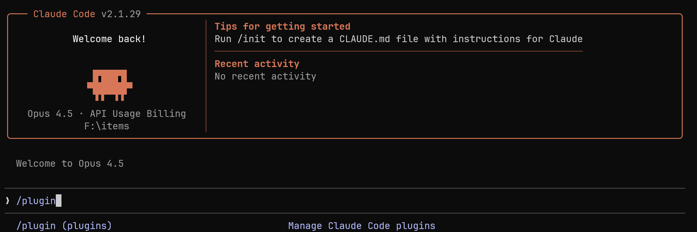
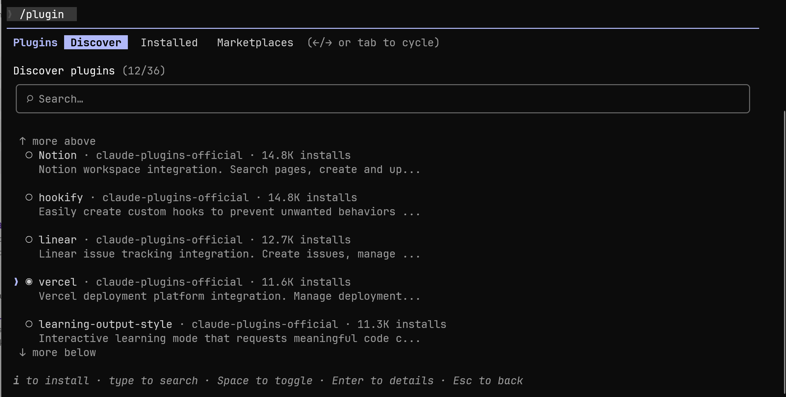
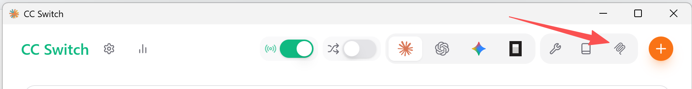
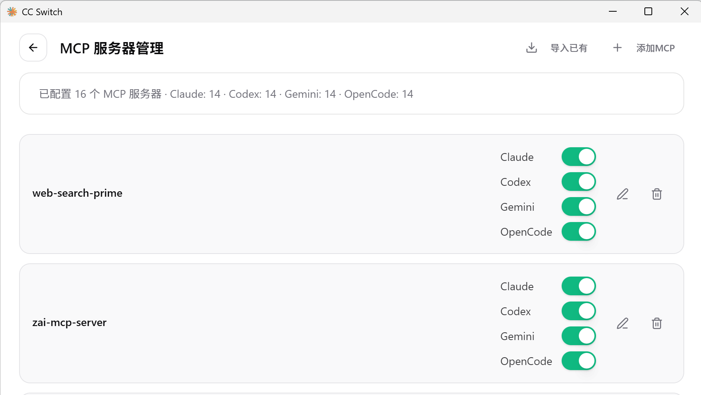

# 2.0 推荐配置

帮助你快速搭建高效的 AI 编程环境，请确保你已经安装 Claude Code。

## 1. 安装插件

> Advanced\02-ai-tuning-guide\03-mcp-and-skills.md 本节会详细介绍插件的组成。

打开 Claude，输入 `/plugin` 打开插件商店。



通过键盘上下按键切换来安装插件，按空格选中，按 `i` 安装。部分插件安装时会弹出的浏览器页面进行登陆，按照提示操作即可。



### 推荐插件

推荐安装以下官方插件，你也可以根据插件描述选择自己需要的插件：

| 插件名称 | 功能说明 |
|---------|---------|
| code-review | 代码审查 |
| code-simplifier | 代码简化 |
| commit-commands | 提交命令 |
| context7 | 库文档查询 |
| feature-dev | 功能开发向导 |
| frontend-design | 前端界面设计 |
| github | GitHub 操作 |
| playwright | 浏览器自动化 |
| pr-review-toolkit | PR 审查工具包 |
| pyright-lsp | Python 语言服务器 |
| supabase | Supabase 数据库 |
| TypeScript-lsp | TypeScript 语言服务器 |

## 2. 安装 CC-SWITCH

安装 [CC-SWITCH](https://github.com/farion1231/cc-switch) 来管理多个 AI 模型供应商、MCP 和 Skills。

### Windows 用户

从官方 [Releases](https://github.com/farion1231/cc-switch/releases) 页面下载最新版，或通过下方链接快速下载安装包：

<https://ghfast.top/https://github.com/farion1231/cc-switch/releases/download/v3.10.3/CC-Switch-v3.10.3-Windows.msi>

### macOS 用户

打开终端，通过 Homebrew 安装：

```bash
brew tap farion1231/ccswitch
brew install --cask cc-switch
```

### Linux 用户

请参照 [cc-switch/README_ZH.md](https://github.com/farion1231/cc-switch/blob/main/README_ZH.md) 进行安装。

## 3. 基本配置

下载安装后打开 CC-SWITCH，点击右上角加号可以管理供应商。导入不同模型后，选择供应商并填写对应的 API Key 即可使用。

| 主界面                                                       | 添加供应商                                                   |
| ------------------------------------------------------------ | ------------------------------------------------------------ |
| [](https://github.com/farion1231/cc-switch/blob/main/assets/screenshots/main-zh.png) | [](https://github.com/farion1231/cc-switch/blob/main/assets/screenshots/add-zh.png) |

### 切换供应商

- **主界面**：选择供应商 → 点击"启用"
- **系统托盘**：直接点击供应商名称（立即生效）

### 重启应用

重启终端或 Claude Code / Codex / Gemini 客户端以应用更改。

## 4. MCP 管理

点击右上角"MCP"按钮进入 MCP 管理界面，可以点击 导入已有 按钮导入，可以看到通过插件安装的MCP：



如果你没有安装context7插件，在这里点击右上角可以添加context7的mcp服务器。

> 安装后，在对话时输入usecontext7，AI就会去调用context7插件查找官方文档，增加写出来代码的准确性。




## 5. Skills 管理

点击右上角"Skills"按钮进入技能管理界面：

- **发现技能**：自动扫描预配置的 GitHub 仓库（Anthropic 官方、ComposioHQ、社区等）
- **自定义仓库**：支持添加自定义仓库（支持子目录扫描）
- **安装技能**：点击"安装"一键安装到 `~/.claude/skills/`
- **卸载技能**：点击"卸载"安全移除并清理状态
- **管理仓库**：添加/删除自定义 GitHub 仓库

这里本教程推荐以下skills，读者可以按需使用。

