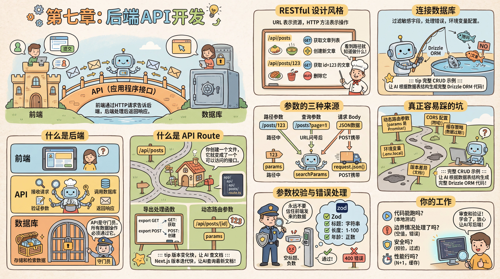

# 第七章：后端API开发



## 序言

界面有了，数据库也准备好了。你点击"提交"按钮，数据应该存入数据库——但前端和数据库之间还缺一座桥。

这座桥就是 **API（应用程序接口）**。前端通过 HTTP 请求告诉后端用户想要什么，后端处理后返回响应。

---

### 什么是后端

你试着在前端直接连数据库，但老师傅拦住了你——"前端代码运行在用户的浏览器里，如果前端直接连数据库，用户打开 F12 就能看到你的数据库密码，还能随意删除别人的数据。" 你才意识到，前端和数据库之间必须有一个"中间人"来把关。

**后端**是运行在服务器上的代码，负责处理前端发来的请求、与数据库交互、执行业务逻辑。

| 层 | 职责 |
|----|------|
| **前端** | 展示界面、收集用户输入、发送 HTTP 请求 |
| **API** | 接收请求、验证参数、调用数据库、返回响应 |
| **数据库** | 存储和检索数据 |

前端不能直接访问数据库——那样会暴露所有数据，也无法做权限控制。API 是数据库的守门员，所有数据操作必须通过它。

---

### 什么是 API Route

你理解了需要后端，但具体怎么写？难道要自己搭一个 Express 服务器？老师傅说不用——Next.js 内置了 API Route 功能，创建一个文件就是一个接口，不需要额外搭建服务器。

不过在讲 API Route 之前，先理解一个更基础的概念：**路由（Route）**。

#### 路由：URL 决定你看到什么

你每天都在跟路由打交道，只是没意识到。打开浏览器看看地址栏：

- 访问 `movie.douban.com/` → 看到豆瓣电影首页
- 访问 `movie.douban.com/subject/37311135/` → 看到《飞驰人生 3》的详情页
- 访问 `movie.douban.com/subject/37311135/comments?status=P` → 看到这部电影的短评（`?status=P` 表示"看过的人的评论"）
- 访问 `movie.douban.com/chart` → 看到排行榜

URL 不同，看到的页面就不同。**路由就是这件事——URL 路径决定了展示什么内容。** `?` 后面的部分是查询参数，用来进一步筛选或控制显示方式。

在 Next.js 里，这个对应关系直接体现在文件结构上：

```
app/
├── page.tsx                    → yourdomain.com/
├── subject/
│   └── [id]/
│       ├── page.tsx            → yourdomain.com/subject/37311135
│       └── comments/
│           └── page.tsx        → yourdomain.com/subject/37311135/comments
└── chart/
    └── page.tsx                → yourdomain.com/chart
```

文件夹结构就是 URL 结构。创建一个文件，就多了一个页面。`[id]` 是动态段——不管是 `37311135` 还是别的电影 ID，都由同一个 `page.tsx` 处理。这就是 Next.js 的**文件系统路由**——不需要写配置文件来定义"哪个 URL 对应哪个页面"，文件放在哪，URL 就是什么。

#### 从页面路由到 API 路由

上面的路由是给用户看页面的。**API Route** 是同样的思路，但不是返回页面，而是返回数据。

在 `app/api/` 目录下创建 `route.ts` 文件，就会生成一个数据接口：

- `app/api/movies/route.ts` → `yourdomain.com/api/movies`（返回电影列表的 JSON 数据）
- `app/api/movies/[id]/route.ts` → `yourdomain.com/api/movies/123`（返回某部电影的 JSON 数据）

区别只是：`page.tsx` 返回用户看到的页面，`route.ts` 返回程序用的数据。

#### 导出处理函数

在 `route.ts` 文件中，你导出对应 HTTP 方法的函数。比如导出 `GET` 函数来处理 GET 请求，导出 `POST` 函数来处理 POST 请求。

Next.js 会根据请求方法自动调用对应的函数。如果同时导出了 `GET` 和 `POST`，同一个 URL 就可以同时支持获取和创建两种操作。

::: tip 版本变化快，让 AI 查文档

Next.js 版本迭代快，API 可能有变化。让 AI 用 Context7 查询最新文档，确保生成的代码符合当前版本。

:::

---

### 跟 AI 聊后端之前，先认识几个关键词

在 7.0 动手之前，有几个词你会反复碰到。不用背，混个脸熟就行——后面每一节都会在具体场景里再遇到它们。

**RESTful**——API 的命名规范。核心思想是用 URL 表示资源，用 HTTP 方法表示操作。其实你每天都在发 HTTP 请求——在浏览器地址栏输入网址按回车，就是一个 GET 请求；填完注册表单点提交，就是一个 POST 请求。RESTful 就是把这套方法用得更规范：`GET /api/movies` 获取电影列表，`POST /api/movies` 创建新电影，`DELETE /api/movies/123` 删除 id=123 的电影。看到路径就知道做什么。跟 AI 说一句"用 RESTful 风格"，它就会自动按这套规范来。

<FullStackFlow mode="rest" />

**参数的三种来源**——你在浏览器地址栏里其实已经见过前两种了：

- **路径参数**：`movie.douban.com/subject/37311135` 中的 `37311135` 就是路径参数，标识"我要看哪部电影"
- **查询参数**：`movie.douban.com/subject/37311135/comments?status=P` 中 `?` 后面的部分，告诉后端"只看'看过'的人的评论"
- **请求 Body**：这个在地址栏里看不到——当你填完表单点"提交"时，表单里的数据（标题、年份、简介）会打包成 JSON 放在请求体里发给后端

路径参数标识"哪个资源"，查询参数控制"怎么查"，Body 传递"要创建或修改的数据"。

<FullStackFlow mode="params" />

**统一响应格式**——在项目初期就跟 AI 约定：成功返回 `{ success: true, data: ... }`，失败返回 `{ success: false, error: { message: "..." } }`。这样前端处理起来一致且简单——先看 `success` 字段，为 true 就取 `data`，为 false 就显示错误信息。

::: tip API 不只有 REST 一种风格
本章讲的都是 RESTful API——用 URL 表示资源、用 HTTP 方法表示操作。这是最主流的方式，也是你最先会接触到的。

但你可能会遇到 AI 生成的代码里没有 `route.ts` 文件、没有 `GET /api/movies` 这样的 URL，取而代之的是类似 `trpc.movie.list()` 这样的函数调用。这说明 AI 用了 **tRPC**——一种让前端像调用本地函数一样调用后端接口的方案。它的好处是前后端类型自动同步，改了后端接口签名，前端立刻报类型错误，不会出现"后端改了字段名前端不知道"的问题。

你不需要指定用哪种方式。如果你跟 AI 说"用 RESTful 风格"，它就用 REST。如果你不指定，AI 会根据项目情况选择——看到 tRPC 出现在代码里不用觉得奇怪，它和 REST 只是风格不同，解决的是同一个问题：让前端和后端能通信。
:::

---

### 你的工作

整个过程中你不需要手写每个接口。你只需要告诉 AI 需求，它会生成完整的代码。你的工作是**验证结果**：

1. **跑起来了吗？** —— `pnpm dev` 启动，页面能正常操作
2. **数据库对吗？** —— 打开 Drizzle Studio，看数据是否正确写入
3. **报错了吗？** —— 把终端里的报错整段复制给 AI，让它修

不需要读懂每一行代码。知道每个文件的职责，出问题时能告诉 AI "改哪个文件"就够了。

---

### 本章小节

| 小节 | 内容 |
|------|------|
| [7.0 跑通你的第一个全栈应用](./00-crud-example.md) | 动手做一个 Todo 应用，体验完整的全栈数据流 |
| [7.1 一个接口不够用了](./01-api-growing-pains.md) | 关联查询、分页、过滤排序——当数据量和需求增长时怎么办 |
| [7.2 当接口出了问题](./02-when-things-go-wrong.md) | 参数校验、幂等性、错误处理——上线后的第一批坑 |
| [7.3 让接口更好用](./03-api-as-product.md) | 版本管理、接口文档、批量操作——把接口当产品来打磨 |
