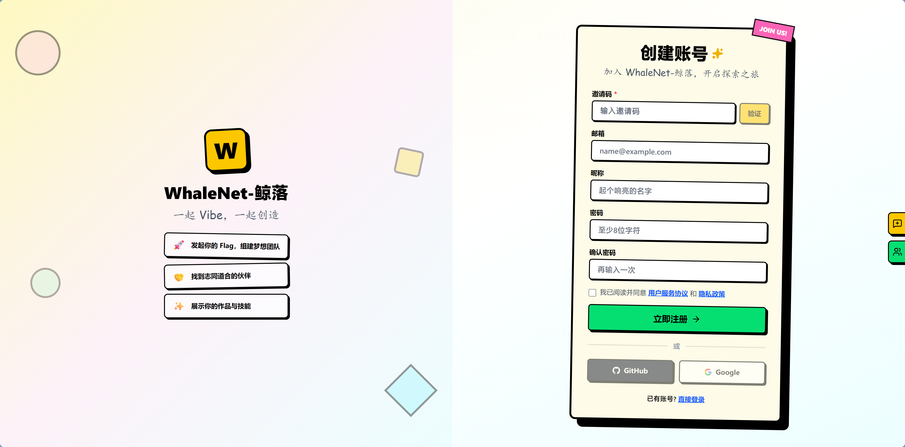
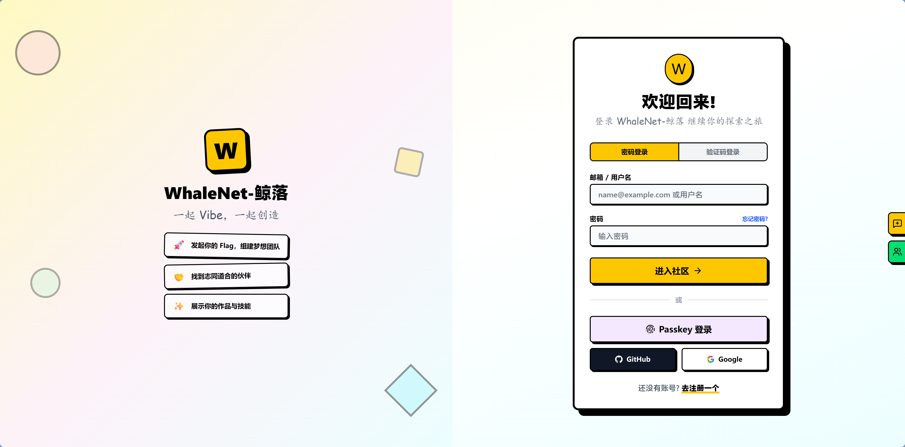
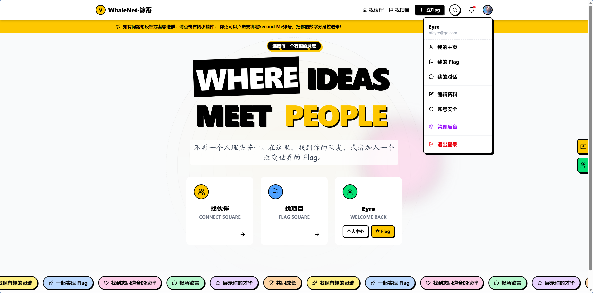
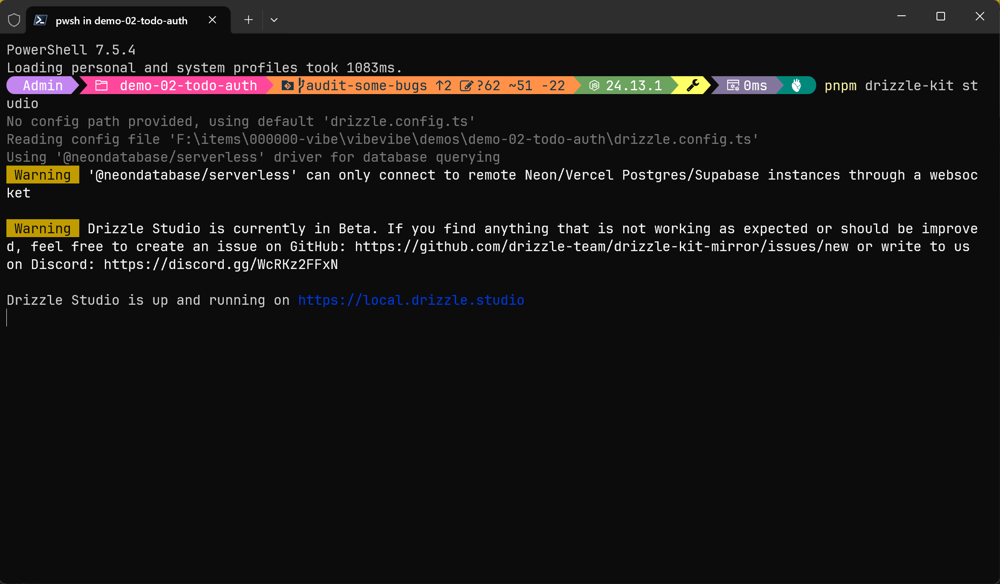
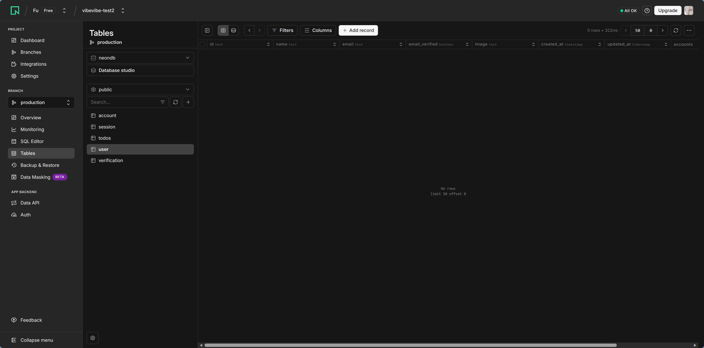
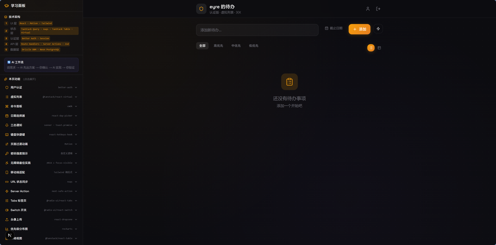
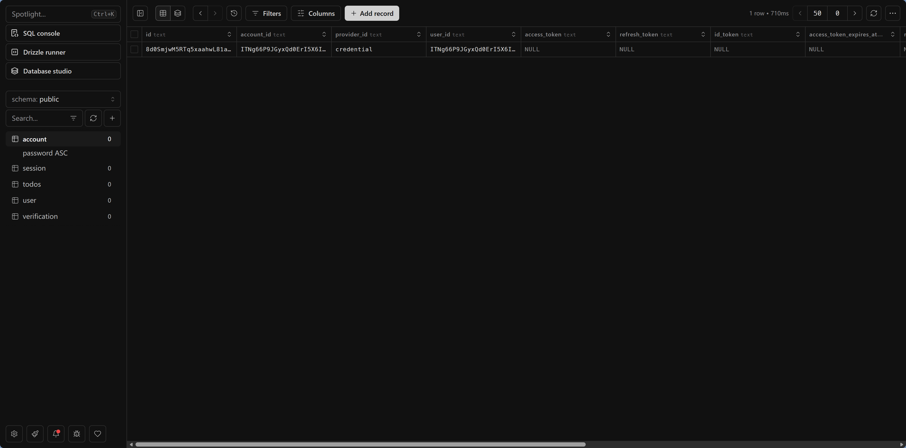
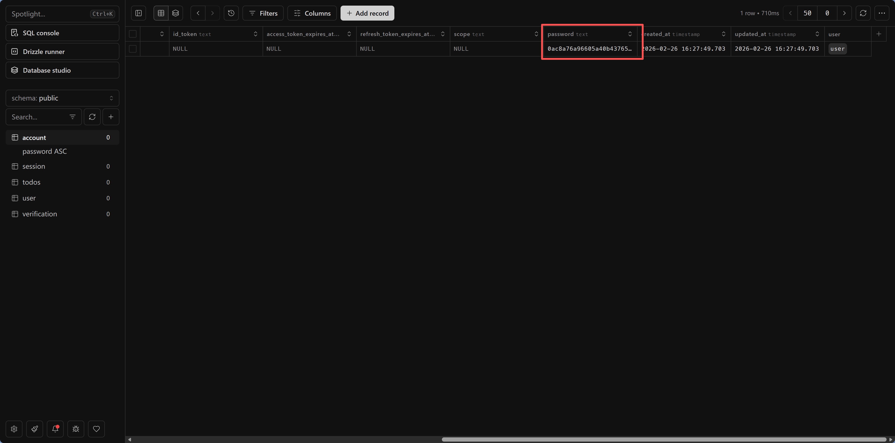

# 8.0 用户系统快速示例

> **本节目标**：理解一个完整的用户认证系统是怎么工作的——注册、登录、登出、受保护页面。

你在第七章学会了 CRUD，现在面临一个新问题：谁都能访问你的 API，谁都能删数据。你需要一个**用户系统**来区分"谁是谁"，并控制"谁能做什么"。

## 认证 vs 授权

你说"加个登录功能就行了"，老师傅摇头："登录只是第一步。登录后，普通用户和管理员能做的事情一样吗？" 你才意识到，"证明你是谁"和"你能做什么"是两个不同的问题。

在开始之前，老师傅让你分清两个概念：

- **认证（Authentication）**：你是谁？——验证身份（登录）
- **授权（Authorization）**：你能做什么？——检查权限（管理员 vs 普通用户）

本节先解决认证问题。

## 为什么选 Better Auth

认证库那么多——NextAuth、Clerk、Auth0、Supabase Auth、Better Auth... 你看得眼花缭乱。老师傅说："选认证库就看三点：数据归谁、能不能自定义、社区活不活跃。"

本教程使用 **Better Auth** 作为认证方案。老师傅选它的理由：

| 特性 | Better Auth | NextAuth | Clerk |
|------|------------|----------|-------|
| 开源免费 | ✅ | ✅ | ❌（有免费额度） |
| 数据自主 | ✅ 存你自己的数据库 | ⚠️ 需要适配器 | ❌ 存在第三方 |
| TypeScript 原生 | ✅ | ⚠️ 类型支持一般 | ✅ |
| 支持 Drizzle | ✅ 原生支持 | ⚠️ 需要适配器 | ❌ |
| 学习成本 | 中等 | 中等 | 低 |

核心理由：**数据存在你自己的数据库里**。用户表、会话表都在你的 PostgreSQL 中，不依赖第三方服务，不被平台捆绑。

::: tip 加载 Better Auth Skill 提升 AI 输出质量
在让 AI 配置认证系统之前，建议加载 `better-auth-best-practices` Skill。加载后，AI 会自动遵循 Better Auth 的最佳实践——Session 管理、插件配置、安全设置等都会更规范，减少你手动检查的工作量。
:::

## 告诉 AI 搭建用户系统

直接告诉 AI：

> "在我的 Next.js 项目中集成 Better Auth，使用 Drizzle ORM 和 PostgreSQL。需要：邮箱密码注册/登录、登出功能、受保护的 /dashboard 页面（未登录跳转到 /login）。"

AI 会帮你生成以下结构：

```
src/
├── lib/
│   ├── auth.ts            # Better Auth 服务端配置
│   └── auth-client.ts     # Better Auth 客户端配置
├── app/
│   ├── api/auth/[...all]/
│   │   └── route.ts       # 认证 API 路由（自动处理登录/注册/登出）
│   ├── login/
│   │   └── page.tsx        # 登录页面
│   ├── register/
│   │   └── page.tsx        # 注册页面
│   └── dashboard/
│       └── page.tsx        # 受保护页面
```

## 理解认证流程

### 注册流程

你可能会问：注册不就是把邮箱密码存进数据库吗？没那么简单。如果直接存明文密码，一旦数据库被攻破，所有用户的密码就全泄露了。所以密码必须先"加密"（准确说是哈希）再存储——即使黑客拿到了数据库，看到的也只是一串乱码。

注册成功后，服务器会创建一个"会话"（session）——你可以把它理解为一张临时通行证。你在淘宝登录后关掉页面，过一会儿再打开还是登录状态，就是因为浏览器里存着这张通行证（Cookie），每次访问时自动出示给服务器。

```
用户填写邮箱+密码 → 前端调用 auth.signUp() → Better Auth 处理：
  1. 检查邮箱是否已存在
  2. 密码加密（bcrypt 哈希）
  3. 在 user 表插入新用户
  4. 创建 session（会话）
  5. 返回 session token → 浏览器存入 Cookie
```

<AuthFlow mode="register" />



### 登录流程

登录时，服务器不是把你输入的密码和数据库里的密码直接比较——因为数据库里存的是哈希值。它会把你输入的密码也做一次哈希，然后比对两个哈希值是否一致。这样即使有人偷看了比对过程，也拿不到真实密码。

```
用户输入邮箱+密码 → 前端调用 auth.signIn() → Better Auth 处理：
  1. 查找邮箱对应的用户
  2. 比对密码哈希
  3. 创建新 session
  4. 返回 session token → 浏览器存入 Cookie
```

<AuthFlow mode="login" />



### 受保护路由

你可能想在前端用 `if (!loggedIn) redirect('/login')` 来保护页面。但老师傅说这不够——用户可以在浏览器里禁用 JavaScript，或者直接用 curl 请求你的页面。真正安全的做法是在服务端检查：页面内容根本不发送给未登录用户。

```
用户访问 /dashboard → 服务端检查 Cookie 中的 session token：
  ✅ 有效 → 正常显示页面
  ❌ 无效/过期 → 重定向到 /login
```

<AuthFlow mode="protected" />



## AI 生成了什么

AI 帮你生成了一堆文件，但你打开一看全是陌生的函数名。别慌——你不需要看懂这些代码的语法。你只需要知道：`auth.ts` 是服务端配置，`auth-client.ts` 是前端调用，`dashboard/page.tsx` 是受保护页面。出问题时，告诉 AI "我的 auth.ts 配置有问题" 就够了。

### 服务端配置（auth.ts）

这个文件告诉 Better Auth 用哪个数据库、启用哪些登录方式。

<details>
<summary>好奇的话展开看看，不看也完全没问题</summary>

```typescript
// src/lib/auth.ts
import { betterAuth } from 'better-auth'
import { drizzleAdapter } from 'better-auth/adapters/drizzle'
import { db } from '@/db'

export const auth = betterAuth({
  database: drizzleAdapter(db, { provider: 'pg' }),
  emailAndPassword: { enabled: true },
})
```

</details>

### 客户端调用（auth-client.ts）

这个文件让前端页面能获取当前登录状态——比如判断用户有没有登录、显示用户名。

<details>
<summary>好奇的话展开看看，不看也完全没问题</summary>

```typescript
// src/lib/auth-client.ts
import { createAuthClient } from 'better-auth/react'

export const authClient = createAuthClient()

// 在组件中使用：
const { data: session } = authClient.useSession()
```

</details>

### 受保护页面（dashboard/page.tsx）

这个文件在服务端检查用户是否登录——没登录就跳转到登录页，页面内容根本不会发送给未登录用户。

<details>
<summary>好奇的话展开看看，不看也完全没问题</summary>

```typescript
// src/app/dashboard/page.tsx
import { auth } from '@/lib/auth'
import { headers } from 'next/headers'
import { redirect } from 'next/navigation'

export default async function Dashboard() {
  const session = await auth.api.getSession({
    headers: await headers(),
  })
  if (!session) redirect('/login')

  return <h1>欢迎回来，{session.user.name}</h1>
}
```

</details>

## 动手跑起来

**第一步：生成认证相关的数据库表**

```bash
pnpm drizzle-kit push
```

Better Auth 需要 `user`、`session`、`account`、`verification` 四张表。AI 已经在 schema 里定义好了，push 一下就行。





**第二步：测试注册**

启动 `pnpm dev`，访问 `/register`，填写邮箱和密码，点击注册。



**第三步：测试登出和登录**

在 Dashboard 点击登出，然后重新访问 `/dashboard`——你会被重定向到登录页。用刚才的邮箱密码登录，又回到了 Dashboard。

**第四步：在 Drizzle Studio 里看看**

```bash
pnpm drizzle-kit studio
```

打开 `user` 表，你能看到刚才注册的用户。注意 `password` 字段存的不是明文，而是一串加密后的哈希值——这就是安全。





## 常见问题

**Q：注册时报错 "table does not exist"？**
执行 `pnpm drizzle-kit push` 同步表结构。

**Q：登录后 Dashboard 还是跳转到 login？**
检查 Cookie 是否正常设置。开发环境下确保使用 `http://localhost:3000` 而不是 `127.0.0.1`。

**Q：想加 GitHub/Google 第三方登录？**
告诉 AI："在 Better Auth 配置中添加 GitHub OAuth 登录。"你需要先去 GitHub 创建 OAuth App 获取 Client ID 和 Secret。

## 这个示例教会你什么

你刚才完成的用户系统包含了认证的核心要素：

- **密码安全**：存储的是哈希值，不是明文
- **会话管理**：通过 Cookie + Session 维持登录状态
- **路由保护**：服务端检查，未登录无法访问
- **数据自主**：所有用户数据存在你自己的数据库里

后续章节会在此基础上讲解更多安全实践：环境变量管理、CORS 配置、中间件等。

---

::: info 下一步
用户系统跑通了。接下来去 [密钥管理与环境变量](./01-env-and-secrets.md)——学会保护你的 API Key 和数据库密码，让密钥永远不出现在代码里。
:::
