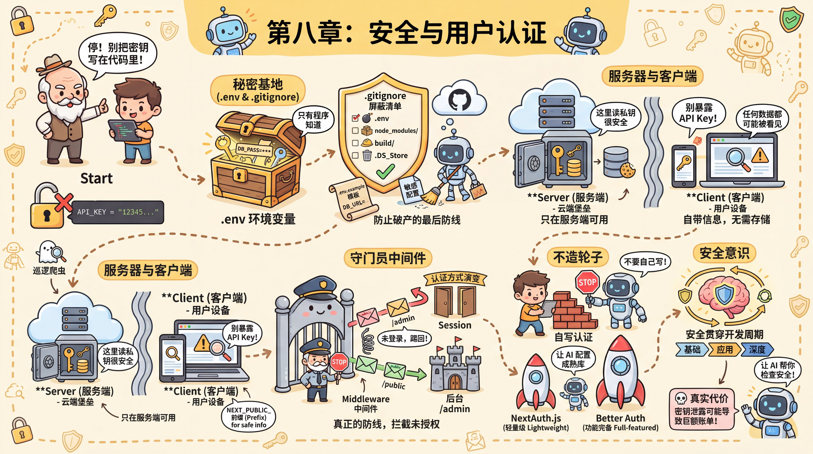

# 第八章：安全与用户认证

## 序言

小明的"个人豆瓣"后端跑通了。CRUD 没问题，接口也加了校验和分页，朋友们试用了几天都说不错。他觉得差不多了，是时候把代码推到 GitHub 上，一方面备份，一方面给朋友们看看自己的成果。

`git add .`，`git commit`，`git push`。一气呵成。

十分钟后，他收到一封邮件——来自 OpenAI：

> "您的账户在过去 10 分钟内产生了 $127.43 的 API 调用费用。"

小明懵了。他今天根本没用过 AI 功能。他打开 OpenAI 后台一看，API 调用记录在疯狂滚动——每秒几十次，全是陌生的请求。他慌了，赶紧去 GitHub 仓库检查，心凉了半截——`.env` 文件赫然在列，里面的 `OPENAI_API_KEY` 明晃晃地躺在那里，任何人都能看到。

他不知道的是，互联网上有成千上万的自动化爬虫，24 小时不间断地扫描 GitHub 上的每一次提交。它们不看你的代码写得好不好，只找一样东西：密钥。从密钥出现在公开仓库到被盗用，平均只需要 **5 分钟**。小明的密钥在他 `git push` 的那一刻就已经暴露了。

他赶紧删掉了 GitHub 上的 `.env` 文件，又推了一次。但老师傅摇头："晚了。Git 记录了每一次提交的历史，你删掉的只是最新版本。任何人翻一下历史记录，密钥还在那里。"

小明这才意识到事情的严重性。他花了一个晚上重置所有密钥、清洗 Git 历史、重新配置环境变量。$127 的账单是小事，真正让他后怕的是——如果泄露的不是 OpenAI 的 Key，而是数据库密码呢？用户的邮箱、密码哈希、个人信息，全部暴露。

老师傅看着他忙活完，说了一句："代码写得再好，密钥一泄露，全白搭。安全这件事，不是功能做完之后的锦上添花，而是从第一行代码开始就要考虑的。"

---

这件事给小明上了一课。他开始意识到，做一个"能用"的应用和做一个"安全"的应用之间，还有很长的路。

本章从小明的这次教训出发，带你建立完整的安全意识：

- **密钥怎么管**——环境变量、`.gitignore`、云端配置，让密钥永远不出现在代码里
- **用户怎么认**——注册登录背后的原理，以及为什么要用成熟的认证库而不是自己写
- **路由怎么守**——Middleware、CORS、权限控制，确保每个请求都经过检查
- **出了问题怎么查**——从"配置没生效"到"密钥已泄露"的排查手册
- **更深的威胁怎么防**——SQL 注入、XSS、CSRF，以及 AI 应用特有的安全问题

这些内容不需要你一次全学完。8.0 先动手跑一个用户系统，建立直觉；后面的章节在你遇到具体问题时回来查就行。

## 本章小节

| 小节 | 内容 |
|------|------|
| [8.0 用户系统快速示例](./00-user-system-example.md) | 用 Better Auth 跑通注册、登录、受保护页面，建立认证直觉 |
| [8.1 密钥管理与环境变量](./01-env-and-secrets.md) | `.env`、`.gitignore`、Server vs Client 边界、云端配置 |
| [8.2 认证方式与方案选择](./02-auth-methods.md) | Session vs Token、OAuth、Passkeys、Better Auth vs 其他方案 |
| [8.3 路由保护与权限控制](./03-route-protection.md) | Middleware、CORS、页面级 vs 接口级保护、角色权限 |
| [8.4 安全检查与问题排查](./04-security-checklist.md) | 开发前/中/后清单 + 症状→原因→解决诊断手册 |
| [8.5 进阶安全防护](./05-advanced-security.md) | SQL 注入/XSS/CSRF 防护、AI 应用安全、依赖审计 |

---

**上一章**：[第七章：后端API开发](../07-backend-api/index.md)

**下一章**：[第九章：功能测试流程与自动化脚本](../09-testing-automation/index.md)
