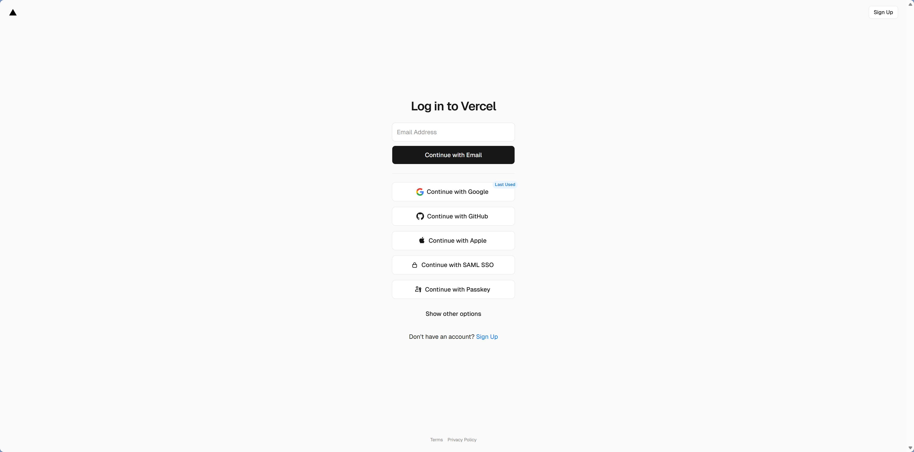
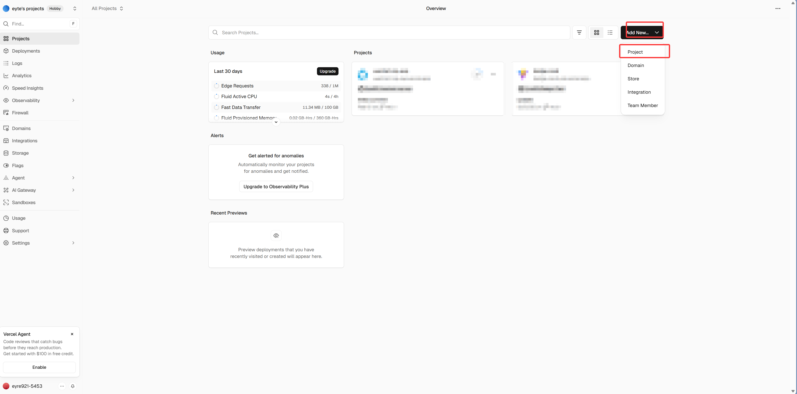
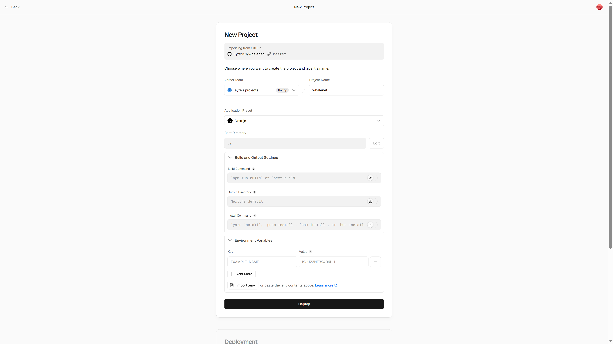
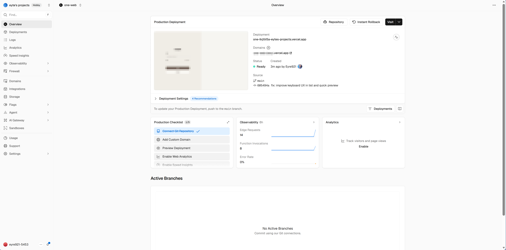
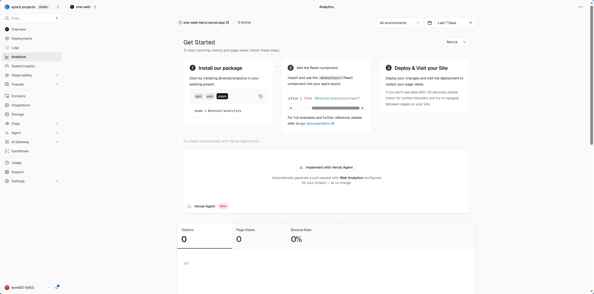
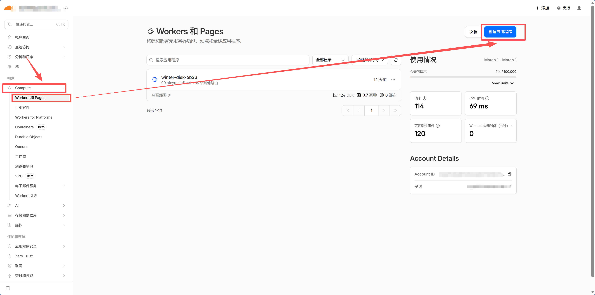
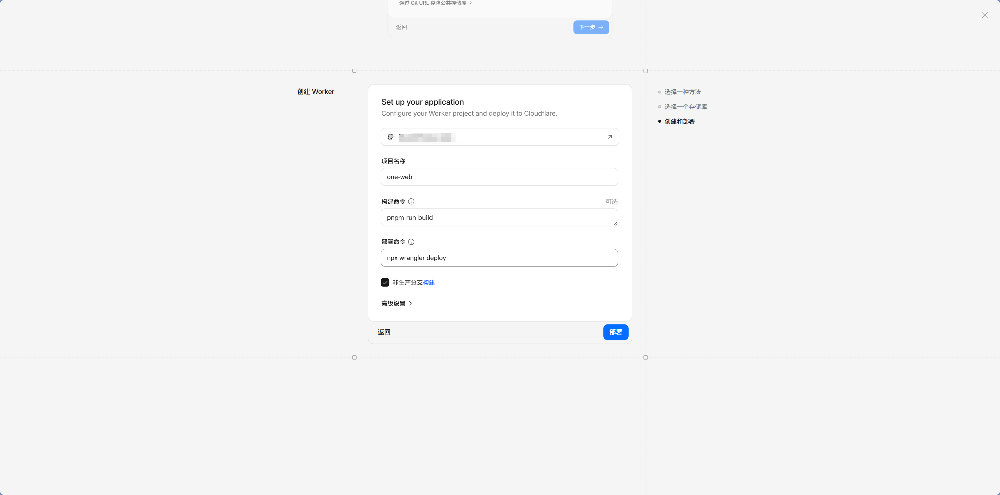
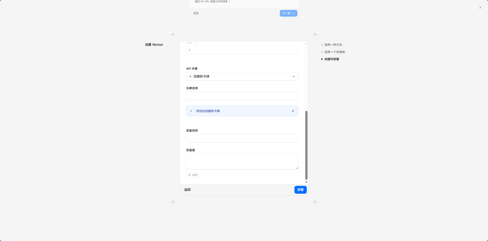
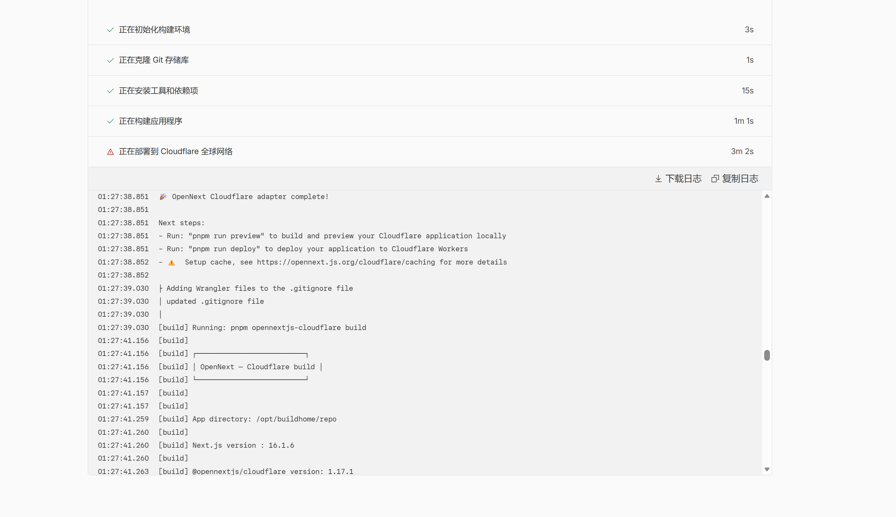
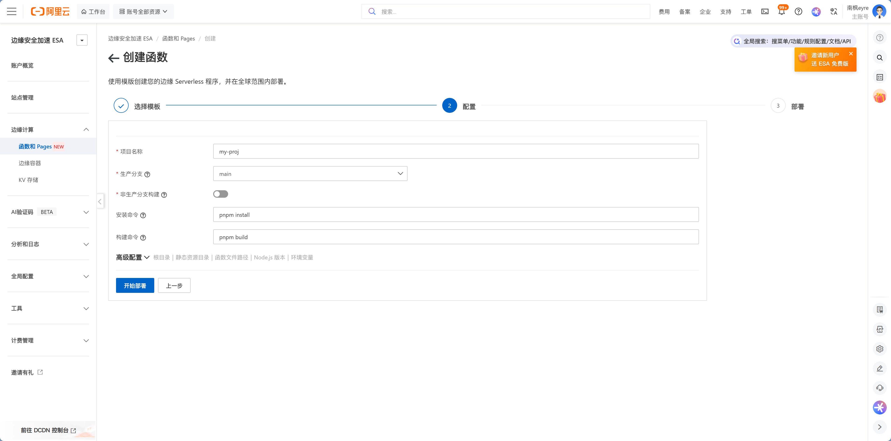

# 12.2 部署到类 Vercel 平台

> **本节目标**：了解 Vercel 及同类平台的部署流程，根据项目需求选择最合适的平台。

小明把"个人豆瓣"部署到 EdgeOne Pages 后，朋友问了一个问题："我也想部署自己的项目，但我的用户主要在海外，用什么平台好？"

这是一个好问题。EdgeOne Pages 适合国内用户，但部署平台不止一家。好消息是，你在 12.1 学到的所有概念——连接 GitHub、配置构建、设置环境变量——在任何平台上都一样。区别只在于界面长什么样、免费额度给多少、哪里访问更快。

## 平台速览

先看一张全景图，了解主流平台各自的定位：

| 平台 | 国内访问 | 免费额度 | 特色 | 适合场景 |
|------|---------|---------|------|---------|
| **Vercel** | 较慢（需自定义域名） | 100 GB 带宽/月 | Next.js 官方平台，体验最好 | 海外用户、个人项目 |
| **Cloudflare Pages** | 较快 | 无限带宽 | 全球 CDN、Workers 边缘计算 | 静态站点优先、可部署 Next.js |
| **阿里云 ESA** | 快 | 有免费额度 | 阿里云生态、国内访问快 | 国内用户、阿里云用户 |
| **Netlify** | 较慢 | 100 GB 带宽/月 | 表单处理、身份认证内置 | 静态站点、JAMstack |
| **Railway** | 一般 | $5 免费额度/月 | 支持数据库、后端服务 | 全栈应用、需要后端 |

不用记住每个平台的细节。接下来我们逐个看看最值得了解的几家，你会发现核心流程完全一样。

## Vercel：Next.js 的"亲爹"

Vercel 是 Next.js 的创造者，也是 Next.js 项目的官方推荐部署平台。如果你的项目用的是 Next.js，Vercel 的部署体验是最丝滑的——它对 Next.js 的每个特性都有原生支持，不需要任何额外配置。

### 部署流程

**方式一：网页界面部署（推荐新手）**

打开 [vercel.com](https://vercel.com)，用 GitHub 账号登录。



点击 **Add New → Project**，选择你的 GitHub 仓库。Vercel 会自动检测到 Next.js 框架，大部分配置不需要改。



你只需要做两件事：

1. 添加环境变量（和 EdgeOne 一样，把 `.env` 内容填进去）
2. 点击 **Deploy**



部署成功后，你会得到一个 `xxx.vercel.app` 的链接。

**方式二：命令行部署（更快）**

如果你更喜欢命令行，可以用 Vercel CLI：

```bash
# 安装 Vercel CLI
npm i -g vercel

# 登录（会打开浏览器授权）
vercel login

# 部署（首次会询问项目配置）
vercel deploy

# 部署到生产环境
vercel --prod
```

首次运行 `vercel deploy` 时，CLI 会询问项目名称、是否关联现有项目等。之后每次 `vercel deploy` 就能一键部署，比网页界面快得多。

整个过程和 EdgeOne 几乎一样——连接 GitHub、配置构建、设置环境变量、点击部署。

::: warning Vercel 国内访问问题
`*.vercel.app` 域名在国内访问不稳定。解决方案是绑定自定义域名，然后用 Cloudflare 做 DNS 代理加速。域名配置详见第十三章。
:::

### Vercel 的独特优势

Vercel 不只是"能部署"，它在开发体验上做了很多额外的事。

**预览部署**是最实用的功能。每次你创建 Pull Request，Vercel 会自动为这个 PR 生成一个独立的预览链接。你可以把这个链接发给朋友，让他们在合并代码之前就看到效果。这和第十一章学的 PR 工作流完美配合——审查代码的同时，直接在预览链接上测试功能。



**分析面板**是 Vercel 的增值能力，但通常需要你在项目里额外接入对应组件（如 Analytics / Speed Insights）后才会有完整数据。具体接入步骤建议直接按 Vercel 控制台和官方文档页面操作，因为不同框架版本与套餐入口可能会有差异。



**Edge Functions** 把你的代码复制到全球各地的 CDN 节点上。你的 API 路由通常跑在一台固定的服务器上——不管用户在北京还是纽约，请求都要飞到同一个地方处理。Edge Functions 让这些动态逻辑也能就近执行，用户的请求在最近的节点就地处理，不用绕远路。


## Cloudflare Pages：无限带宽的诱惑

Cloudflare Pages 的最大卖点是**无限带宽**——免费套餐不限流量。对于个人项目来说，这意味着你完全不用担心流量费用，哪怕突然有一篇文章火了、带来大量访问，也不会产生额外费用。

### 快速体验部署流程

如果你想快速体验 Cloudflare Pages 部署 Next.js 的流程，可以直接访问：

**https://workers.new/templates/next-starter-template**

这是 Cloudflare 提供的 Next.js 模板快速启动器。点击后会自动：
1. 在你的 GitHub 账号下创建一个新仓库（基于 Next.js 模板）
2. 连接到 Cloudflare Pages
3. 自动完成首次部署

整个过程不到 2 分钟，你就能看到一个运行在 Cloudflare 边缘网络上的 Next.js 应用。这是体验平台能力最快的方式——之后你可以把这个模板仓库改成自己的项目，或者按照下面的步骤部署已有项目。

### 部署已有项目

如果你要部署自己的 Next.js 项目：

1. 登录 [Cloudflare Dashboard](https://dash.cloudflare.com)
2. 进入 **Workers & Pages → Create**



3. 连接 GitHub，选择仓库
4. 配置构建设置（框架预设选 Next.js）
5. 添加环境变量
6. 点击部署



看到了吗？和 EdgeOne、Vercel 的步骤几乎一模一样。





### Cloudflare 的独特优势

除了无限带宽，Cloudflare 还有一整套边缘计算生态。**Workers** 是 Cloudflare 版的 Edge Functions——同样是在 CDN 节点上运行代码，只是叫法不同。**D1** 是 Cloudflare 自己的轻量数据库，适合和 Workers 配合使用——你现在用的 Neon PostgreSQL 完全够用，D1 只是 Cloudflare 生态内的一个选项。**R2** 是兼容 S3 API 的对象存储。如果你的项目未来需要边缘计算能力，Cloudflare 是一个值得考虑的选择。


## 阿里云 ESA Pages：国内的另一个选择

如果你是阿里云用户，或者你的项目主要面向国内用户，阿里云 ESA（边缘安全加速）是 EdgeOne 之外的另一个选择。

### 部署流程

1. 登录 [阿里云 ESA Pages 控制台](https://esa.console.aliyun.com/edge/pages/list)
2. 创建 Pages 项目，连接 GitHub
3. 配置构建设置和环境变量
4. 选择加速区域（和 EdgeOne 类似，国内需要备案）
5. 部署



ESA 和 EdgeOne 的定位类似，都是国内云厂商的边缘部署平台。选哪个主要看你更熟悉哪家的生态——如果你已经在用阿里云的其他服务（比如 OSS、RDS），ESA 会更方便，因为账号和计费都在一个体系里。

## 所有平台的核心流程都一样

到这里你应该发现了一个规律：不管选哪个平台，核心步骤都是这五步：

```
连接 GitHub → 选择仓库 → 配置构建设置 → 添加环境变量 → 部署
```

这不是巧合。所有这些平台解决的是同一个问题：把你 GitHub 上的代码变成一个可以访问的网站。它们的底层逻辑一样，只是界面不同、免费额度不同、网络覆盖不同。

**你在 EdgeOne 上做过一次完整的部署，换到任何其他平台都能很快上手。** 就像学会了开一辆车，换一辆车只需要熟悉一下仪表盘的位置。

## 怎么选

选平台就像选手机——功能大同小异，选一个顺手的就行。但如果你需要一个决策参考：

**你的用户主要在国内？** 选 EdgeOne Pages 或阿里云 ESA。国内云厂商的边缘节点覆盖更好，访问速度快。

**你的用户主要在海外？** 选 Vercel（尤其是 Next.js 项目）或 Cloudflare Pages。Vercel 的开发体验最好，Cloudflare 的免费额度最慷慨。

**你的用户遍布全球？** Cloudflare Pages 的无限带宽 + 全球 CDN 是最省心的选择。配合自定义域名，国内外都能快速访问。

**你不确定？** 随便选一个先跑起来。选错了也没关系——所有平台都是连接 GitHub + 配置构建，换平台只需要在新平台上重做一次，不需要改任何代码。迁移成本几乎为零。

::: tip 不用纠结
先选一个跑起来，后面随时可以换。你的代码在 GitHub 上，不依赖任何特定平台。这就是为什么我们在第六章强调"保持架构独立性"——用标准的数据库连接、标准的框架，不被任何平台绑定。
:::

## 告诉 Claude Code 部署

不管选哪个平台，你都可以直接告诉 Claude Code：

> "帮我把项目部署到 Vercel"（或 Cloudflare Pages / Railway / ESA）

Claude Code 会引导你完成整个流程。但经过 12.1 和这一节的学习，你已经理解了部署的核心概念，遇到问题时不会一头雾水。

---

::: info 下一步
部署平台选好了。接下来了解 [12.3 CI/CD 与自动化](./03-cicd-automation.md)，让每次 `git push` 都自动触发部署。
:::
