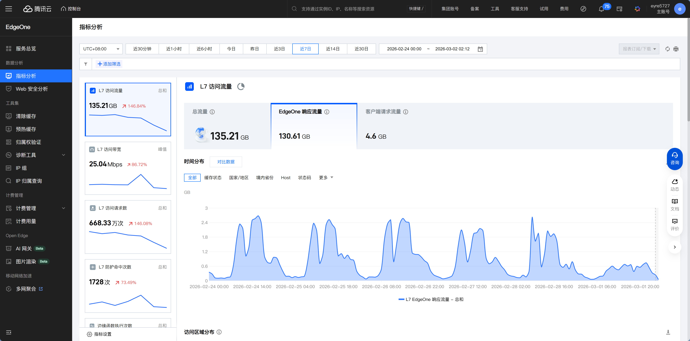
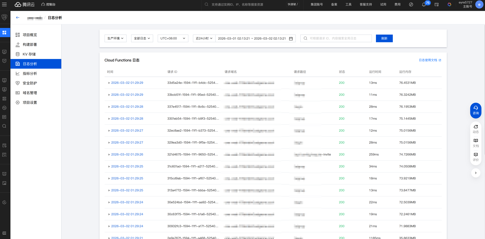

# 12.4 运维基础与成本优化

> **本节目标**：建立运维意识，学会监控应用状态、控制成本、避免账单惊喜。

小明的"个人豆瓣"上线一周了。一切看起来很正常——直到老师傅问了一句："你知道有多少人在用吗？出了问题你怎么知道？"

小明愣住了。他只知道网站"能打开"，但具体有多少人访问、有没有报错、数据库连接是否正常——一概不知。

**上线不是终点，是运维的起点。** 你的应用现在 24 小时跑在公网上，需要有人"看着"它。

## 上线之后谁来看着它

对个人开发者来说，"运维"听起来很重，但核心就三件事：

1. **知道应用是否正常**——有人访问吗？有报错吗？
2. **出问题能快速定位**——哪里出了问题？什么时候开始的？
3. **变更时降低风险**——新功能上线前先小范围测试

这三件事不需要你 24 小时盯着屏幕。部署平台已经帮你做了大部分工作，你只需要知道去哪里看。

## 看懂你的数据

部署平台通常提供一个分析面板，展示你的应用运行状态。



不同平台的分析面板位置不同：
- **EdgeOne**：控制台 → 项目 → 数据分析
- **Vercel**：Dashboard → 项目 → Analytics
- **Cloudflare**：Dashboard → Workers & Pages → 分析

## 日志：出了问题去哪里看

有一天，小明的朋友发来消息："你的网站打不开了，一直转圈。"小明自己试了一下，确实很慢。

这时候就需要看**日志**了。日志就像行车记录仪——出了事故回放一下就知道怎么回事。

小明打开 EdgeOne 的部署日志，找到了这样一行：

```
Error: Connection timed out - database not responding
```

原因很清楚：数据库连接超时了。小明去 Neon 控制台一看，免费版的数据库因为长时间不活跃被暂停了。重新激活后，网站恢复正常。

**日志排查的套路很简单：**

1. 先看有没有红色的 ERROR
2. 找到报错时间点前后的上下文
3. 如果看不懂，把关键信息复制给 Claude Code 帮你分析

各平台的日志查看方式：
- **EdgeOne**：控制台 → 项目 → 部署日志 + 运行日志
- **Vercel**：Dashboard → 项目 → Logs，可以按时间和关键词筛选
- **Cloudflare**：Dashboard → Workers & Pages → 实时日志



## 平台已经帮你做的优化

Serverless 平台默认做了很多事，你不需要操心：

**自动扩缩容**——就像你手机的亮度自动调节：光线强时调暗，光线弱时调亮，你不需要手动拨滑块。传统服务器需要你提前猜"我的网站需要几台服务器"，猜少了扛不住流量，猜多了白花钱。Serverless 平台根据实际访问量自动调整资源，你完全不用操心。

**全球 CDN**——静态资源（HTML、CSS、JS、图片）自动分发到全球节点。用户访问时，CDN 会从离他们最近的节点返回内容，而不是每次都请求源服务器。

**图片优化**——自动压缩图片、转换成更高效的格式（WebP/AVIF）。你上传一张 2MB 的 PNG，用户实际下载的可能只有 200KB。

**HTTPS**——自动申请和续期 SSL 证书。你不需要手动配置 HTTPS，平台默认就是安全连接。

这些优化在传统服务器上需要你自己配置 Nginx、Let's Encrypt、CDN 服务……现在平台全包了。

## 你可以关注的优化

当用户反馈"慢"的时候，可以让 Claude Code 帮你检查：

> "分析我的网站性能，给出优化建议"

常见的优化方向：

**图片太大**——首屏加载慢。使用 `next/image` 组件，它会自动根据设备尺寸返回合适大小的图片。

**接口太慢**——页面白屏时间长。检查数据库查询是否缺少索引，或者是否有 N+1 查询问题。这些在第六章数据库那一节提过。

**包体积大**——JS 文件过大，下载时间长。检查是否引入了不必要的库。告诉 Claude Code "分析我的 bundle 大小，找出最大的依赖"。

**无缓存**——重复请求相同数据。添加适当的缓存策略，让浏览器和 CDN 缓存不常变化的内容。

## 成本：免费额度够用吗

小明用的都是免费套餐，目前一分钱没花。但老师傅提醒他："免费额度是用来体验的，不是用来长期跑生产的。你得知道什么时候会开始花钱。"

### 分阶段决策

老师傅反复强调：**不要在阶段一担心阶段三的问题。**

**MVP 阶段（< 1,000 用户）**——用 Serverless 免费套餐，月成本 ¥0。这个阶段的重点是验证产品，不是优化成本。

**增长期（1,000 - 10,000 用户）**——免费额度可能不够了，需要升级到付费套餐。月成本大概 ¥50-200，取决于流量和功能使用量。这个阶段开始关注成本趋势。

**规模化（> 10,000 用户）**——评估是继续用托管服务还是自建。这个阶段的决策需要根据具体业务来判断，不在本章讨论范围。

### 免费额度

**Vercel** 的免费版限制每个请求最多跑 10 秒。你在 Next.js 里写的 API Route（比如 `/api/books`），部署到 Vercel 后就变成了一个 Serverless Function。对大多数接口来说 10 秒绑绑有余，但如果你的接口要查大量数据或调用外部 AI API，10 秒可能不够。超时后用户会看到一个白页和"504 Gateway Timeout"错误——意思是"服务器处理太久，放弃了"。解决方案是优化接口性能，或者升级到 Pro 套餐（执行时长提升到 60 秒）。

**Neon** 的免费版计算时长有限，长时间不活跃的数据库会被暂停。下次访问时需要"冷启动"，首次请求会慢 1-2 秒。这就是小明之前遇到的"网站打不开"的原因之一。

**Supabase** 的免费版只能创建 2 个项目，而且会暂停 7 天不活跃的项目。如果你有多个项目在跑，免费版很快就不够用了。

### AI 模型成本

如果你的应用调用了 AI API（比如 OpenAI、Claude、GLM），模型成本可能是最大的开销。老师傅建议在 API 平台设置每日或每月消费上限，防止因为代码 bug（比如死循环调用 API）导致天价账单。

## 轻量级灰度发布

序言里提到过灰度发布的概念——先给一部分用户推送新版本，确认没问题再全量发布。

对个人项目来说，你不需要复杂的灰度系统。**预览链接 → 测试 → 合并**就是最简单的灰度流程：

1. 在功能分支上开发新功能
2. 创建 PR，平台自动生成预览链接
3. 自己和朋友在预览链接上测试
4. 确认没问题，合并 PR 到 `main`，自动部署到生产环境

这个流程在 12.3 已经讲过了。它不是严格意义上的灰度发布，但对个人项目来说足够了——新功能上线前，至少有人测试过。

---

::: info 本章总结
你已经学会了从部署到运维的完整流程：选择平台 → 配置部署 → 自动化 CI/CD → 监控和优化。接下来在 [第十三章](../13-domain-dns/index.md) 中，你会给应用绑上自己的域名，让它看起来更专业。
:::
