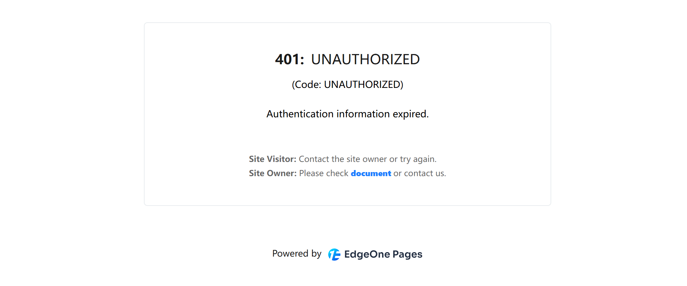
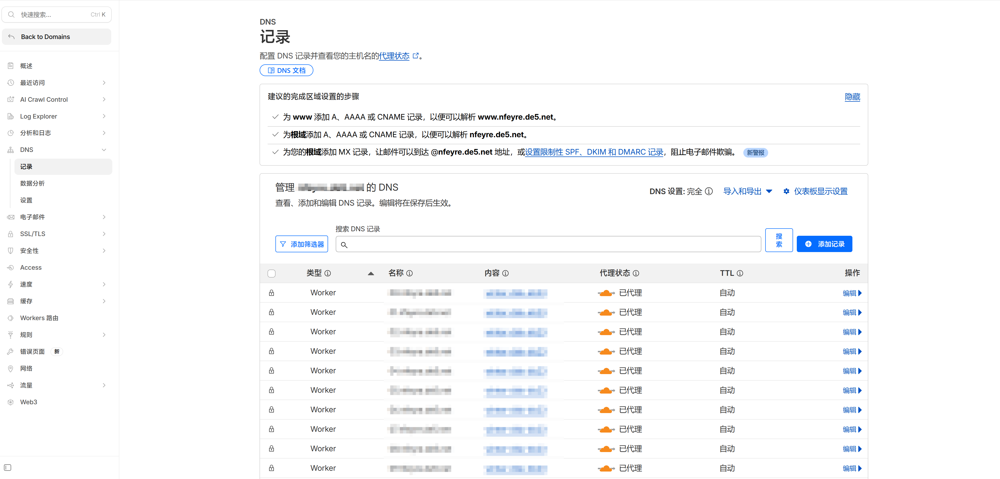

# 13.2 备案与访问问题排查

> **本节目标**：理解 ICP 备案的要求，掌握免备案方案，学会诊断常见的访问错误。

小明的域名配好了，浏览器地址栏亮起了绿锁。他把新链接发到群里——这次海外的朋友秒开了。但国内的朋友反馈："能打开，就是有点慢。"

老师傅说："你的服务器在海外，国内访问要绕半个地球，当然慢。想快，要么把服务器搬到国内，要么用 CDN 加速——CDN 就是在离用户近的地方放一份网站副本，用户从最近的节点取，不用每次都跑到源站去。但服务器在国内有个前提——**备案**。"

## 备案是什么

备案就像开店需要营业执照。服务器在中国大陆 = 店开在国内 = 必须去工商局登记。服务器在香港或海外 = 店开在境外 = 不需要国内的营业执照。

正式的说法是 **ICP 备案**：中国大陆的法规要求，任何使用中国大陆服务器提供互联网信息服务的网站，都必须在工信部完成备案登记。

一句话：**服务器在中国大陆 = 必须备案**。服务器不在大陆 = 不需要。

## 备案 vs 免备案

| 方案 | 条件 | 优势 | 劣势 |
|------|------|------|------|
| **备案** | 域名实名 + 服务器在大陆 | 国内访问最快、完全合规 | 审核周期 1-3 周 |
| **免备案** | 服务器在境外（含港澳台） | 即买即用、无审核 | 国内访问稍慢 |

### 免备案方案（推荐新手）

小明不想等几周的审核，老师傅给了他三个免备案方案：

**方案一：部署平台选"全球（不含中国大陆）"**

在 EdgeOne Pages 或阿里云 ESA 选择不含中国大陆的加速区域，然后绑定自定义域名。国内用户通过域名访问，速度虽然不如大陆节点，但完全可用。

**方案二：使用 Vercel / Cloudflare Pages**

这些海外平台的服务器不在中国大陆，天然免备案。绑定自定义域名后即可使用。

**方案三：云服务器选香港节点**

如果你买了 VPS（下一章会讲），选择中国香港机房。免备案，且国内访问延迟比美国节点低很多。

小明选了方案一——他已经部署在 EdgeOne Pages 上了，只需要确认加速区域是"全球（不含中国大陆）"，绑好域名就行。国内朋友虽然慢一点，但能正常访问。等以后产品做大了，再考虑备案。

### 备案流程（简介）

如果你决定备案，流程大致如下：

1. **域名实名认证**：在注册商完成域名持有者实名（身份证）
2. **选择接入商**：通过云服务商（阿里云/腾讯云）提交备案申请
3. **填写信息**：网站名称、负责人信息、服务内容等
4. **人脸核验**：在手机 App 上完成人脸识别
5. **等待审核**：接入商初审（1-2 天）+ 管局终审（5-20 个工作日）
6. **备案成功**：获得 ICP 备案号，需在网站底部展示

::: warning 备案注意事项

- 个人备案的网站名称不能包含"公司""商城"等企业性质词汇
- 备案期间域名不能访问（部分省份要求）
- 备案号需要每年年审，否则可能被注销
- 更换接入商（比如从阿里云换到腾讯云）需要做"接入备案"
:::

## 常见访问问题排查

网站上线后，你可能会遇到各种访问问题。别慌——先看错误码，再对症下药。

### HTTP 状态码：快递查询式理解

状态码就像快递查询。你查快递物流，系统告诉你包裹的状态：

- **2xx = 已签收**。一切正常，包裹到手了。`200 OK` 是最常见的"签收成功"。
- **3xx = 转寄中**。包裹搬家了，快递员帮你送到新地址。`301` 是永久搬家，`302` 是临时转寄。
- **4xx = 查无此人或拒收**。`404` 是地址写错了，查无此人。`403` 是到了门口但被拒收——你没权限。
- **5xx = 快递站爆仓了**。不是你的问题，是服务器那边出了故障。`500` 是代码报错，`502` 是中转站挂了——你的请求到了中间的转发服务器，但它联系不上后面的应用服务器。

| 状态码 | 含义 | 谁的问题 | 常见场景 |
|-------|------|---------|---------|
| 2xx | 成功 | 没问题 | `200 OK` |
| 3xx | 重定向 | 正常跳转 | `301` 永久搬家、`302` 临时跳转 |
| 4xx | 客户端错误 | 你的问题 | `403` 没权限、`404` 页面不存在 |
| 5xx | 服务端错误 | 服务器的问题 | `500` 代码报错、`502` 网关错误 |

记住：**只看第一位数字**，就能判断是谁的锅。

### 排查决策树

网站打不开？按这个流程走：

**第一步：看到了什么错误？**

→ 看到 **403 Forbidden**？往下看"403 排查"。
→ 页面一直转圈，最后 **超时**？往下看"超时排查"。
→ 能打开但 **很慢**？往下看"国内访问慢"。
→ 浏览器提示 **证书错误 / 不安全**？往下看"HTTPS 证书错误"。

### **401:**UNAUTHORIZED

**原因**：国内平台的默认域名有访问限制（鉴权保护），只有项目所有者通过带token的链接能访问。

**解决**：绑定自定义域名。详见 [13.1 域名购买与 DNS 配置](./01-domain-setup.md)。绑定后，任何人都可以通过你的域名正常访问。

### 页面打不开（超时）

**排查步骤**：

1. 先确认域名解析是否生效：在终端运行 `nslookup 你的域名`（就是问 DNS："这个域名你认不认识？认识的话地址是什么？"）
2. 没有返回结果？DNS 还没传播——刚配置的话等 10-30 分钟
3. DNS 正常但还是打不开？检查部署平台的部署状态是否成功
4. 如果用了 Cloudflare 代理，检查 SSL/TLS 模式是否设置为 "Full (strict)"

### 国内访问慢

**原因**：服务器在海外，物理距离导致延迟。

**解决方案**（按推荐顺序）：

1. 使用 Cloudflare CDN 加速（免费，效果明显）
2. 切换到国内平台（EdgeOne / ESA）+ 备案
3. 静态资源使用国内 CDN

### HTTPS 证书错误

**原因**：证书还没签发，或者域名和证书不匹配。

**解决**：

- 等待平台自动签发（通常 5-15 分钟）
- 检查域名是否正确指向了部署平台（CNAME 记录是否正确）
- 如果用 Cloudflare 代理，确保 SSL 模式设置为 "Full (strict)"，而不是 "Flexible"。Flexible 模式下，Cloudflare 到你服务器这段是明文传输——相当于信封只封了前半程，后半程敞开的。Full (strict) 才是全程密封

### 让 AI 帮你排查

遇到访问问题时，把完整的错误信息告诉 Claude Code，它可以帮你诊断。比如："我的网站 myapp.com 国内访问返回 403，帮我排查原因"，或者"我的域名配置了 CNAME 但还是打不开，帮我检查 DNS 配置"。

关键是把**错误码、域名、你做了什么操作**说清楚——信息越完整，排查越快。

---

## 结语

域名买好了，DNS 配好了，访问问题也知道怎么排查了。小明的应用现在有了一个专业的域名，可以正式分享给全世界了。

你的项目也走到了这一步——从零开始，到现在有了完整的全栈应用、自动化部署、自定义域名。如果你想向**本教程的实践篇**投稿，欢迎联系我们。入选的项目会获得一个专属的二级域名和一定的云资源支持，让你专注于代码和创意，不再为域名和运维的琐事烦恼。

域名配好了，网站跑起来了。如果你想要更多控制权——自己的服务器、自己的规则——下一章带你买一台 VPS。

---

**上一节**：[13.1 域名购买与 DNS 配置](./01-domain-setup.md)

**下一章**：[第十四章：云服务器运维与项目部署](../14-vps-ops-deploy/index.md)
