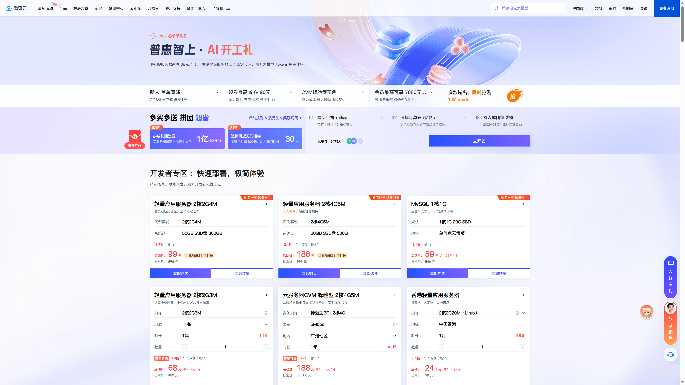

# 14.1 VPS 选购指南

> **本节目标**：了解主流云厂商的差异，根据自己的需求选出一台合适的 VPS。

小明打开各家云厂商的官网，眼花缭乱——阿里云、腾讯云、AWS、DigitalOcean……每家都在喊"限时特惠"。他点进阿里云，看到一堆"ECS""轻量应用服务器""抢占式实例"，完全分不清区别。又点进 AWS，全英文界面，还要绑信用卡。

老师傅说："别慌，买服务器就像租房子——地段、面积、价格都要考虑，但最重要的是**适合你当前的需求**。新手最常犯的错误就是一上来买太贵的配置，结果 90% 的资源都在空转。"

::: tip 什么是 VPS？
VPS（Virtual Private Server）就是你在云上租的一台电脑。它 24 小时开机、有公网 IP，你可以远程登录上去装任何东西。和你自己的电脑唯一的区别是——它没有屏幕，只能通过终端操作。
:::

## 主流云厂商

价格和优惠经常变动，直接去官网看最新方案：

**国内厂商**（中文控制台，支付宝/微信付款）：
- [阿里云 ECS / 轻量应用服务器](https://www.aliyun.com/) — 国内生态最全，文档丰富
- [腾讯云轻量应用服务器](https://cloud.tencent.com/) — 新用户优惠力度大，控制台对新手友好

**海外厂商**（需信用卡/PayPal，英文界面为主）：

- [AWS](https://aws.amazon.com/) — 全球节点多，大厂稳定
- [DigitalOcean](https://www.digitalocean.com/) — 界面简洁，开发者体验好
- [搬瓦工（BandwagonHost）](https://bandwagonhost.com/) — 香港/日本节点对国内访问友好
- [RackNerd](https://www.racknerd.com/) — 性价比高，黑五/新年常有特价

::: tip 新手推荐
国内厂商几乎都有新用户优惠，首年价格通常只有正常价的 1-3 折，买之前先搜"XX云 新用户优惠"。海外厂商关注黑五等促销节点，年付套餐往往最划算。
:::

## 配置选择建议

服务器配置主要看四个参数：

| 参数 | 小型 Web 应用（起步） | 中型全栈项目 |
|------|---------------------|-------------|
| CPU | 2 核 | 2-4 核 |
| 内存 | 2GB | 4GB+ |
| 硬盘 | 40GB SSD | 60GB+ SSD |
| 带宽 | 3-5Mbps | 5-10Mbps |

小明对着配置表犹豫了一会儿。他的项目是 Next.js 全栈应用，带数据库，还想装个监控面板——至少得 2 核 2GB 才够用。但 4GB 的价格翻了一倍，他决定先从 2GB 起步，不够再升级。

老师傅的经验："**内存比 CPU 重要**。跑 Node.js + 数据库 + 1Panel 面板，2GB 内存是底线。1GB 的机器装完面板就没什么余量了。"你同时开十几个浏览器标签页电脑变卡，卡的不是 CPU 算不过来，而是内存不够用了——服务器上也是同样的道理。

::: warning 带宽的坑
国内云厂商的带宽是**独享带宽**，1Mbps 意味着每秒最多传 128KB 数据——加载一张手机拍的照片要好几秒。你平时家里宽带 100Mbps，是它的 100 倍。海外厂商通常给的是**共享大带宽**（100Mbps-1Gbps），但按部分按流量计费。买之前一定要看清楚。独享带宽像家里的包月宽带，不管用不用都是这个速度上限；共享带宽像手机流量套餐，速度快但用多少算多少钱。
:::

## 机房位置选择

| 位置 | 是否需要备案 | 国内访问速度 | 推荐场景 |
|------|------------|------------|---------|
| 中国大陆 | 需要 ICP 备案 | 最快 | 正式商业项目 |
| **中国香港** | **免备案** | 快（延迟 30-60ms） | **个人项目首选** |
| 新加坡 | 免备案 | 较快（延迟 60-100ms） | 面向东南亚用户 |
| 日本东京 | 免备案 | 较快（延迟 50-80ms） | 备选方案 |
| 美国西海岸 | 免备案 | 慢（延迟 150-200ms） | 面向海外用户 |

小明看着表格，大陆节点速度最快但要备案，美国节点最便宜但延迟太高。他在香港和新加坡之间犹豫了一下——两个都免备案，但香港延迟更低，而且腾讯云香港节点正好有新用户优惠。

老师傅强调："**新手首选香港**。免备案、国内访问速度快、即买即用。等你的项目真正需要面向大陆用户时，再考虑备案迁移到国内节点。"备案就是向工信部登记你的网站信息，类似开店要办营业执照——需要提交材料、等审批，通常要 1-2 周。

## 操作系统选择

| 系统 | 推荐度 | 理由 |
|------|-------|------|
| **Ubuntu 22.04/24.04 LTS** | 强烈推荐 | 社区最大，教程最多，1Panel 官方支持 |
| Debian 12 | 推荐 | 比 Ubuntu 更轻量，稳定性好 |
| CentOS Stream 9 | 不推荐 | CentOS 8 已停止维护，生态在萎缩 |
| AlmaLinux / Rocky Linux | 可选 | CentOS 的替代品，企业环境用得多 |

小明在购买页面看到一长串系统选项，CentOS、Debian、Ubuntu、AlmaLinux……他差点选了排在最前面的 CentOS，老师傅赶紧拦住："CentOS 8 已经停止维护了，建议选择还在维护的系统。"

::: info 为什么选 LTS 版本？
LTS（Long Term Support）就像手机的"长期支持版本"——厂商承诺给你打 5 年补丁。非 LTS 版本只管 9 个月，之后出了安全漏洞没人修。生产环境一定要选 LTS。

小明看到 Ubuntu 有 22.04 和 24.04 两个 LTS 版本，不知道选哪个。老师傅说："选最新的 LTS 就行，支持周期更长，软件包也更新。"
:::

## 购买注意事项

1. **薅新用户羊毛**：几乎所有云厂商都有新用户优惠，价格通常是正常价的 1-3 折。注册新账号前先搜一下"XX云 新用户优惠"。

2. **计费方式**：包年包月就像租房签年约，月租更便宜；按量计费像住酒店，随时退房但单价高。
   - **包年包月**：适合长期使用，价格更低
   - **按量计费**：按小时收费，适合临时测试，用完就删

3. **流量限制**：有些套餐看起来便宜，但每月只给 500GB 甚至更少的流量。如果你的网站有图片或视频，流量消耗会很快。

4. **续费价格**：首年优惠价和续费价可能差 3-5 倍，买之前看清续费价格。

小明在下单时，看到了按量计费——看起来每小时才几毛钱，算下来一个月也不贵。老师傅提醒他："你这个项目要长期跑，包年包月划算得多。按量计费适合临时测试，跑几个小时就删的那种。"小明切换到包年包月，选了一年期，价格果然便宜了一大截。

::: warning 别忘了安全组
很多新手买完服务器，兴冲冲地装好应用，结果浏览器打不开。十有八九是**安全组没开放端口**。这个我们下一节详细讲。
:::

小明下单了。几分钟后，控制台里多了一台机器，状态显示"运行中"。他拿到了一个 IP 地址、用户名 `root` 和一串随机密码。

"就这？"小明有点不敢相信——花了不到一百块，就拥有了一台 24 小时运行的服务器。"接下来干嘛？"

---

::: info 下一步
选好了服务器？接下来我们要做的第一件事不是装应用，而是 [14.2 VPS 初始化与安全配置](./02-vps-setup.md)——把服务器的"门窗"先锁好。
:::
