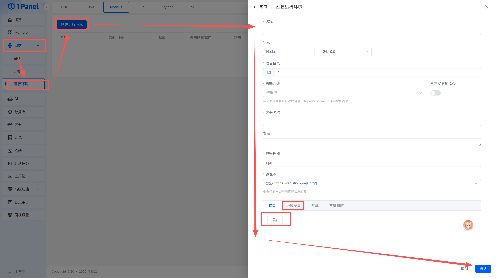
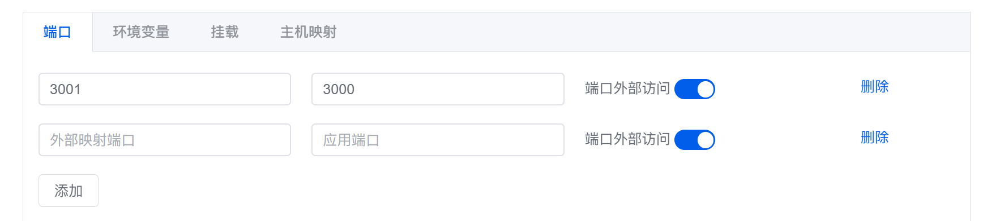
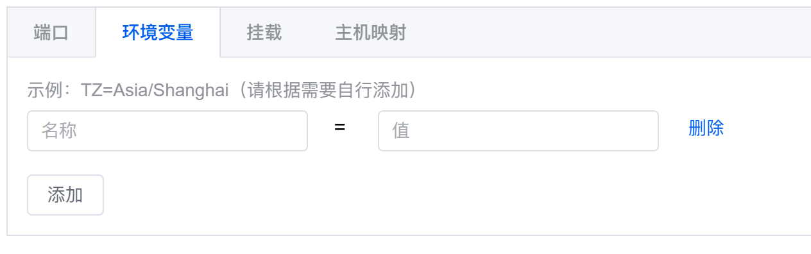
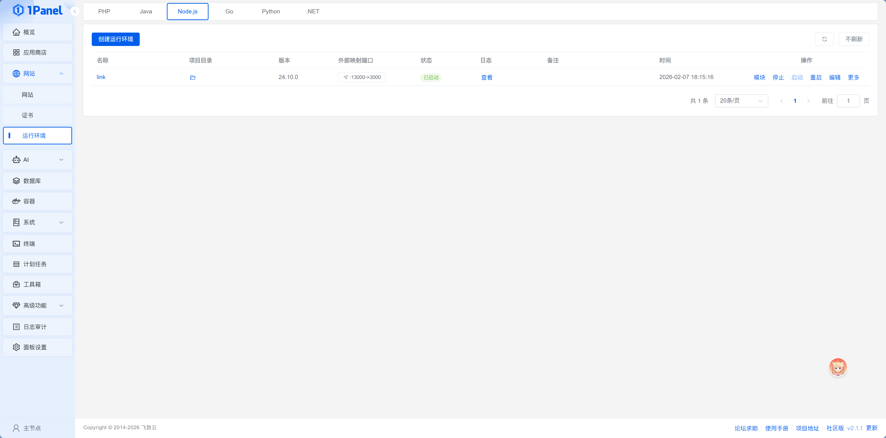

# 14.3.2 部署 Next.js 应用

> **本节目标**：通过 1Panel 的运行环境功能，把你的 Next.js 项目部署到服务器上并成功访问。

小明打开 1Panel 的运行环境配置页面，看到表单字段不多——"比 Vercel 还简单？"

老师傅说："差不多。在自己的服务器上部署，就是把 Vercel 帮你做的事情手动走一遍——填几个关键字段就行。"

## 前置准备

确保你已经完成：

- 服务器上安装了 1Panel（参考 [14.2](./02-vps-setup.md)）
- 通过应用商店安装了 **OpenResty** 和 **PostgreSQL**（如果项目需要数据库）
- 项目代码已推送到 GitHub

## 第一步：上传代码到服务器

创建运行环境时需要指定「项目目录」，所以你需要先把项目代码上传到服务器。常见方式：

- **Git Clone**：SSH 登录服务器，`git clone` 你的仓库到指定目录
- **1Panel 文件管理**：通过面板的「文件」功能上传压缩包并解压

```bash
# SSH 登录后，克隆代码到指定目录
cd /opt
git clone https://github.com/你的用户名/你的项目.git

# 进入项目目录，先把依赖装好
cd 你的项目
pnpm install
```

如果是私有仓库，需要配置 GitHub 的访问凭证（Personal Access Token）或 SSH Key。

::: tip 公开仓库更省事
如果你的项目不涉及敏感信息（敏感信息应该放在环境变量里，不在代码中），把仓库设为 Public 可以省去配置凭证的步骤。
:::

## 第二步：理解端口映射

在创建运行环境之前，先理解一个关键概念：**端口映射**。

你的 Next.js 应用运行在 Docker 容器里，默认监听 3000 端口。但容器是隔离的——外部用户访问服务器 IP 时，根本碰不到容器内部的 3000。你需要配置**端口映射**，在服务器上开一个外部端口，把流量转发到容器的 3000。

```
用户访问 → 服务器IP:3001 → 转发到 → 容器内部:3000 → Next.js 应用
```

::: tip 端口映射是什么？
一栋楼只有一个地址，但有很多房间。服务器只有一个 IP，但通过端口号区分不同的应用——3001 号房间是你的网站，3002 号房间是 API，5432 号房间是数据库。端口映射就是把楼外的门牌号（外部端口）和楼内的房间号（容器端口）对应起来。
:::

小明听到这里有点懵："所以我要填两个端口？"老师傅说："对。容器内部端口是 3000（Next.js 默认），服务器外部端口你自己定，比如 3001。用户访问 3001，流量就转发到容器的 3000。"


## 前置准备：内存不足的解决方案

如果你的 VPS 内存只有 1-2GB，构建 Next.js 项目时可能会遇到内存不足错误（`JavaScript heap out of memory`）。解决方案是创建 Swap 分区（虚拟内存）：

```bash
# 创建 2GB Swap 文件
sudo fallocate -l 2G /swapfile
sudo chmod 600 /swapfile
sudo mkswap /swapfile
sudo swapon /swapfile

# 设置开机自动挂载
echo '/swapfile none swap sw 0 0' | sudo tee -a /etc/fstab

# 验证 Swap 是否生效
free -h
```

创建 Swap 后，即使物理内存不足，系统也能用硬盘空间顶上，避免构建失败。

::: tip 什么时候需要 Swap？
- 1GB 内存：强烈建议创建 2GB Swap
- 2GB 内存：建议创建 1-2GB Swap
- 4GB 及以上：通常不需要
:::

## 第三步：创建运行环境

::: tip 运行环境的本质
1Panel 的「运行环境」本质上就是一个 Docker 容器。你在表单里填的配置项——项目目录、启动命令、端口映射——最终都会变成 `docker-compose.yml` 的参数。理解了这一点，下面的配置就不会觉得陌生了。
:::

在 1Panel 面板中，进入「网站 > 运行环境」，点击「创建运行环境」。表单分为基础配置和高级配置两部分。

**基础配置**（重点关注）：

- **名称**：给这个运行环境起个名字（如 `my-nextjs-app`）
- **项目目录**：选择你的代码所在路径（右侧有文件夹图标可以可视化选择）
- **版本**：Node.js 版本，默认是较新的版本，一般不需要改。如果你本地用的是特定版本，选择和本地一致的即可
- **启动命令**：`git pull && pnpm build && pnpm start`（见下方说明）
- **容器名称**：默认与运行环境名称相同，用于容器间通信——后端容器要连数据库时，就是通过容器名找到对方的

**高级配置**（展开后可见）：

- **端口映射**：把容器的 3000 映射到服务器的 3001（见下方说明）
- **环境变量**：把 `.env` 里的变量逐一添加（见下方说明）



### 端口映射怎么配置

在创建运行环境时，展开「高级配置」区域，找到端口映射部分：

1. 点击「添加」按钮新增一行端口映射
2. **主机端口**填 `3001`（服务器外部端口，你自己定）
3. **容器端口**填 `3000`（Next.js 默认端口）

```
服务器外部端口 3001  →  容器内部端口 3000
```

这样，用户访问 `http://服务器IP:3001`，流量就会被转发到容器里的 3000 端口，也就是你的 Next.js 应用。如果你的项目需要暴露多个端口，可以继续点「添加」配置更多映射。

配置完成后，记得在云厂商的安全组中**开放对应的外部端口**（如 3001）。



### 启动命令怎么填

这是整个表单最关键的一项。1Panel 提供两种模式：

- **自动解析模式**（默认）：1Panel 会读取你项目的 `package.json`，解析出 `scripts` 里定义的命令（如 `dev`、`build`、`start`），显示在下拉框中供你选择。
- **自定义模式**：打开「自定义启动命令」开关，手动输入任意命令。适合需要串联多个步骤的场景。

对于 Next.js 项目，`pnpm start` 只负责启动——它要求项目已经构建好。所以推荐使用自定义模式，把拉代码、构建和启动串起来：

```bash
git pull && pnpm build && pnpm start
```

这样每次重启时会自动拉取最新代码并重新构建，更新部署只需要在面板点「重启」就行，不用 SSH 登录服务器手动操作。

依赖安装（`pnpm install`）建议在上传代码后通过 SSH 提前完成（第一步已经做了），不需要放进启动命令里——每次重启都重新装一遍依赖既慢又没必要。如果后续新增了依赖包，SSH 上去跑一次 `pnpm install` 即可。

小明填到"启动命令"时犹豫了一下——本地开发用的是 `pnpm dev`，但生产环境应该用 `pnpm start`。老师傅提醒："dev 是开发模式，会开启热更新和调试工具，性能差而且不安全。生产环境永远用 start。"

### 环境变量怎么填

::: tip 环境变量的安全管理
环境变量中通常包含敏感信息（数据库密码、API 密钥等）。关于如何安全地管理这些敏感信息，详见第 8 章《认证与安全》中的"环境变量与密钥管理"部分。
:::

表单里的环境变量区域是一个键值对列表——每行一个"键"和"值"，点「添加」新增一行，点红色垃圾桶图标删除。把你本地 `.env` 里的变量逐一添加：

```bash
# PostgreSQL 连接（注意主机名是容器名）
DATABASE_URL="postgresql://用户名:密码@1Panel-postgresql-xxxx:5432/数据库名"

# Redis 连接（如果使用 Redis）
# 有密码的情况
REDIS_URL="redis://:你的密码@1Panel-redis-xxxx:6379"
# 无密码的情况
REDIS_URL="redis://1Panel-redis-xxxx:6379"

# 其他环境变量
BETTER_AUTH_SECRET="你的密钥"
BETTER_AUTH_URL="http://你的IP:端口"
NODE_ENV="production"
```

::: warning 容器名的命名规则
1Panel 创建的数据库容器名遵循 `1Panel-{数据库类型}-{随机4位字母}` 的格式：
- PostgreSQL: `1Panel-postgresql-ukow`（后4位随机）
- Redis: `1Panel-redis-w94p`（后4位随机）
- MySQL: `1Panel-mysql-abcd`（后4位随机）

你可以在「容器」页面查看实际的容器名，或者在创建数据库时自定义容器名。
:::

::: tip Redis 连接字符串格式
Redis 连接字符串的格式取决于是否设置了密码：
- **有密码**：`redis://:密码@容器名:6379`（注意 `:` 后面是密码）
- **无密码**：`redis://容器名:6379`（直接省略密码部分）
- **指定数据库**：`redis://容器名:6379/0`（末尾的 `/0` 表示使用 0 号数据库）
:::

小明把本地 `.env` 文件里的变量一个个复制过去。填到 `DATABASE_URL` 时，他差点又写 `localhost`——想起上一节的教训，赶紧改成了 PostgreSQL 的容器名。他去「容器」页面确认了一下，容器名是 `1Panel-postgresql-ukow`。



### 点击确认，等待启动

所有配置填好后，点击「确认」。1Panel 会按照你的启动命令依次执行拉取代码、构建、启动。第一次启动会比较慢——构建 Next.js 可能需要几分钟，毕竟服务器只有 2GB 内存。

小明点击确认后，日志开始滚动——拉取代码、构建、启动，跑了将近两分钟，最终状态变成了绿色的"运行中"。

查看运行日志可以在「网站 > 运行环境」列表中点击对应环境的「日志」按钮。



## 第四步：访问你的应用

应用启动成功后，在浏览器中输入 `http://服务器IP:3001`（你配置的外部端口），就能看到你的应用了。

小明在浏览器中输入地址，看到了自己的应用页面——"它真的跑在我自己的服务器上了！"他试着注册了一个账号、发了一条数据，刷新页面，数据还在。前端、后端、数据库，三个部分在自己的服务器上协同工作。


## 容器名 vs localhost：数据库连接

这是部署过程中最容易出错的地方，值得再强调一遍：

| 你的代码运行在哪里 | DATABASE_URL 里填什么 |
|------------------|---------------------|
| Docker 容器里（1Panel 运行环境） | 填**容器名**，如 `postgresql` |
| 服务器主机上（SSH 手动运行） | 填 `localhost` 或 `127.0.0.1` |

老师傅说："记住一句话就行——**容器找邻居用名字，主机找容器用 localhost**。"

## 常见问题排查

| 现象 | 可能原因 | 解决方案 |
|------|---------|---------|
| 启动后立刻退出 | 环境变量缺失 | 检查日志，补全环境变量 |
| 页面打不开 | 安全组没开端口 | 去云厂商控制台开放端口 |
| 数据库连接失败 | 主机名填错了 | 用容器名替代 localhost |
| 构建失败 | 内存不足或 Node 版本不匹配 | 参考上文"前置准备：内存不足的解决方案"创建 Swap，或选择和本地一致的 Node 版本 |

## 更新部署

代码更新后，你不需要重新走一遍流程。因为启动命令里已经有 `git pull`，直接在「网站 - 运行环境」列表中点击「重启」，面板就会自动拉取最新代码、重新构建并启动。如果遇到问题需要彻底重建，可以在「已安装」页面对应用执行「重建」——面板会删除容器并基于当前配置重新创建，持久化数据会保留。

小明第一次更新代码时，还傻傻地想着要不要 SSH 上去手动操作。老师傅说："启动命令里已经有 `git pull` 了，直接在面板点'重启'就行。如果新增了依赖包，才需要 SSH 上去跑一次 `pnpm install`。"整个过程不到一分钟，新版本就上线了。

::: tip 部署失败怎么办？
如果重建或重启后应用起不来，先看日志——在「网站 - 运行环境」列表点击「日志」按钮查看运行日志。最常见的原因是新代码引入了新的环境变量但没有在面板里配置，或者依赖包版本冲突。日志里通常会有明确的报错信息。
:::

---

::: info 下一步
Next.js 应用部署搞定了。如果你的项目是纯前端（没有后端），可以用更简单的方式部署——[14.3.3 部署静态网站](./03-3-deploy-static.md)。
:::
