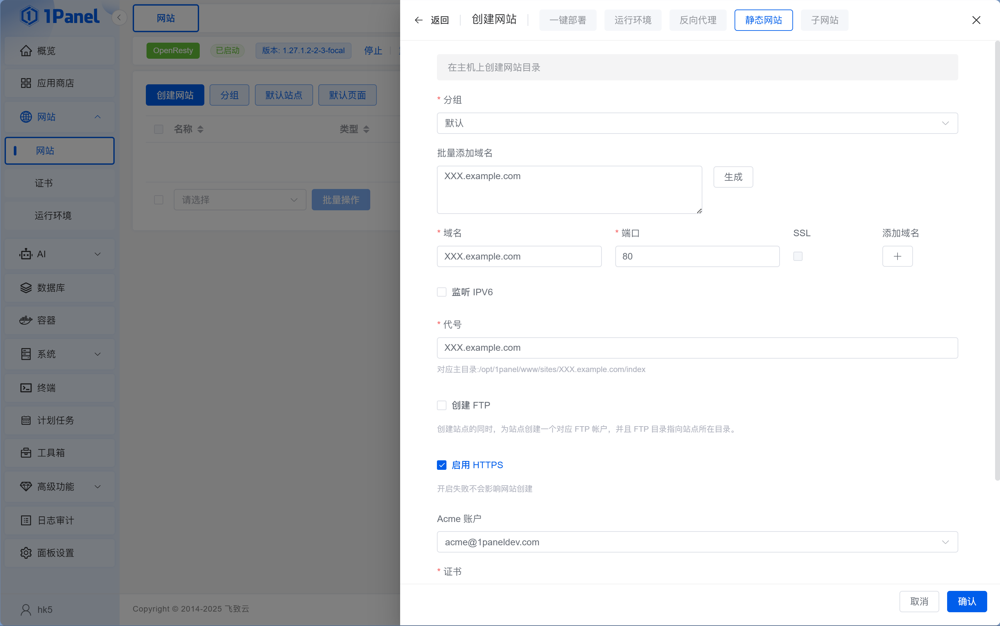

# 14.3.3 部署静态网站

> **本节目标**：通过 1Panel 的 OpenResty 部署纯前端的静态网站。

小明部署完 Next.js 应用后，又想起自己还有个 VitePress 文档站。"这个也能放服务器上吗？"

老师傅说："能，但没必要。静态网站放 Vercel、Cloudflare Pages 才是最优解——全球 CDN、推送即部署、零运维。你的 VPS 单机单线路，速度和稳定性都比不过。不过既然你在学部署，顺手练一下也行，流程比 Next.js 简单得多。"

## 什么是静态网站？

静态网站就是**只有 HTML、CSS、JavaScript 文件**的网站，不需要后端服务器实时处理请求。用户访问时，OpenResty 直接把文件丢给浏览器就行了。

常见的静态网站：

- 用 VitePress / Astro / Hugo 生成的文档站、博客
- React / Vue 的 SPA（单页应用）构建产物
- 纯 HTML 的落地页、作品集

小明的 VitePress 文档站一直托管在 Vercel 上，访问速度和自动部署都很好。但既然服务器已经跑着了，他想顺手把文档站也放上去——主要是练手，顺便体验一下完整的部署流程。

静态网站的优势是**快、省资源、几乎不会挂**。不需要 Node.js 运行环境，一个 OpenResty 就够了。

## 第一步：本地构建

在你的电脑上，先把项目构建成静态文件：

```bash
# VitePress
pnpm build    # 产物在 .vitepress/dist/

# Next.js (静态导出)
pnpm build    # 需要在 next.config.js 中配置 output: 'export'
              # 产物在 out/

# Vite / React / Vue
pnpm build    # 产物在 dist/
```

构建完成后，你会得到一个文件夹（`dist/`、`out/` 或 `.vitepress/dist/`），里面就是要上传到服务器的全部文件。

小明在本地跑完构建命令，`dist` 文件夹里生成了一堆 HTML、CSS 和 JS 文件。他打开其中一个 HTML 看了看——全是压缩过的代码，和他写的源码完全不一样。"这就是构建产物，浏览器直接能跑的东西。"

"就这些？不需要 Node.js 运行？""对，静态网站就是一堆文件，OpenResty 直接丢给浏览器就行。"

## 第二步：在 1Panel 创建网站

进入 1Panel 的「网站」页面，点击「创建网站」，选择「静态网站」。填入主域名（先用 IP 测试也行），其他保持默认，点击确认即可。


小明在 1Panel 的「网站」页面点击"创建网站"，选择"静态网站"，填了个域名就搞定了。1Panel 自动创建了网站目录并生成 OpenResty 配置，不需要手写任何配置文件。

## 第三步：上传构建产物

创建网站后，1Panel 会生成一个网站根目录（如 `/opt/1panel/www/sites/你的域名/index/`）。

在 1Panel 的「文件」页面，导航到网站根目录，直接上传构建产物的压缩包然后解压即可。


上传完成后，在浏览器中访问网站，页面秒开——静态网站上传完就能看，不需要等构建、等启动。

## 扩展：SPA 路由与缓存（大多数情况不需要）

::: info 什么是 SPA？
SPA（Single Page Application，单页应用）是 React / Vue 等框架的一种构建模式——整个网站只有一个 `index.html`，页面切换由前端 JavaScript 控制，不会真的加载新的 HTML 文件。VitePress、Astro、Hugo 等生成的是真正的多页静态 HTML，**不是 SPA**。
:::

::: tip 如何判断你的项目是不是 SPA？

**快速判断方法**：
1. 检查 `package.json` 中是否有 `build` 脚本
2. 运行 `npm run build`（或 `pnpm build`）后，查看构建产物：
   - 如果只有一个 `index.html` + 一堆 JS/CSS 文件 → **是 SPA**
   - 如果有多个 HTML 文件（如 `about.html`、`contact.html`）→ **不是 SPA**

**常见 SPA 框架**：
- React（用 Vite 或 Create React App 创建）
- Vue（用 Vite 或 Vue CLI 创建）
- Angular

**不是 SPA 的情况**：
- 传统多页面网站（每个页面一个 HTML 文件）
- 服务端渲染框架（Next.js、Nuxt）的静态导出

如果你不确定，大概率不是 SPA，可以跳过本节的路由配置。
:::

### SPA 路由修复

SPA 部署后会遇到一个问题：首页能打开，但刷新其他页面就 404。这是因为用户访问 `/about` 时，OpenResty 会去找 `about.html`，但 SPA 的所有内容都在 `index.html` 里。

解决方案：在网站设置的「基本」页面左侧找到「伪静态」选项卡，填入：

```nginx
location / {
    try_files $uri $uri/ /index.html;
}
```

点击「保存并重载」即可。

::: tip 伪静态的预置模板
「方案」下拉菜单预置了 WordPress、Laravel 等 PHP 框架的重写规则，但没有 Vue / React 的预设，需要手动填入上面的规则。
:::


### SPA 缓存策略

SPA 的静态资源（CSS、JS、图片）很少变化，配置缓存可以让用户第二次访问时秒开。在网站设置的「配置文件」选项卡中，在 `server` 块中添加：

```nginx
location ~* \.(js|css|png|jpg|jpeg|gif|ico|svg|woff2?)$ {
    expires 30d;
    add_header Cache-Control "public, immutable";
}
```

::: warning 更新后用户看到的还是旧版本？
现代前端构建工具（Vite、Webpack）会在文件名中加入 hash（如 `app.a1b2c3.js`），每次构建内容变化时 hash 也会变，浏览器会自动请求新文件。所以放心设置长期缓存，不会有"用户看到旧版本"的问题。
:::

## 更新静态网站

和 Next.js 不同，静态网站没有"重新部署"按钮。更新流程是：本地重新构建 → 上传新文件覆盖旧文件。如果你觉得每次手动上传太麻烦，可以写一个简单的脚本自动化这个过程，或者用 GitHub Actions 在推送代码时自动构建并上传（参考第 12 章的 CI/CD 内容）。

## 常见问题排查

| 现象 | 可能原因 | 解决方案 |
|------|---------|---------|
| 访问域名显示 404 | 网站未创建或域名未绑定 | 检查「网站」列表中是否有对应网站 |
| 页面显示空白 | 文件上传路径错误 | 确认上传的是 `dist` 内的文件，不是 `dist` 文件夹本身 |
| 刷新页面 404（SPA） | 缺少路由回退配置 | 在网站配置中添加 `try_files` 规则（见上文） |
| 样式/图片加载失败 | 构建时的 base 路径配置错误 | 检查 `vite.config.ts` 或 `next.config.js` 中的 `base` 配置 |
| 安全组已开放但无法访问 | 1Panel 防火墙未放行 80 端口 | 在「系统 → 防火墙」中添加 80 端口规则 |
| 文件上传后没有生效 | 浏览器缓存 | 强制刷新（Ctrl+Shift+R）或清除缓存 |

::: tip 调试技巧
1. **查看 OpenResty 日志**：在「应用商店 → 已安装 → OpenResty」中查看访问日志和错误日志
2. **检查文件权限**：确保上传的文件可读（通常 1Panel 会自动处理）
3. **用浏览器开发者工具**：按 F12 查看 Network 面板，看哪些资源加载失败
:::

---

::: info 下一步
静态网站部署搞定了。如果你的项目是前后端分离的架构（前端 + 后端 API + 数据库），继续看 [14.3.4 部署前后端分离应用](./03-4-deploy-fullstack.md)。
:::
