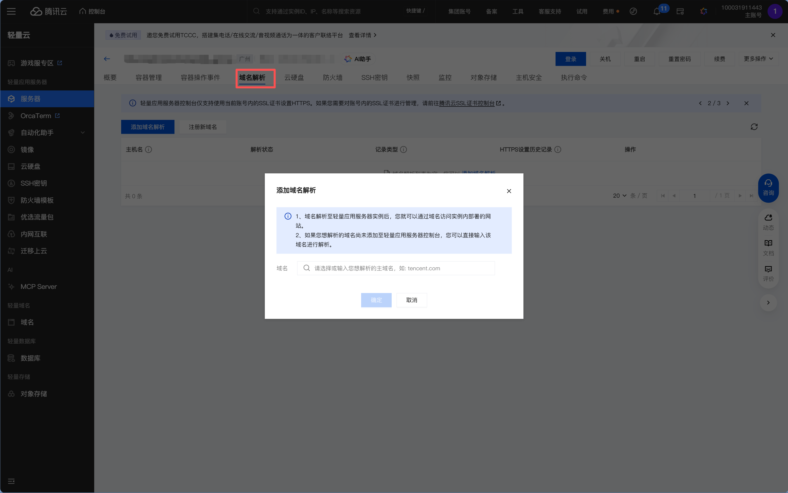
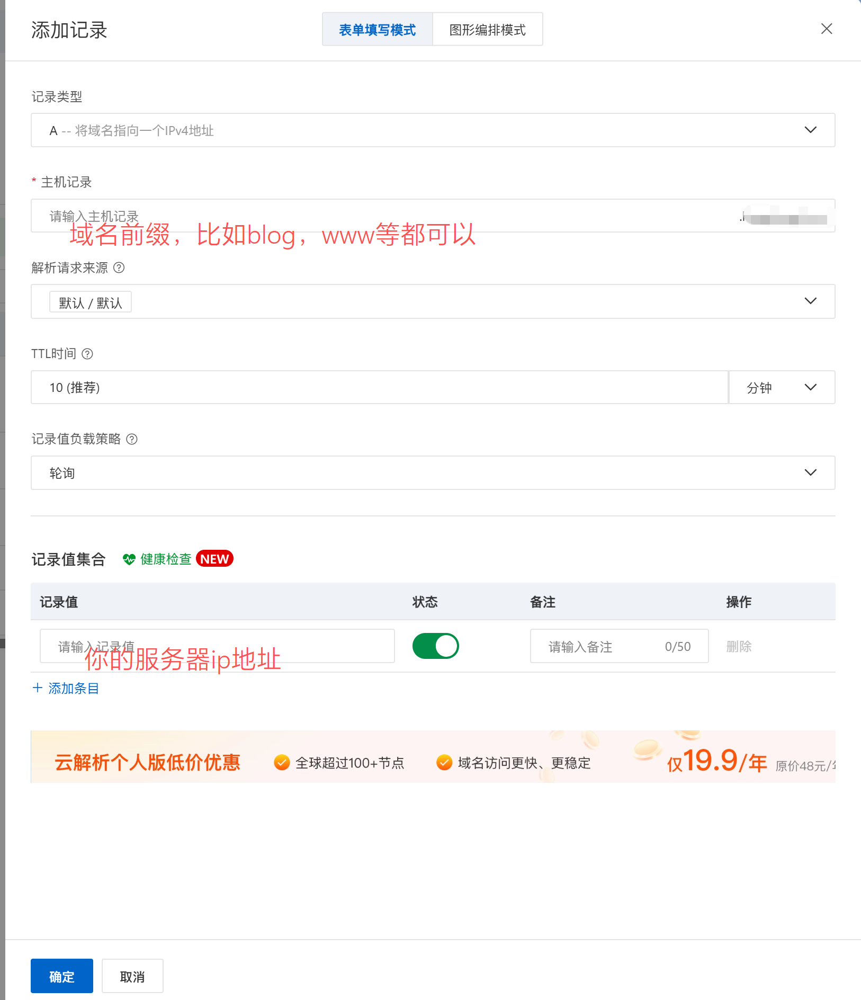
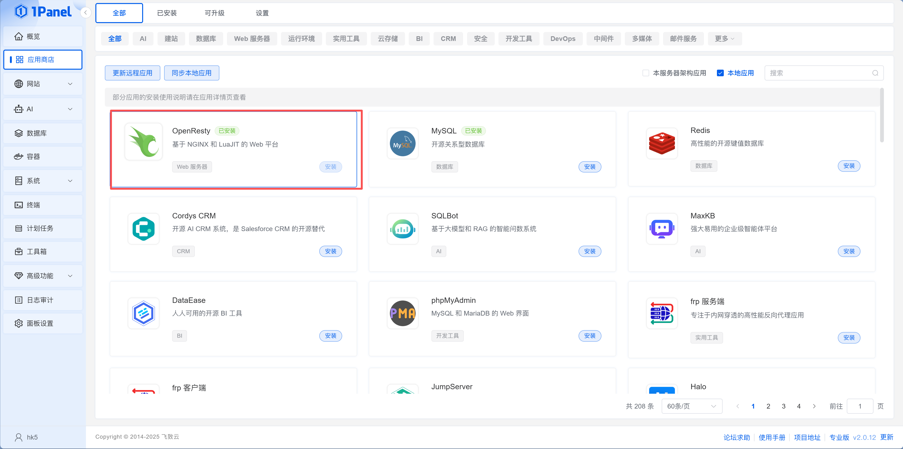
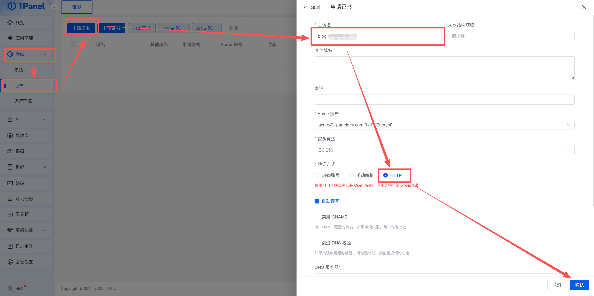
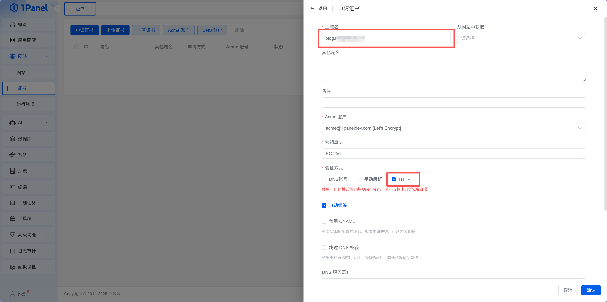
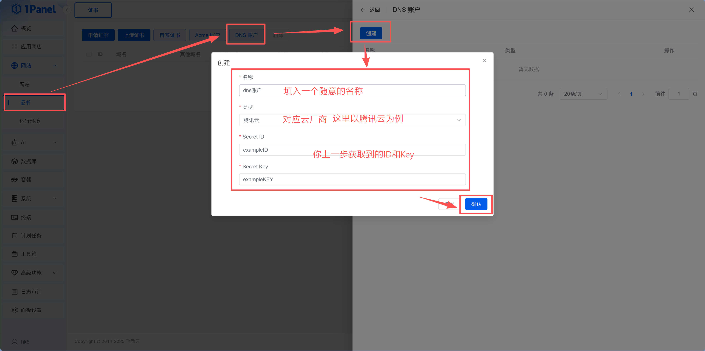
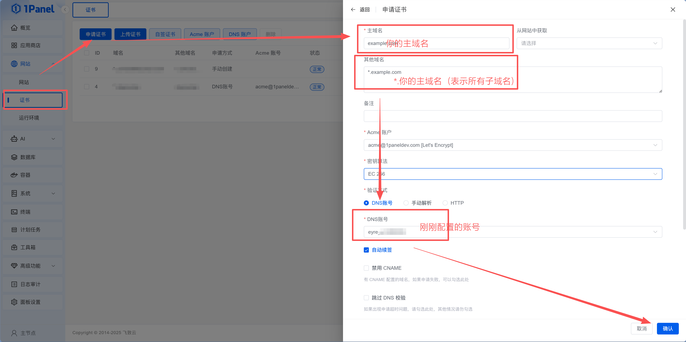

# 14.4 配置域名与证书

> **本节目标**：把域名指向你的服务器，申请免费 SSL 证书，让用户通过 `https://yourdomain.com` 安全访问你的应用。

小明的应用跑起来了，但 `http://IP:3001` 这个地址太丑了。他想起 Ch13 学过绑域名——"这次是 A 记录指向 VPS 的 IP，而不是 CNAME 指向平台。"

老师傅说："绑域名要做两件事，缺一不可：**DNS 是让域名找到服务器，创建网站是让服务器认这个域名**。只做 DNS 不建网站，请求到了服务器但没人接；只建网站不做 DNS，用户根本找不到你的服务器。Ch13 用 CNAME 是呼叫转移——转接到平台帮你处理。这次用 A 记录是直拨——直接拨服务器的 IP，两头都得你自己配。"

## 第一步：DNS A 记录——让域名找到服务器

在你的域名服务商（如阿里云、Cloudflare、腾讯云）的 DNS 管理页面，添加一条 **A 记录**。这一步的作用是告诉全世界的 DNS 系统："这个域名对应这个 IP。"

| 记录类型 | 主机记录 | 记录值 | TTL |
|---------|---------|-------|-----|
| A | `@` | 你的服务器公网 IP | 600 |
| A | `www` | 你的服务器公网 IP | 600 |

- `@` 表示根域名（如 `yourdomain.com`）
- `www` 表示 `www.yourdomain.com`

小明打开域名注册商的 DNS 管理页面，按照表格添加了两条 A 记录。操作本身很简单——选类型、填主机记录、填 IP 地址，几秒钟就加好了。但他心里有点没底："这就行了？域名真的能指向我的服务器？"




::: tip DNS 生效需要时间
添加记录后，通常几分钟到几小时生效（取决于 TTL 设置和各地 DNS 缓存）。可以用以下命令检查是否生效：

```bash
# 在你的电脑上执行
nslookup yourdomain.com
# 或
ping yourdomain.com
# 或（更详细）
dig yourdomain.com
```

如果返回的 IP 是你服务器的 IP，说明 DNS 已经生效了。

**如果 24 小时后还没生效**：
1. 检查 DNS 记录是否正确（主机记录、记录值）
2. 确认域名状态正常（未过期、未被锁定）
3. 尝试清除本地 DNS 缓存：`ipconfig /flushdns`（Windows）或 `sudo dscacheutil -flushcache`（Mac）
:::

## 第二步：创建网站——让服务器认这个域名

DNS 解决了"域名找到服务器"的问题，但服务器收到请求后还得知道该交给谁处理。在 1Panel 中创建网站（前面章节已经做过），填入的主域名就是告诉 OpenResty："收到这个域名的请求，交给我。"

如果你在 [14.3.2](./03-2-deploy-nextjs.md) 或 [14.3.3](./03-3-deploy-static.md) 创建网站时已经填了域名，这一步就已经完成了。如果当时用的是 IP 测试，现在进入 1Panel 的「网站」页面，编辑对应网站，把域名加上。

务必确保已经在应用商店安装 OpenResty。



配置完成后，确保安全组已开放 **80**（HTTP）和 **443**（HTTPS）端口。然后在浏览器中访问 `http://yourdomain.com`，如果能看到你的网站，说明域名配置成功了。

小明添加完 A 记录后，迫不及待地在浏览器输入域名——页面加载失败。他以为配错了，但老师傅让他等等："DNS 不是即时生效的，各地的 DNS 服务器需要时间同步。"过了几分钟再试，页面出来了。他又用手机试了一下，也能打开。"我的网站终于有自己的域名了，不再是一串 IP 加端口号。"

## 第三步：申请 Let's Encrypt 免费 SSL 证书

现在你的网站还是 HTTP，浏览器会显示"不安全"的警告。我们需要申请 SSL 证书来启用 HTTPS。

小明回想起在 Vercel 上部署时，一个 `vercel deploy` 就搞定了——域名、HTTPS、CDN 全自动配置。现在在 VPS 上，每一步都要自己来。"这就是自己管服务器的代价，但也是自由的代价。"

在 1Panel 中，进入「网站 > 证书」页面，点击「申请证书」。填写域名，申请方式选 **HTTP 验证**（最简单，前提是 80 端口可访问），开启「自动续签」，点击确认即可。ACME 账户保持默认的「1Panel 自动生成」就行。






等待十几秒，状态变成"已签发"后，回到网站配置页面，在 HTTPS 设置中选择刚申请的证书并启用。

::: tip Let's Encrypt 是什么？
Ch13 讲过，Let's Encrypt 是免费、自动化的证书颁发机构，全球数亿网站在用。证书有效期 90 天，但可以自动续期。和 Ch13 的区别是——那次证书由平台托管，这次证书在你自己的服务器上。
:::

小明在「网站 > 证书」页面点击"申请证书"，填了域名，选 HTTP 验证，开启自动续签，点击确认。十几秒后状态变成"已签发"。他回到网站配置页面启用 HTTPS，选择刚申请的证书，刷新网站——地址栏从"不安全"变成了小锁图标。"和 Ch13 一样的绿锁，但这次证书是我自己服务器上的。"

## 第四步：HTTPS 强制跳转

启用 HTTPS 后，你的网站同时支持 HTTP 和 HTTPS 访问。但我们希望所有 HTTP 请求都自动跳转到 HTTPS。

在 1Panel 的网站 HTTPS 设置页面，找到「HTTP 选项」，选择「**访问HTTP自动跳转到HTTPS**」即可。

::: tip HTTP 选项说明
1Panel 提供三种 HTTP 选项：
- **访问HTTP自动跳转到HTTPS**：推荐选项，所有 HTTP 请求自动重定向到 HTTPS
- **HTTP可直接访问**：HTTP 和 HTTPS 同时可用，不强制跳转
- **禁止 HTTP**：只允许 HTTPS 访问，HTTP 请求直接拒绝
:::


开启后，用户访问 `http://yourdomain.com` 会自动跳转到 `https://yourdomain.com`，地址栏会显示一个小锁图标。

小明故意在浏览器地址栏输入 `http://` 开头的地址，回车后自动跳转到了 `https://`。他又试了不带 `www` 的地址，也能正常跳转。"所有入口都通了，用户不管怎么输入都会走加密安全连接。"

## 第五步：证书自动续期

Let's Encrypt 证书有效期只有 90 天。如果证书过期了，用户打开你的网站会看到浏览器的全屏红色警告页——"您的连接不是私密连接"，大多数人会直接关掉。好在申请证书时如果勾选了「自动续签」，1Panel 会在证书到期前**自动帮你续期**（HTTP 验证和 DNS 账户验证方式支持自动续签）。你也可以在证书列表中点击「申请」按钮手动触发续签。

::: warning 证书续期失败的常见原因

1. **80 端口被占用或封禁**：Let's Encrypt 的 HTTP 验证需要访问 80 端口
2. **DNS 解析变了**：域名不再指向这台服务器
3. **防火墙规则变了**：安全组关闭了 80 端口

如果自动续期失败，1Panel 会在面板上显示告警。手动点击证书列表中的「申请」按钮重试即可。
:::

## 多域名和泛域名证书

如果你有多个子域名（如 `api.yourdomain.com`、`docs.yourdomain.com`），每加一个就要单独申请证书。泛域名证书可以一次搞定所有子域名：

**方案一：每个子域名单独申请证书**

最简单，每个网站独立管理自己的证书。

**方案二：申请泛域名证书**

一张证书覆盖 `*.yourdomain.com` 下的所有子域名。需要使用 **DNS 验证**（而不是 HTTP 验证）：

1. 在「网站 > 证书 > DNS 账户」中添加你域名服务商的 API 密钥（如阿里云 AccessKey、Cloudflare API Token）

::: details 如何获取 DNS 服务商的 API 密钥？

**阿里云**：
1. 登录阿里云控制台
2. 右上角头像 → AccessKey 管理
3. 创建 AccessKey（AccessKey ID + AccessKey Secret）
4. 在 1Panel 中填写这两个值

**Cloudflare**：
1. 登录 Cloudflare Dashboard
2. 右上角头像 → My Profile → API Tokens
3. 创建 Token，选择 "Edit zone DNS" 模板
4. 在 1Panel 中填写 Token

**腾讯云**：
1. 登录腾讯云控制台
2. 右上角头像 → 访问管理 → API 密钥管理
3. 创建密钥（SecretId + SecretKey）
4. 在 1Panel 中填写这两个值

:::



2. 申请证书时，域名填写 `*.yourdomain.com`，验证方式选择「DNS 验证」，选择刚添加的 DNS 账户



3. 1Panel 会自动在你的域名服务商处添加 TXT 记录完成验证，等待签发即可

| 证书类型 | 覆盖范围 | 验证方式 | 适合场景 |
|---------|---------|---------|---------|
| 单域名 | `yourdomain.com` | HTTP / DNS 均可 | 只有一个域名 |
| 多域名 | 指定的几个域名 | HTTP / DNS 均可 | 2-3 个域名 |
| 泛域名 | `*.yourdomain.com` | 仅 DNS 验证 | 子域名很多 |


---

::: info 下一步
域名和 HTTPS 都配好了，你的网站已经是一个"正经"的线上产品了。接下来看看服务器上还能跑哪些有趣的应用——[14.5 其他好玩的应用](./05-cool-apps.md)。
:::
