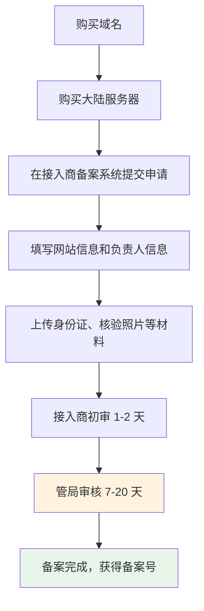

# 15.4 法律合规

> 法律合规不是可选项，而是必修课。不要等被举报了才想起来合规。

---

## "个人项目也需要？"

小明的网站开始有用户了。不多，每天几十个，但确实有真实的人在使用他做的东西。他正沉浸在看 Umami 数据的快乐中，老师傅突然严肃起来。

"你收集了用户数据，有隐私政策吗？"

"啊？个人项目也需要这个？"小明觉得隐私政策是大公司才需要操心的事情。

"只要你收集用户数据——哪怕只是 Umami 的访问统计——严格来说就需要。"老师傅顿了顿，"知道 GDPR 违规罚款多少吗？全球年营业额的 4%，或者 2000 万欧元，取较高者。"

小明吓了一跳。虽然他的个人项目大概率不会被欧盟盯上，但老师傅的意思很清楚：**合规意识要从一开始就有，不要等项目做大了才补课**。

---

## 为什么需要法律合规

互联网产品涉及用户数据和商业行为，必须遵守相关法律。这不是"大公司的事"——法律对个人开发者和大公司一视同仁。

| 风险 | 后果 |
|------|------|
| 违反数据保护法 | 巨额罚款、应用下架、服务被封 |
| 缺少用户协议 | 发生纠纷时没有法律保护 |
| 未备案网站 | 在中国大陆被封禁访问 |
| 侵犯用户隐私 | 声誉损失、用户流失、媒体曝光 |

好消息是：对个人项目来说，合规并不复杂。你不需要请律师（虽然正式产品建议请），也不需要读完整部 GDPR。搞清楚你需要什么，让 Claude Code 根据你的实际情况帮你生成合规文档，比你想象的简单得多。

---

## 隐私政策：告诉用户你拿了什么数据

隐私政策是一份公开文档，说明你的网站或应用收集了哪些用户数据、为什么收集、怎么存储、怎么使用、用户有什么权利。

### 什么时候需要隐私政策

很多人以为只有"收集个人信息"才需要隐私政策。其实不是——只要你收集了以下任何数据，就需要：

- **账户信息**：邮箱地址、用户名、密码（哈希后的）
- **行为数据**：页面浏览记录、点击行为——是的，Umami 统计也算
- **个人身份信息**：姓名、电话、地址
- **位置信息**：IP 地址、GPS 定位
- **Cookie 和类似技术**：如果你用了 Cookie（Umami 不用，但很多其他工具用）

纯静态展示网站——没有任何统计代码、没有表单、没有登录功能——可以不需要隐私政策。但只要你加了 Umami 的追踪代码，严格来说就需要了。虽然 Umami 不追踪个人身份，但它确实在收集匿名的访问数据。

### 隐私政策该包含什么

一份合格的隐私政策需要回答以下问题：

| 内容 | 说明 |
|------|------|
| 数据收集 | 你收集了哪些数据？为什么要收集？ |
| 数据使用 | 收集的数据用来做什么？ |
| 数据存储 | 数据存在哪里？保留多久？ |
| 数据共享 | 会不会把数据给第三方？什么情况下会？ |
| 用户权利 | 用户能不能查看、修改、删除自己的数据？ |
| Cookie 政策 | 有没有用 Cookie？用来做什么？ |
| 联系方式 | 用户有问题找谁？ |

这些内容看起来很多，但对个人项目来说，大部分答案都很简单。比如"数据共享"——你大概率不会把数据卖给第三方，直接写"我们不会出售您的个人信息"就行。

### GDPR：如果你有欧盟用户

GDPR（General Data Protection Regulation，通用数据保护条例）是欧盟的数据保护法，被认为是全球最严格的隐私法规。如果你的网站有欧盟用户访问（即使你的服务器不在欧盟），理论上就需要遵守 GDPR。

GDPR 的额外要求包括：

- 明确的数据处理法律依据（你凭什么收集这些数据？）
- 用户有权要求你删除他们的所有数据（"被遗忘权"）
- 数据泄露时必须在 72 小时内通知用户和监管机构
- 如果大规模处理个人数据，需要指定数据保护官（DPO）

听起来很吓人，但好消息是：**如果你用 Umami 做统计，GDPR 合规压力小很多**。Umami 不使用 Cookie、不追踪个人身份、不收集可识别数据——这些正是 GDPR 最关心的点。你需要在隐私政策里说明你使用了匿名统计工具，但不需要 Cookie 同意弹窗。

### 怎么生成隐私政策

不要复制别人的隐私政策。每个产品收集的数据不同，使用的第三方服务不同，隐私政策也应该不同。复制来的隐私政策可能包含你根本没有的功能（"我们使用 Google Analytics 追踪用户行为"——但你用的是 Umami），也可能遗漏你实际收集的数据。

正确的做法：告诉 Claude Code 扫描代码库，你的产品收集了哪些数据（注册信息、统计数据、支付信息等）、用了哪些第三方服务（Umami、Stripe、Supabase 等），让它根据你的实际情况生成一份隐私政策。AI 生成的隐私政策比通用模板更贴合你的产品，也比你自己从零写更专业。

生成后，把隐私政策放在一个独立页面（通常是 `/privacy`），然后在网站底部加上链接。

---

## 用户协议：定义游戏规则

用户协议（Terms of Service，简称 ToS）定义了用户使用你的服务时的权利和义务。如果说隐私政策是"我怎么对待你的数据"，用户协议就是"我们之间的游戏规则"。

### 为什么需要用户协议

没有用户协议，当出现纠纷时你没有法律依据。比如：

- 用户在你的平台上发布了违法内容——谁负责？
- 用户说你的服务导致了他的损失——你要赔偿吗？
- 你想关停某个用户的账号——你有权这么做吗？

这些问题，用户协议都需要提前说清楚。

### 核心内容

| 内容 | 说明 |
|------|------|
| 服务描述 | 你提供什么服务，服务范围是什么 |
| 用户责任 | 用户不能做什么（发布违法内容、攻击系统等） |
| 内容责任 | 用户发布的内容由谁负责——通常是用户自己 |
| 知识产权 | 你的代码归你，用户的内容归用户 |
| 服务变更 | 你有权修改、暂停或终止服务 |
| 免责声明 | 服务按"现状"提供，不保证 100% 可用 |
| 争议解决 | 出了问题怎么解决，适用哪里的法律 |

### 怎么生成

和隐私政策一样，告诉 Claude Code 你的产品做什么、用户能做什么（能不能发布内容？能不能上传文件？有没有付费功能？），让它帮你生成用户协议。

生成后放在 `/terms` 页面，在网站底部加上链接。如果你的产品有注册功能，注册流程中应该让用户勾选"我已阅读并同意用户协议和隐私政策"。

---

## ICP 备案：中国大陆的特殊要求

ICP 备案是中国大陆特有的制度。如果你的服务器在中国大陆，网站必须完成 ICP 备案才能正常访问，否则会被运营商封禁。

### 什么时候需要

| 服务器位置 | 是否需要备案 |
|-----------|-------------|
| 中国大陆 | 必须备案 |
| 中国香港、澳门 | 不需要 |
| 其他国家/地区 | 不需要 |

小明的服务器在香港，所以不需要备案。但老师傅让他了解规则——如果以后产品做大了，想迁到国内服务器以获得更好的访问速度和百度 SEO 效果（15.2 提到百度对未备案网站收录意愿很低），就需要备案了。

### 备案类型

| 类型 | 说明 | 适用对象 |
|------|------|---------|
| ICP 备案 | 基础备案，所有大陆网站必须完成 | 所有在大陆托管的网站 |
| 公安备案 | 向公安机关备案 | 部分省市要求，ICP 备案后 30 天内完成 |
| 经营性 ICP 许可证 | 提供有偿信息服务的网站 | 有付费功能的商业网站 |

大部分个人项目只需要做 ICP 备案。如果你的网站有付费功能（比如会员订阅、在线购物），可能还需要经营性 ICP 许可证，但这个门槛较高，通常需要企业资质。

### 备案流程

整个流程大约需要 2-4 周。几个注意事项：

- **备案期间网站可能无法访问**——首次备案时，管局审核期间网站需要关闭
- **备案信息必须真实**——虚假信息会被驳回，严重的会被列入黑名单
- **备案号要放在网站底部**——备案完成后，你会拿到一个备案号（如"京ICP备XXXXXXXX号"），必须放在网站底部并链接到工信部查询页面
- **信息变更要及时更新**——换了服务器、换了域名、换了负责人，都需要去更新备案信息

### 备案时间

| 阶段 | 时间 |
|------|------|
| 接入商初审 | 1-2 个工作日 |
| 管局审核 | 7-20 个工作日 |
| 总计 | 约 2-4 周 |

---

## 合规检查清单

老师傅给小明列了一份清单："让 Claude Code 生成合规文档后，过一遍这个清单，确保不遗漏。"

**隐私和数据**
- [ ] 隐私政策已由 Claude Code 根据代码扫描生成并部署到 `/privacy` 页面
- [ ] 隐私政策链接在网站底部显著位置
- [ ] 审核隐私政策内容是否准确反映你的实际数据收集（数据类型、用途、存储位置）
- [ ] 确认提供了用户数据访问和删除的机制（至少提供联系邮箱）
- [ ] 如果服务欧盟用户，审核是否符合 GDPR 基本要求

**用户协议**
- [ ] 用户协议已由 Claude Code 根据你的产品功能生成并部署到 `/terms` 页面
- [ ] 注册流程中要求用户同意协议
- [ ] 审核协议内容是否准确反映你的服务范围和责任划分

**中国大陆特定**
- [ ] 如果服务器在大陆，已完成 ICP 备案
- [ ] 备案号放在网站底部并链接到工信部
- [ ] 内容符合中国法律法规

**其他**
- [ ] 网站底部有联系方式（至少一个邮箱）
- [ ] 如果使用 Cookie，有 Cookie 使用说明
- [ ] 如果有用户举报需求，提供投诉举报渠道

---

## 常见问题

### Q1: 个人项目真的需要隐私政策吗？

严格来说，只要你收集任何用户数据（包括匿名统计），就需要。实际操作中，一个小型个人项目不太可能被监管机构盯上。但养成合规习惯是好事——如果项目以后做大了，你不需要从零补课。而且生成一份隐私政策只需要几分钟，成本几乎为零。

### Q2: GDPR 违规真的会被罚吗？

会。虽然大部分罚款案例针对的是大公司（Meta 被罚过 12 亿欧元，亚马逊被罚过 7.46 亿欧元），但也有小公司和个人被罚的案例。罚款金额取决于违规严重程度——对个人项目来说，做好基本合规（隐私政策 + 数据最小化原则）就足够了。

---

## 小明的合规之路

小明让 Claude Code 根据自己的产品情况生成了隐私政策和用户协议。他告诉 Claude Code：

- 产品是一个 Web 应用，有用户注册功能（收集邮箱和用户名）
- 使用 Umami 做匿名访问统计
- 使用 Supabase 存储数据，服务器在新加坡
- 没有付费功能，不收集支付信息

Claude Code 根据这些信息生成了两份文档，小明检查了一遍，放到了网站底部。合规检查清单也过了一遍——除了 ICP 备案（服务器在香港，不需要），其他项目都打了勾。

第十五章到这里就结束了。回顾一下小明的旅程：

- 他的链接从一串蓝色 URL 变成了精美的分享卡片（OG）
- 他的网站从搜索引擎的"隐形人"变成了可以被搜到的存在（SEO）
- 他从"不知道有没有人用"变成了"每周看数据做决策"（Umami）
- 他从"个人项目不需要合规"变成了"隐私政策和用户协议都有了"（法律合规）

网站从"能用"变成了"能被发现、能被理解、能被信任"。

下一章，我们用数据和用户反馈来驱动产品迭代——不是你觉得该改什么，而是数据告诉你该改什么。
