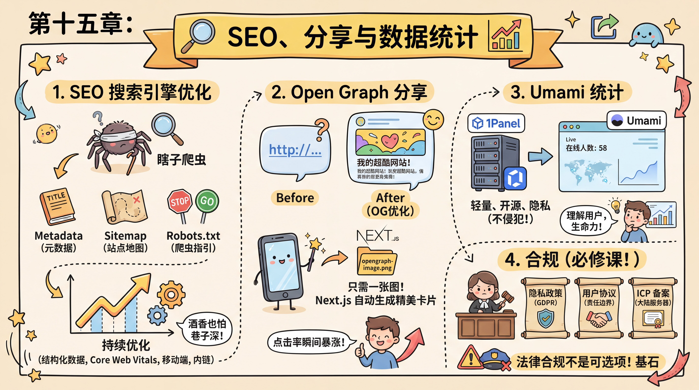

# 第十五章：SEO、分享与数据统计

## 序言

你终于做好项目了，发给你的朋友，他们惊叹于你的创造力。朋友们纷纷把你的网站分享到社交媒体上，你看着点击率一点点上涨，心里美滋滋的。

但小明在百度和谷歌里翻了十页都找不到自己的应用。他意识到，**酒香也怕巷子深**——你需要让搜索引擎和社交媒体都能更好地发现你的网站。

### 1. SEO 搜索引擎优化

小明每天都会上去刷新几次自己的网站，但在搜索引擎里翻了十页都找不到。老师傅告诉他，搜索引擎的爬虫是瞎子，你需要给它指路。

- **Metadata（元数据）**：在 Next.js 的 `layout.tsx` 里配置 `metadata` 对象，填上清晰的 `title` 和 `description`，告诉爬虫你是谁。

- **Sitemap（站点地图）**：给爬虫的一张地图，告诉它网站里有哪些页面，哪些是最新的。

- **Robots.txt**：给爬虫看的规则文件，告诉它哪些能爬，哪些不能爬。

老师傅告诉小明，SEO 不是一次性配置，而是持续优化的过程。结构化数据让搜索引擎更好地理解内容；Core Web Vitals 是谷歌的页面体验指标，直接影响搜索排名；移动端友好度是重要排名因素。这些优化不会一夜之间让你排到第一，但长期坚持会让网站在搜索结果中逐渐上升。

### 2. Open Graph 分享

小明把配置好 SEO 的网址发到群里，却发现只显示一串蓝色的链接，没有任何标题或图片，根本没人想点。老师傅让他配置 **Open Graph（OG）** 协议。

在 Next.js 中只需要放一张图片命名为 `opengraph-image.png`，它会自动生成 OG 标签，社交平台抓取时就能显示精美大图和引人入胜的标题。社交分享是现代产品的重要流量来源，视觉吸引力直接决定点击率。OG 优化不是可选项，是营销的基础设施。

当小明再次把链接分享到群里时，出现了一张精美的大图和引人入胜的标题，朋友们的点击率瞬间暴涨。

### 3. Umami 统计

小明不知道每天到底有多少人来访问，用户来自哪里，用什么设备。市面上的统计工具（如 Google Analytics）太重，而且容易侵犯隐私。老师傅想起了他第十四章刚刚搭好的 **1Panel 服务器**。

"为什么不自己搭建一个统计系统呢？"小明打开 1Panel 的应用商店，一键部署了 **Umami**。把 Umami 生成的一小段 JS 代码贴到应用里，几分钟后，看着后台跳动的在线人数，他第一次感受到了产品的**生命力**。

老师傅说："上线不是结束，而是理解的开始。有了数据，你才能做出更好的决策。但记住：收集数据前先想清楚要解决什么问题。"

### 4. 合规

"**法律合规不是可选项，而是必修课**，"老师傅严肃地说。

**第一：隐私政策**。如果你收集用户数据（邮箱、行为数据等），必须有隐私政策，说明数据用途、存储方式、用户权利等。**GDPR**（欧盟数据保护法）要求严格，不合规可能面临巨额罚款。

**第二：用户协议**。明确服务条款、免责声明、内容责任边界。

**第三：ICP 备案**。如果你的服务器在中国大陆，必须做 ICP 备案，否则网站会被封禁。

记住：**合规是产品长期运营的基石**。不要等被举报了才想起来合规。

---

### 本章小节

1. [15.1 Open Graph 与社交分享](./01-opengraph-sharing.md) — OG 协议、平台差异、图片设计
2. [15.2 SEO 全攻略](./02-seo-guide.md) — 搜索引擎原理、基础配置、内容优化
3. [15.3 Umami 数据统计](./03-umami.md) — 指标解读、数据驱动决策、隐私保护
4. [15.4 法律合规](./04-legal.md) — 隐私政策、用户协议、ICP 备案

---

**上一章**：[第十四章：云服务器运维与项目部署](../14-vps-ops-deploy/index.md)

**下一章**：[第十六章：用户反馈与产品迭代](../16-user-feedback-iteration/index.md)
