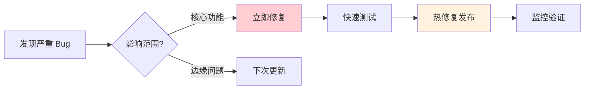
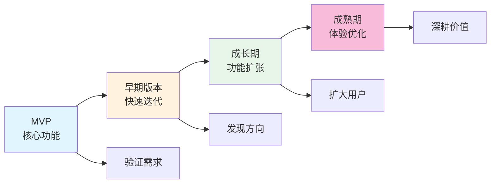

# 16.4 迭代与成长

> 产品上线的那一天，不是结束，而是真正开始。

---

## 一次性全改完的教训

小明根据反馈和数据，列了一个改进清单：优化导航、简化注册、修复三个 Bug、加个搜索功能。他花了两周，把所有改动一次性全部上线。

结果，搜索功能引入了一个新 Bug，导致部分用户的笔记列表显示异常。更糟的是，因为改了太多东西，他花了很长时间才定位到问题出在哪里。如果他一次只改一个，立刻就能知道是哪个改动出了问题。

老师傅说："一次改一点，每次都能确认没问题，再改下一个。"

---

## 更新节奏的平衡

更新太快和太慢都有问题。

更新太快，用户会疲惫——他们刚适应新界面，又变了。频繁更新容易引入新 Bug，产品难以保持稳定，文档也跟不上。更新太慢，用户的需求得不到满足，他们会失去兴趣，竞争者可能趁机超越你，而且你也缺少了反馈循环——改得慢意味着学得慢。

好的更新节奏是既能快速响应用户需求，又能保持产品稳定。怎么做到？老师傅教了小明一个方法：分层。

---

## 三层更新策略

不是所有更新都一样。把更新分成三层，每层有自己的节奏。

**热修复**是最紧急的一层——紧急 Bug 修复，随时发布，风险最低。比如登录功能崩溃了，不能等到下周，现在就要修。热修复只改一个问题，不夹带其他改动。改完立刻测试、发布、监控。

**小更新**是第二层——小功能、优化、非紧急 Bug，每周发布一次，风险中等。把一周内积累的小改动打包发布，比每天零散更新好。

**大版本**是第三层——新功能、重构、架构调整，每月发布一次，风险最高。大版本需要更充分的测试，更完整的文档，更清晰的用户沟通。

小明把这三层策略用起来后，产品稳定了很多。紧急问题随时修，小改进每周攒一批，大功能每月上一个。用户也有了稳定的预期。

---

## 灰度发布

小明问："新功能直接全量上线不行吗？"

老师傅说："你刚吃过亏。新功能先给一小部分用户用，没问题再全量。这叫灰度发布。"

灰度发布的好处很直接：问题只影响部分用户，降低了风险；在真实环境中验证功能，比测试环境更可靠；稳定后再逐步放量，全量发布时你已经有信心了。

具体怎么做？最简单的是白名单——指定几个友好用户先用，适合内部测试。进阶一点是百分比——随机让 10% 的用户看到新功能，适合大规模验证。还可以做随机分桶，本质上就是 A/B 测试。或者条件触发——满足特定条件才显示新功能，适合风险控制。

功能开关（Feature Flag）是实现灰度发布的常用方式。告诉 Claude Code 你需要一个功能开关系统，描述清楚白名单和百分比逻辑就行——具体实现取决于你的技术栈。

---

## 变更管理

更新了功能，要让用户知道。

新增功能要强调价值，教用户怎么用。功能移除要提前通知，解释原因——突然删掉用户在用的功能是大忌。界面变化要做对比说明，引导用户适应。Bug 修复简单告知已解决就行。

更新日志（Changelog）是最简单有效的沟通方式。每次发版写几句话，让用户知道你在持续改进。不需要写得很正式，几句话说清楚改了什么、为什么改就够了。

---

## 迭代节奏

不同阶段适合不同的节奏。

早期是快速迭代阶段——一周一个小版本，关注核心功能，快速验证假设，不过度优化。这个阶段的目标是找到方向，速度比完美更重要。

成长期是稳定节奏阶段——两周一个小版本，每月一个大版本，质量和速度并重。这个阶段你已经知道方向了，开始扩张功能，同时注重稳定性。

成熟期是持续优化阶段——节奏放慢，重点从"加功能"转向"优体验"，深耕价值。

小明的产品还在早期，所以他选择了快速迭代。

### 新功能 vs Bug 修复

老师傅给了一个简单的原则：80% 精力在稳定性和 Bug 修复，20% 精力在新功能开发。

这个比例可能让你意外——"80% 修 Bug？那新功能什么时候做？"但道理很简单：用户宁愿用一个稳定的简单产品，也不愿用一个功能丰富但经常崩溃的产品。稳定是一切的基础。

---

## 永远在 Beta

几个月过去了，小明的产品稳定了不少，用户也在慢慢增长。他问老师傅："什么时候算'做完了'？"

老师傅说："永远不会。"

传统理解里，Beta 是测试版本，是临时的、不稳定的，总有一天会"正式发布"。但现代产品思维里，Beta 是一种永久心态——持续改进，永不停止。"永远在 Beta"不是说产品不完整，而是始终相信有改进空间，保持学习和调整。

这种心态的好处是降低完美主义压力——你不需要一次做到完美，因为永远有下一个版本。它鼓励快速尝试，保持谦逊，承认你不知道所有答案，从反馈中不断进步。

---

## 加强受欢迎的

资源有限，要把精力放在用户真正喜欢的地方。

怎么识别受欢迎的功能？看四个信号：使用率高（功能使用频率高）、正面反馈多（用户主动提及）、留存贡献大（使用该功能的用户留存更好）、付费意愿强（用户愿意为此付费）。

识别出来后，怎么加强？可以深化功能——做得更强大、更完善。可以相关扩展——添加相关功能，让核心体验更完整。可以优化体验——让功能更好用、更顺滑。也可以宣传推广——让更多用户知道这个功能的存在。

---

## 放弃没人用的

小明发现他做的"标签系统"几乎没人用。他花了一周开发的功能，使用率不到 2%。

他很纠结："删掉吗？毕竟花了时间做的。"

老师傅说："沉没成本不是继续投入的理由。没人用的功能留着，只会增加维护负担和产品复杂度。每多一个功能，就多一个可能出 Bug 的地方，多一个需要测试的东西，多一个让新用户困惑的选项。"

怎么识别没人用的功能？使用率低、从未被用户提及、问题多但价值小、与产品方向不符——这些都是信号。

放弃的方式取决于情况。如果使用率极低，直接移除。如果还有部分用户依赖，逐步淘汰——停止推广，慢慢移除。如果有更好的替代方案，用替换的方式。

::: tip 移除功能前的准备

1. 分析使用数据，确认真的低使用率
2. 提前通知受影响的用户
3. 提供替代方案或迁移指南
4. 监控移除后的反馈

不要偷偷删。即使只有 2% 的用户在用，他们也值得被提前告知。

:::

---

## 小步快跑

小明回顾这几个月的经历，发现一个规律：每次改动越小，效果越好。

小改动降低风险——每次改动小，出了问题容易定位。小改动带来快速反馈——更快知道方向对不对，不用等一个月才发现走错了。小改动心理轻松——不需要"憋大招"，每天都有进步的感觉。小改动积少成多——一周改一个小问题，一年就是 52 个改进。

这就是"小步快跑"的核心：不要追求一次性的大突破，而是追求持续的小改进。

---

## 产品进化的全景

从 MVP 到成熟产品，是一个渐进的过程：

MVP 阶段的目标是验证需求——你做的东西有人要吗？早期版本的目标是发现方向——用户真正需要的是什么？成长期的目标是扩大用户——让更多人知道并使用。成熟期的目标是深耕价值——把核心体验做到极致。

小明的产品正在从 MVP 走向早期版本。他已经验证了需求（有人在用），正在通过反馈和数据发现方向。

---

## 长期主义

老师傅最后跟小明聊了一个更大的话题：长期主义。

短期思维追求爆款，长期思维追求持续改进。短期思维想快速扩张，长期思维追求稳健增长。短期思维想取悦所有人，长期思维专注服务核心用户。短期思维期待一夜成功，长期思维相信日积月累。

"你看到的那些成功产品，"老师傅说，"它们不是一夜之间变成那样的。它们都经历了无数次迭代，无数次失败，无数次调整。你现在做的每一个小改进，都在为未来积累。"

---

## 常见问题

### Q1: 什么时候停止迭代？

产品迭代没有终点。但可以调整节奏——早期快速迭代验证假设，成熟期稳定节奏持续优化。"停止迭代"通常意味着产品开始衰退。

### Q2: 如何避免过度迭代？

关注核心指标。如果新改动没有带来改进，停下来重新思考方向，而不是继续改。有时候"不改"比"乱改"更好。

### Q3: 新功能 vs Bug 修复怎么平衡？

80/20 原则。80% 精力在稳定性和 Bug 修复，20% 在新功能。稳定是一切的基础。

---

## 全书结语

小明回头看看自己走过的路。

从第一章搭环境开始，他学会了用 Claude Code 写代码、用 PRD 定义需求、用组件库搭界面、用数据库存数据、用 API 连前后端、用认证保护用户、用测试保证质量、用 Git 管理代码、用 Vercel 部署上线、用 Umami 看数据、用 SEO 让人找到他。

现在，他有了一个真实的产品，有真实的用户，有真实的反馈。他知道怎么收集反馈、怎么排优先级、怎么理解用户、怎么持续迭代。

产品还很小，用户还不多。但它在成长，他也在成长。

产品上线不是结束，而是真正的开始。去做吧。
