# 开局一个浏览器，代码环境全搞定

你是否厌倦了：

- 配置开发环境要花好几天？
- 电脑配置不够，Docker 跑不动？
- GitHub 下载慢，clone 一个仓库要半小时？

别折腾了！**打开浏览器就能写代码**，环境自动配置好，所有依赖装好就能用。

> 理论上任何能安装浏览器的设备都能 VibeCoding，甚至是冰箱、电话手表。

## 预装开发环境

本项目基于 [Eyre@VibeVibe.cn](https://www.hangkangfu.cn) 构建并发布的镜像，开箱即用：

- **AI 编程**: Claude Code、OpenAI Codex、Gemini Code Assist
- **运行时**: Node.js 24.x、Python 3.11+、Docker
- **开发工具**: Git、GitHub CLI、VS Code (53 个扩展)
- **运维面板**: 1Panel (端口 34246，用户名 `cnb`，密码 `IloveCNB.`)

详细配置参考 [default-dev-env](https://cnb.cool/nfeyre/default-dev-env)。

## 基础概念

| 概念 | 说明 |
|-----|------|
| **仓库 (Repository)** | 存放代码的地方，相当于一个项目的文件夹 |
| **组织 (Organization)** | 用来管理多个仓库和团队成员的命名空间 |
| **Fork** | 复制别人的仓库到自己账户下，可以自由修改而不影响原仓库 |
| **Clone** | 将远程仓库下载到本地进行开发 |
| **分支 (Branch)** | 代码的独立版本线，用于并行开发不同功能 |

## 1. 注册与登录

打开腾讯云 [cnb.cool](https://cnb.cool)，右上角使用微信扫码登陆注册。


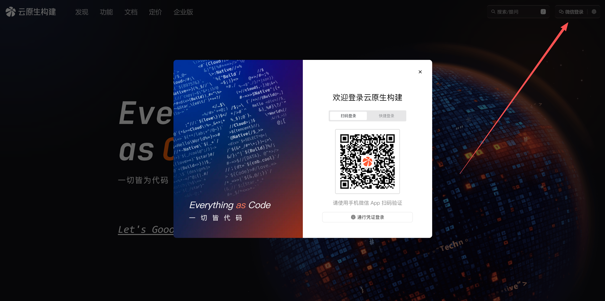

### 实名认证（必须）

注册后需要完成实名认证才能使用 CNB 服务。

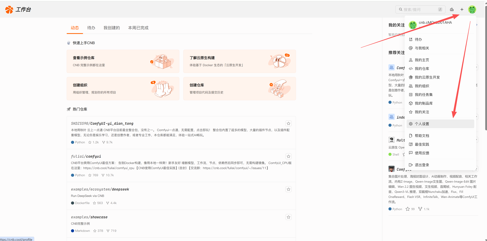

完成认证后进入 [认证页面](https://cnb.cool/profile/auth)：

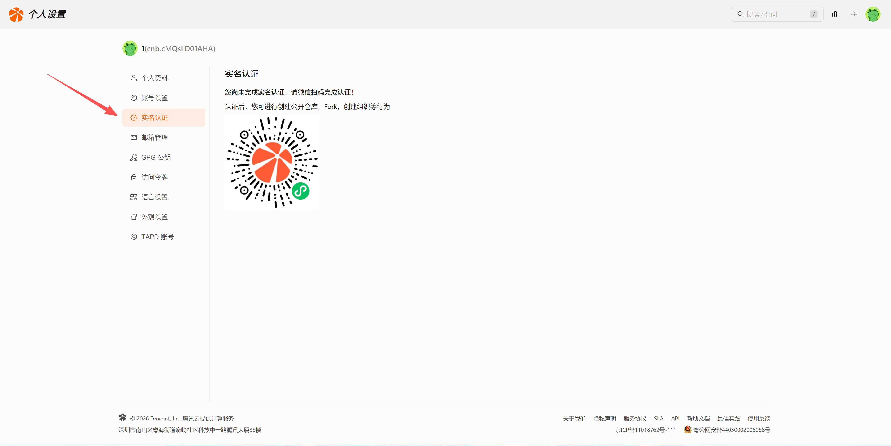

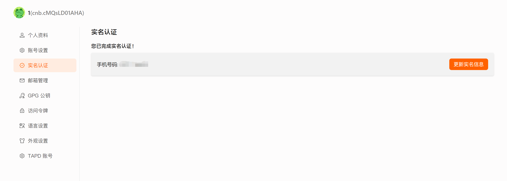

## 2. 创建组织

CNB 的仓库必须在组织下管理。点击右上角的 `＋`，选择`创建组织`，填写组织名称及相关描述后，单击`创建`即可完成组织创建。

- [创建组织页面](https://cnb.cool/new/groups)

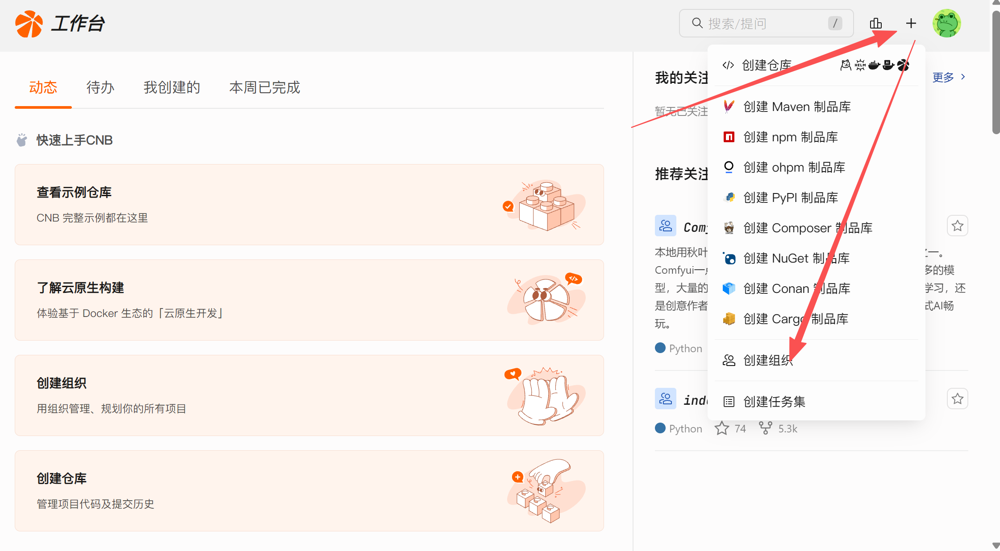

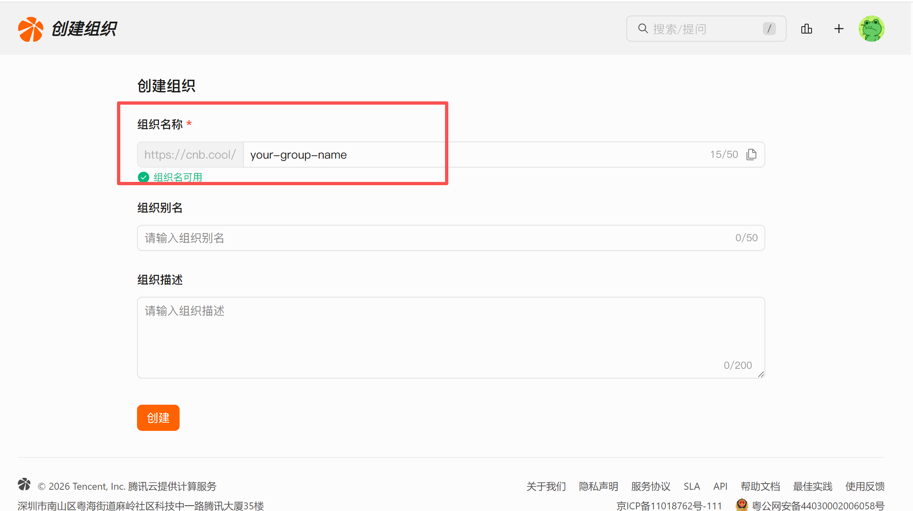

组织是团队管理成员和资源的命名空间。在创建仓库资源前，需创建组织以管理成员及仓库等资源。

## 3. 创建开发环境

### Fork 仓库

点击打开 [vibestudio-default-dev](https://cnb.cool/vibevibe/vibestudio-default-dev) 仓库，点击 Fork：

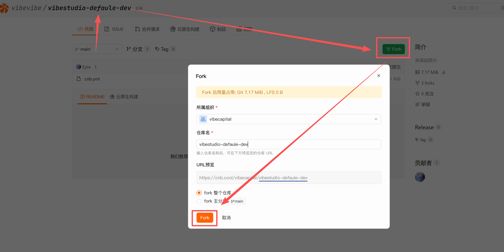

### 启动云原生开发

Fork 到自己的仓库之后，点击"云原生开发"按钮，稍等片刻，等待开发环境创建：

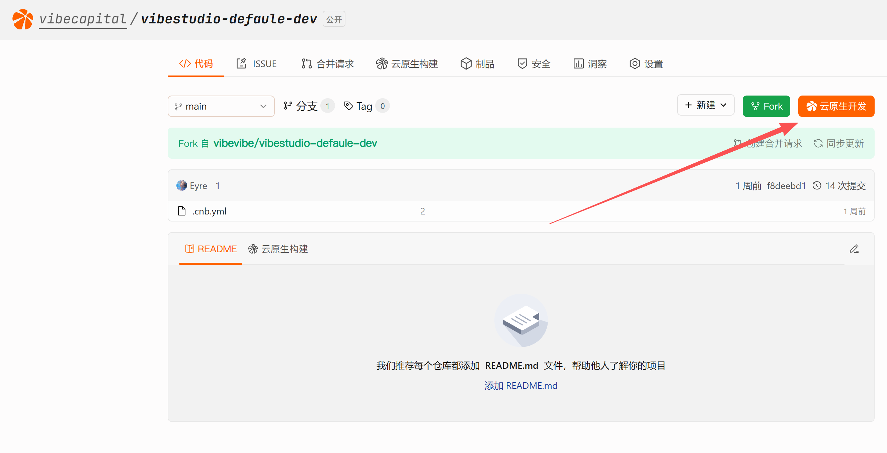

### 连接开发环境

工作空间创建成功后，可以：

- 直接打开 WebIDE 在线编辑
- 通过 SSH 登陆命令，使用安装了 Remote SSH 的 IDE 进行连接

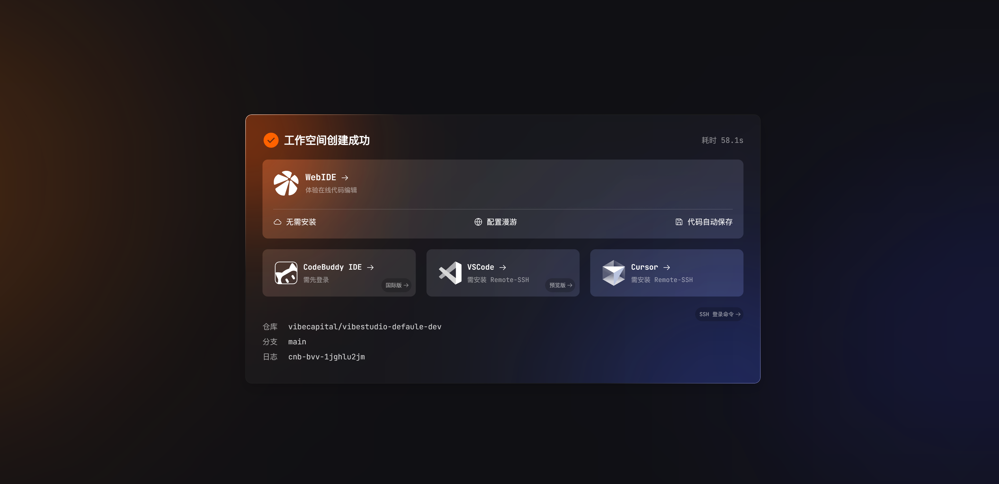

::: danger
**重要提醒：**

在云端 IDE 修改的代码**必须提交 Git 并推送！**

云原生开发环境会在闲置后自动回收，如果代码没有推送到远程仓库，环境回收后代码将会丢失。
:::

## 4. 配置 Claude Code

环境自动安装了开发必要的依赖，打开时会提示配置 GLM KEY 以使用 Claude Code。

| 配置密钥 | 剪贴板权限 |
|----------|-----------|
| 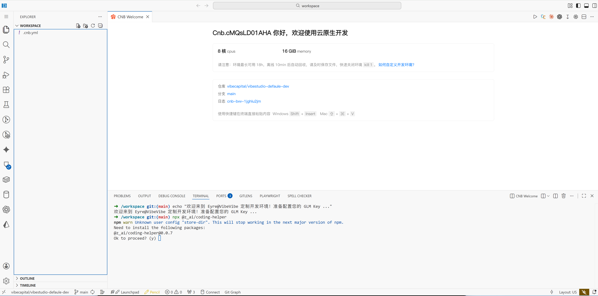 | 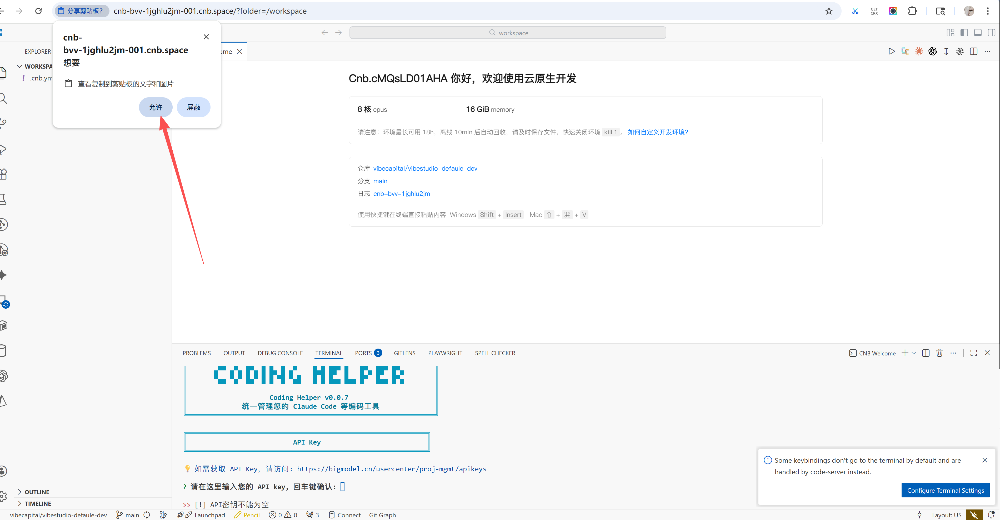 |

粘贴密钥时会提示调用电脑的剪贴板，同意即可。

一键配置 GLM 编码套餐专属 MCP：

| 配置 MCP | 配置完成 |
|----------|----------|
| 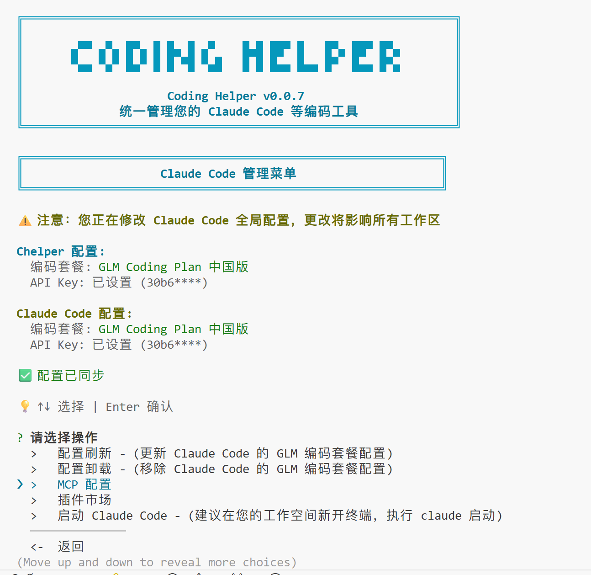 | 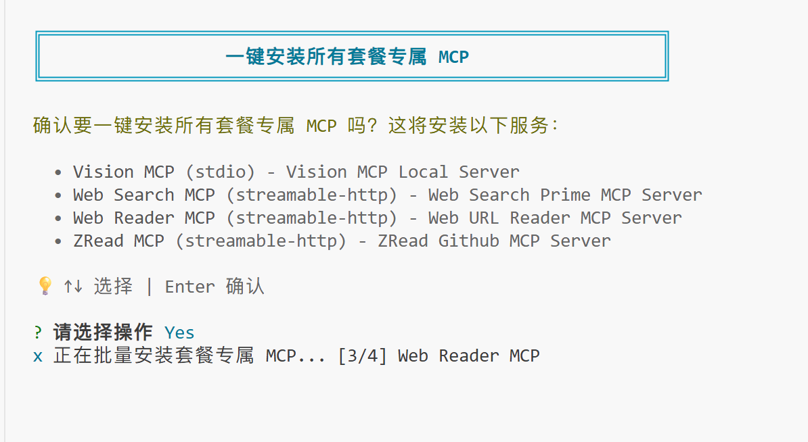 |

配置完成后输入 `claude` 即可开启编程之旅：

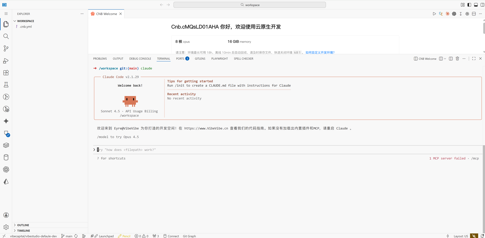

## 5. 本地连接 CNB 仓库

### 获取访问令牌

登录后进入 [访问令牌](https://cnb.cool/profile/token) 页面，创建令牌。

### Clone 仓库

```bash
git clone https://cnb.cool/你的组织名/仓库名.git
# 用户名: cnb
# 密码: 你创建的访问令牌
```

更多用法参考 [CNB 官方文档 - 访问令牌](https://docs.cnb.cool/zh/develops/token)。

## 附录

### 1. 设置中文界面

点击侧边栏插件按钮，安装中文插件：

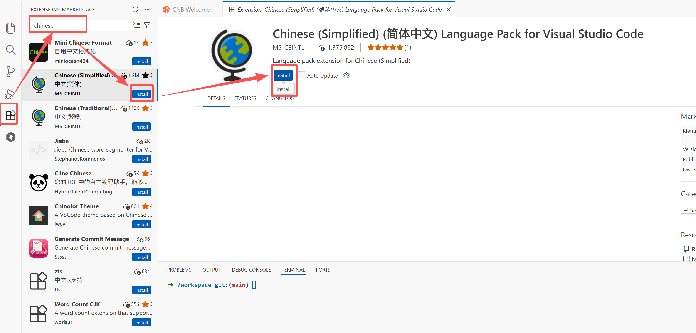

按下 `Ctrl+Shift+P` 组合键显示"命令面板"，然后键入 `display` 筛选并显示"Configure Display Language"命令，按 `Enter`：

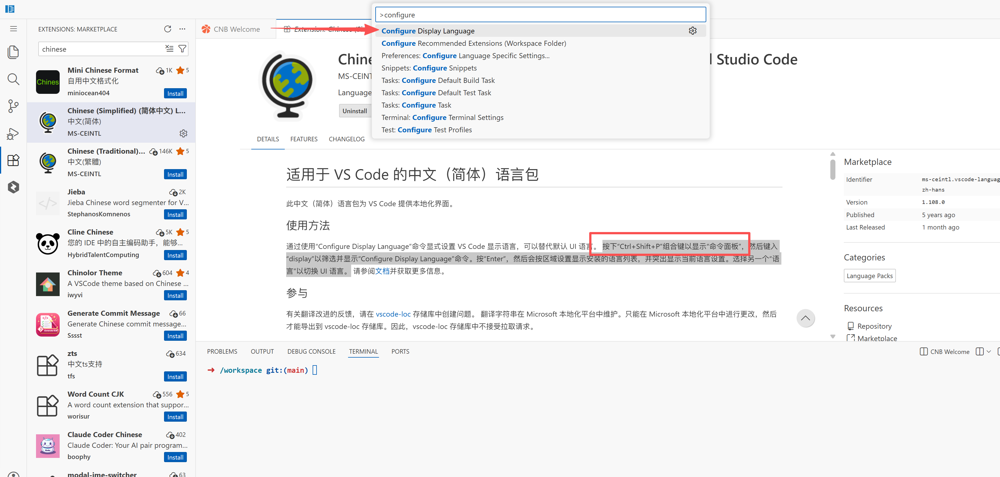

选择"语言"以切换 UI 语言：

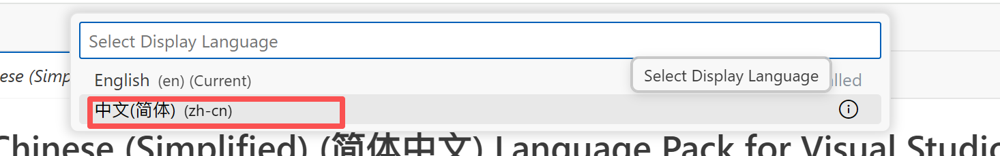

选择中文并确认，自动重启后界面变为中文：

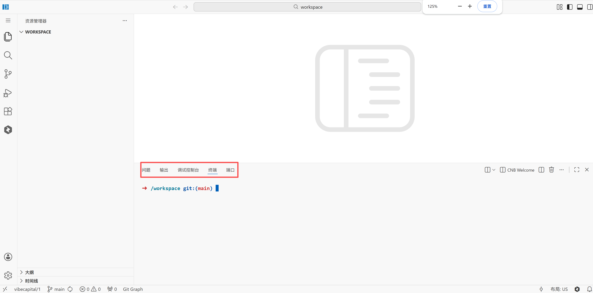

### 2. 迁移本地已有项目

如果你本地已有项目，可以一键迁移到 CNB：

```bash
cnb-init-from https://你的仓库地址.git
```

### 3. 访问令牌是什么？

访问令牌相当于你的"数字钥匙"，用于：

- 从远程仓库 Clone 代码
- Push 代码到仓库
- 访问制品库

获取方式：登录后进入 [访问令牌](https://cnb.cool/profile/token) 页面创建。

---

更多内容参考：[CNB 官方文档](https://docs.cnb.cool/zh/)
