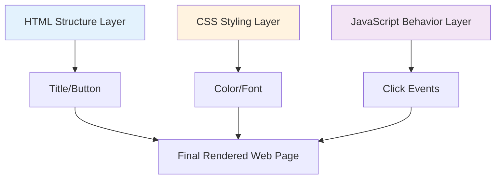
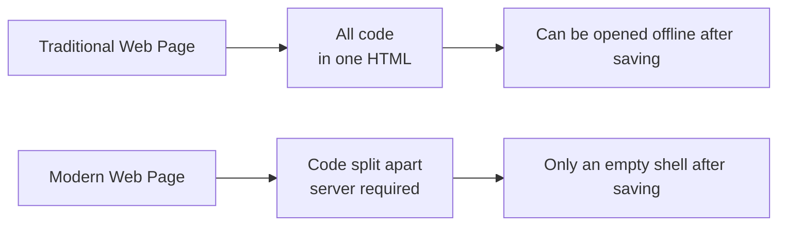
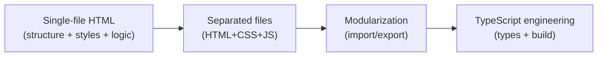

# 1.1 The Evolution of Code Formats

> **After reading this section, you will gain:**
>
> - An understanding of how HTML, CSS, and JavaScript work together to build web pages
> - A clear picture of how code formats evolved from single files to modularization and TypeScript
> - The ability to know when to use a simple format and when to use a more complex one
> - An understanding of why AI-generated code requires specific runtime environments

> As mentioned in the preface, AI sometimes gives you an `.html` file and sometimes a `.ts` file, because code formats evolve as project complexity increases.

## The Three Layers of a Web Page

A web page is like a sandwich, made up of three layers:



**A complete example**:

```html
<!DOCTYPE html>
<html>
<head>
  <style>
    /* CSS: 样式层 — 长什么样 */
    .box { background: #f0f0f0; padding: 20px; }
    .count { font-size: 24px; }
  </style>
</head>
<body>
  <!-- HTML: 结构层 — 有什么内容 -->
  <div class="box">
    <span class="count">0</span>
    <button>增加</button>
  </div>

  <script>
    /* JavaScript: 行为层 — 怎么交互 */
    let count = 0;
    document.querySelector('button').addEventListener('click', () => {
      count++;
      document.querySelector('.count').textContent = count;
    });
  </script>
</body>
</html>
```

Putting these three kinds of code into a single `.html` file is called the **single-file format**—you can run it just by double-clicking, with nothing to install.

## Why Do Some Saved Web Pages Stop Working?

You may have tried using `Ctrl + S` to save a web page you liked, only to get different results when opening it again:

| Behavior | Reason |
|------|------|
| **Works perfectly** | Single-file format, with all code inside one HTML file |
| **Styled but not clickable** | CSS is local, but JS is loaded from the server and fails offline |
| **No styling at all** | Both CSS and JS are loaded from the server; locally you only saved an empty shell |
| **Won't open at all** | A modern single-page app that requires a server to run |

Modern websites (such as Weibo and Bilibili) are built with frameworks like React and Next.js: the code is split across different files, and content is fetched dynamically through JS, so what gets saved is just an empty HTML shell.



## The Four Stages of Code Formats



::: details 🎮 Click to explore: The evolution of code formats
<CodeFormatEvolution />

> 💡 **Exercise**: Click different stages on the timeline and observe how code formats evolved from machine language to modern JavaScript.
>
> 🎯 **Core idea**: Code formats are getting closer to human language, but they also require more transformation steps before they can run.
:::

### Stage 1: Single-file HTML

All code lives in one `.html` file.

**Best for**: Simple demos, learning concepts, rapid prototyping

**Limitation**: Once the code goes beyond 200 lines, it becomes hard to maintain

### Stage 2: File Separation

Structure (HTML), styles (CSS), and logic (JS) are separated:

```
project/
├── index.html
├── style.css
└── script.js
```

**Best for**: Codebases over 200 lines, or multiple pages sharing styles

**Limitation**: File dependencies must be managed manually, and npm packages cannot be used

### Stage 3: Modularization

Use `import`/`export` to organize code:

```javascript
// utils.js
export function formatDate(date) {
  return date.toISOString();
}

// app.js
import { formatDate } from './utils.js';
```

**Best for**: Code with repeated logic, or team collaboration

**Limitation**: Browsers need build tool support

### Stage 4: TypeScript Engineering

Use TypeScript + build tools:

```typescript
// utils.ts
export function formatDate(date: Date): string {
  return date.toISOString();
}
```

**Best for**: Projects with complex logic, team collaboration, and long-term maintenance

**Why does AI like using TypeScript?**

- The type system reduces errors
- AI is better at generating type-safe code
- It's the standard setup for modern frontend development

::: danger TypeScript cannot run directly

TypeScript code **cannot run directly in the browser** and must be compiled first:

```
.ts/.tsx files → TypeScript compiler → .js files → executed by the browser
```

**During development**: `pnpm dev` compiles automatically
**For production**: `pnpm build` bundles and optimizes

:::

## How to Choose a Code Format

| Project complexity | Recommended format | How to run |
|------------|----------|----------|
| Simple demo, one-off script | Single-file HTML | Open directly |
| Small to medium-sized project | Modular JS | Requires build |
| Complex app, team collaboration | TypeScript + framework | Requires a dev server |

**Principle**: If a simple solution works, don't use a complex one—but don't force a simple solution onto a complex project.

Let AI know what you need, and it will choose the appropriate format:

```
"Generate a single-file HTML counter" → Single file, runnable by double-clicking
"Generate a task management app" → TypeScript project, requires pnpm dev
```

## FAQ

### Q1: What's the difference between TypeScript and JavaScript?

TypeScript is an upgraded version of JavaScript that adds type checking.

```typescript
// TypeScript 写代码时会指出错误
const count: number = "hello";  // ❌ 编辑器标红

// JavaScript 要运行后才报错
const count = "hello";
count.toFixed(2);  // 💥 运行时崩溃
```

You don't need to memorize the syntax. You just need to know:

- `.ts` or `.tsx` files need to be run with `pnpm dev`
- If you see type annotations like `: string`, just know that it's TypeScript

### Q2: Why not always use single-file HTML?

Single-file HTML becomes unmaintainable for complex projects. Imagine a 1000-line HTML file where changing a style means hunting down the matching `<style>` tag around line 500—that's a disaster. Modularization lets each file focus on one thing.

### Q3: What should I do if AI-generated code won't run?

First, identify the code type:

**Single-file HTML**:

```bash
# 直接双击，或
open index.html      # Mac
start index.html     # Windows
```

**TypeScript project**:

```bash
pnpm install   # 安装依赖
pnpm dev       # 启动开发服务器
```

If it still throws an error, send the error message to the AI and it will tell you the specific cause.

## Related Content

- See also: [1.2 Tech Stack Concepts](./02-tech-stack.md)
- See also: [1.3 Browser and Server Basics](./03-browser-server.md)
- Next up: [1.5 Package Management and Project Configuration](./05-package-manager-and-config.md)