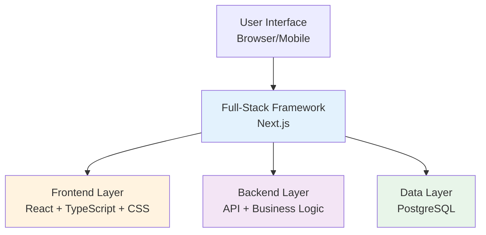

# 1.2 Tech Stack Concepts

> **After reading this section, you will gain:**
>
> - An understanding of the layered architecture of a tech stack (frontend, backend, database)
> - Familiarity with the tech stack used in this tutorial and why it was chosen
> - The ability to quickly identify a project's tech stack through package.json

> Terms mentioned in the introduction, such as TypeScript and Next.js, make up the tech stack of modern Web development.

## What Is a Tech Stack

A **tech stack** is the combination of technologies used to build a project.

Modern Web applications are divided into three layers:



- **Frontend**: The interface users see (HTML, CSS, JavaScript)
- **Backend**: Server-side logic that processes data (Node.js, Python)
- **Database**: Stores data (PostgreSQL, MongoDB)

This tutorial uses the **Next.js full-stack framework**—frontend and backend in the same project, all started with a single command.

::: details 🏗️ Click to explore: Tech stack layered architecture
<TechStackLayers />

> 💡 **Exercise**: Click each layer to view the details and understand the relationship between the frontend, backend, database, and infrastructure.
>
> 🎯 **Core concept**: Modern Web applications are divided into multiple layers, each responsible for different duties and communicating through APIs.
:::

## The Tech Stack Used in This Tutorial

| Layer | Technology Choice | Purpose |
|:-----|:---------|:----|
| **Framework** | Next.js | Unified frontend and backend |
| **Language** | TypeScript | Type safety |
| **Styling** | Tailwind CSS | Utility-first CSS |
| **Component Library** | shadcn/ui | Reusable UI components |
| **Authentication** | better-auth | Type-safe authentication |
| **Database ORM** | Drizzle ORM | Type-safe database operations |
| **Database** | PostgreSQL | Relational database |
| **AI Integration** | Vercel AI SDK | Streaming AI interactions |

::: tip Common "wheels" reference

There are millions of ready-made packages on npm. Here are some commonly used ones:

| Function | Recommended Package |
|------|--------|
| **Form validation** | `zod` |
| **Form management** | `react-hook-form` |
| **Data fetching** | `@tanstack/react-query` |
| **Date/time handling** | `date-fns` or `dayjs` |
| **HTTP client** | `axios` or `ofetch` |
| **Icons** | `lucide-react` |
| **Utility functions** | `lodash` |

AI will choose the right package based on your needs. You only need to understand the principle of "don't reinvent the wheel."

:::

## Why Choose This Tech Stack

This tech stack was chosen **for AI-native development**, with two core principles: make AI more efficient and keep your costs lower.

**1. Lower AI comprehension cost**

Next.js full-stack = frontend and backend in the same project. The traditional approach requires two projects, CORS configuration, and starting two services; with Next.js, you only need one `pnpm dev`. The more consistent the project structure, the less likely AI-generated code is to go wrong.

**2. Zero deployment cost**

| Option | Cost |
|------|------|
| Traditional: rent a server | ¥50-200/month |
| This tutorial: Vercel/EdgeOne | Free |

**3. npm ecosystem: don't reinvent the wheel**

npm is the world's largest open-source code repository, with more than 2 million packages.

```bash
# Need user authentication? Ready-made
pnpm add next-auth

# Need to handle dates? Ready-made
pnpm add dayjs

# Need data validation? Ready-made
pnpm add zod
```

AI does not write code from scratch; it assembles these ready-made "building blocks."

**4. PostgreSQL has free hosting**

| Database | Free Hosting Platforms |
|--------|-------------|
| PostgreSQL | Supabase、Neon、Railway |
| MySQL | Almost none |

**5. When do you need full-stack?**

If you're only building a purely static site (such as a company website), HTML + CSS is enough. When your project needs:

- A user system (login, registration, permissions)
- Data persistence (saving user data)
- Business logic (payments, notifications, email)

then it's time to consider a full-stack tech stack.

## Quickly Identifying a Project's Tech Stack

When taking over a new project, you can quickly understand its tech stack by checking `package.json`:

| Dependency Name | Technology Type |
|--------|----------|
| `next` | Next.js full-stack framework |
| `react` | React frontend library |
| `typescript` | TypeScript type system |
| `drizzle-orm` | Drizzle database ORM |
| `tailwindcss` | Tailwind CSS styling |
| `ai` | Vercel AI SDK |

Once you know the tech stack, you'll know:

- What type of project it is
- What environments are needed
- What keywords to search for when you run into problems

## Frequently Asked Questions

### Q1: Do I need to understand these technologies?

You only need to know what they are and what problems they solve—you don't need to know how to write them. AI will handle the coding. You just need to:

- Be able to understand the project's structure
- Be able to describe the features you want

### Q2: Why use TypeScript instead of JavaScript?

TypeScript can catch errors during development, and AI will use it to write code. You only need to know that when you see a `.ts` extension, it means TypeScript.

### Q3: How is this different from the Java/Python taught in college?

| Traditional teaching | AI-native path |
|---------|-------------|
| Job-oriented | Product-oriented |
| Study for 6-24 months | Learn by building projects |
| Become a programmer | Use tools to solve problems |

The fundamental difference: most tutorials teach you how to become a programmer, while this tutorial teaches you how to solve problems through products. In the AI era, you don't need to become a programmer—you need to understand the tools, describe the requirements, and have AI help you implement them.

## Related Content

- See also: [1.1 Code Format Evolution](./01-code-formats.md)
- See also: [1.3 Browser and Server Basics](./03-browser-server.md)
- Next up: [1.5 Package Management and Project Configuration](./05-package-manager-and-config.md)