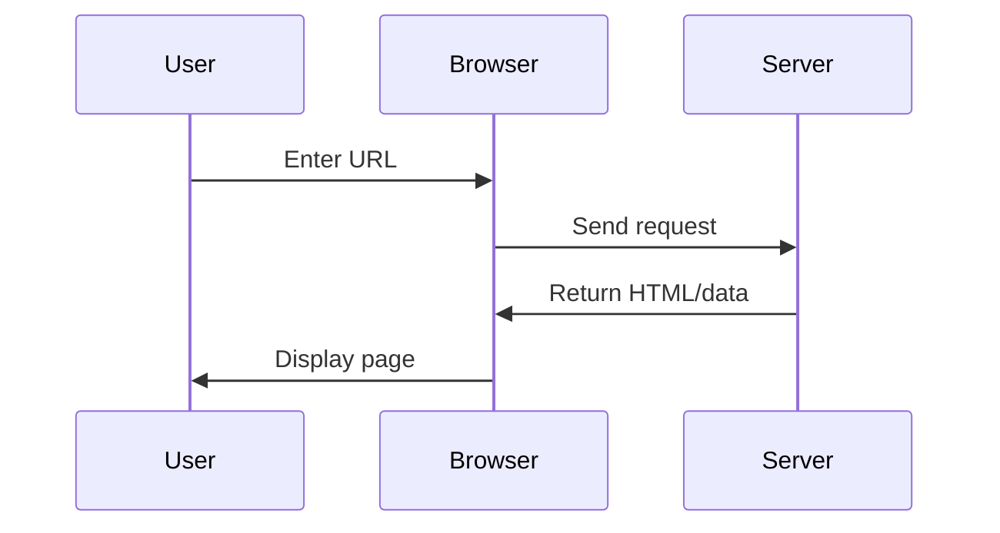
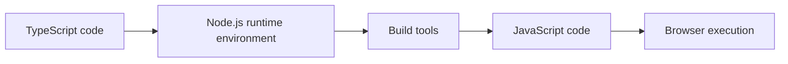

# 1.3 Browser and Server Basics

> **After reading this section, you will gain:**
>
> - An understanding of the basic responsibilities of browsers and servers, and how they work together
> - A grasp of the differences between development environments (localhost) and production environments
> - An understanding of why TypeScript needs to be compiled and the role of Node.js
> - The ability to distinguish where client-side code and server-side code run

> The introduction mentioned that "browsers can't understand TypeScript" because browsers and servers have different responsibilities.

## Basic Concepts

**Browsers** (Chrome, Firefox, Safari) run on users' computers and can only understand HTML, CSS, and JavaScript.

**Servers** are remote computers that run Web server software (such as Nginx and Apache), respond to browser requests, and return data.

**Client-side** = user devices (browsers, mobile apps), **server-side** = the service provider (servers, APIs).

## How a Web Application Works

::: details 🌐 Click to explore: Browser and server interaction
<BrowserServerFlow />

> 💡 **Exercise**: Click "Play Demo" to watch the complete request-response flow, then click the browser or server to see what each one can do.
>
> 🎯 **Core concept**: The browser sends a request, the server processes it and returns data, and then the browser renders it into a page.
:::

## Browser vs Server

| | Browser (Client-side) | Server (Server-side) |
|---|-----------------|-----------------|
| **Responsibilities** | Render pages, handle interactions, request data | Process business logic, query databases, return results |
| **Storage** | Cookie, LocalStorage | File system, database |
| **Can run** | HTML, CSS, JavaScript | Node.js, Python, Go |
| **Cannot run** | TypeScript, backend languages | Browser APIs |

## Why Node.js Is Needed

TypeScript code must be compiled before it can run in the browser, and this compilation process requires a runtime environment:

**What Node.js does**:

- Runs build tools on your computer
- Compiles TypeScript into JavaScript
- Bundles code
- Starts the development server

::: tip Modern frontend development requires Node.js

You must install it in the following cases:

- TypeScript projects (compilation required)
- Using npm packages (dependency management required)
- Running build tools (Vite, Webpack, Next.js)
- Local development (starting a development server)

:::

## Development Environment vs Production Environment

| | Development Environment (Localhost) | Production Environment (Public Internet) |
|---|---------------------|-----------------|
| **Location** | Your computer | Remote server |
| **Address** | `localhost:3000` | `https://example.com` |
| **Code** | Uncompressed, with debugging information | Compressed, obfuscated |
| **Errors** | Shows detailed stacks | Shows only necessary information |
| **Updates** | Hot reload (automatic refresh) | Requires redeployment |

## Runtime Environment Differences

**Servers can access**: file systems, databases, environment variables, all network requests

**Browsers can only access**: page content, user devices (with limited permissions), same-origin requests

::: tip Where does the code run?

When writing code, you should be clear about where it executes:

- **Frontend code**: runs in the browser and is visible to users
- **Backend code**: runs on the server and is not visible to users
- **API routes**: special in Next.js, they can both access server resources and respond to frontend requests

:::

## Related Content

- See: [1.1 The Evolution of Code Formats](./01-code-formats.md)
- See: [1.2 Technology Stack Concepts](./02-tech-stack.md)
- Up next: [1.5 Package Management and Project Configuration](./05-package-manager-and-config.md)
- See: [Chapter 10 Localhost and Public Internet Access](../10-localhost-public-access/)