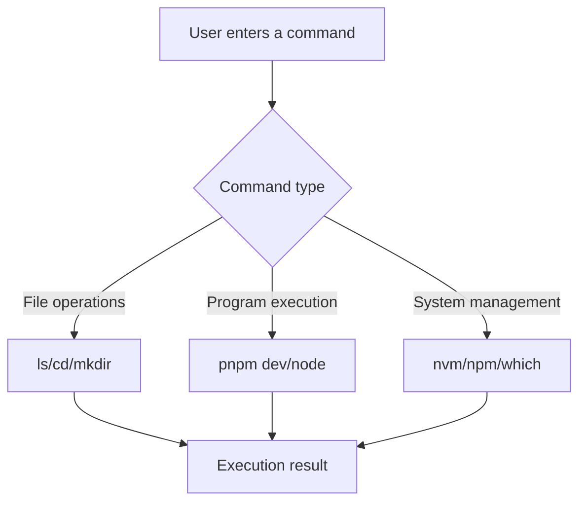
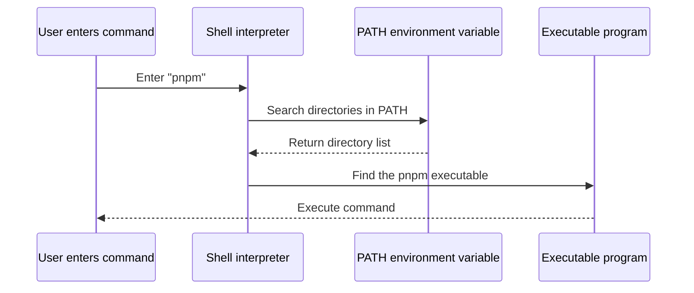

# 1.4 Terminal: Getting Started

> **After reading this section, you will gain:**
>
> - Master the basics of terminal usage (opening it, file navigation, running commands)
> - Understand the differences between a terminal, a Shell, and the command line
> - Learn terminal shortcuts and copy/paste operations
> - Understand the role of environment variables and PATH
> - Learn a systematic troubleshooting process for command errors

> The Terminal mentioned in the introduction is a way to communicate with the operating system through text commands.

## Prerequisites

::: tip The difference between a terminal, a Shell, and the command line

These three concepts are often confused, but they actually exist at different layers:

- **Terminal**: The **interface window** you see, used to enter commands. On Windows it's called PowerShell/CMD, and on Mac it's Terminal/iTerm2
- **Shell**: The **command interpreter** hidden behind the terminal, which reads your input and executes it. Common ones include bash, zsh (the default on Mac), and PowerShell (Windows)
- **Command line (CLI)**: The **way** of operating a computer through text commands, which is more efficient and precise than a graphical interface

:::

::: tip Why is PowerShell recommended on Windows?

Windows has two terminals: CMD (legacy) and PowerShell (modern).

PowerShell is more powerful, has more consistent commands (for example, `ls` also works in PowerShell), and is Microsoft's officially recommended modern terminal. **All Windows commands in this tutorial use PowerShell as the standard**.

:::

## Core Concepts

The terminal is the main workspace for developers. Understanding the basics of terminal usage:



## Hands-on Steps

### Open the Terminal

**Mac**：

- Press `Command + Space`, then type "Terminal"
- Or go to Finder → Applications → Utilities → Terminal

**Windows**：

- Press `Win + R`, then type `powershell` or `Windows Terminal`
- Or right-click a folder → "Open in Terminal"

**VS Code built-in terminal**：Click the menu: Terminal → New Terminal. It's recommended to open it directly in the project directory

### What is the prompt?

After opening the terminal, you'll see a line of text starting with symbols:

```bash
user@MacBook ~ $     # Mac/Linux prompt is $
PS C:\Users\user>    # Windows PowerShell prompt is >
```

This is called the **prompt**, and it is **not part of the command**. When entering commands, do not copy it as well.

`$` means you're using a bash/zsh Shell, and `>` means you're using PowerShell. The command examples below will omit these prompts.

### Copy and Paste

**Windows PowerShell**：

- **Paste**：Right-click the window (pastes directly; Ctrl+V may not work)
- **Copy**：Select the text, then right-click

**Mac Terminal**：

- **Copy**：`Command + C`
- **Paste**：`Command + V`
- **Paste from elsewhere**：`Command + Shift + V` (sometimes required)

### Basic File Operations

These commands are commonly used on Mac, Linux, and Windows PowerShell/CMD:

```bash
# Show current directory
pwd

# List files
ls          # Mac/Linux/PowerShell
dir         # Windows CMD

# Change directory
cd folder-name
cd ..         # Go back one level
cd ~          # Go to the user's home directory (Mac/Linux PowerShell)

# Create directory
mkdir folder-name
```

### Terminal Shortcuts

| Shortcut | Function |
|--------|------|
| `Ctrl + C` | Stop the currently running program |
| `Ctrl + L` | Clear the screen (equivalent to typing `clear`) |
| `↑ / ↓` | Browse command history |
| `Tab` | Auto-complete file names or commands |
| `Ctrl + A` | Move the cursor to the beginning of the line |
| `Ctrl + E` | Move the cursor to the end of the line |

::: tip The two uses of Ctrl + C

In the terminal, `Ctrl + C` has two uses:

1. **Stop a running program** (such as a development server)
2. **Cancel the current input** (if you're typing a command and want to abandon it and start over)

:::

### Environment Variables and PATH

::: tip What are environment variables

Environment variables are configuration data stored by the operating system that programs can use to access system settings. For example, `PATH` is an environment variable that tells the system which directories to search for executable programs.

:::

When you type a command like `node` or `pnpm`, how does the system find it?



**How PATH works**：

1. You type `pnpm`
2. The Shell searches each directory listed in PATH for a file named `pnpm`
3. Once found, it executes that file
4. If it can't be found in any directory, it shows `command not found`

::: tip What should I do if a command can't be found?

If entering a command shows `command not found`, it means the tool is either not installed or not included in PATH.

After completing the installation in the next section (1.5 Node.js Environment and Package Management), the command should work normally.

:::

### CLI Software and Command Arguments

**What is CLI software?**

CLI software (Command Line Interface) has no menus or buttons; everything is done by entering commands. You might wonder: **why do developer tools favor this seemingly primitive approach?**

The reason is simple: typing commands is much faster than clicking through menus, commands can take arguments for precise control, they can be written into scripts for automation, and they use less memory. Once you get comfortable with it, you'll find it far more efficient than a graphical interface.

**Getting started with command arguments**

Commands are often followed by arguments that modify their behavior. There are two formats for arguments:

- **Short arguments**：A single dash followed by a letter, such as `-v` (version) or `-h` (help)
- **Long arguments**：Two dashes followed by a word, such as `--version` or `--help`

```bash
# Check version (short argument)
node -v
pnpm -v

# View help (long argument)
git --help
npm --help
```

Short and long arguments do the same thing. Short arguments are faster to type, while long arguments are easier to read. Most commands support both forms.

## Common Questions

### Q1: How do I run multiple commands at the same time?

Use `&&` to connect commands. The next command runs only if the previous one succeeds:

```bash
# Clean up and reinstall
rm -rf node_modules && pnpm install
```

Use `;` (or a newline) to connect commands. The next command runs regardless of whether the previous one succeeds:

```bash
mkdir new-folder ; cd new-folder    # new-folder is an example folder name
```

### Q2: What should I do if Chinese text is garbled in the terminal?

Change the terminal encoding settings.

- **Mac**：Terminal → Preferences → Profiles → Advanced → Character Encoding → UTF-8
- **Windows**：PowerShell Properties → Font → Choose a font that supports Chinese

### Q3: How do I open a terminal for the current folder in VS Code?

Click the menu: Terminal → New Terminal

## Troubleshooting Command Errors

When you encounter `command not found` or other command errors, troubleshoot step by step in the following order:

::: details 🔧 Click to try: Command error troubleshooting flow
<TerminalTroubleshoot />

> 💡 **Practice**：Follow the steps and enter the correct commands to troubleshoot the issue. Start with spelling checks, then verify tool installation, directory location, and so on.
>
> 🎯 **Core idea**：When a command fails, troubleshoot in order: spelling → installation → directory → PATH → system differences.
:::

### Troubleshooting Checklist

**1. Check spelling**

```bash
# Common errors
pnpm instal  # Error: missing l
l s          # Error: contains a space

# Correct usage
pnpm install
ls
```

**2. Make sure the tool is installed**

```bash
# Check version (confirm executable works)
node -v
pnpm -v
```

If the command is reported as missing, install it first.

**3. Make sure you're in the correct directory**

```bash
# Show current directory
pwd

# Check whether package.json exists
ls package.json
```

**4. Reload the terminal**

After installing a tool or changing PATH, you need to restart the terminal:

```bash
# Mac: reload configuration
source ~/.zshrc

# Or just close and reopen the terminal
```

::: tip Not sure what the problem is?

Just send the error message directly to AI, and it will tell you the specific cause and how to fix it.

You don't need to memorize every error. You just need to know the troubleshooting order.

:::

## Related Content

- See also: [1.5 Package Management and Project Configuration](./05-package-manager-and-config.md)