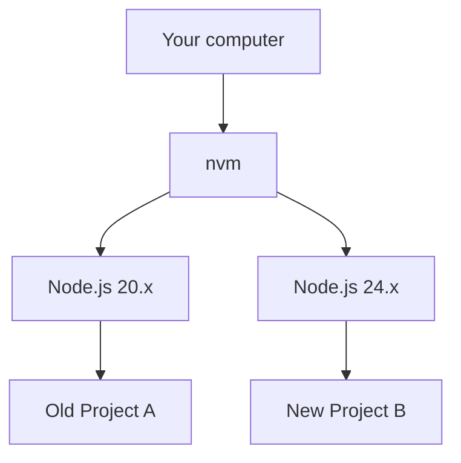

# 1.5 Package Management and Project Configuration

> **After reading this section, you will gain:**
>
> - An understanding of how nvm and pnpm work
> - Mastery of common pnpm commands (including global installation)
> - An understanding of the roles of core configuration files such as package.json and pnpm-lock.yaml

::: tip Haven't installed the environment yet?

If you haven't installed Node.js and pnpm yet, please refer to [1.0 Quick Start](./00-quick-start.md) to complete the installation.

:::

## Basic Concepts

**Node.js** is a JavaScript runtime environment that allows JS to run on the server side. Modern frontend build tools all depend on it.

**LTS** (Long Term Support) refers to a long-term support version. It is more stable than Current and is recommended for development.

**nvm** (Node Version Manager) lets you install and switch between multiple Node.js versions on the same computer.

**pnpm** is a package manager used to install project dependencies. Compared with npm, it is faster and uses less disk space.

## Why Choose pnpm?

| Feature | npm | pnpm |
|------|-----|------|
| Speed | Baseline | **2-3x faster** |
| Disk space (10 projects) | ~5GB | **~1.5GB** |

pnpm uses **hard links** so all projects can share the same dependency files, instead of copying a separate copy for each project.

::: details 🎮 Click to try it: npm vs pnpm installation comparison
<PackageManagerCompare />

> 💡 **Exercise**: Click "Project A/B/C" in order and observe how disk usage changes for npm and pnpm
>
> 🎯 **Core concept**: pnpm saves a large amount of disk space in multi-project scenarios by sharing dependencies through hard links
:::

## Common pnpm Commands

### Project Dependency Commands

| Command | Purpose |
|------|------|
| `pnpm init` | Initialize a project |
| `pnpm install` | Install all dependencies |
| `pnpm add xxx` | Install a production dependency (`xxx` should be replaced with a package name, such as React) |
| `pnpm add -D xxx` | Install a development dependency (`xxx` should be replaced with a package name, such as TypeScript) |
| `pnpm remove xxx` | Uninstall a package |
| `pnpm dev` | Run a script (equivalent to pnpm run dev) |

::: tip What's the difference between add and add -D?

- **add xxx**: Production dependency, needed when the project runs
- **add -D xxx**: Development dependency, only needed during development

If you're not sure, let AI decide which one to use.

:::

### Global Installation Commands

In addition to project dependencies, you can also use npm to install **global tools**—these tools can be used from anywhere on your computer:

```bash
# 安装全局 CLI 工具
npm install -g @anthropic-ai/claude-code
```

**Global installation vs project installation**:

| | Global installation | Project installation |
|---|---------|---------|
| **Command** | `npm install -g xxx` | `pnpm add xxx` |
| **Location** | System directory, available to all projects | The current project's node_modules |
| **Purpose** | CLI tools (such as Claude Code) | Project dependencies (such as React) |
| **Examples** | claude、http-server | react、lodash |

::: tip When should you install globally?

- **CLI tools**: such as Claude Code, http-server, create-react-app
- **System-level tools**: such as nrm (registry source management), vercel (deployment tool)

Regular project dependencies (such as React and Vue) should be installed within the project, not globally.

:::

## Core Configuration Files

**What are configuration files?** Configuration files are plain text files that record project metadata. They tell the package manager what dependencies the project needs and how to run it. They are placed in the project's **root directory** (the outermost folder).

**Why does every project have them?** Because each project depends on different third-party libraries—some use React, some use Vue; some require specific versions, while others need the latest version. Configuration files record these differences to ensure that anyone who gets the code can reproduce the same development environment.

**Why are they needed?** Imagine downloading an open-source project without configuration files: you wouldn't know what dependencies it needs or how to start it. Configuration files solve this problem—`pnpm install` automatically downloads all dependencies based on the configuration, and `pnpm dev` knows how to start the project.

### package.json

The project description file, which records dependencies and scripts:

```json
{
  "dependencies": {
    "react": "^18.0.0"
  },
  "devDependencies": {
    "typescript": "^5.0.0"
  }
}
```

::: details 🎮 Click to try it: package.json interactive viewer
<PackageJsonExplorer />

> 💡 **Exercise**: Click any field in the JSON on the left to see what it does and the related commands
>
> 🎯 **Core concept**: package.json is the project's "ID card," recording dependencies, scripts, and metadata
:::

### pnpm-lock.yaml

An automatically generated lock file that records the exact version of each dependency. It ensures that everyone installs **the exact same versions**, avoiding the "it works on my machine" problem.

**Notes**:

- Automatically generated, **do not modify it manually**
- It must be committed to Git

### .nvmrc（Optional）

Specifies the recommended Node.js version for the project:

```bash
# .nvmrc 文件内容
24
```

Most projects don't have this file; using the latest LTS is enough. If this file exists, running `nvm use` will switch automatically.

## Extended: When Do You Need nvm?

::: tip Already installed?

If you completed the installation by following [1.0 Quick Start](./00-quick-start.md), then nvm is already installed (automatically installed via script on Mac/Linux; Windows users can choose to install it).

:::

Different projects may require different versions of Node.js:



**When you need to switch versions**: maintaining old projects, compatibility testing. Most new projects can just use the latest LTS.

## Common Questions

### Q: The nvm command says `command not found`

You need to reload the configuration or restart the terminal:

```bash
source ~/.zshrc   # 如果使用 zsh
source ~/.bashrc  # 如果使用 bash
```

### Q: How can I check which Node.js version a project needs?

Check the `engines` field in `package.json`, or the `.nvmrc` file in the project root directory.

### Q: Can an npm project be migrated to pnpm?

Yes, it is fully compatible:

```bash
rm -rf node_modules package-lock.json
pnpm install
```

> **What this command does**: It deletes npm's dependency folder and lock file, then reinstalls everything using pnpm.

## Core Philosophy

**nvm solves version conflicts, and pnpm improves installation efficiency**.

- ✅ Different projects can use different Node.js versions
- ✅ pnpm reuses dependencies, making installation fast and space-efficient
- ✅ pnpm strict mode helps avoid "phantom dependencies"

## Related Content

- See also: [1.4 Terminal Basics](./04-terminal-basics.md)
- See also: [nvm Chinese Official Website](https://nvm.uihtm.com/)
- Prerequisite: [1.0 Quick Start](./00-quick-start.md)
- Prerequisite: [1.2 Tech Stack Concepts](./02-tech-stack.md)