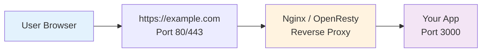

# 1.8 Localhost and Ports

> **After reading this section, you will gain:**
>
> - An understanding of what localhost does and the basics of IP addresses
> - A solid grasp of what ports are and the most common ones
> - The ability to start/stop a development server and handle port conflicts

After creating your project, the next step is to start the development server and view your app in the browser.

## Basic Concepts

### Localhost

**localhost** is your computer's "internal address," used for local development and testing.

| Address | Purpose |
|------|------|
| `localhost` | Local hostname, automatically resolves to 127.0.0.1 |
| `127.0.0.1` | Local loopback IP address |
| `http://localhost:3000` | A service running locally on port 3000 |

The two are equivalent:

```bash
ping localhost      # Same effect as below
ping 127.0.0.1
```

::: tip localhost vs Public Address

| Development Environment | Production Environment |
|----------|----------|
| `localhost:3000` | `https://example.com` |
| Only you can access it | Everyone can access it |
| Used for development and debugging | Used for live operation |

:::

### Port

A **port** is like a door in a house. One IP address can have 65535 ports, and each port can run a different service.

If you think of an IP address as a **building address**, then a port is the **room number**:

| Port | Service | App |
|------|------|------|
| 3000 | Next.js development server | `http://localhost:3000` |
| 5173 | Vite development server | `http://localhost:5173` |
| 8000 | Python HTTP server | `http://localhost:8000` |

**Common development ports**:

| Port | Purpose |
|------|------|
| 3000 | Next.js, Express |
| 5173 | Vite |
| 8000/8080 | General fallback ports |
| 80 | HTTP (production, can be omitted) |
| 443 | HTTPS (production, can be omitted) |

**Port number ranges**:

- **0-1023**: System ports, require administrator privileges
- **1024-49151**: Registered ports, used by common services
- **49152-65535**: Dynamic ports, used temporarily

::: details 🎮 Click to try it: Visualizing Localhost Ports
<LocalhostVisualizer />

> 💡 **Exercise**: Click an available room to start a service, click an occupied room to trigger an EADDRINUSE error, and switch between development/production modes to see the architectural differences
>
> 🎯 **Core concept**: A port is a "room number," and only one service can run on a port at a time
:::

## Starting the Development Server

```bash
# Enter the project directory (replace my-app with your project name)
cd my-app

# Install dependencies (first run only)
pnpm install

# Start the development server
pnpm dev
```

::: tip Why install dependencies first?

`pnpm install` downloads all the code packages (dependencies) the project needs. Without this step, the project cannot run. It's like assembling furniture—you first need to make sure all the parts are there.

:::

After starting, you'll see output similar to this:

```
▲ Next.js 16.1.4
- Local:        http://localhost:3000
- Network:      http://192.168.1.100:3000

✓ Ready in 1.2s
```

Open your browser and visit `http://localhost:3000`.

::: tip When do you need to run pnpm dev?

You need to run it **every time you start working**:

- The first time you open the project
- When you want to see the result after changing code (the server auto-refreshes, so no restart is needed)
- When you want to continue working after stopping the server

Once started, the server can stay running until you're done.

:::

::: tip What is the Network address for?

The Local address can only be accessed by you. The Network address lets other devices on the same local network (such as your phone) access it, which is useful for testing on mobile devices.

:::

## Stopping the Development Server

Press `Ctrl + C` in the terminal to stop it.

| System | Action |
|------|------|
| Windows / Mac / Linux | Press `Ctrl + C` |

::: warning The page stops working after the server is closed

When you close the terminal or press `Ctrl+C` to stop the server, the page at `localhost:3000` will no longer be accessible.

**This is normal**: the development server only serves content while it is running. Next time you work, just run `pnpm dev` again.

:::

## Handling Port Conflicts

If you see a message saying the port is already in use when starting:

```
Error: listen EADDRINUSE: address already in use :::3000
```

**The easiest fix is to ask AI for help**: send the error message to AI, and it can help you resolve it.

You can also manually switch to a different port:

```bash
# Next.js: start on a specified port
pnpm dev -- -p 3001
```

::: tip Automatic handling of port conflicts

Modern development tools (such as Next.js 14+) automatically detect port conflicts. If 3000 is occupied, they will automatically try 3001, 3002, and so on.

**But if you see an EADDRINUSE error**, that means auto-detection failed, and you can just ask AI to help.

:::

::: tip Commands AI might use

If you're curious what commands AI would use to solve this, see below:

**Mac / Linux**:

```bash
lsof -ti:3000 | xargs kill -9
```

One command does it all: find the process using port 3000 and terminate it directly.

**Windows**:

```powershell
netstat -ano | findstr :3000
```

First, check the PID of the process occupying the port, then:

```powershell
taskkill /PID 12345 /F
```

Replace `12345` with the actual PID.

:::

## Common Questions

### Q: Why does the browser automatically open localhost after starting the server?

It's a convenience feature in development tools. Tools like Vercel and Vite can detect when the server starts and automatically open the browser.

### Q: Why doesn't the page change after I modify the code?

The development server supports **hot reload**, so it refreshes automatically after you save the file. If it doesn't:

- Check whether the server is running normally
- Try manually refreshing the browser (F5)

### Q: Can localhost be accessed over the local network?

No. `localhost` can only be accessed on the local machine. For LAN access, you need to use your machine's local network IP:

```bash
# View your local IP
ipconfig        # Windows
ifconfig        # Mac/Linux

# LAN access
http://192.168.1.100:3000
```

### Q: Is port 3000 also used in production?

It can be, but users usually are not given direct access to port 3000.

**Typical production architecture**:



When users visit `https://example.com`, the request first goes to Nginx (listening on ports 80/443), and then Nginx forwards it to your app (port 3000).

**Of course, you can also let users access IP + port directly**:

```
http://你的服务器IP:3000
```

But that's not very user-friendly, and it exposes the port number. It's recommended to use Nginx as a reverse proxy so users only need to remember the domain name.

## Core Idea

**Localhost is the foundation of local development**.

- ✅ localhost = 127.0.0.1, both point to the local computer
- ✅ Ports distinguish services, so multiple services can run on the same computer
- ✅ Use localhost for development, and a domain name for production
- ✅ Only one process can use a port at a time
- ✅ `Ctrl + C` stops the server

## Related Content

- See: [1.4 Getting Started with the Terminal](./04-terminal-basics.md)
- See: [1.7 Creating a Project](./07-creating-project.md)
- Prerequisite: [1.3 Browser and Server Basics](./03-browser-server.md)