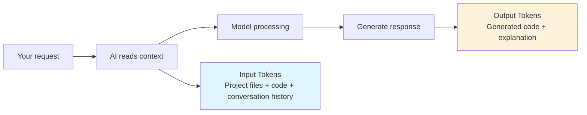

# 2.1 The Economics of AI Programming 🔴

> **After reading this section, you will gain:**
>
> - Understand that Tokens are the billing unit for AI models, and learn how input/output Token billing works
> - Build cost awareness and learn how to optimize costs by using precise prompts to control the AI's context scope
> - Master the core principles of prompt optimization: specify paths, define scope clearly, remove polite filler
> - Understand the relationship between context size and cost, and learn how to avoid unnecessary Token usage

> As mentioned in the introduction, "the model determines the speed and upper limit of coding capability," as well as the importance of cost awareness in AI development. **Tokens are money**—every model call consumes real cost.

> For tool installation and configuration, see: [1.6 Models and Tools](../01-environment-setup/06-models-and-tools.md)

## Prerequisites

::: tip What is an LLM

LLM (Large Language Model) is an AI model trained on massive amounts of text that can understand and generate human language, code, and more.

:::

::: tip What is a Token

A Token is the billing unit for AI models and also the basic unit the model uses to process text.

**Conversion reference**:

- 1 Chinese character ≈ 1 Token
- 1 English word ≈ 0.75 Token
- 1 line of code ≈ 5-15 Token

Models charge based on the number of input (Prompt) and output (Completion) Tokens.

:::

**Try the Token calculator to get an intuitive feel for the relationship between text and Tokens:**

<TokenCalculator />

::: tip What are Input/Output Tokens

**Input Tokens**: The content you send to the model (prompts, code, context)

**Output Tokens**: The content generated by the model (code, explanations, answers)

**How cost is calculated**: Both input and output Token counts are billed, and output is usually a bit more expensive than input.

As a user, though, you don’t need to memorize exact pricing—the tool will show the cost of each call, and you can just top up when needed. What matters is understanding this: **the larger the context, the higher the cost**.

:::

::: tip What is a Context Window

A Context Window is the maximum context length a model can process, measured in Tokens. GLM supports a 200K context window, which is enough to handle complete large files and long conversations.

**If it exceeds the limit, it will be compressed automatically**: When the context approaches or exceeds the limit, the model will automatically compress earlier conversation content and keep the newest and most relevant information. This may cause some historical details to be simplified or omitted.

:::

## Core Concepts

### Where the cost comes from



**Core understanding**:

- A single call is cheap, but it still adds up over time
- **The larger the context = the higher the cost**: reading the whole project vs. reading just one file is an order-of-magnitude difference
- Be careful when debugging frequently: iterative changes continuously accumulate Tokens

::: tip How to control costs

Most AI coding tools will:

- Show the Token count and cost for each call
- Provide plans or usage quotas
- Remind you to top up when your quota runs out

**You don’t need to memorize exact pricing**, but you do need to build good habits (see the next section) to reduce unnecessary usage.

:::

## Cost and Quality Optimization Strategies

**Key insight**: The prompt itself is usually short. **What really consumes Tokens is the context the AI reads**—that is, the project files, code, conversation history, and other material that must be loaded so the AI can understand your request.

So prompt optimization is not about "polishing your wording." It is about **reducing the scope of context the AI needs to read**, while also **controlling output length**.

**Context scope affects both cost and quality**: precise context helps the AI focus on the problem and produce more accurate output; irrelevant context distracts it and increases the chance of mistakes.

### Optimization principles

| Principle | Explanation |
|-----|------|
| **Specify paths** | Specify file/folder paths to narrow the AI's search scope |
| **Define scope clearly** | "There’s an issue with the login feature" is more focused than "There’s an issue with the project" |
| **Remove polite filler** | No need for "please," "thanks," or "if possible" |
| **Get to the point** | Describe the task directly, without politeness or buildup |

### Example comparison

```
❌ Vague prompt (AI reads more context):
"Help me check whether there are any issues in the project and fix them"
→ AI isn't sure where to start and may read a large number of unrelated files

✅ Precise prompt (AI focuses on the relevant area):
"Help me check what's wrong with the login feature and fix it"
→ AI identifies login-related files on its own and reads only the necessary context
→ Or even more directly: "Fix the type error on line 42 of src/auth/login.ts: user may be null"
```

## Practical Advice

### Pay attention to usage

AI coding tools usually show the Token count and cost for each call. You can also check detailed usage on the corresponding model provider's platform.

**If your quota runs out, just top up**—like mobile data usage, there’s no need to stress too much, but you should consciously avoid waste.

### Cost-awareness checklist

- Specify file/folder paths
- Define the feature scope
- Remove polite filler
- Regularly clear conversation history

## Frequently Asked Questions

### Q1: What if I exceed the Token limit?

Usually you won’t hit the limit — AI will automatically split up large files when reading them. But if you do encounter a limit error, it means the project has reached a scale where engineering structure is needed:

- Consider splitting the project (monorepo or microservices)
- Clear conversation history and start a new session
- Use `.gitignore` to exclude files the AI doesn't need to read

### Q2: Why does the model sometimes make things up?

This is the "hallucination" problem, and all models have it. The solution: provide clear context, and have the AI explicitly say when it’s uncertain and wait for your confirmation instead of making things up.

### Q3: Is GLM capable enough?

Yes.

## Core Philosophy

**Context determines both cost and quality, and being direct matters more than being polite.**

Specify a path or feature scope so the AI reads only the necessary context. Precise context saves money and also makes the output more accurate.

## Related Content

- Prerequisite: [1.6 Models and Tools](../01-environment-setup/06-models-and-tools.md)
- See also: [2.2 VibeCoding Workflow](./02-vibecoding-workflow.md)