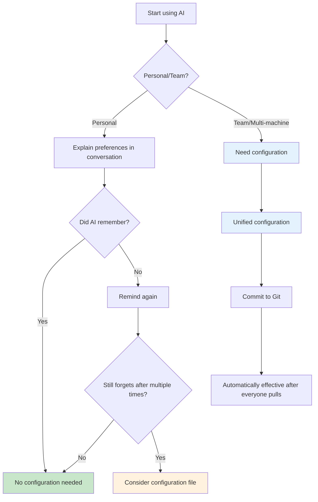
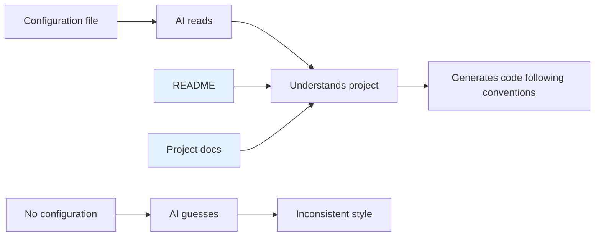
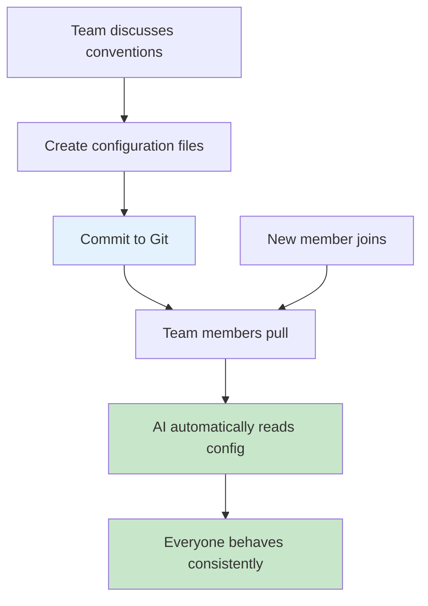
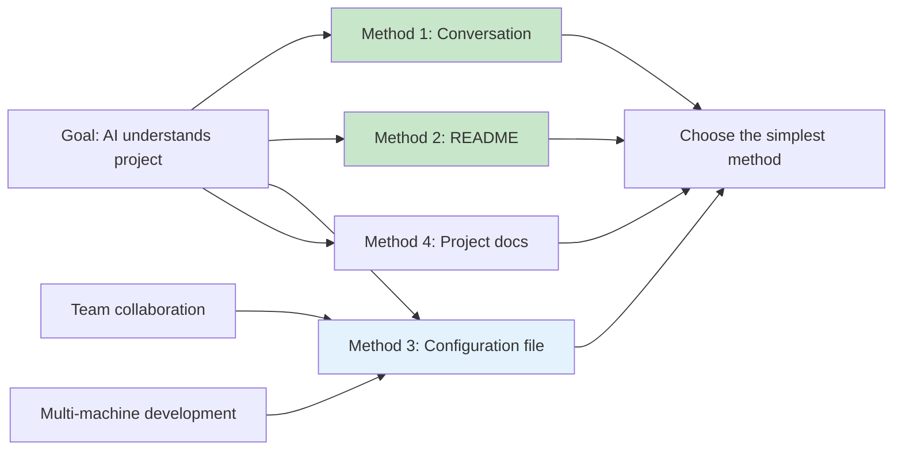

# 2.4 Project Rules Configuration 🟡

> **After reading this section, you will:**
>
> - Understand the purpose and use cases of project configuration files
> - Master the configuration methods for CLAUDE.md and settings.json
> - Learn configuration sharing solutions for team collaboration/multi-machine development
> - Understand how to handle sensitive information in configurations

> **This section can usually be skipped**. For personal development, AI can understand projects from conversations and documentation without additional configuration.
>
> **Team collaboration/multi-machine development**: This section is very useful when you need to unify environments, conventions, MCP, plugins, and other configurations.

::: warning Personal development usually doesn't require configuration

Before diving into configuration files, please understand:

1. **AI has memory**: Preferences you tell AI during conversations will be remembered
2. **Project documentation is sufficient**: README + Chapter 3 project documentation usually helps AI understand the project
3. **Configuration is supplementary**: Only consider writing to configuration files when AI repeatedly forgets certain rules

:::

## When Configuration Is Needed

**Scenario: AI forgot again**

For the 5th time, you remind AI: "Don't use npm, use pnpm." It still uses npm.

You realize: verbal reminders aren't reliable, you need **written rules**.

**Decision flow**:



**Quick assessment**:

| Your situation | Need configuration? | Why |
|---------------|---------------------|-----|
| Personal project, AI remembers | ❌ No | Conversation is easiest |
| Personal project, AI always forgets | ✅ Recommended | Write to CLAUDE.md, done once |
| Multiple computers development | ✅ Needed | Configuration sync, no repeat setup |
| Team collaboration | ✅ **Required** | Unified conventions, avoid "why does your AI behave differently" |

**Focus of this section**: For team collaboration/multi-machine development, configuration files ensure everyone uses the same rules.

:::

## Simpler Method: Let AI Write It

**Scenario: Need to write configuration file, but don't know the format**

You open the documentation, see a bunch of configuration items. Overwhelming.

**Just let AI generate it**:

```
Please create configuration files for my team project according to Section 2.4 of the "AI Tuning Guide".

Project info:
- Next.js 16 + TypeScript
- Using shadcn/ui component library
- Using pnpm package manager
- 5-person team, need unified conventions

Please generate:
1. CLAUDE.md project description
2. .claude/settings.json permission configuration
```

**30 seconds later**, AI gives you complete configuration files, just copy and paste.

**Why faster than writing yourself**:

| You write | AI generates |
|-----------|--------------|
| Check docs → understand format → handwrite → verify | Describe needs → copy result |
| 15 minutes | 30 seconds |

**Prerequisite**: Give AI enough project information (tech stack, team size, special requirements).

AI knows how to write configuration files, you just need to provide project information.

:::

## The Nature of Configuration Files



**Core principle**: Configuration files, README, project documentation—all are essentially **ways to help AI understand the project**.

| Method | File | Purpose | Necessity |
|--------|------|---------|-----------|
| **Project docs** | README, Chapter 3 docs | Complete project description | ✅ Recommended |
| **Configuration** | CLAUDE.md, .cursorrules | Concise convention description | ⚠️ Optional for personal, needed for teams |
| **Conversation** | Tell AI directly | Quick preference expression | ✅ Simplest |

::: tip Key insight

**Project configuration files** (whatever they're called) are essentially the same:

- All are project manuals written for AI to read
- Core content: Tech stack + coding conventions + prohibited behaviors
- Just different tools use different filenames

| Tool | Filename |
|------|----------|
| Claude Code | `CLAUDE.md` |
| Cursor | `.cursorrules` |
| Qoder/Trae | `.iderules` |

:::

## CLAUDE.md Template

If you do need a configuration file, keep it concise:

```markdown
# Project: [Project Name]

## Tech Stack
Next.js 16 + TypeScript + Tailwind + shadcn/ui

## Conventions
- No any, strict mode
- PascalCase for components
- Use pnpm

## Prohibited
- No new dependencies
- Don't modify .env
```

**Creation methods**:

- Claude Code: Create `CLAUDE.md` in project root
- Cursor/Qoder/Trae: Configure rules file in IDE settings

::: details Complete template

```markdown
# Project Description

## Project Overview
[One sentence describing what the project does]

## Tech Stack
- **Framework**: Next.js 16 (App Router)
- **Language**: TypeScript (strict mode)
- **Database**: Drizzle ORM + PostgreSQL
- **Styling**: Tailwind CSS
- **Components**: shadcn/ui

## Coding Conventions
- No `any` type
- PascalCase for components, camelCase for functions
- Use pnpm (don't use npm/yarn)

## Prohibited Behaviors
- ❌ Don't install new dependencies unless explicitly requested
- ❌ Don't modify .env files
- ❌ Don't delete test files

## Directory Structure
app/         # Pages and API
components/  # Components
lib/         # Utility functions
```

:::

### CLAUDE.md Advanced Usage ⭐

::: tip Focus of this section

Master advanced features of CLAUDE.md for more modular and maintainable project configuration.

:::

#### Memory Commands: Let AI Auto-Update Configuration

Use `#` prefix in conversation, Claude Code will automatically write content to CLAUDE.md:

```bash
# Enter in conversation:
"# This project uses pnpm as package manager, don't use npm"
"# Database uses PostgreSQL + Drizzle ORM"
"# Component library uses shadcn/ui, don't install other UI libraries"

# Claude Code will automatically append to CLAUDE.md, no manual editing needed
```

::: warning Note
Content written via memory commands is appended to the end of CLAUDE.md. If it accumulates too much, consider reorganizing and categorizing periodically.
:::

#### Modular Rules: `.claude/rules/` Directory

When CLAUDE.md gets too long, split it into `.claude/rules/` directory:

```
.claude/
├── CLAUDE.md              # Project overview and core rules
└── rules/
    ├── coding-style.md    # Code style conventions
    ├── git-workflow.md    # Git workflow
    ├── testing.md         # Testing requirements
    └── security.md        # Security rules
```

Claude Code automatically loads all `.md` files in `rules/` directory, merging with CLAUDE.md.

**When to use `rules/` directory vs single CLAUDE.md**:

| Scenario | Recommended | Reason |
|----------|-------------|--------|
| Small project, rules under 50 lines | Single CLAUDE.md | Simple and direct |
| Team project, multi-person collaboration | `rules/` directory | Different people maintain different rule files, reduce conflicts |
| Rules exceed 100 lines | `rules/` directory | Split by topic, easy to find and maintain |
| Need conditional rule enabling | `rules/` directory | Can control which rules are active via `.gitignore` |

#### Build/Test/Lint Commands

::: warning Important

Declaring project build commands in CLAUDE.md is the key to preventing AI from "guessing the wrong package manager".

:::

```markdown
## Common Commands
- Install dependencies: `pnpm install`
- Dev server: `pnpm dev`
- Build: `pnpm build`
- Test: `pnpm test`
- Lint: `pnpm lint`
- Type check: `pnpm typecheck`
```

If not declared, AI might use `npm run build` or `yarn test`—this causes dependency resolution errors in pnpm projects.

## Team Collaboration Configuration ⭐

::: tip Focus of this section

Team collaboration/multi-machine development is the most important use case for configuration files. By committing configurations to Git, ensure all members' AI behavior is consistent.

:::

### What to Commit to Git

```bash
# ✅ Should commit
.claude/settings.json      # Project-level system config (no sensitive info)
.mcp.json                   # MCP server config (no sensitive info)
CLAUDE.md                  # Project description (Claude Code)
.cursorrules               # Coding conventions (Cursor)
.iderules                  # Coding conventions (Qoder/Trae)
.claude/skills/            # Team Skills (see Section 2.3)

# ❌ Should not commit
.env                       # Environment variables (contains secrets)
node_modules/              # Dependencies
~/.claude/settings.json    # User-level config (personal keys)
```

### Handling Sensitive Information

**Method: Layered configuration**

- **Project-level config** (`.claude/settings.json`): Commit to Git, no secrets
- **User-level config** (`~/.claude/settings.json`): Don't commit, contains personal keys

::: details Configuration example

**User-level config** (`~/.claude/settings.json`, don't commit):

```json
{
  "env": {
    "GITHUB_TOKEN": "ghp_xxx",
    "OPENAI_API_KEY": "sk_xxx"
  }
}
```

**Project-level config** (`.claude/settings.json`, commit to Git):

```json
{
  "permissions": {
    "defaultMode": "plan"
  }
}
```

:::

::: tip Security principles

- ✅ Project config: Commit to Git, no secrets
- ✅ User config: Don't commit, contains personal keys
- ❌ Never write any secrets into project configuration files

:::

## settings.json Configuration Details

::: details What is settings.json

settings.json is Claude Code's system configuration file, controlling permission modes, environment variables, Hooks, MCP servers, etc.

**Difference from CLAUDE.md**:

- `CLAUDE.md`: Project manual written for AI to read
- `settings.json`: System configuration controlling tool behavior

**Configuration file locations**:

| Level | Location | Scope | Priority |
|-------|----------|-------|----------|
| **Project** | `.claude/settings.json` | Current project | High |
| **User** | `~/.claude/settings.json` | All projects | Low |
| **Local** | `.claude/settings.local.json` | Local development | Highest |

**Priority rule**: Local > Project > User.

:::

::: details Configuration structure

```json
{
  "permissions": {
    "defaultMode": "plan"
  },
  "hooks": {},
  "env": {}
}
```

**Permission mode selection**:

| Mode | Description | Use case |
|------|-------------|----------|
| `plan` | Plan mode, read-only analysis | Code review, learning |
| `acceptEdits` | Auto-accept edits | Rapid development |
| `bypassPermissions` | Bypass permission checks | Full trust |

:::

::: details Hooks configuration

Hooks automatically execute scripts at specific events, see 2.2 VibeCoding Workflow - Hooks Automation (./02-vibecoding-workflow.md).

**Basic structure**:

```json
{
  "hooks": {
    "PostToolUse": [
      {
        "matcher": "Write|Edit",
        "hooks": [
          {
            "type": "command",
            "command": "\"$CLAUDE_PROJECT_DIR\"/.claude/hooks/format.sh"
          }
        ]
      }
    ]
  }
}
```

**Common events**:

| Event | Trigger timing | Needs matcher |
|-------|----------------|---------------|
| `PreToolUse` | Before tool call | ✅ Required |
| `PostToolUse` | After tool call | ✅ Required |
| `PostToolUseFailure` | After tool execution fails | ✅ Required |
| `Notification` | When sending notification | ❌ Not required |
| `UserPromptSubmit` | When user submits prompt | ❌ Not required |
| `Stop` | When main agent completes response | ❌ Not required |

:::

::: details MCP server configuration

MCP server configuration lets AI connect to external services.

**Project-level config** (`.mcp.json`, recommended):

```json
{
  "mcpServers": {
    "github": {
      "type": "http",
      "url": "https://api.githubcopilot.com/mcp/"
    },
    "postgres": {
      "type": "stdio",
      "command": "npx",
      "args": ["-y", "@modelcontextprotocol/server-postgres"],
      "env": {
        "DATABASE_URL": "${DATABASE_URL}"
      }
    }
  }
}
```

**Configuration in settings.json** (legacy method, still supported):

```json
{
  "mcpServers": {
    "github": {
      "type": "http",
      "url": "https://api.githubcopilot.com/mcp/"
    }
  }
}
```

**Common MCP servers**:

| MCP | Function | Needs configuration |
|-----|----------|---------------------|
| **GitHub** | Repository operations | GitHub Token |
| **PostgreSQL** | Database queries | Connection string |
| **Brave Search** | Web search | API Key |
| **Filesystem** | Filesystem access | Allowed paths |

:::

### Team Configuration Templates

::: details Frontend team template

```json
// .claude/settings.json
{
  "permissions": {
    "defaultMode": "acceptEdits",
    "disallowedTools": ["Bash(rm -rf:*)", "Bash(write .env:*)"]
  },
  "env": {
    "PACKAGE_MANAGER": "pnpm"
  },
  "hooks": {
    "PostToolUse": [
      {
        "matcher": "Write|Edit",
        "hooks": [
          {
            "type": "command",
            "command": "pnpm format --write \"$CLAUDE_PROJECT_DIR\"/@file_path"
          }
        ]
      }
    ]
  }
}
```

```json
// .mcp.json
{
  "mcpServers": {
    "filesystem": {
      "type": "stdio",
      "command": "npx",
      "args": ["-y", "@modelcontextprotocol/server-filesystem", "$CLAUDE_PROJECT_DIR"]
    }
  }
}
```

:::

::: details Backend team template

```json
// .claude/settings.json
{
  "permissions": {
    "defaultMode": "plan",
    "disallowedTools": ["Bash(DROP TABLE:*)", "Bash(DELETE FROM:*)"]
  }
}
```

```json
// .mcp.json
{
  "mcpServers": {
    "postgres": {
      "type": "stdio",
      "command": "npx",
      "args": ["-y", "@modelcontextprotocol/server-postgres"],
      "env": {
        "DATABASE_URL": "${DATABASE_URL}",
        "PG_READONLY": "true"
      }
    }
  }
}
```

:::

## Team Collaboration Workflow



**Actual operations**:

```bash
# 1. Team lead creates configuration
vim CLAUDE.md
vim .claude/settings.json
vim .mcp.json

# 2. Commit to Git
git add CLAUDE.md .claude/ .mcp.json
git commit -m "docs: Add team AI configuration"
git push origin main

# 3. Team members pull
git pull origin main

# 4. AI automatically reads, no extra action needed
```

## Core Philosophy

**Configuration is a means, not an end**



**Remember**:

1. **Conversation first**: Communicate before configuring
2. **Documentation primary**: README and project docs are more complete
3. **Configuration supplementary**: Only essential for team collaboration
4. **Let AI help you**: Give docs to AI, let it generate configuration

## FAQ

### Q1: What's the difference between CLAUDE.md and .cursorrules?

**A**: Essentially the same, just different filenames.

| Tool | Filename |
|------|----------|
| Claude Code | `CLAUDE.md` |
| Cursor | `.cursorrules` |
| Qoder/Trae | `.iderules` |

**Core content is**: Tech stack + coding conventions + prohibited behaviors

### Q2: settings.json changes not taking effect?

**A**: Check the following:

1. **JSON format**: Ensure correct formatting
2. **File location**: Confirm project-level or user-level
3. **Priority**: Local overrides project-level

### Q3: How to unify configuration for team collaboration?

**A**: Commit to Git, automatically effective after everyone pulls.

```bash
# Commit configuration
git add CLAUDE.md .claude/settings.json .mcp.json
git commit -m "docs: Add team AI configuration"
git push

# Members pull
git pull
```

### Q4: How to handle personal keys?

**A**: Use layered configuration.

- **Project-level** (`.claude/settings.json`): Commit to Git, no secrets
- **User-level** (`~/.claude/settings.json`): Don't commit, contains personal keys
- Use `${VAR_NAME}` to reference environment variables

## Related Content

- Prerequisite: 2.2 VibeCoding Workflow Details
- See also: 2.3 MCP, Plugins and Skills
- See also: 10.10 Skills Team Knowledge Sharing
- See also: 10.11 Agent Skills Team Collaboration
- Next: Chapter 3 PRD Document-Driven Development