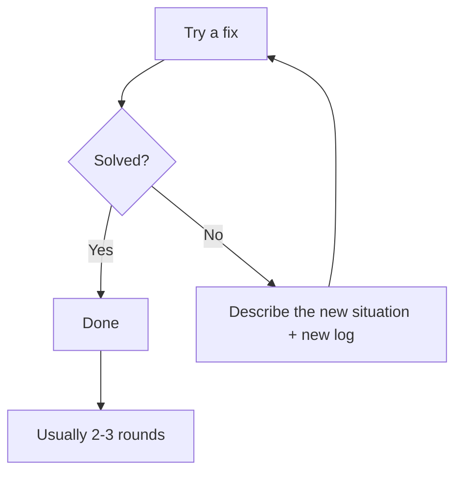
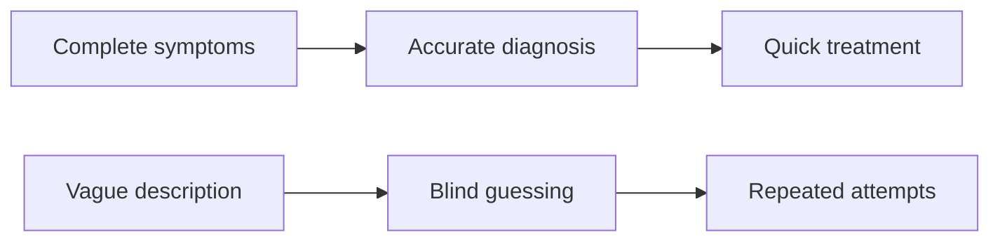

# 2.5 Efficient Debugging Mindset 🟢

> **After reading this section, you will gain:**
>
> - Master the formula for efficient AI debugging communication
> - Learn how to provide complete error logs and context
> - Understand the iterative fix pattern and keep refining until the issue is solved
> - Learn the ultimate move: "let AI build it itself"

> The "debugging mindset" mentioned in the introduction: provide complete error logs and use an iterative fix pattern.

## Prerequisites

::: tip What is debugging

Debugging is the process of finding and fixing code errors.
:::

::: tip What is an error log

An error log is the detailed information output when a program crashes or encounters an exception, including the error type, location, stack trace, and more.
:::

::: tip What is a stack trace

A stack trace is the chain of function calls at the time an error occurs. It shows which line of code, which function, and which layers of calls produced the error. It helps you trace the root cause.
:::

---

## Debugging communication formula: complete logs + steps to reproduce + expected result

**Scenario: your project throws an error, and you don't know what to do**

You copy only the last line of the error message to AI: (❌ Inefficient)

```
"It threw an error, help me take a look"
```

AI asks you: "What error? What were you doing?"—it takes 3 back-and-forth rounds just to get to the point.

**Efficient approach**: provide all the information at once (✅)

```
I ran pnpm dev to start the project, and the terminal showed this error:

[complete error log]

My expected result is: the dev server starts normally and I can access it at localhost:3000
Help me analyze and fix this issue
```

**Why this works better**:

| Information you provide | What AI can do | Rounds saved |
|-----------|----------|-----------|
| Only say "it errored" | Ask for details | +2 rounds |
| Give only the last line | Guess the context | +1 round |
| **Provide the complete log** | **Pinpoint the issue directly** | **0 rounds** |

**Iterative fix pattern**:

The first round didn't solve it? That's normal. Keep going with the new log:

```
I followed your suggestion, and now I’m seeing a new error:

[new error log]

Please continue analyzing it
```

**Usually it takes 2-3 rounds to solve**, so don't give up.

**Iterative fix pattern**：



**Try the debugging prompt quality grader — see whether your prompt is good enough:**

<PromptOptimizer />

---

## Ultimate move: let AI build it itself

**Scenario: there are too many errors, and you don't want to investigate them one by one**

You changed the code, the build failed, and the error output is 50 lines long. You don't know where to start.

**Just hand it to AI directly**:

```bash
"Please help me run pnpm install && pnpm build. If you encounter any errors, fix them yourself until the build succeeds."
```

**Then go grab a coffee**.

**Why it works**:

- AI sees the real errors directly, without relying on your retelling
- AI can handle small issues on its own (version conflicts, missing dependencies)
- You only need to check the result

**Best use cases**：

| Scenario | Why it's a good fit |
|------|-----------|
| Taking over a new project | You don't know the project structure, so let AI explore it itself |
| Too many errors | Checking them one by one is too slow, so let AI handle them in parallel |
| CI/CD failed | You can't reproduce it locally, so let AI run it locally |

**Notes**：

- ✅ `git commit` first, so you can roll back if AI breaks something
- ✅ The first run may be slow, so be patient
- ⚠️ If AI gets stuck in a loop (editing the same spot back and forth) → interrupt it promptly

---

## Practical examples

### Example 1: Type error

**Error log**：

```
Type error: 'user' is possibly 'undefined'.
  at App (app/page.tsx:15:10)
```

**❌ Bad description**：

```
"It's a type error, help me take a look"
```

**✅ Good description**：

```
TypeScript error:

File: app/page.tsx
Line: 15
Error: 'user' is possibly 'undefined'

Code:
const user = await getUser();
return <div>{user.name}</div>;  // line 15

How should I handle the possibility of undefined?
```

**AI analysis**：

```
user could be undefined, so you need to:
1. Add a type check
2. Provide a default value
3. Or use optional chaining
```

---

### Example 2: Runtime error

**Error log**：

```
Error: connect ECONNREFUSED 127.0.0.1:5432
    at Connection.<anonymous> (node_modules/pg/lib/client.js:89:17)
    at Socket.emit (events.js:315:13)
```

**❌ Bad description**：

```
"Database connection failed"
```

**✅ Good description**：

```
Database connection error:

Error: connect ECONNREFUSED 127.0.0.1:5432

Environment:
- Development environment
- PostgreSQL should be running locally
- DATABASE_URL="postgresql://localhost:5432/mydb" in .env

Possible causes:
1. PostgreSQL isn't running?
2. Wrong port?
3. Incorrect .env configuration?
```

**AI analysis**：

```
ECONNREFUSED means the service is not running.
Check:
1. Whether PostgreSQL is running
2. Whether the port is correct (default is 5432)
3. Run commands to check:
   Mac/Linux: brew services list
   Windows: sc query postgresql-x64-[version]
```

---

### Example 3: Build error

**Error log**：

```
✘ [ERROR] Could not resolve "./components/Button"

    app/page.tsx:3:24:
      3 │ import { Button } from "./components/Button";
        ╩                         ~~~~~~~~~~~~~~~~~~~~
    This file does not exist.
```

**❌ Bad description**：

```
"The build failed"
```

**✅ Good description**：

```
Build error:

Could not resolve "./components/Button"

File location: app/page.tsx:3:24
import { Button } from "./components/Button";

Actual situation:
- The project uses shadcn/ui
- The Button component should be in components/ui/button.tsx

How do I fix the import path?
```

---

## Common error patterns quick reference

| Error type | Typical message | Direction for fixing |
|---------|---------|---------|
| Type error | `Type 'X' is not assignable to type 'Y'` | Check type definitions, use type assertions, or revise the types |
| Null/undefined error | `Cannot read property 'X' of undefined` | Add null checks, optional chaining, or default values |
| Import error | `Module not found: Can't resolve 'X'` | Install dependencies, fix the path, check exports |
| Network error | `ECONNREFUSED / ENOTFOUND` | Check service status, URL, and network connection |
| Port already in use | `Address already in use :3000` | Stop the process using the port or switch ports |
| Permission error | `EACCES / Permission denied` | Check file permissions, use sudo, or change permissions |
| Syntax error | `Unexpected token / SyntaxError` | Check syntax and spelling, and make sure brackets and quotes match |

---

## Core ideas

**Debugging is like a doctor's diagnosis process**.



**Remember**：

1. **Complete logs**: don't trim them down; stack trace information is very important
2. **Steps to reproduce**: explain what you did that triggered the error
3. **Expected result**: tell AI what you want
4. **Iterative fixes**: don't give up; it usually takes 2-3 rounds
5. **Report the result**: after each fix, tell AI what happened next

**Debugging formula**：

```
Complete error log
+ Steps to reproduce (what you did)
+ Expected result (what you want)
= Fast solution
```

**Ultimate move formula**：

```
git commit to save the current state
+ Let AI run the build itself
+ If it hits errors, let it fix them itself
= Less stress, less effort
```

---

## Related content

- Prerequisite: 2.2 VibeCoding workflow explained