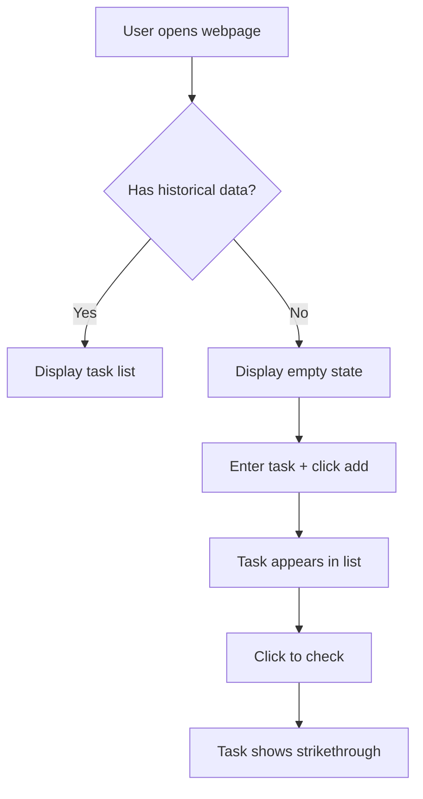

# 3.3 PRD Writing in Practice 🔴

> **After reading this section, you will gain:**
>
> - Understanding of the five-part PRD structure and its purpose
> - Mastery of the "draft-medium-final" iteration principle
> - Ability to write AI-friendly PRDs using Markdown and Mermaid
> - Methods for handling edge cases and scope management

> As mentioned in the preface: PRD is the execution specification for AI, and also a reflection of problem-definition capability.

---

## The Value of PRD

In AI development, the role of PRD differs from traditional development. In traditional development, PRDs are primarily for the team; in AI development, PRDs are more importantly for providing AI with complete context so it doesn't have to repeatedly guess intent.

PRD is the "single source of truth." When ideas are clearly described in a PRD, AI output becomes much more stable, and scope explosion issues are avoided.

The process of writing a PRD is also training in problem-definition capability. Many people directly ask AI to "help me build a feature," resulting in multiple rounds of revision. But when you first clarify the goal, user, business scenario, and interaction logic, AI often gets it right the first time.

This training has value beyond a single development cycle. When forced to describe a requirement clearly in writing, you'll discover many previously ambiguous areas. You might think you have a clear vision for the product, but when you actually put pen to paper, you'll realize many details were never seriously considered. PRD writing forces you to confront these gaps—either making explicit decisions or acknowledging that more information is needed. This mental training will make you sharper and more decisive in subsequent product decisions.

---

## The Five-Part PRD Structure

PRDs are divided into five core parts, corresponding to the "draft-medium-final" iteration principle:

| Part | Corresponding Stage | Core Content |
|------|---------------------|--------------|
| **Part 0: Document Information** | Always recorded | Version, stage, update history |
| **Part 1: Background & Goals** | Draft | Why build it, for whom, what problem to solve |
| **Part 2: Solution Overview** | Medium | Business flow, feature flow, information architecture |
| **Part 3: Detailed Solution** | Final | Interaction details, edge cases, non-functional requirements |
| **Part 4: Launch Plan** | Final | Schedule, gradual rollout |

**Iteration Principle**: Draft clarifies "why," medium clarifies "what," final clarifies "how." Each step includes review and revision, avoiding major issues discovered at the end.

This iteration rhythm has psychological foundations. When facing complex problems, people often fall into "analysis paralysis"—wanting to think through all details at once, resulting in no progress at all. Staged iteration lets you focus on specific dimensions at each stage. During the draft, you don't need to worry about technical implementation, only confirming the direction is correct; during medium, you don't need to fuss over button colors, only confirming the flow is reasonable. This layered thinking approach makes complex problem processing manageable.

Another easily overlooked benefit is that each version is a "rollback checkpoint." If direction issues are found in the medium stage, you can return to the draft for re-examination; if technical solutions prove infeasible in the final stage, you can return to medium to adjust the flow. This structured iteration allows errors to be discovered and corrected early, rather than accumulating until they explode at the end.

<PRDIterationTimeline />

---

## Part 0: Document Information

This section records the document's version status and iteration history.

### Document Status

- **Current Version**: e.g., "Internal Review-Revision 1" — records current stage and revision count
- **Current Stage**: Requirements Review / UI Design / In Development / Launched
- **Key Stakeholders**: Product, Engineering, Design, QA leads, etc.

Version information lets AI know whether this is a "draft" or "final." Final versions should be more detailed; drafts can leave TBD (to be determined).

#### Semantic Versioning

In addition to descriptive naming, you can use **Semantic Versioning** to manage document versions. Format is `MAJOR.MINOR.PATCH` (e.g., `1.2.3`):

- **MAJOR**: Breaking changes, incompatible with previous versions (e.g., product direction shift)
- **MINOR**: New features, backward compatible (e.g., adding a new module)
- **PATCH**: Bug fixes or minor changes (e.g., typo corrections, detail additions)

Example: `1.0.0` is the first stable version, `1.1.0` adds new features, `1.1.1` fixes description errors.

This versioning applies not only to code but also to documents, APIs, and any resources requiring version management.

### Update History

Record the iteration process:

| Version | Status | Updates |
|---------|--------|---------|
| Internal Review | Draft | Initial description of background, goals, and core value |
| Project Review | Medium | Added core business flow, feature flow diagrams |
| Pre-Development Final | Final | Incorporated UI designs, added edge cases, tracking plan |

Update history lets AI know what's stable and what may still be changing.

---

## Part 1: Background & Goals

This is the soul of the PRD, corresponding to the core content of the draft stage.

### Project Overview

Summarize what the product is in one or two sentences.

| Good Overview | Poor Overview |
|---------------|---------------|
| A minimal todo list webpage for personal use | A todo list app |

Vague overviews lead AI to build complex versions. Specific overviews quickly set boundaries.

Writing overviews is an art of compression. You need to convey the product's essential characteristics in extremely limited space. "A minimal todo list webpage for personal use" contains multiple key pieces of information: "for personal use" indicates a personal tool rather than team collaboration; "minimal" indicates limited features and clean interface; "webpage" indicates the technical form. This information together forms a clear boundary, letting AI know what should and shouldn't be done.

### Core Problem

Answer three questions:

1. **Target User Persona**: Who uses it? (Specific characteristics, not "everyone")
2. **User Scenario**: What time, place, and situation will they use it?
3. **Core Pain Point**: What's wrong with existing solutions?

| Missing | Consequence |
|---------|-------------|
| Didn't say who the user is | May build a complex "everyone can use" version |
| Didn't say the scenario | May use unsuitable technology (mobile built as desktop) |
| Didn't say the pain point | May build "perfect" features that solve pseudo-needs |

### User Stories

Describe requirements from the user perspective:

> As a **[role]**, I want **[to accomplish a task]**, so that **[I can achieve some value]**

This is closer to users than "I want to build a feature." The user story format forces thinking from the user angle rather than the feature angle.

The value of user stories lies in establishing an "empathy framework." When you write "As a sales manager, I want to quickly generate weekly reports, so that I can save time on Friday afternoons," you're forced to imagine a specific person, in a specific scenario, facing a specific frustration. This imagination removes you from the technical implementation angle and lets you think about solutions from the user's real situation. Often, we think users need a certain feature, but what they actually need is the value behind the feature. User stories help you discover this true need.

### Scope Management

Clarify "what to build" and "what not to build."

**In-Scope**: Explicitly list features to be built

**Out-of-Scope**: Explicitly list what **not** to build

Scope management should be completed in [3.2 Discussing Requirements with AI](./02-discuss-with-ai.md). Here, you're just recording the discussion results.

| Without Out-of-Scope | With Out-of-Scope |
|----------------------|-------------------|
| AI may automatically add "common features" | AI clearly knows the boundaries |
| Scope keeps expanding | Product stays focused |

### Requirements List & Priorities

Break down macro requirements into specific items with priorities:

| Req ID | Module | Description | Priority | Status |
|--------|--------|-------------|----------|--------|
| R001 | Add Task | User can add todo items | High | Planned |
| R002 | Delete Task | User can delete tasks | High | Planned |
| R003 | History | View historical tasks | Low | Consider for V2.0 |

Priorities let AI know what's core (P0) and what can be deferred.

---

## Part 2: Solution Overview

Corresponds to the medium stage, using visual methods to show the complete product picture.

### Core Business Flow Diagram

Use Mermaid to describe the complete flow of users completing core tasks.



| Text Only | With Flow Diagram |
|-----------|-------------------|
| AI may misunderstand step order | AI understands flow at a glance |
| May have ambiguity | Visualization removes ambiguity |

Flow diagrams let AI accurately understand business logic and reduce misunderstandings.

Another value of flow diagrams is that they expose blind spots in your thinking. When trying to describe a process graphically, steps that were "obvious" become concrete and visible. You may discover you never seriously considered "what if the user isn't logged in" or "what should the page show when data fails to load." Flow diagrams force you to consider every branch, every decision point—this structured examination often reveals important details missed in text descriptions.

### Information Architecture

List the product's page structure and hierarchy:

- **Home**
  - Navigation bar
  - Task list
- **Settings**
  - Theme settings
  - Data management

Information architecture lets AI understand what pages exist and how they're organized.

---

## Part 3: Detailed Solution

Corresponds to the final stage, the most detailed part, and the direct basis for AI to write code.

### Page Prototypes & Interaction Details

Describe the complete interaction flow for each page:

1. **Initial State**: What the page looks like when first loaded
2. **Trigger Action**: What the user does
3. **Success State**: What displays after success
4. **Failure State**: What displays after failure
5. **Empty State**: What displays when there's no data

| Only writing "user can add tasks" | Writing complete interaction logic |
|-----------------------------------|------------------------------------|
| AI doesn't know where to put it or how to display | AI knows input position, button style, how list updates |

### Edge Case Handling

This is what beginners most easily miss.

The omission of edge cases is often not due to carelessness but "happy path bias." When imagining user scenarios, our brains automatically fill in the ideal flow: user opens app, completes action, leaves satisfied. But real user experience is full of surprises—network fluctuations, accidental touches, sudden calls. These abnormal situations aren't "exceptions" but normal components of user experience. A system that only handles normal cases will perform very fragilely in real environments.

| Edge Case | What Happens If Not Written |
|-----------|-----------------------------|
| User rapidly clicks button twice | May submit duplicate |
| Network error occurs | User doesn't know what happened |
| Data is empty | May show blank or error |
| User exits midway | May lose data |

Common edge case handling:

- User rapidly clicks "Add" button → Debounce, only respond once within 0.5 seconds
- Network request fails → Show Toast: "Network error, please retry"
- Task list is empty → Show empty state illustration: "No tasks yet, add one"

### Non-Functional Requirements

| Requirement Type | Why It Matters |
|------------------|----------------|
| Performance | Not written → AI may build something heavy with slow loading |
| Compatibility | Not written → May only support Chrome, Safari users can't use |
| Data Tracking | Not written → Can't track usage after launch |

---

## Part 4: Launch Plan

Defines the requirement's lifecycle.

### Launch Schedule

| Stage | Date |
|-------|------|
| Requirements Review | YYYY-MM-DD |
| UI/UX Design | YYYY-MM-DD ~ YYYY-MM-DD |
| Development | YYYY-MM-DD ~ YYYY-MM-DD |
| Target Launch | YYYY-MM-DD |

Launch schedule lets AI know the project timeline and reasonably plan development order.

---

## Markdown & Mermaid

PRDs should be written in Markdown, with Mermaid for flow diagrams.

**Advantages of Markdown**:

- Uniform format, easy version management
- AI understands Markdown best
- Supports rich formatting: code blocks, tables, lists, etc.

**Advantages of Mermaid**:

- Text is the diagram, easy to modify
- AI can accurately understand flow diagrams
- Supports flowcharts, sequence diagrams, state diagrams, and more

Just tell AI "draw a flowchart using Mermaid"—no need to memorize syntax.

---

## Having AI Generate the PRD

After confirming AI understands correctly in 3.2, have it generate the PRD based on a template:

> Please generate a document using the PRD template based on our discussion. If we haven't discussed a certain field, mark it TBD (to be determined).

Responsibilities after generation:

1. **Review AI-generated PRD** — Confirm each field is based on discussion, not AI guessing
2. **Fill in TBD fields** — For "to be determined" parts, add details or explicitly mark "not needed"
3. **Correct misunderstandings** — Immediately correct anything inconsistent with the discussion

---

## Good PRD vs. Bad PRD

<GoodBadPRDCompare />

### Bad PRD

```markdown
# Todo List

Build a todo list feature where users can add tasks and check them complete.
```

**Problems**:

- Didn't say who the user is → May build a team version
- Didn't say core features → May add many unneeded features
- Didn't say Out-of-Scope → May add login, cloud sync
- Didn't say edge cases → Rapid clicking causes duplicate submission
- No flow diagram → AI may misunderstand business logic

### Good PRD

```markdown
# Minimal Todo List

## 1.1 Project Overview
A minimal todo list webpage for personal use, with only add and check functions.

## 1.2 Core Problem
- **Target User**: Myself (working professional, handling 5-10 tasks daily)
- **User Scenario**: Open computer in morning, quickly see what to do today
- **Core Pain Point**: Sticky notes get lost, phone memo takes too long to open

## 1.5 Scope
**In-Scope**: Add tasks, view list, check complete, delete tasks
**Out-of-Scope**: Login/registration, cloud sync, category tags

## 2.1 Core Business Flow
[Mermaid flowchart]

## 3.1 Edge Case Handling
- Rapid click on "Add" → 0.5s debounce
- Empty list → Show "No tasks yet"
- Refresh page → Data not lost (localStorage)
```

---

## FAQ

### Q1: How detailed should a PRD be?

**A**: Draft can be brief, medium needs flow diagrams, final needs edge cases. The principle: after AI reads it, it shouldn't need to ask "where does this button go" or "what happens on failure."

### Q2: Can I write the PRD while developing?

**A**: Not recommended. PRD is the embodiment of ideas; writing before development is to think things through. Writing while developing often leads to "discovering it's wrong while writing," with higher rework costs.

### Q3: Can't the PRD be changed after it's written?

**A**: No. PRDs should be updated as requirements change. Every major change should update the version number and update history.

### Q4: Do small projects need PRDs too?

**A**: Yes. Small projects can be simpler, but the structure should be complete. A simple project's PRD may only be a few hundred words, but still contains all five parts.

---

## Key Takeaways

- ✅ PRD has five major parts, corresponding to "draft-medium-final" iteration principle
- ✅ **Core business flow diagram** lets AI accurately understand business logic
- ✅ **Edge case handling** is what beginners most easily miss
- ✅ **Out-of-Scope** prevents AI from freelancing
- ✅ Review AI-generated PRD to ensure it's based on discussion, not guessing
- ✅ Have AI mark undiscussed items as TBD, rather than blindly guessing

After the PRD is written, next understand how AI executes it.

---

## Related Content

- Prerequisite: [3.2 Discussing Requirements with AI](./02-discuss-with-ai.md)
- Next: [3.4 From PRD to Code](./04-coding-agents.md)