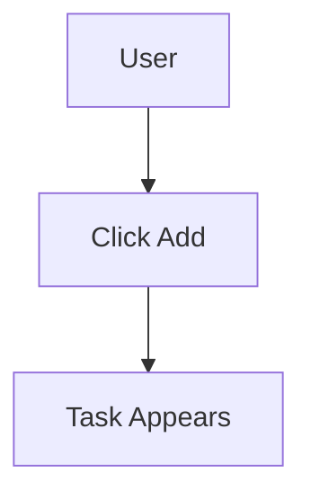

# 3.4 From PRD to Code 🟡

> **After reading this section, you will:**
>
> - Understand how AI "reads" and executes PRDs
> - Master how PRD details affect code generation quality
> - Learn to use visualizations to reduce misunderstandings
> - Grasp the "solution-first" workflow approach

> As mentioned in the preface: understanding how AI executes PRDs helps you write more effective PRDs.

---

## How AI "Reads"

PRDs aren't for humans—they're for AI. The way AI "reads" a PRD differs fundamentally from human reading.

### Human vs. AI Reading

| How Humans Read | How AI Reads |
|-----------------|--------------|
| Read start to finish | Breaks PRD into "information chunks" |
| Skip repetitive content | Processes every field |
| "Fill in the blanks" for ambiguous parts | Interprets strictly by literal meaning |
| Ask when something's unclear | May apply default assumptions or ask follow-ups |

**Core difference**: AI doesn't "fill in the blanks." Every word you write influences the code it generates. If your PRD is ambiguous, AI either guesses (and may guess wrong) or stops to ask (adding conversation rounds).

This difference has profound implications for PRD writing. When writing for humans, you can rely on "common sense"—you know readers understand that "login functionality" typically includes username fields, password fields, and login buttons without listing each one. But AI lacks this "common sense," or rather, its "common sense" comes from statistical patterns in training data that may not match your expectations. For AI, "login functionality" could mean simple local storage validation or full OAuth third-party authentication. Without explicit specification, AI chooses based on common patterns—but you only discover which one it "guessed" after seeing the result.

### AI's Execution Flow

When you give a PRD to AI, it goes through these internal steps:


This flow happens automatically. PRD quality directly determines accuracy at each step.

<PRDToCodeFlow />

Understanding this flow helps you anticipate AI behavior. Knowing AI first extracts key information, you'll pay special attention to clarity in your PRD's opening sections; knowing it builds data models, you'll ensure data descriptions are complete and consistent. Each step is a potential failure point—and an opportunity to optimize through better PRD writing. If generated code has issues, tracing this flow helps pinpoint where problems originated—misunderstanding during information extraction, or deviation during data model design.

---

## How PRD Details Affect Code

### Information Extraction Phase

AI extracts from your PRD:

- Who is the user → affects UI design style
- Core features → determines code structure
- Business processes → determines logic sequence
- Out-of-Scope → prevents "creative interpretation"

If your PRD is too vague, AI guesses based on "common practices"—and may guess wrong.

### Data Model Building Phase

AI designs data structures based on "data" descriptions in your PRD:

| PRD Description | AI's Data Structure Understanding |
|-----------------|-----------------------------------|
| "Tasks have title, completion status" | `{ title: string, completed: boolean }` |
| "Users can add multiple tasks" | `tasks: Array<Task>` |
| "Data needs to be saved" | Needs localStorage or database |

**Note: In this chapter, PRDs only need to describe "what data is needed"—AI will design preliminary data models accordingly. Detailed database design (table structures, relationships, index optimization) comes in Chapter 8; you can revisit and refine this design with new knowledge then.**

If your PRD doesn't specify what data to save, AI may miss critical fields, requiring structural refactoring later.

Data model design is architectural foundation. Once established, subsequent decisions build around it. If AI misunderstands at this stage—designing related data as separate tables, or omitting key fields—the error amplifies downstream. Frontend code renders based on wrong structures, backend APIs query based on wrong models, and entire data flows are affected. Fixing this isn't just changing a few lines—it often requires redesigning database schemas, modifying API contracts, and adjusting frontend components. This refactoring cost far exceeds adding a few clarifying sentences to your PRD.

### Business Logic Design Phase

AI writes code logic based on flowcharts and interaction descriptions:

| Interaction Description | AI-Generated Code Logic |
|-------------------------|------------------------|
| "Click add button, task appears in list" | `handleAddTask()` function |
| "Click checkbox, task shows strikethrough" | `toggleTask()` + CSS styles |
| "Rapid click debouncing" | `debounce()` or `disabled` state |

If your PRD omits edge cases, AI may skip debouncing and error handling.

---

## PRD Quality Determines Code Quality

### Example 1: Missing Out-of-Scope

**PRD**:

```markdown
# Todo List
Users can add tasks and check them complete.
```

**AI might generate**:

- Login functionality
- Cloud sync
- Category tags

Result: Code far more complex than intended.

This "over-engineering" is among the most common AI development issues. AI's training data contains countless feature-complete enterprise applications; it learned "what a todo list should have." When you don't explicitly say no, AI defaults to this "complete version." This isn't AI's fault—it's doing its best to fulfill your request. The problem is missing boundary information in your requirements. Out-of-Scope's value lies not just in telling AI what not to do, but helping AI understand your true intent. When you say "no login/register," AI understands this is a local tool; when you say "no cloud sync," AI understands data doesn't need cross-device sharing. These negative constraints actually define a clear creative space for AI.

**Revised PRD**:

```markdown
# Todo List

## Core Features
- Add tasks
- Check complete

## Out-of-Scope
- No login/registration
- No cloud sync
- No category tags
```

### Example 2: Missing Edge Cases

**PRD**:

```markdown
Users can click the add button to add tasks.
```

**AI-generated code**:

```javascript
function addTask() {
  tasks.push(newTask);
}
```

Problem: Rapid clicks create duplicates.

**Revised PRD**:

```markdown
Users click the add button to add tasks.

Edge case: Debounce rapid clicks, respond only once within 0.5 seconds.
```

**AI-generated code**:

```javascript
function addTask() {
  if (isAdding) return; // debounce
  isAdding = true;
  tasks.push(newTask);
  setTimeout(() => isAdding = false, 500);
}
```

---

## AI's Blind Spots in Understanding PRDs

AI has understanding blind spots to watch for when writing PRDs.

### Blind Spot 1: Default Values

| What You Write | AI's Default Assumption |
|----------------|------------------------|
| "Display task list" | How many items max? AI might guess 10, 50, 100 |
| "After button click..." | Should button disable? AI might not handle |
| "Save data" | How long? AI might assume "forever" |

**Solution**: Explicitly state expected defaults.

Default values matter because they reveal differences in "common sense" between AI and humans. For humans, "display task list" means "show all tasks," "save data" means "save permanently." But AI lacks these default assumptions—or rather, its defaults come from statistical learning that may differ from your intuition. When AI guesses "how many items max," it might choose 10 (common on mobile), 50 (a "reasonable" number), or 100 (a "safe" upper bound). All are "reasonable," but possibly not what you want. Explicit defaults transfer your "common sense" to AI.

### Blind Spot 2: State Changes

| What You Write | AI Might Misunderstand |
|----------------|------------------------|
| "Tasks can be checked complete" | Strikethrough? Move to bottom? Disappear? |
| "Loading..." | Disable button during loading? Show spinner? |

**Solution**: Use state descriptions: "Initial state → Trigger → Loading → Success/Failure".

### Blind Spot 3: Priorities

| What You Write | AI Might Misunderstand |
|----------------|------------------------|
| List of features | AI might implement all in listed order |
| No indication of importance | AI might over-engineer secondary features |

**Solution**: Label priorities with P0/P1/P2.

---

## Helping AI Better Understand Your PRD

### Technique 1: Use Structured Formatting

AI understands Markdown structure well.

Structured lists:

```markdown
## Core Features
- Feature 1
- Feature 2

## Out-of-Scope
- No social sharing functionality
- No multi-language support
```

Are clearer than plain text paragraphs.

### Technique 2: Specific Over Abstract

Don't say "interface should look good"; say "white background, blue buttons, borderless rounded corners."

Don't say "should be smooth"; say "responds within 0.5 seconds of click."

Specific descriptions can't be interpreted multiple ways.

Abstract adjectives are traps in PRD writing. "Good-looking," "smooth," "clean" sound professional, but everyone interprets them differently. Your "good-looking" might mean minimalist black-on-white; AI might interpret as gradient backgrounds and rounded cards. Your "smooth" might mean 0.5-second response; AI might interpret as elegant transition animations. These interpretation differences don't cause code errors, but cause product feel mismatches. Specific descriptions eliminate all interpretation space. When you say "white background, blue buttons, borderless rounded corners," AI translates precisely to CSS; when you say "responds within 0.5 seconds," AI knows to optimize performance or add loading states.

### Technique 3: Use Mermaid Diagrams

AI can "read" Mermaid flowcharts:



This is more accurate than text descriptions.

---

## Solution First, Implementation Second

An effective practice: **Have AI output a technical solution first, then write code**.

> Please provide a technical implementation plan for this feature first, including data structures, interface definitions, and main steps. I'll confirm before you write code.

Benefits:

| Direct to Code | Solution First |
|----------------|----------------|
| Directional errors discovered late | Course-corrected at planning phase |
| Misunderstandings require major rework | Issues caught at planning phase |
| Results unpredictable | Clearer expectations after confirmation |

This applies "chain of thought"—breaking complex tasks into "think first, then act" steps.

Solution-first splits complex tasks: Phase 1 focuses on "what" and "how"; Phase 2 focuses on "how to write." More importantly, the planning phase provides a checkpoint to catch and correct directional errors before major time investment.

---

## Common Questions

### Q1: AI didn't generate code according to PRD

**A**: Check if PRD was given to AI, verify PRD path is correct, check if content was truncated. AI may have only "seen" part of the PRD.

### Q2: Generated code doesn't match PRD

**A**: This indicates understanding deviation. Use the confirmation template from 3.2 to have AI re-confirm understanding, or apply the "solution-first" method.

### Q3: How detailed must PRDs be for accurate AI understanding?

**A**: Principle: After reading, AI shouldn't need to ask "where does this button go" or "how to handle failures." Detail levels vary by draft stage—see 3.3.

### Q4: Can I have AI supplement the PRD while coding?

**A**: Not recommended. This causes PRD-code divergence, making maintenance difficult. Correct approach: finalize PRD first, then generate code.

---

## Key Takeaways

- ✅ AI interprets PRDs literally, without "filling in blanks"
- ✅ Every PRD field affects AI-generated code
- ✅ Missing Out-of-Scope → AI may "creatively interpret"
- ✅ Missing edge cases → AI may skip error handling
- ✅ AI has blind spots: defaults, state changes, priorities
- ✅ Use structured formatting, specific examples, and Mermaid diagrams for clearer AI understanding
- ✅ **Solution first** — Have AI output technical plans, confirm before coding

Chapter 3 complete. Next up:

- **Chapter 4**: Development Fundamentals and Tech Stack
- **Chapter 8**: Data Persistence and Databases (revisit data model design with new knowledge)

---

## Related Content

- Prerequisite: [3.3 PRD Writing in Practice](./03-prd-template-guide.md)
- See also: [Chapter 4: Development Fundamentals and Tech Stack](../04-dev-fundamentals/index.md)