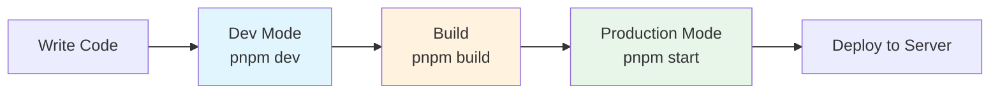

# 4.0 The Three States of Running Code 🟢

> **After reading this section, you will gain:**
> - An understanding of the three runtime modes for code
> - A solid grasp of what `package.json` does
> - Familiarity with hot reload and caching mechanisms
> - The ability to avoid common runtime environment mistakes

> Code has three "life states": Dev, Build, and Production. Understanding the differences between them is the key to avoiding confusion like "I changed the code, but nothing happened."

---

## The Three States

<BuildModesSimulator />

### Dev (Development Mode)

`pnpm dev` starts development mode. Think of it as **drafting**:

- The browser updates automatically after you save code
- Supports hot reload, so form contents are not lost
- Includes detailed error messages for easier debugging
- Runs more slowly

**Best for**: Day-to-day development and debugging

### Build (Build Mode)

`pnpm build` runs the build. This process is like **typesetting and printing a draft into a book**:

- Compresses code size
- Optimizes runtime performance
- Generates a `.next` or `dist` folder
- Removes debugging information

**Best for**: Right before deployment

### Production (Production Mode)

`pnpm start` (or `next start`) runs the built version. This **simulates the real production environment locally**:

- Runs the built code
- Delivers the best performance
- Does not support hot reload

**Best for**: Final checks before going live



---

## Hot Reload

In Dev mode, the browser updates automatically after you save a file. This is called **Hot Reload**.

Development tools watch for file changes in the background. When a change is detected, they automatically refresh the browser or update only the changed parts. This means you do not need to refresh manually every time.

However, in Build or Production mode, the code has already been bundled and there is no file-watching mechanism, so changes require a rebuild.

---

## package.json

**Why does the project start just by typing `pnpm dev`?**

Open the `package.json` file in the root directory. This is the **core configuration file** of a Node.js project:

### Scripts

It defines commonly used commands for running the project:

```json
{
  "scripts": {
    "dev": "next dev",
    "build": "next build",
    "start": "next start"
  }
}
```

When you type `pnpm dev`, the package manager looks it up, sees that it maps to the `next dev` command, and runs it.

You can also define your own commands, such as changing the port to avoid the crowded default port 3000:

```json
{
  "dev": "next dev -p 4000"
}
```

### Dependencies

It records the third-party libraries the project needs along with their version numbers:

```json
{
  "dependencies": {
    "next": "^16.0.0",
    "react": "^19.0.0",
    "drizzle-orm": "^0.36.0"
  }
}
```

This ensures that others can use `pnpm install` to install the exact same libraries and perfectly reproduce the development environment.

---

## Build Output

After the build is complete, output files are generated in the `.next` (Next.js) or `dist` (Vite) folder.

But you cannot just double-click these files to open them. At its core, Next.js is a **program** that runs on Node.js and requires a server environment—connecting to databases, handling API requests, and server-side rendering pages.

Even for purely static projects (bundled with Vite), you usually cannot just double-click to open them. Modern apps use **absolute paths** to reference assets, and opening them by double-clicking uses the **file:// protocol**, which causes the browser to fail to locate those assets.


::: tip The Correct Way to Access It

Always access the app through a Web server:
- Next.js: `pnpm start`
- Vite: `pnpm preview`

Do not directly double-click the built files.

:::

---

## Cache Issues

### Browser Cache

In Production mode or when visiting a deployed website, you may run into odd behavior caused by caching. For example, you changed a button color, but nothing changes after refreshing.

**Solutions**:
- Force refresh: `Ctrl + Shift + R`
- Open in incognito mode
- In Developer Tools, check "Disable cache" in the Network tab


### Build Cache

If force refreshing still does not work, it may be a build cache issue. Delete the `.next` directory and run `pnpm build` again.

### Environment Variable Cache

Environment variables are configuration values stored outside the code—like the "Settings" on your phone: the app itself does not change, but you can adjust its behavior through settings (dark mode, language preference, and so on). In development, environment variables are usually stored in the `.env` file and read when the program starts.

After modifying the `.env` file, you **must restart the service** (`Ctrl+C` and then `pnpm dev`) for the environment variables to take effect. That is because environment variables are loaded when the process starts, and changing the file while it is running will not update them automatically.

---

## Key Takeaways

- ✅ Dev mode is for day-to-day development and supports hot reload
- ✅ Build creates the production version and optimizes performance
- ✅ Production mode simulates the real production environment
- ✅ package.json manages scripts and dependencies
- ✅ You cannot directly double-click build output files to open them
- ✅ When something goes wrong, consider caching first
- ✅ Changing environment variables requires a service restart

Now that you understand the three states of running code, the next step is to learn the decision-making framework for choosing a tech stack.

---

## Related Content

- See also: [4.1 Tech Stack Decision Framework](./01-tech-stack-decision.md)