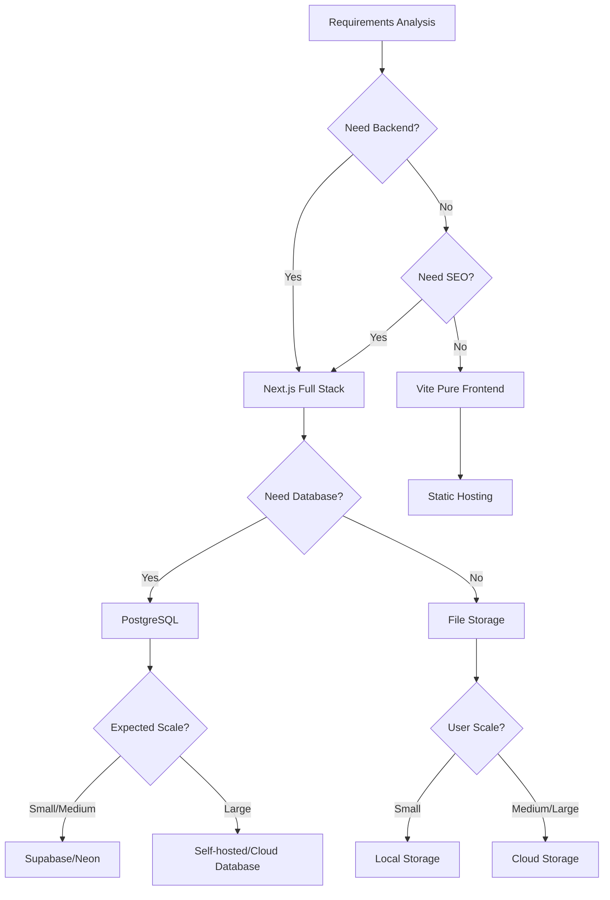

# 4.1 Tech Stack Decision Framework 🟡

> **After reading this section, you will gain:**
>
> - Understanding of core principles for tech stack decisions
> - Mastery of "requirements-first" selection thinking
> - Ability to evaluate feasibility and complexity of technical solutions
> - Knowledge of common technical solutions and their applicable scenarios

> Choose your tech stack after the PRD is finalized. First figure out what to build, then decide how to build it.

---

## Core Principles of Tech Stack Decisions

Tech stack decisions are a critical milestone in product development. Choosing the right technology can multiply your productivity, while the wrong choice adds unnecessary complexity.

Many people fall into "technology worship" when selecting technologies—chasing the newest, coolest tools while ignoring actual requirements. This mindset is especially dangerous in the AI era, because AI has the best support for mainstream, mature technologies. Niche technologies may lead to AI failing to understand code correctly or generating incorrect implementations.

The core principle of tech stack decisions is: **clarify requirements → evaluate complexity → choose the minimum viable solution**.

Understanding the evolution logic of technology stacks helps make wiser choices. The development of programming languages and frameworks shows a clear "layered stacking" characteristic, where each layer provides more powerful abstraction capabilities based on the previous one.

### The World of Programming Languages

Imagine walking into a restaurant with dozens of dishes on the menu. The world of programming languages is similar—dozens of languages to choose from, each with its own characteristics and applicable scenarios. Understanding their stories helps you understand why certain technologies become the preferred choice in specific domains.

**C and C++** are the foundation of the computing world. They were born in an era when operating systems needed to talk directly to hardware. If you want to develop a game engine requiring extreme performance, or write code running on embedded devices, C/C++ remains the best choice. The Linux operating system, Windows kernel, and most game engines are built on them. But the cost is lower development efficiency—you need to manage memory manually and handle many low-level details.

**Java** dominates the enterprise world. The promise of "write once, run anywhere" made it the preferred choice for large systems. Alibaba, JD.com's backend systems, and core banking businesses mostly run on Java. It provides a mature ecosystem and strict type safety, but also means more verbose code and slower development cycles.

**Python** is the favorite of data scientists. Its concise and elegant syntax allows scientists and researchers to quickly validate ideas. Instagram and YouTube's backends both use Python, and OpenAI's model training heavily relies on Python. But Python's frontend capabilities are weak—if you want to do full-stack development, you need to learn another set of technologies.

**Go**, developed by Google, is designed for the cloud-native era. Docker and Kubernetes are both written in Go. Its concurrency model is elegant, compilation is fast, and it's suitable for building high-performance network services. ByteDance and other companies heavily use Go in their backends.

**Rust** is the rising star in systems programming. It promises C++-level performance while guaranteeing memory safety. Firefox browser, some Discord components, and Cloudflare's infrastructure all use Rust. But the learning curve is steep, making it unsuitable for rapid prototyping.

**JavaScript and TypeScript** rule the Web world. Originally just a scripting language in browsers, they expanded to the server side with the advent of Node.js. TypeScript adds a type system on top of JavaScript (explicitly marking whether each piece of data is text, number, or date, so the compiler can catch "type mismatch" errors before runtime), making maintenance of large projects much easier. Netflix, Stripe, and Vercel are all built on the TypeScript ecosystem.

### Our Choice: Why TypeScript + Next.js?

Faced with so many choices, you might ask: why does this tutorial choose TypeScript + Next.js?

Let's start from actual requirements. Suppose you're an indie developer or on a small team, and your goal is to quickly validate a product idea. You need a tech stack that can handle both frontend interfaces and backend logic, with a gentle learning curve and rich community support.

C/C++/Rust are first eliminated. They're too low-level—you need to handle memory management, compilation optimization, and other details, which are huge time costs for rapid product development.

Java and Go are excellent backend languages, but you need to separately learn frontend technologies. This means two toolchains, two ways of thinking, two deployment processes. For small teams, this complexity is an unnecessary burden.

Python is the first choice for data science, but it can't run in browsers. If you want to build web applications, you need to additionally learn JavaScript for the frontend, returning to the two-technology problem.

PHP and Ruby were once popular choices for web development, but their ecosystems are shrinking. More importantly, AI models have less training data on them compared to JavaScript, meaning AI-generated code quality may be less stable.

TypeScript's unique advantage is that it unifies frontend and backend. You write frontend interfaces and backend APIs in the same language, with type definitions shared across both ends. When you ask AI to generate code, it doesn't need to switch between different language paradigms, producing more consistent and accurate code.

Next.js further simplifies full-stack development. It integrates React frontend, API routes, database connections, and deployment workflows together. You don't need to configure complex build tools, handle cross-origin issues, or even manage servers—Vercel enables one-click deployment.

This is why we choose TypeScript + Next.js. It's not just a technology choice, but the most efficient production method for individual developers in the AI era.

---

## Tech Stack Selection in the AI Era

In the AI-assisted development era, tech stack selection has new dimensions to consider. AI-friendliness describes the extent of training data coverage AI has for a particular technology. Mainstream technologies like JavaScript and Python have massive training data—AI knows their best practices and common pitfalls. Niche technologies or newly emerged frameworks have less training data coverage, and generated code may require more validation.

When you use a unified tech stack, AI's contextual understanding becomes more coherent. If frontend uses React, backend uses Python, and database uses MongoDB—three different technology paradigms mixed together—there's more context switching, and generated code styles tend to be inconsistent. But using a unified TypeScript ecosystem—Next.js for frontend and backend, PostgreSQL for database—AI can work in a coherent context, producing more consistent and accurate code. Type definitions shared across frontend and backend mean AI won't get field names wrong; AI can understand the entire project at once, generating cross-component code. These seemingly small improvements accumulate to significantly boost development efficiency.

In the past, technology selection was often a trade-off game: choosing Java meant enterprise-grade stability but slow development; choosing Python meant rapid development but performance constraints; choosing JavaScript meant full-stack unification but lack of type safety. The TypeScript and Next.js combination breaks this trade-off—it provides enterprise-grade type safety, achieves full-stack language unification, adapts to the AI era, and unlocks individual developer productivity. This is why this tutorial chooses TypeScript + Next.js as the core tech stack.

---

## Decision Framework: Three Questions

When facing technology selection, answering these three questions can quickly narrow down the options:

**Question 1: What does this project essentially need to do?**

- Content display focused → Static site or pure frontend framework
- Requires user login → Needs backend capabilities
- Requires persistent storage → Needs database
- Requires AI capabilities → Needs AI API integration

**Question 2: What is the expected user scale and concurrency?**

- Personal use or small scale → Can choose simple solutions
- Expected medium scale → Need to consider scalability
- Expected large scale → Need architectural design

**Question 3: What is the team (or individual's) technical background?**

- Familiar with JavaScript/TypeScript → Choose Next.js
- Familiar with Python → Choose FastAPI/Flask
- Learning from scratch → Choose the tech stack with best AI support

---

## Common Technical Solutions Quick Reference

### Frontend Frameworks

| Solution | Applicable Scenarios | Not Applicable Scenarios |
|----------|---------------------|--------------------------|
| **Next.js** | Needs backend, SEO, full-stack development | Pure static display |
| **Vite + React** | Pure frontend, SPA applications | Needs SSR/SEO |
| **Pure HTML/CSS** | Minimalist static pages | Complex interactive applications |

::: tip Why recommend Next.js?

- AI has deep understanding of its project structure, generating accurate code
- Supports full-stack development with unified frontend and backend tech stack
- Easy deployment (Vercel one-click deploy)
- Mature ecosystem with abundant problem-solving resources

:::

### Databases

| Solution | Applicable Scenarios | Not Applicable Scenarios |
|----------|---------------------|--------------------------|
| **PostgreSQL** | Relational data, needs transactions | Minimalist key-value storage |
| **Supabase** | Rapid development, needs auth/storage | Needs fully custom backend |
| **Neon** | Serverless architecture, lightweight needs | Needs complete backend functionality |
| **SQLite** | Local development, minimalist needs | Multi-user concurrent writes |

::: tip Why recommend PostgreSQL?

PostgreSQL is the most powerful open-source database:

- Relational + JSONB + pgvector extension
- Handles both structured and semi-structured data
- Supports vector search, suitable for AI applications
- AI has deep understanding, generating accurate data model code

:::

### Deployment Solutions

| Solution | Applicable Scenarios | Characteristics |
|----------|---------------------|-----------------|
| **Vercel** | Next.js projects, global distribution | Zero-config deployment, automatic CI/CD, Edge Functions support |
| **EdgeOne Pages** | Needs China nodes, edge computing | Tencent Cloud global acceleration, supports Pages Functions and Node.js runtime |
| **Cloud Server** | Full control, complex applications | Requires self-configuration and operations |
| **Docker** | Needs environment consistency, multi-service architecture | Containerized packaging, ensures dev and production environment consistency |

::: tip Vercel vs EdgeOne Pages

**Vercel** is the native deployment platform for Next.js, providing:

- Zero-config automatic deployment, seamless Git repository integration
- Global CDN acceleration, automatic static asset distribution
- Serverless Functions and Edge Functions support
- Generous free tier, suitable for personal projects and small teams

**EdgeOne Pages** is Tencent Cloud's edge deployment platform:

- China node coverage, suitable for scenarios requiring mainland China acceleration
- Supports Pages Functions (edge computing) and Node.js runtime
- Provides KV storage, supporting full-stack application development
- Deep integration with Tencent Cloud ecosystem (SSL certificates, CDN, etc.)

Selection advice: Choose EdgeOne Pages for primarily domestic users; choose Vercel for global distribution or deep Next.js usage.

:::

---

## Tech Stack Choices for Different Company Scales

Technology selection is often related to company scale and business characteristics:

<ScaleComparison />

| Company Scale | Tech Stack | Reason for Choice |
|--------------|------------|-------------------|
| **Startup** (0-50 people) | Next.js + PostgreSQL + Vercel | Fast development speed, unified tech stack, AI-friendly, simple deployment |
| **Mid-size Company** (50-500 people) | Java/Go backend + React frontend + Cloud database | Controllable performance, sufficient talent pool, good maintainability |
| **Large Company** (500+ people) | Multiple languages coexisting: Java (e-commerce), Go (cloud-native), C++ (performance-sensitive) | Different business lines choose most suitable technology, infrastructure team develops custom frameworks |

---

## Technical Principles Supplement (Optional Reading)

If you want to deeper understand the principles behind technologies, you can read the following content. This knowledge isn't essential for development, but helps understand the logic of technology selection.

### Compiled vs Interpreted

Understanding how languages execute helps choose appropriate technologies. The apps you download from app stores are compiled products—code is translated into instructions the phone can directly execute before release. The web pages you open in browsers are interpreted—the browser reads and executes code line by line.

<CompileVsInterpret />

| Type | Representative Languages | Execution Method | Characteristics |
|------|-------------------------|------------------|-----------------|
| **Compiled** | C, C++, Go, Rust | Compile to machine code first, then execute | Fast execution, simple deployment |
| **Interpreted** | Python, Ruby, JavaScript | Interpreter executes line by line | High development efficiency, strong flexibility |
| **Hybrid** | Java, C# | Compile to bytecode, run on virtual machine | Balance of performance and cross-platform |

### Virtual Machines and Cross-Platform

Hybrid languages (like Java) need to first compile into an intermediate code, then run on a **virtual machine (VM)**. The virtual machine is like a bridge—the same intermediate code can run on Windows, Mac, or Linux, as long as these systems have the corresponding virtual machine installed. This is the principle of "write once, run anywhere."

This concept extends to the deployment domain. **Docker** adopts a similar concept: it packages your application code, runtime, dependencies, and configuration into a "container." Whether deployed to development, testing, or production environments, the application behavior inside the container is consistent.

For full-stack developers, Docker's value is simple: **it solves the "works on my machine" problem.** When collaborating with a team, you no longer need to worry about "your environment configuration is different from mine." As long as you use the same Docker image, everyone's runtime environment is consistent.

In modern web development, JavaScript/TypeScript adopts a flexible approach: use the convenience of interpreted execution during development, then compile and optimize through build tools (like Webpack, Vite) during deployment, generating production-ready code.

### Insights from Technology Evolution

This layered evolution isn't simple replacement, but capability stacking. Each new layer of technology builds on the previous one, solving problems the previous layer couldn't efficiently solve. When choosing technologies, understanding this layered thinking helps you judge: is a new technology genuine innovation, or just repackaging of existing technology? The former may bring long-term value; the latter often just adds learning costs.

For example, TypeScript doesn't replace JavaScript, but adds a "safety net" of type system on top of it; Next.js doesn't replace React, but adds server-side rendering, routing management, and other capabilities on top of React. Truly valuable new technologies are often innovations standing on the shoulders of giants, not reinventing the wheel from scratch.

---

## Decision Process

<TechStackDecisionTree />

---

## Frequently Asked Questions

### Q1: Do I need to determine all technical details during the PRD phase?

No. The PRD phase only needs to determine the general direction: what framework to use (Next.js), what database (PostgreSQL), where to deploy (Vercel). Specific library choices and component design can be adjusted during development. Over-planning wastes time because requirements may change during actual development.

### Q2: What if I'm not sure whether a feature I want to build can be implemented?

Ask AI first. Send your feature description to AI and ask "Can this feature be implemented with Next.js? What technologies would be needed roughly?" AI will tell you the feasibility and possible technical approaches. If AI says "needs WebRTC" or "needs third-party map services," you know you need additional research on these technologies.

### Q3: Do I need to learn TypeScript before starting?

No. You can learn as you build. Ask AI when you encounter unfamiliar syntax: "What does this line of code mean?" "How do I add types to this variable?" Real projects are the best teacher—you learn to build functionality, which is much more efficient than reading tutorials first then coding. This tutorial assumes you're starting from zero; all code will be explained.

### Q4: Can this tech stack build mobile apps?

Next.js itself is for web pages, but web pages can open in mobile browsers. If you want native apps (the kind downloaded from app stores), there are several choices:

- **Capacitor**: Package web pages into native apps, supports iOS and Android, code barely needs changes
- **PWA**: Progressive Web App, natively supported by Next.js, users can "install" web pages to their phone home screen
- **React Native**: Need to learn new technology, but better performance

For MVP validation, the web version is usually sufficient. Consider native apps after validation succeeds.

---

## Key Takeaways from This Section

- ✅ The core of tech stack decisions is "requirements first" not "technology first"
- ✅ Answering three questions can quickly determine technical direction
- ✅ Choose AI-friendly, mature, stable mainstream technologies
- ✅ Avoid over-engineering and chasing the latest technologies
- ✅ Unified tech stack improves AI understanding accuracy
- ✅ Complete tech stack selection during PRD phase to avoid rework

After the tech stack is determined, next understand the relationship between PRD and technical documentation.

---

## Related Content

- Prerequisite: [3.4 From PRD to Code](../03-prd-doc-driven/04-coding-agents.md)
- Next: [4.2 The Relationship Between PRD and Technical Documentation](./02-prd-and-tech-docs.md)