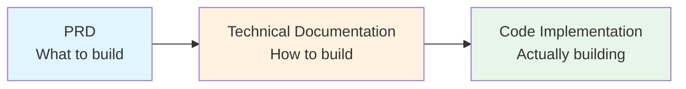
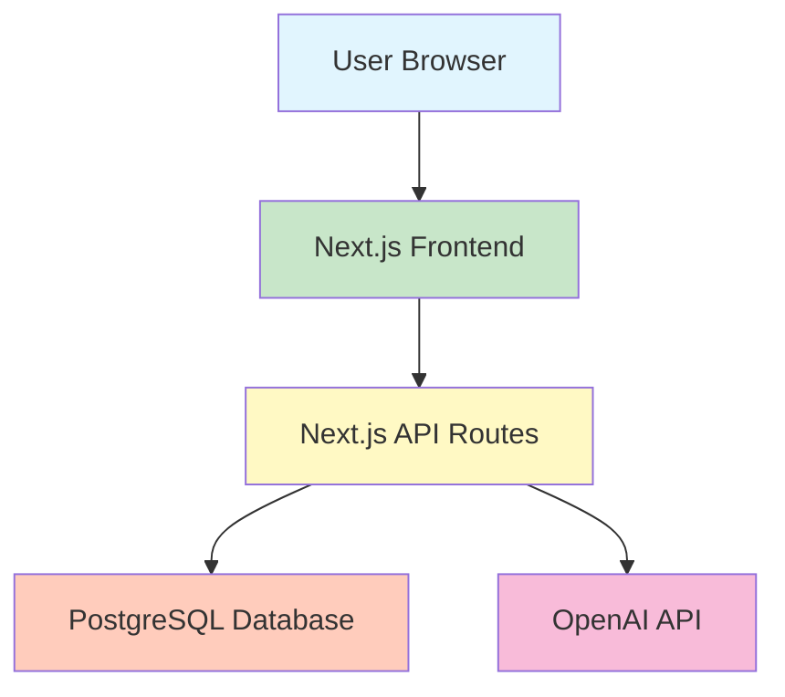
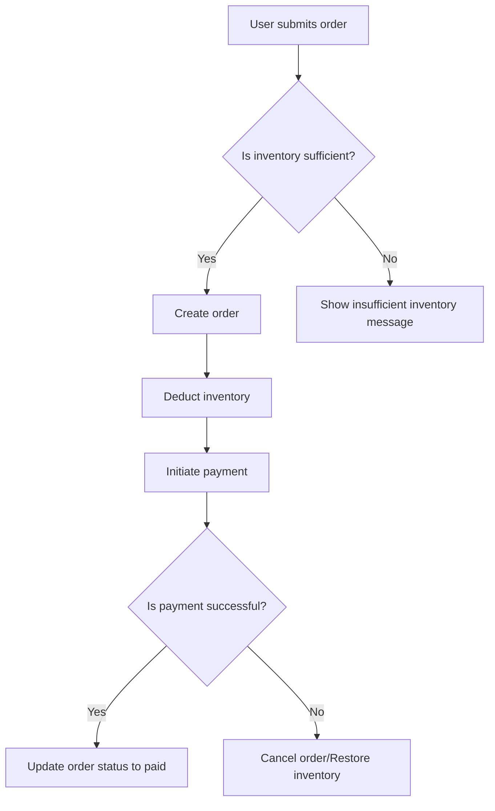

# 4.2 From PRD to Technical Documentation 🟢

> **After reading this section, you will:**
>
> - Understand the clear division of labor between PRDs and technical documentation
> - Master the five components of technical documentation
> - Learn to document technical decisions
> - Understand the value of documentation in AI-assisted development

> After iterating the PRD to its fifth draft and finalizing the product approach, beyond organizing business logic, you need to document the specific technical implementation plan—this is the technical documentation.

---

## Introduction

The PRD answers "what to build," but code doesn't grow directly from it. Before writing code, you need **technical documentation**—the bridge from PRD to code, and the "manual" that helps AI understand your system structure.

Complete technical documentation lets AI know:

- What data the system has and how it relates
- Which interfaces the frontend and backend use to communicate
- What components make up the system and how business processes flow
- Which external services it depends on

Without this context, AI can only guess, and the generated code often misses the mark.

---

## Division of Labor: PRD vs. Technical Documentation

The roles are clearly defined: PRD answers "what to do," technical documentation answers "how to do it."

### PRD (Product Requirements Document)

| Content | Description |
|---------|-------------|
| Target users | Who will use this product |
| Core features | What functionality the product needs |
| User interactions | How users complete operations |
| Edge cases | How to handle exceptional scenarios |
| Business processes | Complete user operation flows |

### Technical Documentation

| Content | Description |
|---------|-------------|
| Data models | Tables, fields, and relationships |
| API design | Interface list and responsibilities |
| Architecture/flow diagrams | System component relationships and business processes |
| Third-party integrations | External services and integration methods |
| Technical decisions | Selection rationale and key trade-offs |

### The Relationship Between Them



Every business entity in the PRD should have a corresponding entry in the data model; every feature point in the PRD should have a corresponding interface in the API design. This correspondence is the standard for checking the completeness of technical documentation.

---

## The Five Components of Technical Documentation

Technical documentation isn't template-filling—it's a record of your thinking process. The five components below cover the complete technical perspective from data to interfaces, from architecture to dependencies. They work together to form the contextual foundation for AI to understand your system.

### 1. Data Model

The data model is the technical mapping of PRD business concepts. It describes what data the system stores, the structure of that data, and the relationships between data.

**Why it's needed:**

- It's the foundational context for AI to generate database code
- It's the data contract for frontend-backend collaboration
- It determines system extensibility

**What to document:**

- What tables exist (corresponding to business entities in the PRD)
- Fields for each table (corresponding to entity attributes)
- Relationships between tables (one-to-many, many-to-many)

**Example:**

```markdown
## Data Model

### Users Table (users)
- id: Primary key
- email: Email (unique)
- name: Display name
- created_at: Creation timestamp

### Posts Table (posts)
- id: Primary key
- title: Title
- content: Content
- author_id: Author ID (foreign key, references users)
- created_at: Creation timestamp

Relationship: One user can have many posts (one-to-many)
```

<DataModelER />

When you view comments on Bilibili and click a commenter's avatar to jump to their profile page—the comment itself doesn't store all that person's information, only a user ID. The system follows this ID to look up the complete information in the users table. `author_id` is such a "foreign key": the posts table only records an author ID, and when needed, follows it to find the corresponding user.

::: tip ORM Schema as Documentation

ORM lets you define and operate databases using code rather than SQL statements. Schema is the "table template" written in code—specifying what each column is called and what data types it can hold. When using ORMs like Drizzle, the schema definition file itself serves as data model documentation, intuitively displaying table structures, field types, and table relationships, which AI can also accurately understand.

For specific database design and implementation, see Chapter 8.

:::

### 2. API Design

API design defines the interfaces your system provides externally—it's the contract for frontend-backend collaboration.

**Why it's needed:**

- It's the boundary for frontend-backend division of labor
- It's the basis for AI to generate interface code
- Clear API definitions reduce communication costs

**What to document:**

- Interface paths and HTTP methods
- Interface responsibilities (what it does)
- Request parameters and return values (brief description)

**Example:**

```markdown
## API Design

### Post-related
- GET /api/posts - Get post list
- GET /api/posts/:id - Get single post
- POST /api/posts - Create post (requires login)
- PATCH /api/posts/:id - Update post (requires owner)
- DELETE /api/posts/:id - Delete post (requires owner)

### Comment-related
- GET /api/posts/:id/comments - Get post comments
- POST /api/posts/:id/comments - Post comment (requires login)
```

::: tip Learn More

HTTP protocol details, RESTful conventions, and status code meanings are covered in detail in 4.4 API and HTTP Fundamentals.

:::

### 3. Architecture/Flow Diagrams

Architecture diagrams show system component relationships; flow diagrams show business logic flow.

**Why it's needed:**

- Helps AI quickly understand overall system structure
- Helps team members establish shared understanding
- Discovers omissions or contradictions in design

**Architecture diagram example:**



**Flow diagram example (user order process):**



::: tip Learn More

Frontend-backend separation architecture and how full-stack frameworks work are covered in detail in 4.5 Frontend-Backend Separation Concepts.

:::

### 4. Third-Party Integrations

Document external services your system depends on and how to integrate them.

**Why it's needed:**

- External services extend system capabilities
- Need to record key configurations and limitations (e.g., rate limits)
- Facilitates troubleshooting integration issues

**What to document:**

- Which external services are used
- What they're used for
- Key configuration items (environment variable names)
- Limitations like rate limiting, timeouts

**Example:**

```markdown
## Third-Party Integrations

### OpenAI API
- Purpose: AI conversation features
- Environment variable: OPENAI_API_KEY
- Limitation: 60 requests per minute

### Amap (Gaode Maps)
- Purpose: Location display
- Environment variable: AMAP_KEY
```

::: tip Learn More

Specific steps for API integration, error handling, and security practices are covered in detail in 4.7 API Integration in Practice.

:::

### 5. Technical Decision Records

Document key technology choices and decision rationale.

**Why it's needed:**

- Avoids revisiting the same issues later
- Helps new members understand why the system is designed this way
- Provides context for future refactoring or extension

**What to document:**

- Technology stack choices (connecting with 4.1 Technology Stack Decision Framework)
- Key trade-offs (e.g., Supabase vs. Neon)
- Rejected alternatives and reasons

**Example:**

```markdown
## Technical Decisions

### Stack: Next.js + PostgreSQL
- Rationale: Full-stack framework offers high development efficiency; AI understands Next.js best
- Alternative: Vite + Express (rejected: need to maintain two separate projects)

### Database Hosting: Neon
- Rationale: Lightweight, serverless architecture, works well with Drizzle
- Alternative: Supabase (rejected: don't need Auth and other additional features yet)
```

---

## The Value of Documentation in the AI Era

In the era of AI-assisted development, the value of technical documentation is amplified. In the past, documentation was primarily for humans—helping team members understand the system, or serving as notes for yourself. Now, it has another important reader: AI.

AI needs context to work accurately. When you tell it "help me write a user login feature," without documentation explaining what fields the users table has or what format the login interface returns, AI can only guess. Guessing means trial and error, and trial and error means wasted time.

Clear technical documentation is like providing AI with a "system manual." Knowing the data structure, it can generate code that fits your architecture; knowing the API specifications, it can write interfaces that frontend and backend can integrate with. The clearer the documentation, the less AI has to guess, and the higher the development efficiency.

::: tip Documentation is AI's Context

Technical documentation provides structured context, letting AI know "what technology to use," "what the data structure is," and "how interfaces are defined." Without documentation, AI can only reverse-engineer from code, which is less efficient and more error-prone.

:::

---

## Keeping Documentation and Code in Sync

Technical documentation is written, but the work isn't done. Documentation's biggest enemy is becoming outdated—specifications written today become "historical archives" when the code changes next week. Keeping documentation synchronized with code is the prerequisite for technical documentation to deliver value.

The trick to maintaining synchronization is "update on change": every time you modify code, ask yourself if this change affects descriptions in the documentation? If yes, update immediately. Once this habit is formed, the cost of maintaining documentation is far lower than dealing with problems caused by documentation inconsistency.

Consequences of documentation-code divergence:

- New members understand the architecture from documentation, only to find the code structure completely different
- AI generates code based on outdated API designs, causing integration failures
- Reviewing the project months later, confused by your own documentation

**Recommended practices:**

1. Document before coding — Documentation is a thinking process
2. Update on change — Synchronize documentation after code changes
3. Regular review — Check if documentation matches actual code

---

## Simplified Practice: Minimum Viable Documentation

For individuals or small teams, don't be constrained by form—you can merge PRD and technical documentation into **project documentation**. But clearly distinguish which parts are product-level thinking and which are technical-level decisions.

**Regardless of project size, these five components cannot be omitted:**

| Component | Why it cannot be omitted |
|-----------|--------------------------|
| Data model | AI needs to know what data to store |
| API design | Frontend and backend need to know how to communicate |
| Architecture/flow diagrams | AI needs to understand system structure and business logic |
| Third-party integrations | AI needs to know external dependencies and configurations |
| Technical decisions | AI needs to understand selection rationale to avoid going off track |

**What can be simplified:**

- Level of detail: Small projects can use tables instead of lengthy text
- Documentation format: Can use comments, README instead of standalone documents
- Diagram tools: Can use text descriptions instead of complex diagrams

**Simple organization:**

```markdown
# Project Documentation

## 1. Product Section
### 1.1 Background
### 1.2 Core Features
### 1.3 User Stories

## 2. Technical Section
### 2.1 Technology Stack
### 2.2 Data Model
### 2.3 API Design
### 2.4 Architecture Diagram
### 2.5 Third-Party Integrations
### 2.6 Deployment Plan
```

---

## Common Questions

### Q1: How detailed should documentation be?

Use "can AI understand it" as the standard. Data models should clarify tables and fields; APIs should list interfaces and responsibilities; architecture diagrams should show component relationships. Implementation details (like Drizzle syntax, HTTP status codes) don't need to be covered in 4.2—subsequent chapters will address them.

### Q2: Can AI generate technical documentation?

Yes. After the PRD is finalized, have AI generate a technical solution framework based on requirements, then review and supplement manually. The technical decisions section requires your personal confirmation, as it involves business understanding and trade-offs.

### Q3: What if code changes but I forget to update documentation?

Develop the habit of updating on change. Or let AI help: tell it "I changed the data model, help me update the technical documentation."

### Q4: Do architecture and flow diagrams require professional tools?

No. Text descriptions, ASCII art, or simple Mermaid syntax all work. The key is expressing system structure and business processes clearly.

---

## Key Takeaways

- ✅ PRD answers "what to build," technical documentation answers "how to build it"
- ✅ Five components of technical documentation: data model, API design, architecture/flow diagrams, third-party integrations, technical decisions
- ✅ The five components cannot be omitted, but level of detail can be simplified
- ✅ Keep documentation synchronized with code to avoid "outdated maps"
- ✅ Documentation is an important source of context for AI
- ✅ Implementation details are covered in subsequent chapters

Understanding the role and components of technical documentation, next we'll explore the basic building blocks of programming.

---

## Related Content

- Prerequisite: [3.3 PRD Writing in Practice](../03-prd-doc-driven/03-prd-template-guide.md)
- Prerequisite: [4.1 Technology Stack Decision Framework](./01-tech-stack-decision.md)
- Details: [4.3 How to Read AI-Generated Code](./03-programming-basics.md)
- Details: [4.4 API and HTTP Fundamentals](./04-api-and-http.md)
- Details: [4.5 Frontend-Backend Separation Concepts](./05-frontend-backend-separation.md)
- Details: [4.6 Configuration File Formats](./06-config-formats.md)
- Details: [4.7 API Integration in Practice](./07-api-integration.md)