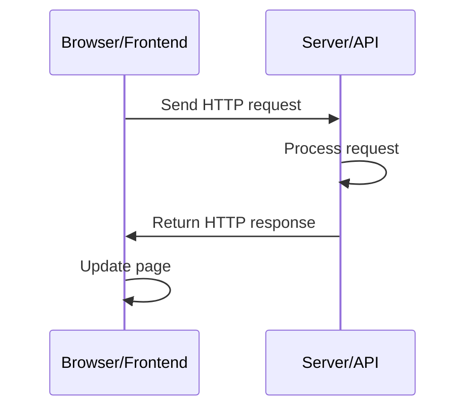
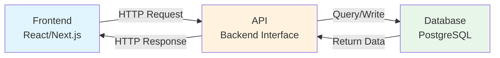

# 4.4 API and HTTP Fundamentals 🟢

> **After reading this section, you will gain:**
>
> - An understanding of the concept and role of APIs
> - A grasp of the basic principles of the HTTP protocol
> - The ability to understand the structure of HTTP requests and responses
> - An understanding of the meaning of common HTTP status codes
> - A basic understanding of the frontend-backend interaction flow

> The HTTP protocol is the "language" of frontend-backend communication. Understanding how it works will help you troubleshoot issues faster.

---

## Introduction

In the previous section, you learned how to understand the basic logic of code. But a complete application is more than just local code—it needs to communicate with servers to fetch data and submit actions. This communication is handled through **APIs** and the **HTTP protocol**.

Understanding how HTTP works will help you describe requirements more accurately when collaborating with AI, and it will also give you the ability to troubleshoot when problems occur.

---

## What Is an API

**API (Application Programming Interface)** is an agreement that allows different software systems to communicate with each other.

In Web development, API usually refers to a **Web API** or **HTTP API**, meaning an interface that communicates over the HTTP protocol. The frontend calls backend APIs to fetch data or submit actions.

::: tip APIs Are Like Functions

Do you remember the functions we covered in the previous section? An API is essentially a **remote function**.

- **Function**: Defined in code, accepts parameters, returns a result
- **API**: Defined on a server, accepts an HTTP request (parameters), returns an HTTP response (result)

Calling an API is like calling a function:

- Function call: `calculatePrice(100, 2)` → returns `200`
- API call: `GET /api/price?unit=100&quantity=2` → returns `{ "total": 200 }`

The only difference is: functions run locally, while APIs run on remote servers.
:::

::: tip API Restaurant Analogy

Think of an API as a restaurant menu:

- The frontend is the customer
- The backend is the kitchen
- The API is the menu—it tells the customer what can be ordered and what each dish is called
- The HTTP request is the waiter—taking the customer's order to the kitchen and bringing the dish back

:::

---

## HTTP Communication Flow

<HttpRequestFlow />

HTTP communication is based on a **request-response** model. You can think of an HTTP request as an envelope sent to a distant place: the recipient address (URL) is written on the envelope, inside is the message you want to send (request body), and there are also labels describing the nature of the letter (Headers). After the server receives the letter, it opens and reads it, writes a reply (response), and sends it back to you.

This analogy helps explain the essence of HTTP: it is a **text-based protocol**, where all information is transmitted in human-readable text form. When you open the Network panel in your browser's developer tools and see those request records, you're really looking at a detailed list of these "envelopes."



1. The frontend sends an HTTP request
2. The server receives and processes the request
3. The server returns an HTTP response
4. The frontend updates the page based on the response

---

## Components of an HTTP Request

A complete HTTP request contains four core parts:

### Request Method

This tells the server what kind of action you want to perform:

| Method | Purpose | Example |
|------|------|------|
| **GET** | Read data | Fetch a list of articles |
| **POST** | Create data | Submit a registration form |
| **PUT/PATCH** | Update data | Update a user profile |
| **DELETE** | Delete data | Delete an article |

### URL (Path)

Specifies the address of the resource to operate on:

```
https://api.example.com/users/123
│       │                │      │
│       │                │      └── User ID
│       │                └── Resource path
│       └── Domain name
└── Protocol
```

### Headers

Carries metadata such as authentication and data format:

| Common Header | Description |
|------------|------|
| Authorization | Authentication token |
| Content-Type | Data format of the request body |
| Accept | Expected data format of the response |

### Body

The actual data being sent, usually in JSON format:

```json
{
  "title": "文章标题",
  "content": "文章内容"
}
```

---

## Components of an HTTP Response

An HTTP response also contains multiple parts:

### Status Code

A three-digit number that indicates the result of processing the request. Status codes follow a simple pattern: the first digit indicates the category of the response, and the last two digits indicate the specific details. This design means that even if you see an unfamiliar status code, you can still infer the general situation from the first digit.

| Status Code | Meaning | Common Scenario |
|--------|------|---------|
| **200 OK** | Success | The request completed successfully |
| **201 Created** | Created | POST successfully created a resource |
| **204 No Content** | No content | DELETE succeeded |
| **400 Bad Request** | Bad request | Invalid parameter format |
| **401 Unauthorized** | Unauthorized | Missing or invalid token |
| **403 Forbidden** | Forbidden | Has a token but lacks permission |
| **404 Not Found** | Not found | Resource does not exist |
| **429 Too Many Requests** | Too many requests | Rate limit triggered |
| **500 Internal Server Error** | Server error | Internal server failure |

::: tip Quick Status Code Reference

- **2xx**: Success
- **4xx**: Client-side issue (there is something wrong with the request you sent)
- **5xx**: Server-side issue (the backend failed)

:::

<StatusCodeExplorer />

### Headers (Response Headers)

Contains metadata about the response:

| Common Header | Description |
|------------|------|
| Content-Type | Data format of the response body |
| Content-Length | Byte length of the response body |

### Body (Response Body)

The data returned by the server:

```json
{
  "id": "123",
  "title": "文章标题",
  "content": "文章内容",
  "createdAt": "2025-01-28T10:00:00Z"
}
```

---

## Complete Example: Updating a User Nickname

Below is a complete example of an HTTP request and response:

**Request:**

```http
PATCH /api/users/123 HTTP/1.1
Host: api.example.com
Authorization: Bearer your_token_here
Content-Type: application/json

{
  "nickname": "新昵称"
}
```

**Response:**

```http
HTTP/1.1 200 OK
Content-Type: application/json

{
  "id": "123",
  "nickname": "新昵称",
  "updatedAt": "2025-01-28T10:00:00Z"
}
```

---

## Common Troubleshooting

Understanding the structure of HTTP can help you quickly pinpoint issues:

| Issue | Possible Cause | How to Check |
|---------|---------|---------|
| 401 Unauthorized | Token is invalid or expired | Check the Authorization header |
| 404 Not Found | Incorrect URL path | Check whether the request path is correct |
| Incorrect data display | Field names do not match | Check whether the response format matches the frontend code |
| 429 Too Many Requests | Rate limit triggered | Reduce request frequency or add retry logic |
| Network error | Server is not responding or network is unavailable | Check network connectivity and server status |

### Data Format Mismatch

Even if the status code is 200 OK, data format issues can still cause code to fail:

- Inconsistent field names: the backend returns `userName`, while the frontend uses `username`
- Inconsistent types: the backend returns the string `"123"`, while the frontend expects the number `123`
- Inconsistent structure: the backend returns an array, while the frontend expects an object

AI knows how to handle format conversion and field mapping. When you run into this kind of issue, just tell it "the data formats don't match."

Understanding the text-based nature of HTTP is very helpful for debugging. When you inspect a request in your browser's developer tools, the Headers, Status Code, and Response Body you see are all parts of the HTTP protocol. They are transmitted across the network as plain text, just organized by the browser into a more readable format. If you use a command-line tool like curl, you will see their raw form—plain text lines, each separated by line breaks, with a blank line between Headers and the Body. This transparency means you can precisely see every bit of information exchanged between the frontend and backend—there is no black box.

---

## JSON Data Format

JSON (JavaScript Object Notation) is the most commonly used data format for Web APIs.

**Characteristics of JSON**:

- Uses curly braces `{}` to represent objects
- Uses square brackets `[]` to represent arrays
- Organizes data as "key: value" pairs
- Keys must be wrapped in double quotes

**Example**:

```json
{
  "users": [
    {
      "id": "1",
      "name": "张三",
      "email": "zhang@example.com"
    },
    {
      "id": "2",
      "name": "李四",
      "email": "li@example.com"
    }
  ],
  "total": 2,
  "page": 1
}
```

::: tip JSON Is a Universal Language

JSON is the "common language" between different programming languages. Python, JavaScript, Java, Go, and others can all easily parse and generate JSON, which is why it has become the standard data format for Web APIs.

:::

---

## Frontend-Backend Interaction Diagram



---

## Frequently Asked Questions

### Q1: Do I need to memorize all HTTP status codes?

No. It's enough to remember the most common ones (200, 401, 404, 500). You can look up the others when needed.

### Q2: What's the difference between GET and POST?

GET is used to read data, and its parameters are usually placed in the URL; POST is used to create data, and its parameters are placed in the Body. GET can be cached, while POST cannot.

### Q3: How do I test an API?

You can use the following tools:

- Browser developer tools (Network panel)
- API testing tools like Postman or Insomnia
- The command-line tool curl
- Ask AI to write test code


### Q4: What's the difference between HTTPS and HTTP?

HTTPS is encrypted HTTP. Data is encrypted during transmission, making it more secure. Modern websites should all use HTTPS.

---

## Key Takeaways

- ✅ APIs are the interface for frontend-backend communication
- ✅ HTTP is based on the "request-response" model
- ✅ An HTTP request includes: method, URL, Headers, Body
- ✅ An HTTP response includes: status code, Headers, Body
- ✅ 2xx = success, 4xx = client error, 5xx = server error
- ✅ JSON is the standard data format for Web APIs
- ✅ Understanding HTTP structure helps you quickly identify issues

Now that you understand the basics of HTTP communication, the next step is to learn the concept of frontend-backend separation.

---

## Related Content

- Prerequisite: [1.3 Browser and Server Fundamentals](../01-environment-setup/03-browser-server.md)
- Prerequisite: [4.3 How to Read AI-Generated Code](./03-programming-basics.md)
- See also: [4.5 Frontend-Backend Separation Concepts](./05-frontend-backend-separation.md)