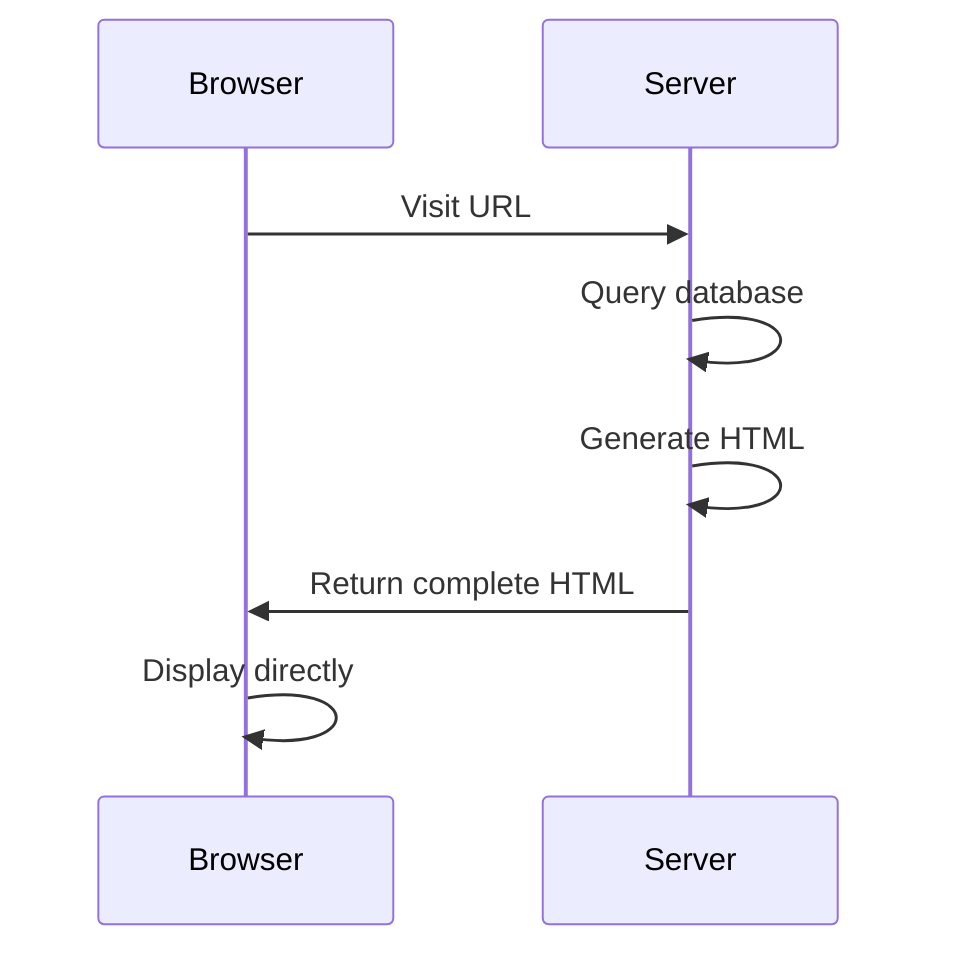
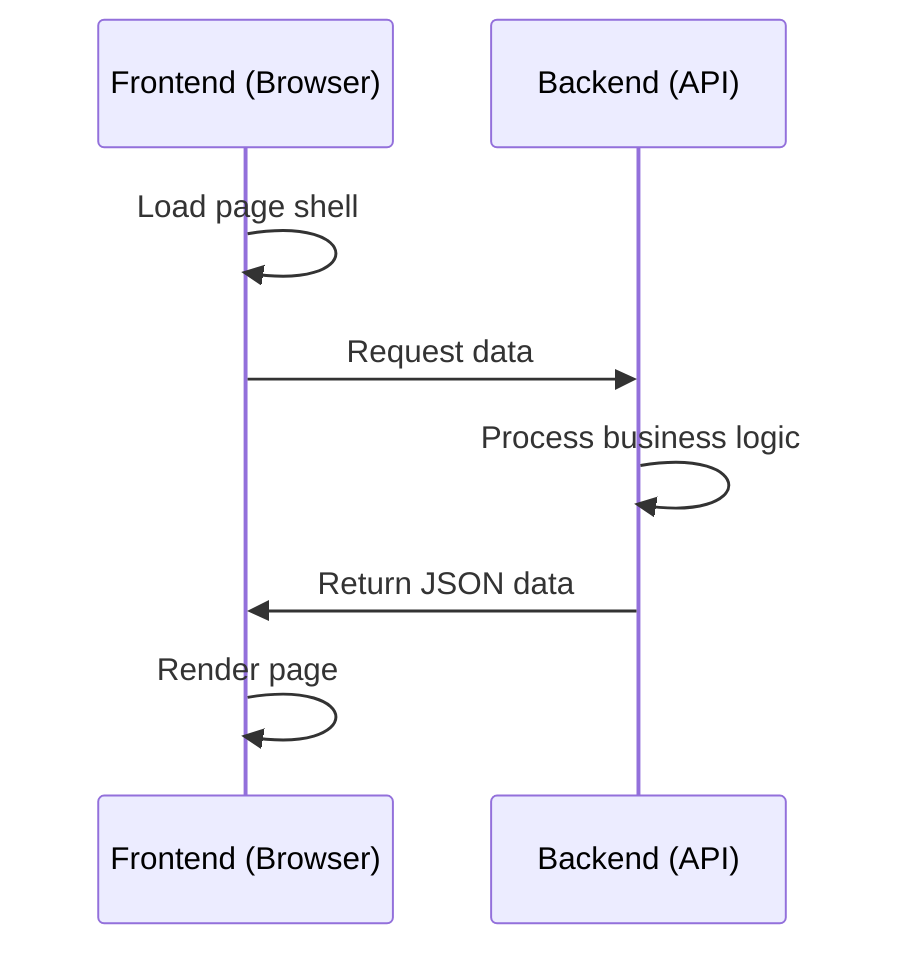
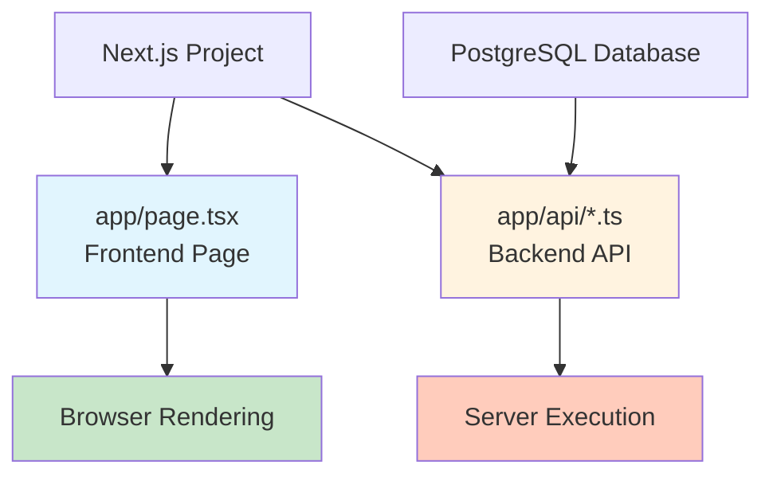
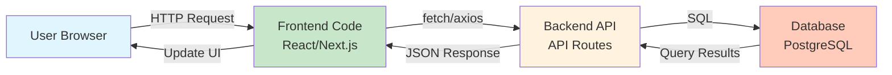

# 4.5 Frontend-Backend Separation Concepts 🟢

> **After reading this section, you will gain:**
>
> - An understanding of the division of responsibilities between the frontend and backend
> - Mastery of the frontend-backend separation architecture pattern
> - Insight into how full-stack frameworks simplify development
> - An understanding of the importance of modular thinking

> The frontend is responsible for "presentation," while the backend is responsible for "processing," and the two communicate through APIs.

---

## Responsibilities of the Frontend and Backend

### Frontend

The frontend runs in the user's browser and is responsible for everything the user sees and interacts with:

| Responsibility | Description |
|------|------|
| Page rendering | Converts HTML and CSS into a visual interface |
| User interaction | Responds to user actions such as clicks and input |
| Data display | Displays data returned by the backend to the user |
| Data collection | Collects user input and sends it to the backend |

### Backend

The backend runs on the server and is responsible for the business logic users do not see:

| Responsibility | Description |
|------|------|
| Business logic | Handles core business rules |
| Data storage | Interacts with the database to store and query data |
| Authentication | Verifies user identity and permissions |
| External services | Calls third-party APIs |

This division of labor between the frontend and backend has historical roots. In early Web development, the server directly generated complete HTML pages and sent them to the browser, and the browser was only responsible for display. As JavaScript became more powerful and AJAX emerged (allowing the browser to quietly request data from the server in the background without refreshing the entire page), the browser began taking on more rendering work, while the backend focused on providing data. This evolution transformed Web experiences from "pages" into "applications"—bringing them closer to native software, with smoother interactions and more powerful functionality. Understanding this evolution helps you grasp the essence of frontend-backend separation: it is not a specific technical choice, but an architectural idea that lets each side focus on what it does best.

---

## Traditional Pattern vs Frontend-Backend Separation

<FrontendBackendArchitecture />

### Traditional Pattern (Server-Side Rendering)

In the early days of the Web, the server directly generated complete HTML pages and sent them to the browser:



Characteristics of this pattern:

- The server generates complete HTML
- The browser is only responsible for display
- Page switches require reloading
- Frontend and backend code are tightly coupled

### Frontend-Backend Separation Pattern

Modern Web applications use a frontend-backend separation architecture:



Characteristics of this pattern:

- The frontend is responsible for page rendering
- The backend only provides data APIs
- Communication uses JSON format
- Frontend and backend can be developed and deployed independently

---

## Advantages of Frontend-Backend Separation

| Advantage | Description |
|------|------|
| **Clear responsibilities** | The frontend focuses on presentation, the backend focuses on logic |
| **Independent development** | Frontend and backend can be developed in parallel without blocking each other |
| **Technology decoupling** | Frontend and backend can use different tech stacks |
| **High reusability** | The same set of APIs can serve Web, App, and other clients |
| **Better experience** | Page switches do not require reloading, making interactions smoother |

---

## The Rise of Full-Stack Frameworks

As the JavaScript ecosystem has evolved, **full-stack frameworks** such as Next.js have emerged. These frameworks allow both frontend and backend code to live in the same project and be written in the same language (TypeScript), while the division of responsibilities remains unchanged:



Advantages of full-stack frameworks:

- **Unified language**: Both frontend and backend use TypeScript
- **Shared types**: Frontend and backend can share type definitions
- **Simplified deployment**: One project contains both frontend and backend
- **Development efficiency**: Reduces context switching

::: tip Next.js Full-Stack Capabilities

Next.js API Routes let you write backend code in the same project. This code runs on the server, where it can safely access databases and call external APIs, while frontend code runs in the browser and is responsible for presentation and interaction.

:::

---

## Modular Thinking

Whether or not you use a full-stack framework, you should maintain modular thinking: split functionality into different modules instead of cramming all the code into a single file.

The value of modular thinking lies in reducing cognitive complexity. When a project has only a few hundred lines of code, putting everything in one file may not seem like a problem. But as features grow, the codebase can quickly expand to thousands or even tens of thousands of lines. Without clear module boundaries, understanding and maintaining the code becomes extremely difficult—you have to search through large amounts of unrelated code to find what you need, and every change risks affecting other parts. At its core, modularization is a "divide and conquer" strategy: break a big problem into smaller ones, let each independent module solve one small problem, and have modules interact through clear interfaces. This not only makes code easier to understand, but also helps AI locate and work with specific functionality more accurately.

### Typical Module Breakdown

```
src/
├── app/              # Next.js App Router
│   ├── page.tsx      # Frontend page
│   └── api/          # API routes
│       ├── auth/     # Authentication-related
│       ├── posts/    # Post-related
│       └── users/    # User-related
├── components/       # Reusable components
├── lib/             # Utility functions
└── db/              # Database-related
```

### Benefits of Modularity

| Benefit | Description |
|------|------|
| Easy maintenance | Each module has a single responsibility, so changes have limited impact |
| Easy to understand | A clear directory structure makes the project more readable |
| Easy to test | Small modules are easier to write unit tests for |
| Team collaboration | Different people can work on different modules |
| AI-friendly | AI can locate relevant code more quickly |

---

## Frontend-Backend Communication Overview



---

## Client Side and Server Side

Understanding where code runs is the key to building full-stack applications well:

| Code location | Execution environment | What it can access |
|---------|---------|-----------|
| **Client-side code** | Browser | Page DOM, user device (limited), Cookie |
| **Server-side code** | Server | File system, database, all network requests, environment variables |

**Client-side**: The user's browser. Frontend code runs here and is responsible for rendering the interface and handling user interactions. However, the client cannot directly access the database or sensitive information.

**Server-side**: A remote server. Backend code runs here and can safely access databases, call external APIs, and handle sensitive information. Users cannot see server-side code.

This separation is the foundation of Web security—you cannot put a database password in client-side code, because anyone can view the browser's source code.

---

## The Concept of Template Rendering

In traditional server-side rendering (such as Flask and Django), a **template engine** is a technique for generating HTML on the server side. When you look at personal profile pages on Weibo or GitHub, every page has the exact same layout, but the avatar, username, and content are different—this is the effect of a template engine: define the page skeleton, leave placeholders for data, and fill in different content for different users:

```
Server side: template + data → render → complete HTML → send to browser
```

Templates usually include:

- Static HTML structure
- Placeholders (such as `{{ username }}`) for inserting dynamic data
- Simple logic (such as loops and conditionals)

**React vs templates**:

- **Traditional templates** (such as Jinja2): Rendered on the server side, generating complete HTML before sending it to the browser
- **React components**: Rendered on the client side (or server side), dynamically updating the interface through JavaScript

Next.js combines both patterns:

- **Server Components**: Similar to traditional templates, rendered on the server and able to access the database
- **Client Components**: Similar to React applications, run in the browser and handle interactions

When you open a news article, the text and images appear almost instantly—this part was pre-rendered on the server by Server Components. Meanwhile, the "Like" button, comment input box, and share menu on the page need to respond to your clicks and input—these are Client Components running in your browser.

---

## Determining Where Code Belongs

When writing code, you should be clear about where it runs:

| Code location | Execution environment | What it can access |
|---------|---------|-----------|
| **Frontend code** | Browser | Page DOM, user device (limited) |
| **Backend code** | Server | File system, database, all network requests |
| **API routes** | Server | Server resources, database |
| **Server Components** | Server | Database, file system |

::: tip Next.js Specifics

Next.js Server Components are rendered on the server and can safely access the database. Client Components run in the browser and can only communicate with the backend through APIs.

:::

---

## Frequently Asked Questions

### Q1: Are full-stack frameworks and frontend-backend separation contradictory?

No. A full-stack framework is a development approach, while frontend-backend separation is an architectural pattern. Full-stack frameworks place frontend and backend code in the same project, but their responsibilities are still separate.

### Q2: When do you need frontend-backend separation?

It is more valuable when multiple people are collaborating, when you need to support multiple clients (Web + App), or when the frontend and backend tech stacks differ significantly. For personal projects, using a full-stack framework is more efficient.

### Q3: How granular should module splitting be?

Use the principle of "single responsibility." A module should handle one functional area—for example, the `auth` module should only handle authentication, and the `posts` module should only handle posts. Avoid making modules too fine-grained (only a few lines per file) or too coarse-grained (one file containing all functionality).

### Q4: How do you decide whether code should go in the frontend or backend?

Code that needs to access the database, call external APIs, or handle sensitive information must go in the backend. Code for pure UI rendering and user interaction belongs in the frontend. If you are unsure, prefer putting it in the backend—it is safer.

---

## Key Takeaways

- ✅ The frontend is responsible for presentation, and the backend is responsible for processing
- ✅ Frontend-backend separation improves development efficiency and code reusability
- ✅ Full-stack frameworks let frontend and backend use the same language, but their responsibilities stay the same
- ✅ Modular thinking is the key to long-term project maintainability
- ✅ Knowing where code executes is a prerequisite for building full-stack applications well

Now that you understand frontend-backend separation, the next step is to learn how to integrate external APIs.

---

## Related Content

- Prerequisite: [1.3 Browser and Server Basics](../01-environment-setup/03-browser-server.md)
- Prerequisite: [4.4 API and HTTP Basics](./04-api-and-http.md)
- See also: [4.6 Configuration File Formats](./06-config-formats.md)