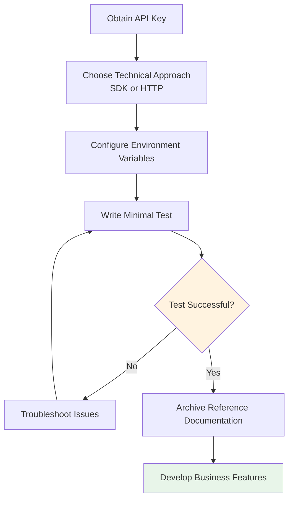

# 4.7 API Integration in Practice 🟢

> **After reading this section, you will learn:**
>
> - The complete API integration workflow
> - The difference between SDKs and direct HTTP requests
> - How to securely manage API keys
> - Common error handling techniques
> - Rate limiting and timeout strategies

> Integrating external APIs is a common way to extend your application's capabilities, such as adding AI features or map services.

---

## API Integration Overview

One of the beautiful things about modern software development is that you don't have to build everything from scratch. Whatever you want to do—have AI conversations, display maps, process payments—there are existing services willing to do the heavy lifting for you. You just need to talk to them through an **API**.

API (Application Programming Interface) is the language that applications use to communicate with each other. In the past, two pieces of software "talking" to each other required complex protocols and specialized integration development. Now, most services provide standardized APIs. You simply send requests in their agreed-upon format and get the results you want.

### Why Are APIs So Important?

Imagine you want to build a travel app. You need to mark attractions on a map, display local weather, and process user payments. Before APIs existed, you'd have to build your own map servers, hire meteorologists, and integrate with banking systems. Now? Call a map service API, call a weather service API, call a payment service API—you just focus on your core business logic and leave the rest to the professionals.

This isn't just about efficiency; it's about possibility. APIs enable individual developers to build products that only large companies could create before. You can combine data and capabilities from different services like building blocks, creating something entirely new.

### Asynchronous Communication and Data Formats

Modern web applications use **AJAX** (Asynchronous JavaScript and XML) to exchange data with servers—when you search for products on Taobao, the page doesn't fully refresh; search results appear directly below. This is AJAX at work. After a user action, JavaScript sends requests in the background, the server returns data, and the page updates partially without refreshing. This asynchronous approach makes interactions smoother.

APIs typically return data in **JSON** format (see 4.6 Configuration File Formats). JSON is pure data structure that any programming language can parse, and the frontend can flexibly render it into any style.

### Common API Capabilities

The modern API ecosystem is already very rich, from basic data storage to cutting-edge AI multimodal capabilities, with mature services available:

| Capability Type | International Leaders | Domestic Leaders | Use Cases |
|-----------------|----------------------|------------------|-----------|
| **AI Chat** | GPT, Claude, Gemini | Tongyi Qianwen, Wenxin Yiyan, Doubao, Kimi, DeepSeek | Chatbots, content generation |
| **AI Image Generation** | DALL-E, Midjourney, Stable Diffusion | Tongyi Wanxiang, Wenxin Yige, Jimeng | Product design, marketing assets |
| **AI Video Generation** | Sora, Runway, Pika, Kling | Keling, Hailuo AI, Doubao Seedance | Short videos, ad production |
| **AI Music Generation** | Suno, Udio | Doubao Music, Tiangong Music | Soundtrack creation, sound effects |
| **Speech Recognition/Synthesis** | Whisper, ElevenLabs | iFlytek Speech, Doubao Speech, MiniMax Hailuo Speech | Voice input, AI dubbing |
| **Code Generation** | GitHub Copilot, Cursor | Tongyi Lingma, Wenxin Kuaima, CodeGeeX | Code completion, auto-programming |
| **Map Services** | Google Maps, Mapbox | Amap, Baidu Maps, Tencent Maps | Location marking, route planning |
| **Payment** | Stripe, PayPal | Alipay, WeChat Pay | Online payments, subscription management |
| **Data Storage** | AWS S3, Cloudflare R2 | Alibaba Cloud OSS, Tencent Cloud COS, Qiniu Cloud | File uploads, data backup |
| **SMS/Email** | Twilio, SendGrid | Alibaba Cloud SMS, SendCloud | Verification codes, notifications |

---

## The Six-Step API Integration Process

<ApiIntegrationFlow />

### Step 1: Obtain Credentials

Just like you need an ID to check into a hotel, using an API requires proving your identity. This proof of identity is your **API Key**.

The process of obtaining an API Key is usually straightforward:

1. Find the official developer platform or documentation
2. Register a developer account
3. Create an application or project (fill in some basic information)
4. Generate an API Key


::: warning Security First

An API Key is like your bank card password—once leaked, others can impersonate you to use the service and even exhaust your quota. So:

- **Don't** commit it to Git repositories
- **Don't** write it in frontend code (users can see it)
- **Don't** publish it in public places

:::

### Step 2: Choose Your Technical Approach

Once you have your API Key, you need to decide how to call the API. There are two approaches: **SDK** and **Direct HTTP Request**.

| Approach | Pros | Cons | Best For |
|----------|------|------|----------|
| **SDK** | Officially packaged, complete types, comprehensive docs | Requires installing dependencies | Most cases |
| **HTTP Request** | No dependencies, lightweight | Requires manual protocol handling | Simple calls or when no SDK available |

**What is an SDK?**

SDK (Software Development Kit) is an officially provided wrapper library. It packages all the low-level operations you'd otherwise handle manually (like HTTP requests, JSON serialization, error handling, timeout retries, etc.) into simple function calls. You just call a method like `generateText()`, and the SDK handles all the complex network interactions internally.

::: tip Why Prioritize SDKs?

Official SDKs come with complete TypeScript type definitions. This is like providing AI with a detailed "code map"—it can accurately know what features are available, how to fill parameters, and what the return values are. This is more precise than having AI infer parameters and return values solely from HTTP documentation.

:::

For AI applications, we recommend the **Vercel AI SDK**. It provides the `@ai-sdk/openai-compatible` package specifically for connecting to services that implement the OpenAI API format. Since OpenAI's API design has become the industry de facto standard, most model service providers (including domestic ones) choose to be compatible with its interface format—maintaining consistency in request structure, response fields, and authentication methods. This means developers only need to learn one API specification, then modify `baseURL`, API Key, and model name to call mainstream large models globally, without learning different SDKs for each model.

### Step 3: Configure Environment Variables

You have your API Key, and now you need to store it securely in your code. Writing the Key directly in your code is a big no-no—anyone who can see the code can take it.

The correct approach is to use **environment variables**:

```bash
# .env file
AI_API_KEY=sk-xxx                   # API key
AI_BASE_URL=https://api.openai.com/v1  # API base URL
AI_MODEL=your-model-name             # Model name (e.g., gpt-4o-mini, glm-4-plus, etc.)
```

Environment variables act like a "firewall" between your code and your secrets:

- The program automatically reads configuration at runtime
- The `.env` file is not committed to Git
- Different environments use different keys

::: tip The .env File

In Next.js projects, the `.env.local` file stores environment variables for local development. When deploying to production, configure the same environment variables in your deployment platform's settings.

:::


### Step 4: Write a Minimal Test

After configuring the SDK and API Key, you might be eager to start writing business features. But wait—write the simplest test first.

Why? Because if you jump straight into complex features and something goes wrong, you won't know if it's a configuration error, invalid Key, or code logic issue. A minimal test only needs to verify one thing: **Can I connect to the API?**

This test code only needs to do one thing: make one API call and see if you get a response. If it succeeds, your configuration is correct and you can continue developing. If it fails, AI can help you quickly locate the problem based on the error message.

After configuring the SDK and API Key, **don't rush to write business features**—write the simplest test first:

```typescript
// Test API connection
import { createOpenAICompatible } from '@ai-sdk/openai-compatible';
import { generateText } from 'ai';

// Create client instance
const client = createOpenAICompatible({
  name: 'my-provider',
  apiKey: process.env.AI_API_KEY,
  baseURL: process.env.AI_BASE_URL,
});

async function testConnection() {
  const { text } = await generateText({
    model: client.chatModel(process.env.AI_MODEL!),  // Read model name from environment variable
    prompt: 'Hello, please reply "Connection successful"',
  });

  console.log(text);
}

testConnection();
```

**Testing Checklist**:

- Use `createOpenAICompatible` to create a client, passing in `apiKey` and `baseURL`
- Use `generateText` to send a simple test message
- Fill in the model name in `chatModel()` (read from environment variable or hardcode)
- If you receive a response, the configuration is correct

If the test succeeds, it means:

- The API Key is valid
- Network connection is normal
- SDK configuration is correct

If the test fails, AI will help you troubleshoot based on the error message:

- Wrong Key?
- Network unreachable?
- SDK version conflict?
- Quota exhausted?

### Step 5: Archive Reference Documentation

Once the test passes, don't rush to continue development. First, save the API's official documentation for future reference.

Why? Because next time you ask AI to write related features, if you feed it the official documentation directly, it can generate precise calling code. Otherwise, you might need to repeatedly explain various parameters and details.

**Recommended Practices**:

1. **Save official documentation**: Save key pages of official documentation as Markdown files (you can use browser extensions like "MarkDownload" or copy manually)
2. **Extract common code**: Organize the most frequently used calling examples into a cheat sheet

**Suggested Documentation Location**:

```
docs/
├── api-references/
│   ├── openai-api.md          # Official documentation archive
│   ├── aliyun-qwen-api.md     # Official documentation archive
│   └── my-cheatsheet.md       # Personal cheat sheet
```

**Cheat Sheet Example** (`my-cheatsheet.md`):

```markdown
# API Cheat Sheet

## Environment Variables
- AI_API_KEY
- AI_BASE_URL
- AI_MODEL

## Official Documentation Links
- [OpenAI API](https://platform.openai.com/docs)
- [Alibaba Cloud Tongyi Qianwen](https://help.aliyun.com/zh/model-studio/)
```

::: tip Why Save Official Documentation?

Official documentation contains complete parameter descriptions, error code definitions, usage limits, and more. Rewriting it yourself is prone to missing details; saving the original is most reliable. When you need AI to help write code, provide these documents as context, and the generated code will be more accurate.

:::

### Step 6: Develop Business Features

With the foundation laid, you can now start writing business features. Tell AI what functionality you want to implement, provide it with the API documentation you just archived, and it can write accurate calling code.

::: tip Avoid Frequent Calls

Don't call APIs frequently in loops:

- It consumes API quota
- It's prone to triggering rate limits
- Response speed is slow

Use caching appropriately; identical data can be stored and reused.

:::

---

## Common Error Handling

### Rate Limiting

Most APIs have call frequency limits; exceeding them returns `429 Too Many Requests`.

**Handling Methods**:

- Add retry logic (wait a while before trying again)
- Use queues to control request frequency
- Analyze whether call logic can be optimized

### Timeout Handling

If an API doesn't respond for a long time, your program will hang.

**Handling Methods**:

- Set timeout durations
- Add fallback logic after timeouts
- Display user-friendly error messages

### Authentication Failure

Expired or invalid API Keys return `401 Unauthorized`.

**Handling Methods**:

- Check if the API Key is correct
- Confirm the Key hasn't expired
- Check if there's sufficient call quota

---

## API Integration Flowchart



---

## Security Best Practices

| Practice | Description |
|----------|-------------|
| Use environment variables | API Keys not written in code |
| .gitignore exclusion | Ensure .env files aren't committed |
| Backend proxy | Sensitive API calls go through backend |
| Principle of least privilege | Only give APIs necessary permissions |
| Regular rotation | Periodically change API Keys |

::: tip Frontend Cannot Directly Call Sensitive APIs

When you order food through a mini program, the app doesn't send the merchant backend password to your phone—your order first goes to the mini program's own server, which then uses the key to connect with the merchant system. This is how "backend proxy" works.

Don't directly call APIs requiring API Keys from frontend code. The API Key will be visible to everyone and may be abused.

Correct approach: Backend receives frontend requests, backend uses API Key to call external APIs, then returns results to frontend.

:::

<ProxyArchitecture />

---

## Risks of API Dependencies

Using external APIs is indeed convenient, but there's an important risk you need to know: **don't over-rely on a single API**.

**Services may shut down or raise prices.** Companies providing APIs may stop services, change pricing strategies, or significantly reduce free quotas at any time. If your business is entirely built on one API, once that API disappears, your application may collapse with it.

**APIs may change.** Even if the service continues, the API interface itself may change. Today it returns `user_name`, tomorrow it might become `userName`. Such seemingly minor changes can cause your application to crash.

**Mitigation Strategies**:

- **Keep alternatives**: If possible, know what similar APIs are available
- **Abstract encapsulation**: Wrap API calls into your own functions (like switching payment methods in an app—from WeChat Pay to Alipay, the checkout flow stays the same, only the underlying payment channel changes), so even if you switch APIs, you only modify one place
- **Cache important data**: Don't request the API every time; store results to reduce dependency
- **Monitor API health**: Regularly check if APIs are responding normally

---

## FAQ

### Q1: What if my free API quota runs out?

Most API providers have paid plans. Evaluate your project's usage and choose an appropriate package. If it's just for learning, you can apply for educational or developer discounts.

### Q2: How can I test APIs without consuming quota?

Use mock data or test environments. Many API providers offer test modes that return fake data without charging.

### Q3: What if there's an SDK version conflict?

Use AI to help resolve it. Tell it the specific error message and dependency versions, and it will provide compatible version combinations or alternative solutions.

### Q4: How do I manage API Keys across multiple environments (dev/production)?

Use different environment variable files. Next.js supports multi-environment configurations like `.env.local` (local) and `.env.production` (production).

### Q5: Should I choose domestic or international APIs?

Based on your user base and business needs:

- **Serving domestic users**: Prioritize domestic APIs for lower network latency and better compliance
- **Serving international users**: Choose international APIs for better global node coverage
- **AI capabilities**: Domestic and international options each have advantages; compare results and prices
- **Storage/SMS and other basic services**: Domestic providers are usually cheaper and more responsive

### Q6: Are domestic large model APIs compatible with OpenAI format?

Yes, most domestic large model APIs provide OpenAI-compatible mode. When using compatible mode, you only need to modify `baseURL`, API Key, and model name; other code basically stays the same. For specific configurations, please refer to each provider's official documentation.

---

## Key Takeaways

- ✅ API integration follows six steps: obtain credentials → choose approach → configure variables → test → archive → develop
- ✅ Prioritize official SDKs; type definitions make AI more accurate
- ✅ API Keys must be stored in environment variables
- ✅ Write minimal tests first; develop business features after verification
- ✅ Pay attention to common errors like rate limiting, timeouts, and authentication failures
- ✅ Sensitive APIs must be called through backend, never exposed in frontend

After understanding API integration, next we'll learn how to write project documentation.

---

## Related Content

- Prerequisite: [4.4 API and HTTP Basics](./04-api-and-http.md)
- Prerequisite: [4.5 Frontend-Backend Separation Concepts](./05-frontend-backend-separation.md)
- Prerequisite: [4.6 Configuration File Formats](./06-config-formats.md)
- Next: [4.8 Project Documentation Structure](./08-readme-structure.md)