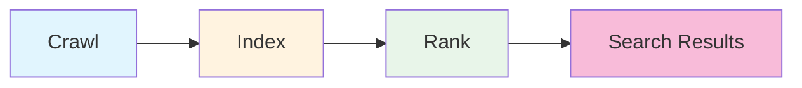

# 15.2 The Complete SEO Guide

> Search engine crawlers are "blind"—you have to show them the way. But once you've pointed the way, what really determines your ranking is the content itself.

---

## Xiaoming Can't Find His Own Website

Xiaoming searched for his website name on Baidu and Google, scrolling through ten pages without finding it.

"My website is clearly live—why isn't it indexed by search engines?"

He tried searching for keywords related to his product, and all he saw were other people's websites. His site was like a shop tucked away in a deep alley—it existed, but nobody knew about it.

The old hand said: "Search engine crawlers don't automatically discover you. Millions of new pages are born on the internet every day—crawlers can't possibly check each one. You have to proactively tell them where you are and what you have."

---

## What Is SEO and Why It's Worth Your Time

**SEO (Search Engine Optimization)** is the practice of improving your website's ranking in search results.

For indie developers, SEO might be the most cost-effective way to acquire users:

| Value | Explanation |
|------|------|
| Free traffic | Get visitors without paying for ads |
| Lasting returns | Good SEO results can be maintained long-term—people find you even while you sleep |
| Qualified users | Search users have clear intent; they're actively looking for problems you can solve |
| Brand exposure | Ranking high is itself a vote of confidence |

Unlike social sharing discussed in the previous section, SEO traffic is the "slow and steady" type. Social sharing is like fireworks—one post, a burst of excitement, then it's gone. SEO is like planting a tree—you won't see much for the first few months, but once your ranking climbs, you get steady daily traffic without repeated promotion.

### How Search Engines Work

To do SEO well, you first need to understand how search engines operate. The whole process has three steps:

**Step 1: Crawling**. Search engines have "crawler" programs that start from known web pages and follow links to new pages, like spiders crawling along a web. If no links point to your website, crawlers can't discover you—this is exactly Xiaoming's problem.

**Step 2: Indexing**. After crawlers discover your page, they fetch its content, analyze what information it contains, and store it in a massive database (the index). This is like a library cataloging new books—the books have arrived, but haven't been shelved yet.

**Step 3: Ranking**. When a user searches for a keyword, the search engine finds all relevant pages from its index, then sorts them based on hundreds of factors (content relevance, page quality, site authority, user experience, etc.). The ones at the top are what users see in search results.

Understanding these three steps makes SEO logic clear: **First, let crawlers find you (technical setup); second, let crawlers understand you (content optimization); third, make search engines think you're better than others (quality and authority)**.

---

## The Basic Setup Trio: Letting Crawlers Find You

The technical foundation of SEO comes down to three things: **Metadata + Sitemap + Robots.txt**. This is your "entry ticket"—without them, search engines won't even know what your website is.

The good news is that all three are standardized configurations. Tell Claude Code you need to set up SEO infrastructure, and it'll handle all of them in one go.

<SEOProcess />

### Metadata

Metadata is how you tell search engines "what this page is about." The two most important fields:

- **`title`**: The page title, displayed directly in search results. This is the first factor in whether users decide to click.
- **`description`**: The page description, shown as gray text below the title in search results. A good description can significantly improve click-through rates.

Every page should have unique title and description tags. If all your pages have the title "My Website," search engines will think your content is monotonous, and users won't be able to tell which page they're looking for.

### Sitemap

A Sitemap is an XML file listing all pages on your website and their update times. Think of it as a "guide map" for crawlers—"Hey, here are my pages, these ones were recently updated, come check them out first."

Without a Sitemap, crawlers can only discover your pages one by one through links, potentially missing "island" pages that aren't linked from anywhere else. With a Sitemap, crawlers can know all your pages at once.

### Robots.txt

Robots.txt tells crawlers which pages they can and cannot fetch. For example, you don't want search engines indexing your `/api/` endpoints or `/admin/` backend pages—these serve no purpose in search results and might expose sensitive information.

Robots.txt is also where you tell crawlers where your Sitemap is located. When crawlers visit your site, they typically check `robots.txt` first, find the Sitemap URL from there, then crawl pages according to the Sitemap.

### Configuring in Next.js

All three configurations have standard file conventions in Next.js: the `metadata` object for metadata, `app/sitemap.ts` for generating sitemaps, and `app/robots.ts` for crawler rules. Claude Code with the `next-best-practices` Skill loaded handles these effortlessly—they're all standard framework features, no third-party libraries needed.

---

## Xiaoming's Website Gets Indexed

Xiaoming had Claude Code configure the SEO trio. Then he submitted his Sitemap through webmaster tools of major search engines:

1. [Google Search Console](https://search.google.com/search-console)—Google's webmaster tool, just register and submit your Sitemap
2. [Bing Webmaster Tools](https://www.bing.com/webmasters)—Bing's webmaster tool, similar process to Google

Both platforms are free. Submitting your Sitemap is essentially telling search engines proactively: "Hey, my website is here, here's my page list, come take a look."

As for Baidu, Xiaoming wanted to submit there too, but found Baidu's webmaster platform has high barriers for personal websites—it requires verifying site ownership, and shows low willingness to index unregistered sites. Xiaoming's server was in Hong Kong without ICP registration, so Baidu was temporarily out of reach. The old hand said: "Focus on Google and Bing first. We'll tackle Baidu later when you move your server to mainland China."

Two weeks later, Xiaoming searched for his website name on Google—it finally appeared in search results! Though ranked low, on page three, at least it was indexed.

"How do I get to the front page?"

The old hand said: "Technical setup is just the entry ticket—it solves the 'can you be found' problem. But 'what position you're in' depends on your content quality."

---

## Content Is the Core of SEO

Many people think SEO is about configuring a bunch of technical parameters—it's not. Technical setup is only a small part of SEO; what really determines ranking is **the content itself**.

Think about it: what's the goal of search engines? To provide users with the most valuable search results. If your page content genuinely solves users' problems, search engines have no reason not to rank you highly. Conversely, if your content is hollow, no amount of technical optimization can save you.

### Title Optimization

The title is the most prominent element in search results, and the first factor in whether users decide to click.

| Principle | Explanation |
|------|------|
| Keywords first | Put your most important keywords at the beginning of the title—users scan search results left to right |
| Optimal length | 50-60 characters is best; too long gets truncated with ellipses |
| Uniqueness | Every page must have a different title, otherwise search engines get confused |

Good title structure: `Primary Keyword | Secondary Keyword | Brand Name`

For example: `Next.js Deployment Tutorial | Vercel One-Click Guide | Xiaoming's Tech Blog`

### The E-E-A-T Principle

Google evaluates content quality using a core framework called **E-E-A-T**:

- **Experience**: Does the author have actual experience? Has the person writing a deployment tutorial actually deployed something?
- **Expertise**: Does the content demonstrate professional knowledge? Is it superficial or in-depth?
- **Authoritativeness**: Does the website and author have authority in this field?
- **Trustworthiness**: Is the content trustworthy? Are sources cited?

This sounds abstract, but the core message is simple: **write about what you truly understand, and provide genuinely valuable content**.

Search engines are getting smarter. Ten years ago you could game rankings by keyword stuffing—now you can't. Google's algorithm can tell whether an article has real substance or is just SEO fluff assembled for rankings. So the best SEO strategy is simply to write good content seriously.

### URL Structure

URLs are also signals that help search engines understand page content.

| Good URL | Bad URL |
|---------|---------|
| `/blog/how-to-learn-nextjs` | `/post?id=123` |
| `/products/laptops` | `/products?type=1&cat=2` |

Good URLs should be: short, descriptive, hyphen-separated, all lowercase. Users can guess the page content from the URL, and so can search engines.

---

## Page Speed: User Experience Is Also a Ranking Factor

Google officially incorporated page experience into ranking factors in 2021. This means even if your content is great, if your page loads slowly, interactions lag, or the layout jumps around, your ranking will suffer.

### Core Web Vitals

Google defines three core metrics to measure page experience:

| Metric | Good Value | Explanation |
|------|--------|------|
| **LCP** | < 2.5s | Largest Contentful Paint—how quickly the main page content appears |
| **INP** | < 200ms | Interaction to Next Paint—how quickly users see response after clicking |
| **CLS** | < 0.1 | Cumulative Layout Shift—whether content suddenly shifts during page load |

You don't need to become a performance optimization expert. Most modern frameworks (Next.js, Nuxt, etc.) already have built-in optimizations: automatic code splitting, image optimization, preloading, etc. But a few directions are worth attention:

- **Images**: Use WebP format instead of JPG/PNG—smaller files, similar quality. Next.js's `<Image>` component handles this automatically.
- **Code splitting**: Load code on demand—users visiting the homepage don't need to load code for the "About Us" page.
- **Caching**: Leverage browser caching and CDN so returning users don't need to re-download all resources.
- **Compression**: Enable Gzip or Brotli compression to reduce transfer size.

Claude Code can also help you check and tune these optimizations. You can test your page score with Google's [PageSpeed Insights](https://pagespeed.web.dev/) tool—it gives specific optimization suggestions.

### Structured Data

Structured data is another advanced technique. It uses JSON-LD format to tell search engines the "structure" of your page content—this is an article, who the author is, when it was published, whether it has ratings, etc.

After reading structured data, search engines might display "rich snippets" in search results—like article publication dates, product star ratings, FAQ Q&A lists. These rich snippets stand out more than regular search results and have higher click-through rates.

Common structured data types: Article, Product, FAQPage, BreadcrumbList. Tell Claude Code you need to add structured data, specifying your page type.

---

## Accelerating Indexing: Getting Search Engines to Discover You Faster

After setting up SEO infrastructure, you might still need to wait a while to be indexed by search engines. These methods can speed up the process:

| Method | Explanation |
|------|------|
| Submit Sitemap | Submit to Google Search Console and Bing Webmaster Tools—this is the most direct way |
| Active push | Some webmaster platforms support actively pushing new page URLs via API |
| External links | If an already-indexed site links to you, crawlers will discover you by following that link |
| Social media | Share links on social media (echoing the OG configuration from 15.1)—crawlers also discover you from social platforms |

Among these, "external links" are the most valuable. If an authoritative site links to you, search engines consider your content valuable too—like academic paper citations, the more you're cited, the more influential you appear. But external links aren't directly controllable; they depend on whether your content truly deserves to be cited.

---

## Google and Bing vs. Baidu: Two Different Worlds

For personal projects with servers overseas, Google and Bing are your main battlegrounds. They don't discriminate against overseas servers, and you can usually get indexed within weeks of submitting your Sitemap.

Baidu is a different world. If your users are primarily in China, Baidu SEO is worth attention, but the barriers are noticeably higher:

| Dimension | Google / Bing | Baidu |
|------|--------|------|
| Indexing barrier | Submit Sitemap, no server location requirements | Strongly prefers domestic servers, rarely indexes unregistered sites |
| Content evaluation | E-E-A-T principles, values content depth | Values original content, strictly penalizes plagiarism |
| Technical requirements | Core Web Vitals are ranking factors | More values access speed from domestic hosts |
| Mobile | Mobile-first indexing (mobile version first) | Mobile weight is equally high |
| Security/Compliance | HTTPS is a ranking factor | ICP registration is almost a prerequisite for indexing |

In short: **Baidu SEO = domestic server + ICP registration + content optimization**. If your server is overseas without registration, Baidu basically won't index you. This isn't solvable through technical configuration—it's an infrastructure choice.

Xiaoming's server was in Hong Kong, so he focused on Google and Bing first. He'd tackle Baidu later when his product targeted domestic users, his server moved to the mainland, and he completed ICP registration. Detailed ICP registration information is covered in 15.4 Legal Compliance.

---

## SEO Checklist

Run through this checklist before launch to ensure the basics are covered:

<SEOChecklist />

**Basic Setup**

SEO infrastructure (Metadata, Sitemap, Robots.txt) is configured by Claude Code for your Next.js project in one go. Claude Code with the `next-best-practices` Skill loaded automatically handles these standard features.

What you need to do:
- [ ] Submit Sitemap to Google Search Console and Bing Webmaster Tools

**Content Quality** (requires your review)
- [ ] Original content that solves real user problems
- [ ] Semantic HTML structure (clear h1 → h2 → h3 hierarchy)
- [ ] Images have alt descriptions (helps search engines understand image content)

**Technical Optimization** (handled by framework, but worth confirming)
- [ ] Clean, descriptive URLs
- [ ] Good page load speed (test with PageSpeed Insights)
- [ ] Mobile-friendly (responsive design)
- [ ] HTTPS encryption

---

## FAQ

### Q1: How long until I see SEO results?

Usually 3-6 months. New sites need time to be discovered by search engines and build trust. This isn't something that works immediately after configuration—search engines need time to crawl your pages, evaluate your content quality, and observe user behavior data.

Don't give up just because you don't see results in a month or two. SEO is a long-term investment, but once it works, the returns are continuous.

### Q2: What's the right keyword density?

There's no standard value, and you don't need to calculate it deliberately. Just write naturally.

Ten years ago, SEO circles popularized "2%-5% keyword density," so many people stuffed keywords frantically into their articles. Modern search engines don't fall for this anymore—they use semantic understanding to judge content relevance, not simply counting keyword occurrences. Deliberate keyword stuffing can actually be flagged as "keyword stuffing," causing rankings to drop.

---

Xiaoming's website ranking is slowly climbing. From page three to page two, then from page two to the bottom of page one. He's starting to pay attention to a new question: what are these visitors from search and social sharing doing after they arrive? Which pages are most popular? Where are users leaving?

It's time to look at the data.