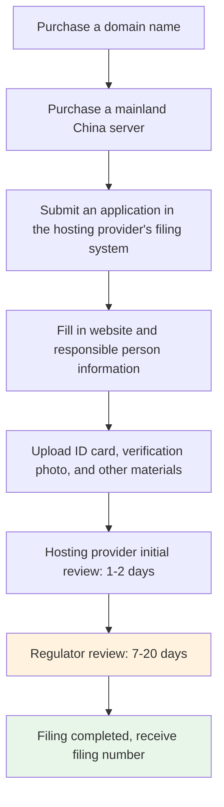

# 15.4 Legal Compliance

> Legal compliance isn't optional—it's required. Don't wait until someone reports you to start thinking about compliance.

---

## "Do Personal Projects Need This Too?"

Xiaoming's website had started getting users. Not many—just a few dozen a day—but real people were genuinely using what he had built. He was happily checking Umami analytics when the master suddenly turned serious.

"You collect user data. Do you have a privacy policy?"

"Huh? Personal projects need that too?" Xiaoming thought privacy policies were something only big companies had to worry about.

"As long as you collect user data—even if it's just Umami visitor stats—strictly speaking, you need one." The master paused. "Do you know how much the fine is for violating GDPR? 4% of global annual revenue, or 20 million euros, whichever is higher."

Xiaoming was startled. His personal project probably wouldn't end up on the EU's radar, but the master's point was clear: **you need compliance awareness from the very beginning—don't wait until the project grows before trying to catch up**.

---

## Why Legal Compliance Matters

Internet products involve user data and business activity, so they must comply with relevant laws. This isn't just "a big company thing"—the law treats individual developers and large companies the same.

| Risk | Consequence |
|------|------|
| Violating data protection laws | Massive fines, app removal, service suspension |
| Missing Terms of Service | No legal protection in disputes |
| Unfiled website | Blocked in mainland China |
| Violating user privacy | Reputation damage, user loss, media exposure |

The good news is: for personal projects, compliance isn't complicated. You don't need to hire a lawyer (though it's recommended for formal products), and you don't need to read the entire GDPR. Figure out what you need, then have Claude Code generate compliance documents based on your actual situation—it’s much easier than you might think.

---

## Privacy Policy: Tell Users What Data You Collect

A privacy policy is a public document that explains what user data your website or app collects, why it's collected, how it's stored, how it's used, and what rights users have.

### When You Need a Privacy Policy

Many people think you only need a privacy policy if you collect "personal information." That's not actually true—as long as you collect any of the following data, you need one:

- **Account information**: email address, username, password (hashed)
- **Behavioral data**: page views, click behavior—yes, Umami analytics counts too
- **Personally identifiable information**: name, phone number, address
- **Location data**: IP address, GPS location
- **Cookies and similar technologies**: if you use cookies (Umami doesn't, but many other tools do)

A purely static showcase site—with no analytics code, no forms, and no login functionality—may not need a privacy policy. But as soon as you add Umami tracking code, strictly speaking, you do. Even though Umami doesn't track personal identity, it is still collecting anonymous visitor data.

### What a Privacy Policy Should Include

A compliant privacy policy needs to answer the following questions:

| Content | Description |
|------|------|
| Data collection | What data do you collect? Why do you collect it? |
| Data usage | What is the collected data used for? |
| Data storage | Where is the data stored? How long is it retained? |
| Data sharing | Will you share data with third parties? Under what circumstances? |
| User rights | Can users view, modify, or delete their data? |
| Cookie policy | Do you use cookies? What are they used for? |
| Contact information | Who should users contact if they have questions? |

This may look like a lot, but for personal projects, most of the answers are straightforward. For example, "data sharing"—you probably aren't selling data to third parties, so you can simply write, "We do not sell your personal information."

### GDPR: If You Have EU Users

GDPR (General Data Protection Regulation) is the EU's data protection law and is considered one of the strictest privacy regulations in the world. If your website is accessed by users in the EU (even if your server isn't located there), then in theory you need to comply with GDPR.

Additional GDPR requirements include:

- A clear legal basis for data processing (what gives you the right to collect this data?)
- Users have the right to request deletion of all their data ("right to be forgotten")
- In the event of a data breach, users and regulators must be notified within 72 hours
- If you process personal data at scale, you need to appoint a Data Protection Officer (DPO)

It sounds intimidating, but the good news is: **if you use Umami for analytics, GDPR compliance is much easier**. Umami doesn't use cookies, doesn't track personal identity, and doesn't collect identifiable data—these are exactly the things GDPR cares most about. You need to explain in your privacy policy that you're using an anonymous analytics tool, but you don't need a cookie consent banner.

### How to Generate a Privacy Policy

Don't copy someone else's privacy policy. Every product collects different data and uses different third-party services, so privacy policies should be different too. A copied privacy policy might mention features you don't even have ("We use Google Analytics to track user behavior"—but you're using Umami), or it might leave out data you actually collect.

The right approach: ask Claude Code to scan your codebase, identify what data your product collects (registration info, analytics data, payment info, etc.) and what third-party services it uses (Umami, Stripe, Supabase, etc.), then generate a privacy policy based on your actual setup. An AI-generated privacy policy is more tailored to your product than a generic template, and more professional than writing one from scratch yourself.

Once it's generated, put the privacy policy on a dedicated page (usually `/privacy`), then add a link to it in your website footer.

---

## Terms of Service: Define the Rules of the Game

A Terms of Service document (ToS for short) defines the rights and responsibilities of users when they use your service. If a privacy policy says "how I handle your data," then the ToS says "the rules between us."

### Why You Need Terms of Service

Without Terms of Service, you have no legal basis when disputes arise. For example:

- A user posts illegal content on your platform—who is responsible?
- A user says your service caused them losses—do you have to compensate them?
- You want to suspend a user's account—do you have the right to do that?

These are all things that should be clarified in advance in your Terms of Service.

### Core Content

| Content | Description |
|------|------|
| Service description | What service do you provide, and what is its scope? |
| User responsibilities | What users are not allowed to do (post illegal content, attack the system, etc.) |
| Content responsibility | Who is responsible for user-posted content—usually the user |
| Intellectual property | Your code belongs to you; user content belongs to users |
| Service changes | You have the right to modify, suspend, or terminate the service |
| Disclaimer | The service is provided "as is" with no guarantee of 100% availability |
| Dispute resolution | How disputes are handled and which jurisdiction's law applies |

### How to Generate It

Just like with the privacy policy, tell Claude Code what your product does and what users can do (Can they post content? Upload files? Use paid features?), and let it generate the Terms of Service for you.

Put it on the `/terms` page once generated, and add a link in the website footer. If your product has user registration, the signup flow should require users to check a box saying "I have read and agree to the Terms of Service and Privacy Policy."

---

## ICP Filing: A Special Requirement in Mainland China

ICP filing is a system unique to mainland China. If your server is located in mainland China, your website must complete ICP filing in order to be accessible normally; otherwise, it may be blocked by network providers.

### When It's Required

| Server Location | Filing Required? |
|-----------|-------------|
| Mainland China | Required |
| Hong Kong, Macau | Not required |
| Other countries/regions | Not required |

Xiaoming's server was in Hong Kong, so he didn't need filing. But the master still wanted him to understand the rules—if the product grows later and he wants to move to a domestic server for better speed and Baidu SEO performance (as mentioned in 15.2, Baidu is much less likely to index sites without ICP filing), then he'd need to complete it.

### Types of Filing

| Type | Description | Applies To |
|------|------|---------|
| ICP filing | Basic filing required for all mainland China websites | All websites hosted in mainland China |
| Public security filing | Filing with public security authorities | Required in some provinces/cities, to be completed within 30 days after ICP filing |
| Commercial ICP license | For websites providing paid information services | Commercial websites with paid features |

Most personal projects only need standard ICP filing. If your site has paid features (such as memberships or online shopping), you may also need a commercial ICP license, but the bar is higher and usually requires a business entity.

### Filing Process

The entire process usually takes about 2-4 weeks. A few things to keep in mind:

- **Your website may be inaccessible during filing**—for first-time filing, the website usually needs to be taken offline during the regulator review period
- **Filing information must be truthful**—false information will be rejected, and serious cases may result in blacklisting
- **The filing number must be displayed in the website footer**—after filing is completed, you'll receive a filing number (such as "京ICP备XXXXXXXX号"), which must appear in the footer and link to the Ministry of Industry and Information Technology inquiry page
- **Update changes promptly**—if you change servers, domains, or the responsible person, you need to update the filing information

### Filing Timeline

| Stage | Time |
|------|------|
| Hosting provider initial review | 1-2 business days |
| Regulator review | 7-20 business days |
| Total | About 2-4 weeks |

---

## Compliance Checklist

The master gave Xiaoming a checklist: "After Claude Code generates the compliance documents, go through this checklist once to make sure nothing is missed."

**Privacy and Data**
- [ ] Privacy policy has been generated by Claude Code based on a code scan and deployed to the `/privacy` page
- [ ] Privacy policy link is prominently placed in the website footer
- [ ] Review whether the privacy policy accurately reflects your actual data collection (data types, purposes, storage location)
- [ ] Confirm that a mechanism is provided for user data access and deletion requests (at minimum, provide a contact email)
- [ ] If serving EU users, review whether it meets basic GDPR requirements

**Terms of Service**
- [ ] Terms of Service have been generated by Claude Code based on your product features and deployed to the `/terms` page
- [ ] Users are required to agree to the terms during registration
- [ ] Review whether the terms accurately reflect your service scope and allocation of responsibilities

**Mainland China Specific**
- [ ] If the server is in mainland China, ICP filing has been completed
- [ ] Filing number is placed in the website footer and links to MIIT
- [ ] Content complies with Chinese laws and regulations

**Other**
- [ ] Contact information is available in the website footer (at least one email address)
- [ ] If cookies are used, a cookie usage notice is provided
- [ ] If user reporting is needed, a complaint/reporting channel is provided

---

## Frequently Asked Questions

### Q1: Does a personal project really need a privacy policy?

Strictly speaking, yes—as long as you collect any user data (including anonymous analytics), you need one. In practice, a small personal project is unlikely to attract regulatory attention. But building compliance habits early is a good thing—if the project grows later, you won't need to start learning from scratch. And generating a privacy policy only takes a few minutes, with almost zero cost.

### Q2: Can GDPR violations really lead to fines?

Yes. While most major fines have been imposed on large companies (Meta was fined 1.2 billion euros, Amazon was fined 746 million euros), there have also been cases involving smaller companies and individuals. The amount depends on the severity of the violation—for a personal project, basic compliance (privacy policy + data minimization) is usually enough.

---

## Xiaoming's Path to Compliance

Xiaoming asked Claude Code to generate a privacy policy and Terms of Service based on his product's actual situation. He told Claude Code:

- The product is a Web app with user registration (collecting email addresses and usernames)
- It uses Umami for anonymous traffic analytics
- It uses Supabase to store data, with servers in Singapore
- It has no paid features and does not collect payment information

Claude Code generated two documents based on this information. Xiaoming reviewed them, then added them to the website footer. He also went through the compliance checklist—everything was checked off except ICP filing (the server was in Hong Kong, so it wasn't needed).

That wraps up Chapter 15. Looking back on Xiaoming's journey:

- His links went from plain blue URLs to polished share cards (OG)
- His website went from "invisible" to search engines to something people could actually find (SEO)
- He went from "I don't know if anyone is using this" to "I look at the data every week to make decisions" (Umami)
- He went from "personal projects don't need compliance" to "I now have both a privacy policy and Terms of Service" (legal compliance)

His website went from merely "usable" to "discoverable, understandable, and trustworthy."

In the next chapter, we'll use data and user feedback to drive product iteration—not what you think should change, but what the data tells you should change.