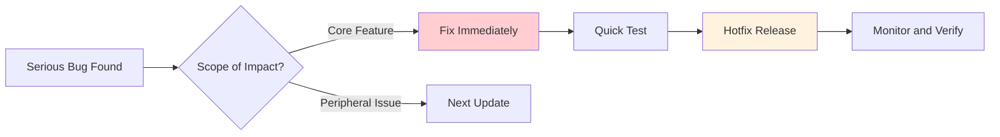
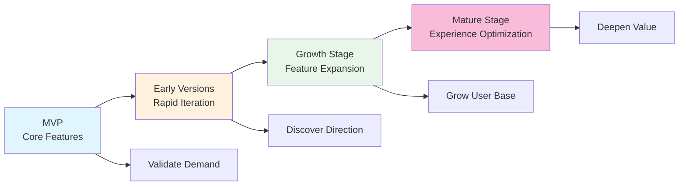

# 16.4 Iteration and Growth

> The day your product goes live is not the end, but the real beginning.

---

## The Lesson of Changing Everything at Once

Based on feedback and data, Xiaoming made a list of improvements: optimize navigation, simplify registration, fix three bugs, and add a search feature. He spent two weeks shipping all the changes at once.

As a result, the search feature introduced a new bug that caused some users' note lists to display incorrectly. Worse, because he had changed too many things at once, it took him a long time to figure out where the problem was. If he had changed just one thing at a time, he would have known immediately which change caused the issue.

The experienced craftsman said, "Change a little at a time. Each time, make sure everything is fine before moving on to the next change."

---

## Balancing the Update Cadence

Updating too fast and too slowly both cause problems.

If you update too fast, users get fatigued—they just got used to the new interface, and now it changes again. Frequent updates can easily introduce new bugs, making it hard for the product to stay stable, and the documentation can't keep up either. If you update too slowly, user needs go unmet, they lose interest, competitors may overtake you, and you also lose the feedback loop—slow changes mean slow learning.

A good update cadence responds quickly to user needs while keeping the product stable. How do you do that? The experienced craftsman taught Xiaoming a method: layers.

---

## A Three-Layer Update Strategy

Not all updates are the same. Divide updates into three layers, each with its own cadence.

**Hotfixes** are the most urgent layer—emergency bug fixes, released at any time, with the lowest risk. For example, if the login feature is broken, you can't wait until next week—you need to fix it now. A hotfix addresses only one issue and does not bundle in any other changes. Once it's done, test, release, and monitor immediately.

**Small updates** are the second layer—small features, optimizations, and non-urgent bugs, released once a week, with moderate risk. It's better to package up a week's worth of small changes and release them together than to push scattered updates every day.

**Major releases** are the third layer—new features, refactoring, and architectural changes, released once a month, with the highest risk. Major releases require more thorough testing, more complete documentation, and clearer communication with users.

After Xiaoming started using this three-layer strategy, the product became much more stable. Urgent issues were fixed immediately, small improvements were bundled weekly, and major features shipped monthly. Users also developed consistent expectations.

---

## Gradual Rollouts

Xiaoming asked, "Can't we just release a new feature to everyone at once?"

The experienced craftsman said, "You just learned that lesson the hard way. Let a small group of users try the new feature first. If everything looks good, then roll it out to everyone. That's called a gradual rollout."

The benefits of gradual rollout are straightforward: issues affect only some users, reducing risk; features are validated in a real environment, which is more reliable than a test environment; and once things are stable, you can expand gradually, so by the time you do a full release, you already have confidence.

How do you do it in practice? The simplest approach is a whitelist—let a few friendly users try it first, which is great for internal testing. A more advanced approach is percentages—randomly show the new feature to 10% of users, which works well for large-scale validation. You can also do random bucketing, which is essentially A/B testing. Or use conditional triggers—show the new feature only when specific conditions are met, which is useful for risk control.

Feature Flags are a common way to implement gradual rollout. Tell Claude Code that you need a feature flag system, and clearly describe the whitelist and percentage logic—that's enough. The specific implementation depends on your tech stack.

---

## Change Management

When a feature is updated, users need to know about it.

For new features, emphasize the value and teach users how to use them. If a feature is being removed, notify users in advance and explain why—suddenly deleting a feature people rely on is a major mistake. For UI changes, show before-and-after comparisons and guide users through the transition. For bug fixes, a simple note that the issue has been resolved is enough.

A changelog is the simplest and most effective way to communicate. Every time you release a version, write a few lines so users know you're continuously improving the product. It doesn't need to sound formal—a few sentences explaining what changed and why are enough.

---

## Iteration Cadence

Different stages call for different cadences.

The early stage is about rapid iteration—one small release per week, focusing on core features, validating assumptions quickly, and avoiding over-optimization. The goal at this stage is to find the right direction, and speed matters more than perfection.

The growth stage is about a steady rhythm—one small release every two weeks and one major release every month, balancing quality and speed. At this stage, you already know your direction, so you start expanding functionality while also prioritizing stability.

The mature stage is about continuous optimization—the pace slows down, and the focus shifts from "adding features" to "improving the experience," going deeper on value.

Xiaoming's product is still in the early stage, so he chose rapid iteration.

### New Features vs. Bug Fixes

The experienced craftsman offered a simple principle: spend 80% of your effort on stability and bug fixes, and 20% on developing new features.

That ratio might surprise you—"80% fixing bugs? Then when do we build new features?" But the reasoning is simple: users would rather use a stable, simple product than one packed with features that crashes all the time. Stability is the foundation of everything.

---

## Always in Beta

A few months passed. Xiaoming's product had become much more stable, and the user base was slowly growing. He asked the experienced craftsman, "When is it considered 'done'?"

The experienced craftsman said, "Never."

Traditionally, Beta means a test version—temporary, unstable, and something that will eventually get an "official release." But in modern product thinking, Beta is a permanent mindset—continuous improvement that never stops. "Always in Beta" doesn't mean the product is incomplete. It means always believing there is room for improvement, and staying open to learning and adjustment.

The benefit of this mindset is that it reduces the pressure of perfectionism—you don't have to get everything perfect in one go, because there is always a next version. It encourages fast experimentation, keeps you humble, acknowledges that you don't have all the answers, and helps you keep improving through feedback.

---

## Double Down on What Users Love

Resources are limited, so focus your effort on the things users genuinely like.

How do you identify popular features? Look for four signals: high usage (the feature is used frequently), lots of positive feedback (users mention it proactively), strong retention impact (users who use it retain better), and strong willingness to pay (users are willing to pay for it).

Once you've identified them, how do you strengthen them? You can deepen the feature—make it more powerful and more complete. You can expand around it—add related functionality to make the core experience more complete. You can optimize the experience—make the feature easier and smoother to use. And you can promote it—make sure more users know the feature exists.

---

## Let Go of What Nobody Uses

Xiaoming discovered that the "tagging system" he built was barely used. He had spent a week developing it, but its usage rate was under 2%.

He was conflicted: "Should I remove it? After all, I spent time building it."

The experienced craftsman said, "Sunk cost is not a reason to keep investing. Features nobody uses only add maintenance burden and product complexity. Every extra feature means one more place where bugs can happen, one more thing that needs testing, and one more option that can confuse new users."

How do you identify features nobody uses? Low usage, never mentioned by users, lots of problems but little value, and poor alignment with the product direction—these are all signals.

How you let go depends on the situation. If usage is extremely low, remove it directly. If some users still depend on it, phase it out gradually—stop promoting it and remove it over time. If there is a better alternative, replace it.

::: tip Preparing to Remove a Feature

1. Analyze usage data and confirm that the usage rate is truly low
2. Notify affected users in advance
3. Provide an alternative or a migration guide
4. Monitor feedback after removal

Don't delete it quietly. Even if only 2% of users are using it, they still deserve advance notice.

:::

---

## Small Steps, Fast Moves

Looking back on the past few months, Xiaoming noticed a pattern: the smaller each change was, the better the results.

Small changes reduce risk—when each change is small, it's easier to locate problems. Small changes bring fast feedback—you find out sooner whether you're heading in the right direction, instead of waiting a month to discover you've gone the wrong way. Small changes feel mentally lighter—you don't need to "save up for a big move," and you can feel progress every day. Small changes add up—fix one small problem every week, and that's 52 improvements in a year.

That is the core of "small steps, fast moves": don't chase one big breakthrough all at once—pursue steady, continuous improvements instead.

---

## The Big Picture of Product Evolution

From MVP to a mature product is a gradual process:

The goal of the MVP stage is to validate demand—does anyone actually want what you're building? The goal of the early version stage is to discover direction—what do users really need? The goal of the growth stage is to grow the user base—help more people discover and use the product. The goal of the mature stage is to deepen value—make the core experience exceptional.

Xiaoming's product is moving from MVP toward the early version stage. He has already validated demand (people are using it), and is now using feedback and data to discover the right direction.

---

## Long-Term Thinking

At the end, the experienced craftsman talked with Xiaoming about a bigger topic: long-term thinking.

Short-term thinking chases viral hits; long-term thinking pursues continuous improvement. Short-term thinking wants rapid expansion; long-term thinking seeks steady growth. Short-term thinking tries to please everyone; long-term thinking focuses on serving core users. Short-term thinking expects overnight success; long-term thinking believes in consistent accumulation over time.

"Those successful products you see," the experienced craftsman said, "didn't become that way overnight. They all went through countless iterations, countless failures, and countless adjustments. Every small improvement you're making now is building toward the future."

---

## Frequently Asked Questions

### Q1: When should you stop iterating?

Product iteration has no endpoint. But you can adjust the pace—iterate quickly in the early stage to validate assumptions, and maintain a steady cadence in the mature stage for continuous optimization. "Stopping iteration" usually means the product is starting to decline.

### Q2: How do you avoid over-iterating?

Focus on core metrics. If new changes are not producing improvements, stop and rethink the direction instead of continuing to tweak. Sometimes "not changing" is better than "changing things randomly."

### Q3: How do you balance new features vs. bug fixes?

The 80/20 principle. Spend 80% of your effort on stability and bug fixes, and 20% on new features. Stability is the foundation of everything.

---

## Closing Words for the Book

Xiaoming looked back at the road he had traveled.

Starting from the first chapter on setting up the environment, he learned how to use Claude Code to write code, use a PRD to define requirements, use a component library to build interfaces, use a database to store data, use APIs to connect the frontend and backend, use authentication to protect users, use testing to ensure quality, use Git to manage code, use Vercel to deploy to production, use Umami to view data, and use SEO to help people find him.

Now, he has a real product, real users, and real feedback. He knows how to collect feedback, how to prioritize, how to understand users, and how to keep iterating.

The product is still small, and there still aren't many users. But it's growing, and so is he.

Launching your product is not the end—it is the real beginning. Go build it.