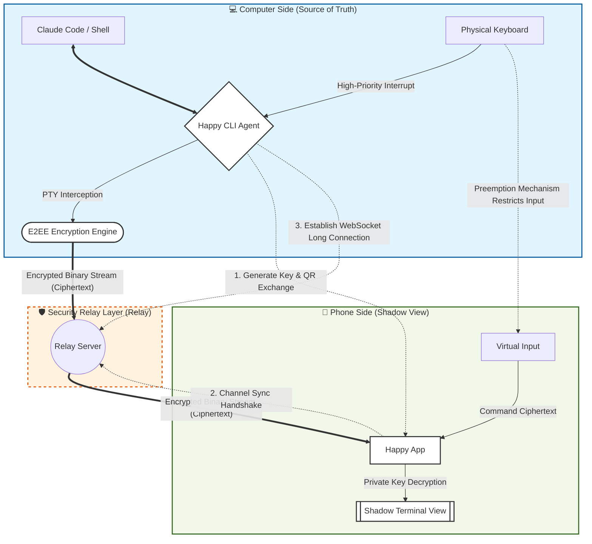

# AI Coding Anywhere, Anytime: The Happy Coder Toolchain

> Author: Mu Cheng

**Happy Coder** is an open-source, free remote control tool designed specifically for AI command-line assistants like **Claude Code**, **Codex**, and **Gemini**.

Its core vision isn't to replace your computer, but rather to "put powerful terminal capabilities in your pocket" through advanced **end-to-end encryption technology**. With Happy Coder, you can remotely control AI programming agents running on your desktop from mobile devices anytime, anywhere—transforming AI development workflows that were once confined to desktops into cross-spatial, full-scenario mobile productivity.

> You can even use voice input in the Happy App to code with AI just by talking


Notes:

- Happy Coder official website: [https://happy.engineering](https://happy.engineering)
- Happy App: [Web UI + Mobile Client](https://github.com/slopus/happy/tree/main/packages/happy-app)
- Happy CLI: [Command-line interface for Claude Code and Codex](https://github.com/slopus/happy-cli)
- Happy Server: [Encrypted synchronization backend server](https://github.com/slopus/happy-server)

## I. Why It's the Ultimate Dev Tool for the AI Era

In developer circles circa 2026, **Happy Coder** earns the title of "ultimate tool" because it transcends mere "code writing" logic and evolves into a **cross-platform intelligent R&D hub**.

It's just a plugin integrated into your editor, yet it solves the three biggest pain points plaguing AI-era developers: **multi-device sync, privacy security, and "heavy task" execution**.

- True "productivity": excellent mobile experience
- Extreme privacy security (signal-level encryption)
- From "chat window" to "command line": a dimensional upgrade
- The "developer alarm clock" for 2026
- Be a happy programmer from now on: monitor code development progress anytime in elevators, cafés, while eating, on trains, planes, or even walking outdoors

> Happy Coder's magic isn't that its models are stronger than others—it's that it makes AI development as natural as breathing, anywhere and anytime, and as secure as a vault.

<video src="/images/Advanced/happy-coder/Happy-App.mp4" autoplay muted loop playsinline controls></video>

### 1. What Pain Points Does Happy Coder Solve?

Comparison between traditional AI programming development patterns and Happy Coder development patterns

| **Core Pain Point** | **Traditional AI Programming (Old School)** | **Happy Coder Mode (Next Gen)** | **Corresponding "Superpower" Feature** |
| ------------------- | ------------------------------------------- | ------------------------------- | -------------------------------------- |
| **Spatial Constraints** | Must sit at computer; long waits for AI-generated code or test runs | **Pick up phone and go**<br />Monitor code development progress anytime in elevators, cafés, while eating, on trains, planes, or even walking outdoors | **Relay Penetration Technology**<br />(no public IP needed), no same-network requirement, connect anytime |
| **Physical Strain** | Prolonged desk work puts enormous pressure on neck and spine, fixed posture | **Code standing, lying down, or walking**<br />Completely liberates body posture | **Voice-to-Action**<br />(true voice programming) |
| **Fragmented Time** | Commutes, queues, and other fragmented moments can only be spent scrolling phones, unable to handle complex programming tasks | **Pull out phone**<br />to have home computer fix bugs or refactor—turning waste into treasure | **Multi-Sessions**<br />(parallel task switching) |
| **Waiting Anxiety** | During long tasks (like running tests), afraid to leave lest AI stops waiting for authorization | **When task completes or authorization needed**<br />phone in pocket vibrates to alert | **Smart Push**<br />(intelligent push notifications) |
| **Security Barriers** | Remote desktop configuration extremely complex; poor SSH connectivity; fear of code leaks | **Scan QR to connect**<br />End-to-end encryption protects code privacy, relay cannot peek.<br />Relay only transports encrypted "data blocks"—**it cannot see or decrypt your code content** | **E2EE Encryption Architecture**<br />(end-to-end encryption) |
| **Control Conflicts** | During remote operation, local keyboard input causes input chaos | **Physical keyboard has highest priority**<br />When you return to desk, no need to tap exit on phone.<br />Just press **any key** on computer keyboard—control instantly jumps back to computer terminal, phone automatically enters "observation mode." | **Zero Disruption**<br />(seamless control handoff) |

Core Values:

- **For individual developers**: It's your "remote brain controller," freeing you from chair captivity
- **For team leads**: It lets you intervene in complex code execution flows anytime, even during meetings or walkthroughs
- **For hardcore geeks**: It provides the most secure, zero-configuration AI Agent remote interaction solution

### 2. How Happy Coder Works

Happy Coder adopts a "trinity" collaborative system architecture, aka the "Three Musketeers Architecture":


- **Happy CLI (the "brain" on your computer)**: It's the "intelligent shell" wrapped around AI assistants (like Claude Code, Gemini, CodeX). Responsible for **instantly encrypting** terminal screen content and packaging it for transmission

> **Plain English**: It's your **"personal secretary"** sitting by the computer, watching the screen, stuffing information into a safe and mailing it out

- **Relay Server (the "pipeline" in the cloud—relay station)**: **WebSocket-based bidirectional signaling relay** It's the digital bridge connecting computer and phone, solving the "penetration" challenge in complex network environments. Responsible for passing computer data to phone—whether you're on 5G or café Wi-Fi, achieving "type on computer, phone displays instantly"

  Leveraging WebSocket protocol characteristics, through computer-side 'actively initiated' encrypted long connections, cleverly bypasses firewall external intrusion interception, achieving instant penetration in any network environment.

> **Plain English**: It's the **"blind courier"**—only responsible for moving the safe. Without the key, they completely cannot see the code inside. Use with confidence!

- **Happy App (phone side)**: This is the data destination. Responsible for **local decryption** and presenting a beautiful interface, while capturing your voice or typed commands. Supports iOS, Android, and Web

> **Plain English**: It's your "remote monitor + remote control," letting you operate thousands of kilometers away as if sitting right in front of the computer

### 3. Happy Coder's Operational Logic

To thoroughly understand Happy Coder's operational mechanism, we need to deeply dissect its **underlying communication logic**, **security encryption scheme**, and **AI collaboration model**.

- **Standard Terminal**: User ↔ Terminal ↔ Claude Code

- **Happy Mode**: User ↔ **Happy CLI** ↔ Claude Code

  When `Claude Code` outputs a line on screen, Happy CLI instantly captures that line and transforms it into an encrypted data stream.

> The essence of the diagram below: Computer is the **real brain** (Source of Truth), phone is the **remote control** (Shadow View), and the relay server is just a **content-blind** mover.



Core logic breakdown from the diagram above:

**Core Link: Shadow Control Flow**

Phone Virtual Input ↔ Happy App ↔ Relay Server ↔ Happy CLI ↔ Claude Code

> Plain English: Phone sends commands via App, passes through relay and encryption proxy, ultimately "simulating" keystrokes passed to AI assistant

**Security Link: End-to-End Encryption Flow (E2EE)**

Local Data ↔ CLI Encryption ↔ Ciphertext Forwarding (Relay) ↔ App Decryption ↔ User Vision

> Plain English: Data transforms into "gibberish" before leaving the computer; relay server only moves it; only your phone holds the private key to unscramble it

**Conflict Link: Preemption Mechanism**

Physical Keyboard Input → Happy CLI Forced Interception → Suspend Remote Input

> Plain English: When you type at the computer in person, the system automatically cuts off phone input permissions, ensuring local operation has highest priority

**Collaboration Link: Remote Awareness Loop**

AI Execution Produces Result → Happy CLI Captures Output → Phone App Async Notification → User Decision Intervention

> Plain English: Decouples "send command" from "wait for result"—even if you turn off phone screen, AI completion on computer still pushes to your palm through this link### 4. Security & Privacy

> Many students worry: *"Is my code safe when it passes through their servers?"*

**Official Promise**: Happy uses a **Zero-Knowledge Architecture**

- **End-to-End Encryption**: Keys are exchanged via QR code or URL during pairing; data is encrypted before it ever leaves your computer

- **Relay Role Only**: Happy Server is just a delivery person—it only forwards encrypted "data chunks." It can only see encrypted binary blocks and has absolutely no way to decrypt your content

- **Self-Hosting Option**: If you're a geek, you can even deploy your own private Happy Server on your own VPS following the [official guide](https://happy.engineering/docs/guides/self-hosting/)
- **Open Source Transparency**: You can review all source code anytime on [GitHub](https://github.com/slopus/happy)

### 5. Security & FAQ

- **Q: Can I still connect if my computer goes to sleep?**

A: No. Your computer must remain running and connected to the internet. We recommend increasing your system's sleep timeout during long tasks, or simply use a cloud host to ensure persistent connectivity

- **Q: Will my code be uploaded?**

A: No. Happy only passes encrypted "binary chunks" through the relay. It does not store, nor can it read, your source code

- **Q: What if I get an error running `happy`?**

A: Check if you have `claude-code` installed globally. If it's a permission issue, try adding `sudo` before the command (Mac) or running as Administrator (Windows)

## II. Prerequisites for Using Happy Coder

This tutorial primarily uses Windows as the base environment (to accommodate most students), though Mac / Linux are similar—no worries.

### 1. Environment Requirements

Ensure your computer meets the following conditions:

- **Node.js installed** (version 18 or higher recommended)
- **Claude Code installed** (or other supported CLI tools)
- **A smartphone** (for installing the App)
- Git installed (optional, mainly for project development—unrelated to Happy Coder)

### 1.1. Node.js Installation

Official Node.js download: [https://nodejs.org/en/download](https://nodejs.org/en/download)


Run the following command to verify the version

```bash
node -v

# Terminal output similar to v24.11.1 indicates successful installation
```

### 1.2. Git Installation

Before using Git, we need to install it first. Git currently runs on Linux/Unix, Solaris, Mac, and Windows platforms.

- Git download for all systems: [https://git-scm.com/install/windows](https://git-scm.com/install/windows)
- After installation, you can use the command-line git tool (which comes with an SSH client built-in), plus a graphical Git project management tool
- Find `Git -> Git Bash` in the Start menu to open the Git command window, where you can perform Git operations


Run the following command to verify the version

```bash
git -v

# Terminal output similar to git version 2.52.0.windows.1 indicates successful installation
```

### 1.3. Claude Code Installation

[This step in Windows PowerShell] Uninstall any existing Claude Code (skip if not installed)

```bash
npm uninstall -g @anthropic-ai/claude-code
```

[This step in Windows PowerShell] Install the official package. See [Claude Code Official Docs](https://code.claude.com/docs/en/quickstart) for details

```bash
# Install Claude Code globally
npm install -g @anthropic-ai/claude-code
```

Launch Claude Code by typing `claude` in the terminal and pressing Enter


> Note: Using Claude Code by typing "cmd" in the folder address bar to open the command line is more convenient and faster

### 1.4. Model Providers

Major domestic model providers most commonly used

| Model Name | Company | Key Features & Applications | Access URL |
| :--------- | :-------- | :----------------------------------------------------------- | :----------------------------------------------------------- |
| **DeepSeek** | **DeepSeek** | **King of Cost-Performance**: China's strongest open-source force. The DeepSeek-V3.2/R1 series stunned the world with mathematical logic and coding capabilities, with extremely low inference costs | [DeepSeek](https://platform.deepseek.com) |
| **GLM (Zhipu Qingyan)** | **Zhipu AI** | **Academic Background/Strong Reasoning**: Originated from Tsinghua. The GLM-5 series excels at complex reasoning and intelligent agent scheduling, serving as a core of the domestic open-source community | [Zhipu AI](https://bigmodel.cn/glm-coding) |
| **Qwen (Tongyi Qianwen)** | **Alibaba** | **All-Rounder/Business Ecosystem**: Supports ultra-long context, consistently leading Chinese and coding benchmarks, deeply integrated with Alibaba Cloud | [Qwen](https://bailian.console.aliyun.com/) |
| **Kimi** | **Moonshot AI** | **Long-Text Specialist**: First in China to overcome the "long context" bottleneck. The latest Kimi 2.5 features native multimodal architecture, supporting visual understanding and programming, efficient agent cluster collaboration, and full-process office automation. Also open-source | [Kimi](https://www.kimi.com/membership/pricing) |
| **MiniMax** | **MiniMax** | **Emotional Interaction/Full Multimodal**: Its Hailuo AI leads internationally in voice generation and video generation (Hailuo 2.0), with strong AI social attributes | [MiniMax](https://platform.minimaxi.com/docs/coding-plan/intro) |

Major international model providers most commonly used

| Model Name | Company | Key Features & Applications | Access URL |
| :--------- | :------------ | :----------------------------------------------------------- | :------------- |
| **Claude** | **Anthropic** | **Balance of Humanities and Logic**: Known for "Constitutional AI," high safety. Claude 4.x excels at creative writing, long document analysis, and complex programming (Claude Code) | Recommended to use relay for China |
| **Gemini** | Google | **Native Multimodal**: Highly advantageous in search integration, long context (2M+ tokens), and video understanding. Gemini 3 is known as the full-stack documentation and legacy code expert | Recommended to use relay for China |
| **GPT** | OpenAI | **Industry Benchmark**: Combines o-series logical reasoning with GPT-series rapid response. GPT-5 features strong multimodal understanding and autonomous agent execution.<br />With its built-in **o1 reinforcement reasoning architecture**, it demonstrates superhuman stability when handling extremely difficult algorithm optimization, cryptographic protocol implementation, and logical deadlocks requiring repeated deduction. | Recommended to use relay for China |### \1.\2. Do I Have to Purchase Model API Services?

- Note: Happy Coder itself is free and open-source. No fees required!

- However, the Claude Code, Gemini, and CodeX it calls will still consume your existing token quota or incur charges from the model providers, so you must purchase model services to use them
- Happy Coder officially supports Claude Code (default), Gemini, and CodeX CLI terminals
- For example: Claude Code can also be connected to domestic models (**GLM**, **Qwen**, **DeepSeek**, **Kimi**, **MiniMax**, etc.)

## 3. Happy Coder Usage

A comprehensive guide to Happy CLI installation, authorization login, using Happy Coder with Claude Code terminal in the browser, and connecting to Claude Code terminal via mobile app—including how to take over any terminal from anywhere.

### 1、Install Happy CLI on Your Computer

- You need to install the Happy Coder command-line tool on the computer (or server) where you run your code
- **Prerequisites**: Ensure you have Node.js 18 or higher installed

Open your preferred terminal (Terminal or PowerShell) and enter the following command:

```bash
npm install -g happy-coder
```

### 2、Launch Happy Coder (Launches Claude Code by Default)

Enter in terminal:

```bash
happy
# or
happy claude
```

Taking Windows as an example:


After running the `happy claude` command, choose which terminal to authenticate with (Mobile App or Web Browser)


Note:

- Option 1: Mobile App, for connecting your phone to the Happy Coder CLI terminal on your computer
- Option 2: Web Browser, for connecting to the Happy Coder CLI terminal through a browser webpage

### 3、Select Web Browser

Select Web Browser to use Claude Code in your browser

- Create an account and complete authorization
- Start a session to use Claude Code in your browser

Enter `happy claude` in the terminal and press Enter, then select `Web Browser`


When you select `Web Browser`, a browser window will automatically pop up, as shown below


### \1.\2. First Connection Attempt May Fail

The first time you click "Accept Connection", it may fail to connect to the terminal, but don't panic!


Simply open the Happy Coder official website [https://happy.engineering](https://happy.engineering/) and click "Launch Web App"


### \1.\2. Create an Account

After clicking the "Launch Web App" button, you'll be redirected to the app login page—create an account first


After clicking "Create Account", you'll enter "Web Browser" mode, which shows the terminal connection is successful


After clicking "Start New Session", type "Hello" in the text box to test—an error prompts "Select a device to start session"


Return to the browser's "Connect Terminal" page, right-click and select "Reload" to refresh the page, then click the "Connect Terminal" button again


### \1.\2. Terminal Connection Successful

After refreshing the browser page, click "Accept Connection" again—it will show "Terminal Connected Successfully", and the terminal will also change


After clicking the "OK" button, click the current terminal directory in the left conversation list to enter conversation mode


### \1.\2. Start a Session and Send Commands to Use Claude Code Freely in Your Browser

After clicking the current conversation in the left list, the page enters conversation mode, and the terminal will sync in real-time


From here, it's just like developing projects in the Claude Code terminal before—no need for that black window terminal anymore (remember: don't close the terminal)


When we press `Ctrl + C` in the terminal, happy claude will exit the session, and the browser webpage will also exit the session


To reconnect, simply enter `happy claude` in the terminal—the browser will automatically connect and start a session, and the terminal will automatically enter Claude Code session mode, with no additional verification needed.


> Now you can continue using Claude Code in your browser

### \1.\2. Take Over Anytime

- When the browser is in session, the Claude Code terminal defaults to a locked (observation) state (you can see generated content syncing with the browser in real-time)
- When you need to manually take over in the command-line terminal, press any key with the cursor in the terminal to take over, and you can enter commands in the terminal again
- Meanwhile, if you continue typing and sending commands in the browser's dialog box, the browser takes over again, and the Claude Code terminal returns to the locked (observation) state

### 4、Select Mobile App

If you've previously connected to another terminal (e.g., browser), you need to log out first before connecting via mobile

```bash
# Happy coder logout
happy auth logout
```

After entering the command, the terminal prompts "You will need to re-authenticate to use Happy again. Are you sure you want to log out? (y/N)"


Select "y" to confirm logout


After logging out, enter the Happy Coder launch command in the terminal again

```bash
happy claude
```

Enter `happy claude` in the terminal


After running the `happy claude` command, select Mobile App for terminal authentication and press Enter to confirm


After selecting "Mobile App", a mobile authentication QR code and URL will be generated for verification

- Scan the QR code with the Happy mobile app
- Or manually enter the URL for authentication

### \1.\2.  Install Happy App

- Android: Download [Happy Coder](https://play.google.com/store/apps/details?id=com.ex3ndr.happy) from Google Play
- iOS: Download [Happy Coder](https://apps.apple.com/us/app/happy-codex-claude-code-app/id6748571505) from Apple App Store

> After installation, open the Happy App directly—no registration or login required


### \1.\2. Connect to Computer Terminal via App

- Tap the "Open Camera" button in the App to scan the terminal's QR code
- Or tap "Manual URL Entry" and copy the connection address shown after "Or manually enter this URL" in your terminal


### \1.\2. Start Real-Time Session with Claude Code and Happy App

- Type text input in the Happy App on your mobile device
- Or use voice input
- Mobile and desktop don't need to be on the same network—stay connected in real-time from anywhere


When you send a command from mobile, it syncs in real-time to Claude Code on your computer to complete the model conversation


> At this point, you can issue commands through Happy App on your phone to accomplish any task you need

### \1.\2. Seamless Handoff Anytime

- When you return to your desk, no need to exit on your phone
- Simply press **any key** on your computer keyboard—control instantly jumps from phone to desktop terminal, and the mobile app automatically enters "Observer Mode"
- To return control to your phone, just type a command in Happy App's chat box; the desktop terminal switches back to "Observer Mode"

## 4. Happy Coder Common Commands

Happy Coder doesn't have many commands. Here's a reference of main commands, utility commands, and related subcommands for quick lookup when needed.

### 1、Main Commands (Start Session)

| **Command**     | **Description**                                              |
| --------------- | ------------------------------------------------------------ |
| `happy`         | **Default: Start Claude Code**. Launches Claude Code session with option for Mobile App or Web Browser |
| `happy gemini`  | Start Gemini CLI session                                     |
| `happy codex`   | Start OpenAI Codex mode                                      |
| `happy connect` | Connect and verify service (e.g., `happy connect gemini`)    |

### 2、Utility Commands

| **Command**     | **Function Description**                                     |
| --------------- | ------------------------------------------------------------ |
| `happy auth`    | **Manage Authentication**: Log in, log out, or manage Happy Coder's own account system<br />e.g.: `happy auth logout` to exit session login |
| `happy connect` | **Cloud Key Sync**: Securely store AI vendor API keys in Happy Cloud for cross-device access |
| `happy notify`  | **Send Push Notification**: Manually send push messages to your connected mobile device (phone/tablet) |
| `happy daemon`  | **Manage Background Service**: Start, stop, or restart Happy Coder's daemon (background resident service) |
| `happy doctor`  | **System Diagnostics & Troubleshooting**: Run environment self-check, detect configuration errors, and provide fix suggestions |

### 3、Connect Subcommands

| **Command**            | **Function Description**                                     |
| ---------------------- | ------------------------------------------------------------ |
| `happy connect gemini` | **Google Gemini Authentication**: Link your Google account to use Gemini models. |
| `happy connect claude` | **Anthropic Claude Authentication**: Link your Anthropic account to use Claude series models. |
| `happy connect codex`  | **OpenAI Codex Authentication**: Link your OpenAI account to use Codex/GPT related models. |
| `happy connect status` | **View Connection Status**: Display current authentication status for all AI vendors. |

### 4、Gemini Subcommand Quick Reference

| **Command**                      | **Function Description**                                     |
| -------------------------------- | ------------------------------------------------------------ |
| `happy gemini`                   | **Start Gemini Session**: Enter AI programming mode based on Gemini models |
| `happy gemini model set <model>` | **Set Default Model**: Switch to specific model version (e.g., flash or pro) |
| `happy gemini model get`         | **View Current Model**: Confirm which Gemini version is currently running |
| `happy gemini project set <id>`  | **Set Project ID**: Configure Google Cloud project ID (for enterprise/workspace accounts) |
| `happy gemini project get`       | **View Current Project ID**                                  |

Gemini Latest Model Recommendations (February 2026 Edition) Gemini has fully evolved to the **3.0 era**. If you're using Happy Coder, select models based on task complexity:

| **Model ID**              | **Role**            | **Use Case**                                                 |
| ------------------------- | ------------------- | ------------------------------------------------------------ |
| **`gemini-3-pro`**        | **Powerhouse / Flagship** | **Deep Development & Architecture**: Features "Deep Think" mode, ideal for refactoring complex logic, writing large modules, cross-file code audits. |
| **`gemini-3-flash`**      | **All-Rounder / Default** | **Daily Efficient Coding**: Current default choice. Reasoning surpasses 2.5 Pro while maintaining extremely low latency. Great for quick bug fixes, unit tests. |
| **`gemini-3-flash-lite`** | **Efficiency Expert / Lightweight** | **Simple Assistance & Formatting**: High cost-performance, ideal for simple code formatting, writing comments, or real-time syntax checks. |

Related operation commands

```bash
# 1. Switch to the most powerful 3 Pro (recommended for complex projects)
happy gemini model set gemini-3-pro

# Or switch to the fastest 3 Flash (recommended for daily use)
happy gemini model set gemini-3-flash

# 2. Verify settings applied successfully
happy gemini model get

# 3. Start AI programming session
happy gemini
```


## 5. Develop in the Cloud: Use Happy Coder for AI Programming Anywhere, Anytime

If we want to connect and use AI programming tools anytime, anywhere through desktop clients, mobile devices, or mini-programs—free from local hardware limitations, and able to start working, AI development, design, or gaming on demand. With the ability to switch between different computer configurations as needed, using resources elastically and flexibly, we can choose cloud hosts or cloud computers.

> For this guide, we've selected the most accessible yet powerful solution: **"Alibaba Cloud Wuying Cloud Computer + Happy Coder"** to achieve AI programming in the cloud, anytime, anywhere.


### 1. What is a Cloud Computer?

- You'll never see a physical tower again—the core components of the cloud computer run on Alibaba Cloud. All you need is a display and keyboard/mouse.
- Because the core components are in the cloud, you can upgrade or downgrade your computer configuration at any time and use it across devices from anywhere.
- You only pay for the time when the computer is powered on.


### 2. Cloud Computer Use Cases

- **AI Office Work & AI Development:** AI models are always available to assist with daily work, with multiple environments and systems suitable for AI development.
- **Cloud-based Design / Programming:** Upgrade configurations on demand to experience the smooth performance of high-end computers for design work.
- **Exploring AI:** The AI field evolves rapidly, with new tools emerging almost daily.
- **Education & Training:** Share computer content with one click, eliminating software download and configuration time.
- **Esports & Entertainment:** Start cloud gaming instantly to play *Black Myth: Wukong*, *Naraka: Bladepoint*, and many other cloud games.
- **Business Travel:** No need to carry heavy laptops—tablets and phones can instantly become work computers.
- **Low-end PCs, MacBooks, Phones Playing High-end Games:** Low-end machines can instantly become high-performance, and MacBooks and phones can also run AAA games.


### 3. Advantages of Cloud Computers

We'll interpret the advantages of cloud computers from three perspectives: breaking through performance bottlenecks, expanding device functionality, and crossing platform limitations.

### 3.1 Breaking Through Performance Bottlenecks

Through the Wuying client, low-configuration traditional computers can also run large software or games, including programming.

> For programming development, AI large model deployment, and more, you can upgrade configurations at any time to meet actual needs.


### 3.2 Expanding Device Functionality

Pad devices primarily for leisure and entertainment can instantly become productivity tools by installing the Wuying Cloud Computer client, balancing work and play.

> Notice something? You no longer need to carry a laptop when going out! Even your TV can instantly become a computer.


### 3.3 Crossing Platform Limitations

For software or games limited to specific platforms, cloud computers can help you overcome this restriction. Without the hassle of dual-boot systems or virtual machines, you can easily play AAA games on Mac!

> Including programming development—when you need Linux systems, Windows, or multi-platform testing, switching anytime saves time and effort.


### 4. How to Use Cloud Computers

Simply install and log in to the Wuying client, then launch your cloud computer with one click inside the client.

- Desktop: Supports Windows client, macOS client
- Web: Supports opening the web version in browsers like Chrome and Firefox for login
- Mobile: Supports iOS and Android

> Wuying Cloud Computer client download: [https://www.aliyun.com/product/wuying/download](https://www.aliyun.com/product/wuying/download)

### 4.1 Installing the Wuying Client (Desktop)

- Please download the appropriate client version based on your local device type and operating system version.
- After successful installation, you can access Wuying services anytime, anywhere through the client.
- We recommend logging in with an Alibaba account via QR code.


Select Personal Edition and log in with Alipay.


New users can enjoy a free one-month trial upon first registration (completely sufficient for learning purposes).


Confirm to claim and place the order.

- Gold Edition: 60GB system disk + 40GB data disk + 10 Mbps public bandwidth + 40 core-hours computing power (free for one month, then ¥9.9/month for renewal)
- 240 core-hours computing power (free, valid for 1 year)


Set up basic cloud computer information.

- Cloud Computer Name: Customize a name (similar to your local computer name)
- Primary Location: Follow the proximity principle (select a node close to your city for theoretically faster speeds)


Click "Place Order Now" to proceed.


After successful order placement, scan to enable password-free payment.

> Note: You can cancel auto-renewal in Alipay later. This won't affect the free trial policy for new registrations—if you don't use it afterward, you won't be charged, so don't worry.


After successful Alipay scan, click the "Completed Activation and Authorized Deduction" button.


Enter the order success page.


You can close the order success page and enter the Wuying Cloud Computer client homepage. Simply click the "Connect" button to enter your cloud computer.


The default system on first entry is Windows—all operations are identical to a local computer.


Note:

- Installing development environments and tools in the cloud computer is identical to a local computer.
- Similarly, AI programming tool installation and model configuration follow the same process.

### 4.2 Switching Operating Systems on Wuying Cloud Computer

- The default is Windows, but you can switch to Linux at any time.
- You can also switch back to Windows using the same method.


After confirming, confirm again to switch operating systems.


After successful system switch, enter the Linux system.

### \1.\2. Install the Wuying Client (Mobile)

If using on a mobile device:

- Search and download the **Wuying Cloud Computer App** from your app store (for managing and operating cloud computers)
- After logging in via Alipay QR code scan, you can also manage Wuying Cloud Computers through the Alipay mini-program (management only, no direct operation)


### \1.\2. Flexible Configuration Selection on Cloud Computer Startup

The most powerful feature of cloud computers is the ability to choose your desired configuration before every boot.

| **Mode Name** | **CPU Cores** | Memory | GPU VRAM | **Core-Hour Rate** | **Recommended Use Cases** |
| ------------- | ------------- | ------ | -------- | ------------------ | ------------------------- |
| **Economy Mode** | 4 cores | 8 GiB | - | 4 core-hours / hour | Lightweight code editing, document processing, simple script execution |
| **Smooth Mode** | 8 cores | 16 GiB | - | 8 core-hours / hour | **Daily AI development preferred**. Smoothly runs VS Code and multiple AI Agent sessions |
| **Performance Mode** | 16 cores | 32 GiB | - | 16 core-hours / hour | Large project compilation, multi-container operations, complex architecture analysis |
| **Esports Mode** | 12 cores | 46 GiB | 11 GiB | 60 core-hours / hour | GPU-accelerated tasks, running large local models, or graphics rendering |

> For trials, choose the lowest configuration. You can switch anytime when you need more power (higher configurations consume more core-hours per hour)


### 5、Deploy and Install Happy Coder on the Cloud Computer for Full Cloud Migration

- Install and configure Claude Code and the corresponding models just like on your local machine, ensuring it works the same as locally
- Install Happy Coder on the cloud computer—specific steps are identical to local installation


- After successful installation, use `happy claude` to select the Mobile App terminal for authentication, then press Enter to confirm


After selecting "Mobile App," a mobile authentication QR code and URL will be generated for identity verification:

- Scan the QR code with the Happy mobile app
- Or manually enter the URL for authentication


###  Connect to the Cloud Computer Terminal via the Happy App on Your Phone

Open the Happy App on your phone, scan the QR code or manually enter the URL for authentication, then enter your prompt to connect to Claude Code on the cloud computer for project development


Meanwhile, Claude Code on the cloud computer side will also sync


###  Seamless Handoff Anytime

- When you return to your desk, there's no need to exit on your phone
- Simply press **any key** on your computer keyboard, and control instantly jumps from your phone back to the computer terminal, while the phone automatically enters "observation mode"
- To transfer control back to your phone, just enter a command in the Happy App's chat box, and the computer terminal returns to "observation mode"

> Additionally, another benefit of cloud computers is that you can directly operate (take over) Claude Code on your phone anytime through the "Wuying Cloud Computer App"

###  Control the Cloud Computer via the Wuying Cloud Computer App


## VI. Why I Chose This AI Programming Toolchain

In the era of AI programming, the traditional "computer + compiler" model is becoming a bottleneck. I chose Happy Coder + Claude Code (Gemini or Codex) + Happy App + Wuying Cloud Computer to build a never-offline, multi-brain collaborative, and absolutely secure super development environment. I use this toolchain as the best practice for daily project development.

- It actually represents the cutting-edge **"Agent-First"** development paradigm
- Essence: **Cloud compute center + multi-model, all-capable brain + cross-device portable control**

### 1、Core Architecture

This system essentially keeps the **"heavy production environment"** in the cloud, delegates **"intelligent decision-making"** to AI, and keeps **"control"** in your hands.

- **Compute Foundation (Wuying Cloud Computer):** 24/7 always-on, high-performance, elastically scalable cloud Linux/Windows environment. Ensures complex tasks never lag (provides up to 12-core GPU, 46GB RAM, 11GB GPU VRAM elastic compute power, with even higher configurations available in enterprise editions). Achieves "data never lands" for code assets, with physical-level security isolation to prevent data leakage.
- **Execution Engine:** An all-capable "resident programmer," a CLI intelligent agent with multi-model scheduling capabilities. Happy Coder natively supports Claude Code + Gemini CLI + Codex, and can connect to all commonly used models both domestically and internationally (Claude, Gemini, GPT, Minimax, Kimi, GML, etc.)
- **Collaboration Gateway/Security Encryption:** Happy Coder + Happy mobile app (enables seamless connection and message push between cloud terminal and mobile device) uses the same **E2EE end-to-end encryption protocol** as Signal. Code is encrypted on the cloud desktop before transmission; the relay server only sees gibberish, and only the private key on my phone can decrypt it.

> Solves developers' pain points of "anytime, anywhere, high efficiency, low cost"

### 2、It's My "All-Capable Brain," Even More a Model All-Star

No more纠结 between Claude or Gemini—all models domestic and international can be switched anytime, a "strongest brain" that draws on the best of all. It can read my hundreds of thousands of lines of code and give the most precise refactoring suggestions.

### 3、It's My "Disembodied Productivity": AI Works While I Drink Coffee

This is what excites me most. Through the linkage of **Happy Coder** and **Happy App**, I've achieved **asynchronous development**:

- **Offline Task Execution:** I can issue refactoring commands on the **Wuying Cloud Computer**, then close my laptop and go to the gym or commute.
- **Remote Real-Time Oversight:** When AI needs confirmation for file writes or encounters runtime errors, the **mobile app** immediately pushes a notification. I just tap "Allow" on my phone, and AI continues sprinting in the cloud.

> **In plain terms:** I've hired a senior programmer on 24/7 standby, and I only need to do "approval" work on my phone.

### 4、It's My "Digital Fortress": An Architecture Safer Than Local Development

Security isn't an add-on—it's the foundation of this system. Through "data never lands" and "end-to-end encryption," I've solved AI development's biggest privacy concern:

- **Military-Grade Encrypted Transmission:** **Happy Coder** uses the same **E2EE end-to-end encryption protocol** as Signal. Code is encrypted on the cloud desktop before transmission; the relay server only sees gibberish, and only the private key on my phone can decrypt it.
- **Physical-Level Privacy Isolation:** All core code, API Keys, and development environments are locked in the **Wuying Cloud Computer**. My personal devices retain no sensitive data; even if my phone is lost, code assets remain secure in the cloud vault.
- **Anonymity and Minimal Permissions:** No account registration required, reducing attack surface for identity leakage; every critical AI operation requires my remote manual authorization, preventing risks from Agent "going off track."

### 5、It's My "Mobile Command Center": The Ultimate Balance of Performance and Freedom

- **Compute Freedom:** With **Wuying Cloud Computer**, I'm no longer limited by my local machine's specs. Compilation too slow? One-click switch to "Performance Mode." Want to save money? Switch back to "Smooth Mode."
- **Spatial Freedom:** Whether using a tablet at a café or a phone on a high-speed train, I'm connecting to the same high-performance Linux/Windows environment. The environment is always consistent, code is always up-to-date, data is always secure (code never lands).
- **Cost Expert:** Spend every penny where it counts—Wuying Cloud Computer bills by core-hour, stop when not in use.### 6、总结：这套工具链的核心逻辑

| **维度**     | **传统本地开发模式**     | **“Happy+无影” 模式**                            |
| ------------ | ------------------------ | ------------------------------------------------ |
| **工作地点** | 被拴在工位屏幕前         | 任何有网络的地方（手机、平板、电脑）             |
| **工作效率** | 盯着进度条，不敢离开     | **异步交付**，手机审批，AI 自动推进              |
| **算力资源** | 受限于本地硬件，发热严重 | 云端弹性配置，从 4 核到 12 核 GPU 甚至更高随心换 |
| **AI 能力**  | 单一模型，上下文有限     | 多模型混血，具备百万级长上下文分析力             |