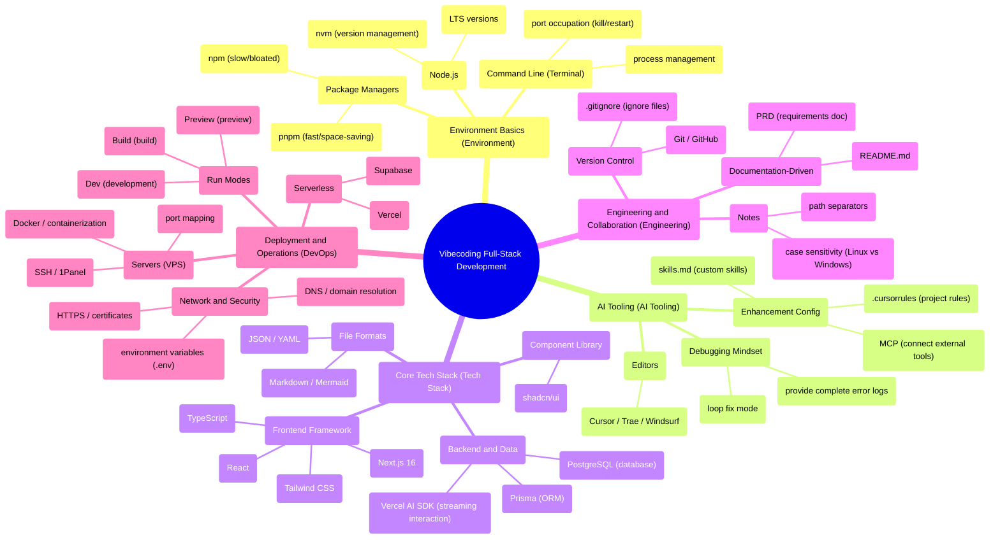

# Advanced Guide: From Idea to Product in 100 Hours

If you flip through the table of contents of this advanced tutorial, you'll see a sea of technical terms: environment setup, package managers, databases, deployment...

This looks a lot like the content list of traditional programming education. But let me tell you first: **these are not the point—they're just tools.**

Over the past decade, programming education seems to have fallen into a huge misconception: starting with syntax, data structures, and algorithms, as if mastering these would enable you to build products. It sounds right. But in reality, there's a massive gap between "being able to write code" and "being able to build products."

What's more troublesome is that many people think building software is just writing code. But the truth is exactly the opposite—**code is never the starting point of software; it's the final step of a solution.**

You see, any software project begins with a **problem**.

It could be a business problem: a restaurant has two-hour queues during peak hours every day, and the owner wants to reduce customer wait times.

It could be a scientific problem: a lab generates massive amounts of experimental data daily, and researchers want to automatically analyze trends.

It could be a personal problem: you want to record every book you've read and organize the insights each one gave you.

It could even be a fictional problem: you just want to practice a certain technology, so you make up a requirement for yourself.

To solve this problem, you first need to form a **solution**.

This solution spans many dimensions: what processes to design, what rules to establish, what roles to assign, how to coordinate all parties. These are the core of the project.

Only when certain parts of the solution need automation, scaling, or going beyond human limits do you think: **"This part can be implemented with software."**

Only then does code enter the stage.

So, **writing code is something needed at a relatively late stage.**

---

## The Gap Is Disappearing

But the pendulum of the times has swung to a new position.

Before AI programming tools emerged, there was a massive gap called "implementation ability" between "idea" and "product."

You had ideas, but you couldn't code. Or you could code a little, but the quality wasn't high enough—it wouldn't run, or it was full of bugs when it did.

Or you had money to hire developers, but the communication costs were ridiculously high, and what they built never quite hit the mark.

Or you gritted your teeth and did it yourself, spent months, only to find the product wasn't what users wanted.

So ideas remained just ideas.

I've seen too many people like this: they have keen business instincts, rich industry experience, deep understanding of user needs. But simply because they couldn't code, their ideas stayed in notebooks, in bar conversations, in sleepless nights.

This gap blocked how many potentially world-changing products.

Now, this gap is being filled.

This is like the history of photography technology.

Previously, to take a decent photo, what did you need to understand? Aperture, shutter speed, focus, ISO, white balance... You had to figure out all these complex principles and buy expensive equipment. Most people gave up just thinking about it.

Now? Phone cameras automatically handle all the technical details. You only need to focus on two things: what you want to shoot, and how to make it look good.

AI programming tools are the same.

They handle the code details for you; you only need to focus on the product itself—**what problem you want to solve, and how to solve it.**

This doesn't mean you can be completely ignorant of technology. You still need to understand the principles and boundaries of technology, just like you need to know "low light makes blurry photos" when using a phone camera.

But you don't need to memorize every line of code, just like you don't need to know the underlying algorithms of your phone camera.

**The barrier to entry has lowered, but the ceiling is still there—and even higher.**

And there's another more important change happening.

We used to think: we need big models first, then applications. Big model companies lead the way, and we follow.

But look across industries now—**AI's explosive scenarios aren't at big model companies, but at places closest to real problems.**

What does this mean for you? It means you don't have to wait for AI companies to release new features. You just need to understand the problem around you and use existing AI tools to solve it. In this process, your understanding of AI will grow naturally.

---

## Who Is the Teacher

There's an even deeper change happening here.

Throughout human history, experience and wisdom have always accumulated with age—elders teaching the young, masters passing knowledge to apprentices. This has been the unchanging rule for thousands of years.

But this rests on a premise: the world changes slowly enough that past experience can handle future challenges.

When technology iterates faster than humans can accumulate experience, this premise collapses.

Have you seen scenes like this:

A young beginner might understand server debugging better than their technically proficient teacher; a student just starting to learn programming might discover the value of AI tools more keenly than a senior who's studied for ten years; a new operations hire might automate her work with AI tools faster than her veteran colleagues.

This isn't the fault of age—it's the inevitable result of accelerating times.

When "experience" hasn't had time to settle into "wisdom," technology has already refreshed several rounds.

So we see a quietly happening role reversal: it's no longer elders passing knowledge one-way, but the younger generation becoming guides.

This isn't a rejection of tradition. On the contrary, it's a new answer to the question of "who's out front exploring."

In this era, those who embrace new technology first naturally bear the responsibility of leading others through the fog.

This doesn't depend on seniority, degrees, or position—only on whether you dare to take that first step while others watch.

**When the world changes too fast, the most dangerous thing isn't going the wrong way—it's standing still.**

---

## Another Path

In this advanced tutorial, you won't see the traditional path of "learning programming from syntax."

Instead, you'll see a doer's path:

Start with a problem, form a solution, then use AI tools to turn that solution into a product.

I write each chapter's preface as a retrospective note—it's not an encyclopedic pile of knowledge points, but a clear record of the decisions, pitfalls, struggles, and trade-offs at the time, giving you a working path and core philosophy first.

This isn't a manual teaching you "how to do it," but notes telling you "how I got through it."

---

### One Person Is a Whole Team

To help you understand the unique nature of the path we're about to learn, it's necessary to first look at how modern software development traditionally works.

**At large internet companies, getting a seemingly simple feature live involves a complete and complex process:**

First is the **requirements phase**: product managers write requirement documents, organize requirement review meetings, with PMs, developers, and testers sitting together in conference rooms discussing for half a day.

Then comes the **technical design phase**: backend and frontend write technical proposals respectively, then organize technical review meetings, even with upstream and downstream team developers participating.

Next is the **development phase**: coding, unit testing, interface self-testing, frontend-backend integration. Everyone codes at their own screens, then comes together to align interfaces.

Then the **testing phase**: after developers pass self-testing, they "submit for testing" to the QA team, who do manual and automated testing, find bugs, and send back to developers for fixing. Back and forth, days go by.

Then the **deployment phase**: code merging, pre-production environment verification, canary release—first to 5% of users, then 10%, 50%, finally 100% full rollout. Every step is careful, afraid of something going wrong.

Finally the **iteration phase**: two-week iteration cycles, continuously planning and delivering new features. The whole process runs like a precision machine, cycling over and over.

What's good about this process? Standardized, controllable, low risk.

But the problems are obvious: slow, heavy, high barrier.

From proposal to launch, a feature often takes weeks or even months. And every step needs dedicated people—product managers, backend developers, frontend developers, QA engineers...

For individuals or small teams, this process is almost impossible to replicate. Where do you get that many people? That much time?

---

**In the AI era, this process is compressed and reconstructed:**

**Requirements phase**: You are the product manager yourself, writing PRDs for AI to understand. You don't need to master professional product terminology; you just need to clearly explain what you want to do.

**Technical design phase**: AI generates technical proposals for you; you just review and adjust. Like having an experienced architect sitting beside you, giving advice anytime.

**Development phase**: AI writes code for you; you just describe requirements and check results. You don't need to memorize every API usage or remember every framework detail.

**Testing phase**: AI writes test cases for you, executing automatically. You no longer spend大量时间 writing repetitive test code or worry about missing edge cases.

**Deployment phase**: One-click deployment to cloud platforms, automatically completing build and release. You don't need to configure servers yourself or set up CI/CD pipelines.

**Iteration phase**: Rapid adjustment based on data and feedback, iterating in days or even hours. Want to change a feature? See results in minutes.

See, from weeks to minutes, from dozens of people to one person. This isn't exaggeration—it's happening reality.

Note, this doesn't mean the process disappears.

Rather, many steps are automated by AI, or one person can wear multiple hats.

You don't need to write every line of code, but you still need to understand what each step does, why it's done this way, and how to troubleshoot when problems arise.

**This is what this tutorial teaches: not replacing the process, but mastering its core and using AI to boost efficiency.**

---

### 100 Hours to Complete the Journey

This guide follows the thread of "a pitfall-avoidance guide from zero to production," taking you through a complete product delivery process that strings together full-stack development:

**Step 1: Technology Selection and Environment Preparation** (Chapters 1-2)

Set up the stage before the show. Choose the right tech stack, configure the development environment, master basic methods of collaborating with AI. Without these foundations, no matter how good your ideas are, they won't land.

**Step 2: Problem Definition and Solution Design** (Chapter 3)

Write PRDs, clarify what problem to solve and how. Many people skip this step, thinking starting to code directly feels better. But trust me, thinking the problem through clearly will save countless hours later.

You may notice: **the actual project flow is "think through the problem first, then choose technology," but the tutorial order is reversed.**

This is intentional. PRDs will contain technical terms like Next.js, Prisma, database—if you don't even know what these are, you can't read the document. So first get the environment set up, tools familiar, and a basic feel for the technology, then learn how to write PRDs properly.

**Step 3: Product Implementation** (Chapters 4-8)

UI/UX design makes products look good and work well, data storage makes information persistent, security mechanisms protect user privacy, automated testing ensures quality. Every step has specific tools and methods.

**Step 4: Release and Iteration** (Chapters 9-16)

From local to public network, let the world see your product; from individual to team, learn collaboration and sharing; from launch to continuous improvement, let your product evolve through feedback.

At the end of this path, what awaits you isn't "becoming a programmer," but "becoming someone who can solve problems with products." **Code is a means, not an end**—your goal is to solve problems and create value, and code is just one tool to achieve that goal.

---

## Stop Thinking, Start Doing

In this era full of uncertainty and acceleration, overthinking is often the enemy of action.

Have you had experiences like this:

You want to build a product, but always feel your preparation isn't sufficient enough. You want to learn a technology, but always feel you need to finish all tutorials first. You want to solve a problem, but always feel there might be a better solution.

So you tread in place, watching others run far ahead.

Don't wait until your idea is perfect to start building products, don't wait until you see the endgame to start running.

Because in the real world, there's never a perfect starting point.

Those successful products you admire often started from crude MVPs. Those entrepreneurs you respect often adjusted direction through trial and error.

**In this era, thinking creates problems; doing creates answers.**

---

## What You Need to Do

Hearing this, you might ask: If AI can do so much, what do I still need to do?

That's a good question.

AI has indeed replaced us. But what it replaced is precisely what we didn't want to do, couldn't do, or shouldn't have been doing in the first place.

Those tedious, repetitive, risky, boring tasks—AI took them.

And what it left us, or rather what it forces us to do, is to explore new possibilities, to do what only humans can do well.

Think this relationship through, and you'll know how to coexist with AI:

**Give repetitive trivialities to AI, keep judgment and creation for yourself.**

**Give hard labor to AI, keep taste and thinking for yourself.**

**Give mechanical execution to AI, keep inspiration and creativity for yourself.**

AI can generate code for you, but it can't decide what product to build for you.

AI can write test cases for you, but it can't help you understand users' real needs.

AI can optimize performance for you, but it can't discover that problem worth solving for you.

**Work requiring judgment, taste, connection, and creation will always be human territory.**

---

## Before You Start

So, the correct way to use this tutorial is:

Don't treat it as a textbook to chew through from beginning to end.

Treat it as a map, a guide, a friend you can always turn to for help.

When you encounter specific problems, flip to the corresponding chapter and see how I got through it. When you're confused, read those prefaces and see the thought process at the time. When you don't know what to do next, check the chapter overview and pick a direction to start moving.

**Learning isn't memorizing; it's imitating.**

**Growth isn't waiting; it's acting.**

In 100 hours, you'll be amazed at what you can accomplish.

No, maybe it won't even take 100 hours.

**Go slow to go fast.**

This isn't the end; it's the beginning.

This tutorial isn't to make you a full-stack engineer after reading, but to make you someone who can solve problems while reading.

**Don't be scared by imaginings of "what might go wrong"; be driven by the vision of "what might be accomplished."** What you need to do is see that problem-solving product, then set out to realize it.

Let's evolve together.

Fu Hangkang / Eyre

January 1, 2026

::: info Tutorial Progress Note
Some chapters' main text/images are pending completion; content may adjust with iterations. Like writing code—build the framework first, then polish the details. Stay tuned for the official release, and thank you for your patience!
:::

---

## Chapter Overview

| Chapter | Topic |
|---|---|
| 1 | [Environment Setup](/Advanced/01-environment-setup/) |
| 2 | [How to Use AI](/Advanced/02-ai-tuning-guide/) |
| 3 | [From Requirements to Documentation](/Advanced/03-prd-doc-driven/) |
| 4 | [Essential Development Knowledge](/Advanced/04-dev-fundamentals/) |
| 5 | [Beautiful and Usable Interfaces](/Advanced/05-ui-ux/) |
| 6 | [Where Data Lives](/Advanced/06-data-persistence-database/) |
| 7 | [Connecting Frontend and Backend](/Advanced/07-backend-api/) |
| 8 | [Who Can Access My Data](/Advanced/08-auth-security/) |
| 9 | [Feature Testing](/Advanced/09-testing-automation/) |
| 10 | [Public Network Access](/Advanced/10-localhost-public-access/) |
| 11 | [Collaborative Development](/Advanced/11-git-collaboration/) |
| 12 | [Serverless Auto-Deployment](/Advanced/12-serverless-deploy-cicd/) |
| 13 | [Domain Resolution and Access](/Advanced/13-domain-dns/) |
| 14 | [Deploying to Servers](/Advanced/14-vps-ops-deploy/) |
| 15 | [SEO, Sharing, and Analytics](/Advanced/15-seo-analytics/) |
| 16 | [User Feedback and Product Iteration](/Advanced/16-user-feedback-iteration/) |

---

## Knowledge Overview

