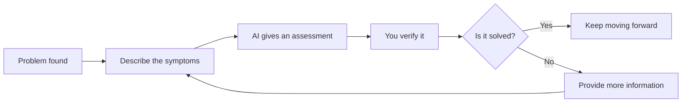

# 0.3 What to Do When You're Stuck: A Unified Basic Help-Seeking Process

## First, build a better response than “just powering through”

When many beginners run into a problem, their first reaction is often similar: they start randomly changing code, search error messages one by one, wonder “maybe I’m just not cut out for this,” and then stay stuck on a single issue for a long time, afraid to move on.

The basic section does not recommend taking this path.

In the age of AI programming, a more effective first response is:

> **First describe the problem clearly, then let AI help you keep moving forward.**

This is not laziness. It is a way of working that is both easier and more efficient.

## A unified formula for asking for help

When you get stuck, tell AI in this order: what you just did, what problem you are seeing now, and what result you originally wanted. If you can also include a screenshot or the full error message, even better.

## The simplest question template

```text
What I just did: [what you just did]

The problem I’m seeing now is: [the issue you are seeing now]

The result I originally wanted was: [the effect you want to achieve]

Please first help me identify the most likely cause, then tell me what to do next.
```

## Three common examples

### Example 1: Blank page

```text
I just asked AI to help me modify the homepage layout.

Now the page is blank after opening it.

I originally wanted to see the updated homepage. Please first help me identify the most likely cause, then tell me what to do next.
```

### Example 2: Button not responding

```text
I just added a send button.

Now nothing happens when I click it.

I originally hoped that clicking it would send a message. Please help me first identify the most likely problem.
```

### Example 3: The chat results are off

```text
I just updated the profile information for the digital clone.

Now its replies still feel very mechanical, and they do not follow my setup.

I want it to sound more like me. Please help me determine whether the instructions are not clear enough, or whether something did not take effect.
```

## What if it’s not solved the first time

If it is not solved the first time, that does not mean you failed. Many problems are not the kind you “solve with a single question,” but are instead a small iterative process:



A better approach is to tell AI about the new symptoms, explain what you just did based on its suggestion, and then continue to the next round of analysis.

## What information is most worth adding

If the first answer is still not enough, the most valuable things to add next are usually screenshots, the full original error message, which part you just changed, and where the result you are seeing differs from what you expected.

Do not just say “it’s wrong,” “it’s broken,” or “it still doesn’t work.” Information like that is too limited, and AI will also have a hard time making a judgment.

## Remember: don’t blame every problem on AI

If a problem appears, do not immediately think “AI got it wrong again.” In many cases, the more accurate situation is: you did not explain the goal clearly, you did not limit the scope of changes, the environment or configuration was not prepared properly, or some step did not actually take effect as expected.

This is not about blaming you. It is about helping you build a steadier perspective for collaboration:

**When a problem appears, first look at the context, goals, boundaries, and environment—instead of immediately throwing the responsibility onto AI.**

::: details Want to go a bit deeper?
If you want a systematic understanding of AI debugging, workflows, and project rules, you can jump to the advanced section and keep reading:
- [Chapter 2: AI User Guide](/Advanced/02-ai-tuning-guide/)
:::

---

[Next section: Chapter Summary: Basic Learning Map →](./0.4-how-to-learn.md)