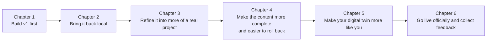

# 0.4 Chapter Summary: Basic Edition Learning Map

## Now, see the whole route clearly

At this point, you already know what this basic series teaches and does not teach, what you will ultimately build, whether this route suits you, and how to keep going when you get stuck.

The most important thing next is to see the whole route clearly. Because once you know what stage you are at now, why you need to take the next step, and what you will gain after completing it, a lot of your anxiety will disappear at once.

## What the full route looks like

## How each chapter moves your project forward

| Chapter | How the project changes |
|------|--------------------|
| Chapter 1 | You will first build a `v1` that can be previewed, showcased, and used for simple chat |
| Chapter 2 | The project will move from the platform to your own computer and become something you can keep iterating on |
| Chapter 3 | The homepage will go from a default template to something that looks more intentionally crafted |
| Chapter 4 | The project will no longer feel thin; visitors will understand who you are more easily and know better what to ask |
| Chapter 5 | Your digital twin will no longer just “reply”; it will start to feel more like you |
| Chapter 6 | The project will go from “only on your computer” to “a live link others can access” |

## Where this path gradually takes you

Let’s not talk about abstract skill labels for now—just the more practical changes. First, you will learn how to express requirements clearly, then bring your project back to your own workspace. Next, you will learn to judge whether a page feels more like a real project and whether it is more usable, and you will also learn how to leave yourself room to recover in the code so you do not panic every time you make a change. After that, you will start making your digital twin more like you, and finally publish the whole project for real so others can see it.

## When you should stop, and when you should keep going

If you just want to experience “I can build this too” once, then getting through Chapter 1 is already well worth it.

If you want to complete your first full closed loop, then keep going all the way to Chapter 6. Neither option is failure, and neither is laziness. The difference is simply this: by the end of Chapter 1, what you gain is your first positive feedback; by the end of Chapter 6, what you gain is your first complete project closed loop.

## By this point, what you have already figured out

You now clearly understand the positioning of this tutorial, what you will ultimately build, and how to learn, ask questions, and keep moving forward. More importantly, you now have a clear sense of where each upcoming chapter will take the project.

## Before you start, make sure of at least these things

- [ ] I know this basic series is not a traditional grammar course
- [ ] I know what kind of project I will ultimately build
- [ ] I know whether this route is right for me
- [ ] I know how to ask AI for help when I get stuck
- [ ] I know what Chapters 1 through 6 are each advancing

## Next step

Now, do not stay in the “preparation phase” any longer. You already know the route and what you are ultimately going to build. The most important next step is not to read one more explanation, but to start building the first version.

If you want a systematic understanding of environments and tools, AI workflows, product documentation, UI/UX, APIs, security, Git collaboration, or deployment, you can jump to the advanced edition later when you hit those boundaries; but for now, you already have everything you need to enter Chapter 1.

---

[Enter Chapter 1: The First Version →](/Basic/01-awakening/)