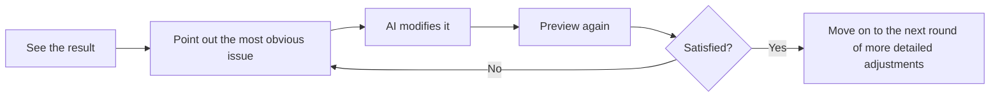

# 1.3 Generate Your First Version on the Platform and Complete Three Rounds of Fine-Tuning

## Now, actually build it

By this point, you already have a batch of real materials about yourself, as well as a completed first-version requirements template.

The next most important thing is to actually hand this information over to an AI prototyping tool so that the first version can appear.

This section uses **Miaoda** as an example. If you are currently using another tool that supports generating pages from natural language, the workflow is basically the same: open the platform, create a new project, paste in the requirements, wait for generation, and then enter preview mode.

## For the first generation, keep the goal very restrained

Please remember:

> The goal of the first generation is not to “wow everyone,” but to “first get a version that can be viewed, clicked, and talked to.”

So the most important thing at this stage is not showing off fancy tricks, but keeping the scope under control first: the page can show who you are, the page includes a digital avatar chat area, the overall structure is clear, and at least the mobile version does not completely break.

## It is recommended to proceed in this order

First create a new project and give it a simple, clear name, such as `my-homepage` or `personal-homepage-v1`; then paste in the completed template from the previous section in full, and do not make major last-minute changes while pasting it in—let the first version run completely first; next, patiently wait for the first round of output to finish, and unless the tool has clearly gone off in a completely irrelevant direction, do not interrupt it frequently midway. After generation is complete, enter the preview page. During the first preview, only look at three things first:

1. Whether the page structure has been generated
2. Whether the personal information is basically correct
3. Whether the digital avatar chat area has already appeared

In Miaoda, after you paste in the requirements, it usually will not immediately jump straight to the final page. It will often first help you organize a more structured requirements document, confirming the application name, core functions, page structure, and style requirements. This step is normal—it does not mean the tool is stuck, but that it is helping you further refine the natural language requirements you just provided.

As long as the overall direction does not seem obviously off, you can continue by clicking `Generate App Now` in the lower right corner.


Here, you mainly look at two things: first, whether this requirements document correctly describes “who you are, what the page should include, and what the digital avatar should do”; second, whether the style requirements organized on the right obviously deviate from your expectations. If these two aspects are mostly correct, then continue forward and do not get bogged down in details too early here.

## During the first preview, do not rush to criticize everything

When many people see the result for the first time, they immediately enter a state of “this is wrong, that is wrong.”

But a more effective approach at this moment is to first judge three things: whether it is already a page, whether it already expresses the direction of “this is me,” and whether it already has the foundation for continued iteration.

The following two images show a real first-page result. Everyone’s materials, the platform’s generation state at the time, and the style requirements you provided are all different, so your page may not look like this; but **it is perfectly normal for the first page to have similar problems**, so do not assume this path does not work just because it is imperfect.


If you look closely at this kind of first-version result, there are usually both good signs and problems at the same time: the good news is that the page skeleton is already there, and sections such as the hero area, project section, chat area, and footer links already exist; the problems are also obvious—for example, the name or information may have been extracted incorrectly, the chat box placement may feel a bit awkward and sit too close to the right edge of the page; buttons such as `Q1`, `Q2`, and `Q3` are often just demo quick questions and may not actually be connected to a large model yet; some links, cards, or buttons may look clickable, but do not actually navigate anywhere yet.

This is exactly why we keep emphasizing that the goal of the first version is not to get everything perfect in one step, but to first pull out a version that can continue to be improved.

Here I will stop at the stage of the “first-page result” for now. Later, when we talk about continued adjustments, fine-tuning, and acceptance checks, I will add the follow-up screenshots from the same case in the corresponding places. For now, it is enough for you to grasp the evaluation logic: in the first version, first check whether the skeleton has appeared and where the obvious problems are; you do not need to wait until all screenshots are shown before continuing to read.

If the answer is broadly “yes,” then you have succeeded.

Because the success criterion for Chapter 1 has never been getting everything right in one go, but rather:

**First pull out a version that can continue to be improved.**

## If the first page is not what you want, that is also normal

This does not mean you failed, nor does it mean the tool is bad.

A more common situation is that your description is not specific enough, the style you want is not clear enough, or you have not yet constrained it with “just do the first version first, do not add too much.” It may also be that the platform first gave you a prototype that “can demonstrate the structure,” which is why common first-page issues appear, such as inaccurate information, placeholder interactions not yet connected, and links that still do not work.

And these issues happen to show exactly this: generation is not the end—iteration is the norm.

## The recommended three-round fine-tuning method



### Round 1: Fix obvious errors

This round deals only with the most obvious issues, such as incorrect information, missing sections, seriously flawed layout, or the chat entry not appearing properly. Problems like those in the screenshots above—“the name is wrong,” “the chat box is too close to the right side,” “footer links look clickable but do not actually navigate,” and “Q1/Q2/Q3 are only placeholder buttons”—all belong to the kind of issues that should be prioritized in this round.

You can say it like this:

```text
Please do not make major changes to the whole page yet.

I want to fix a few obvious issues first:
1. My name / Chinese name is displayed incorrectly. Please change it to the correct version.
2. The chat box on the right is too close to the right edge of the page. Please give it more natural outer margins and whitespace.
3. Please connect the external links and contact methods on the page so they work as real clickable links.
4. If Q1 / Q2 / Q3 are only demo buttons, please do not present them as real conversations; either turn them into genuinely chat-triggering questions, or remove them for now.

In this round, only fix these obvious issues first. Do not redo the overall style.
```

If what you care about most right now is “whether the chatbot is actually connected to a model,” you can also ask one additional question separately:

```text
Please check whether the current chat area is already connected to a real large-model call.
If it is still only a demo or keyword matching, please explicitly tell me which state it is in now.
If the platform supports it, please continue connecting it into a genuinely usable LLM conversation; if this step still lacks configuration, please also clearly tell me what is missing.
```

### Round 2: Adjust style and content

This round starts handling problems of “it already works, but it still does not feel like me,” such as the style being too flashy or too plain, the colors not matching what you had in mind, or the hierarchy of personal information still not being clear enough. In the previous example, for instance, although the chat box has already appeared, it still looks a bit stiff visually and does not coordinate well enough with the hero section, which makes it more suitable to keep adjusting in this round.

You can say it like this:

```text
The structure is basically correct now.
Next, I only want to adjust the overall style:
- Make the page more minimal and clean
- Change the main color palette to dark blue and white
- Do not add new complex modules
Please only make style-level changes.
```

### Round 3: Make small refinements

In this round, deal with those details that are “not major issues, but will look better once done,” such as whether the button copy sounds more natural, whether the prompt text in the chat area is clearer, and whether the spacing of the avatar and profile section feels more comfortable.

You can say it like this:

```text
The overall page is already close to the effect I want.
Now please only make small refinements:
- Make the guidance text in the chat box sound a bit more natural
- Make the spacing in the avatar and profile section more comfortable
- Do not add new modules, and do not redo the layout
```

## Two very important fine-tuning principles

First, only change one category of problem at a time. Do not say all at once that the color scheme needs to change, the layout needs to change, the chat logic needs to change, and then also add a portfolio section on the side. That makes it very easy for the scope of this round of changes to spiral out of control. A steadier approach is to focus on only one main objective each time. Second, state the boundaries of the changes as clearly as possible. You can directly say “only change this part,” “do not add new modules yet,” or “keep the current overall structure.” This will significantly reduce the chance of “fix one thing, and many other parts get changed too.”

## What to fix in this round first, and what to continue in later chapters

If you are already seeing many problems now, there is no need to solve everything all at once in Chapter 1. A steadier approach is to first distinguish between “what should be fixed now” and “what will be handled systematically later.”

| Fix now | Continue handling in later chapters |
|------|------------------|
| Wrong name, incorrectly extracted information | More complete interface and unified style (Chapter 3) |
| Obvious layout problems, missing sections | How to supplement content modules more reasonably (Chapter 4) |
| Link buttons do not navigate | How to make the digital avatar more like you and more stable (Chapter 5) |
| The chat area is only a placeholder and has no real calls | Launch and real-environment validation (Chapter 6) |

In other words, you can absolutely keep prompting Miaoda now to connect the links, fix obvious errors, and move the chat area from a “demo prop” to “at least clearly explaining its current state”; but we will cover more systematic UI polishing in Chapter 3; and the digital avatar instruction manual, real conversation experience, APIs, and more stable responses will continue to be addressed in Chapter 5.

## What if you are still not satisfied after three rounds

If you have already gone back and forth for three rounds and the result is still far from what you expected, do not keep grinding on the details.

A better approach is to go back and check two things: whether your initial requirements were too vague, and whether you mixed too many objectives into the same round.

At this point, what is often needed is not to “keep tuning harder,” but to **rewrite a clearer version of the requirements description**.

::: details Want to go deeper?
If you want to systematically understand multi-turn dialogue, debugging mindset, and AI workflows, you can jump to the advanced version and continue reading:
- [Chapter 2: AI User Guide](/Advanced/02-ai-tuning-guide/)
:::

---

[Next section: Chapter Summary: First-Round Acceptance Check and the Next-Round Optimization Checklist →](./1.4-vibe-vs-spec.md)